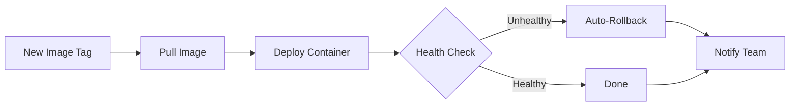
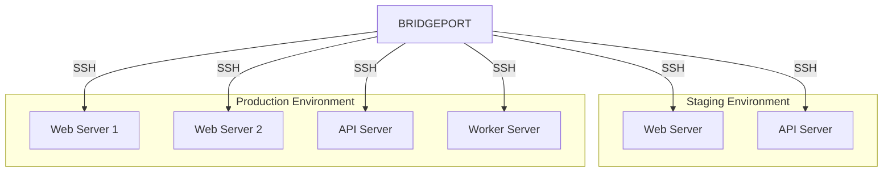
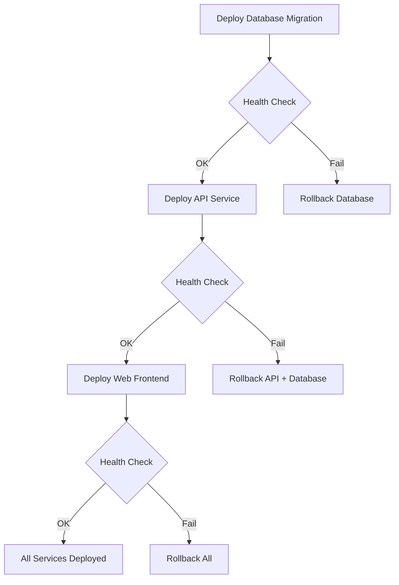

<p align="center">
  
</p>

<p align="center">
  A lightweight, self-hosted tool to deploy, orchestrate, and monitor Docker services across all your servers — production-grade ops without Kubernetes.
</p>

<!-- functional + CI status badges -->
<p align="center">
  <a href="https://bridgeport.bridgein.com"></a>
  <a href="LICENSE"></a>
  <a href="https://ghcr.io/bridgeinpt/bridgeport"></a>
  <a href="https://github.com/bridgeinpt/bridgeport/actions/workflows/test.yml"></a>
  <a href="https://github.com/bridgeinpt/bridgeport/actions/workflows/build.yml"></a>
</p>

<!-- tech stack, brand red #CC0000 -->
<p align="center">
  
  
  
  
  
  
  
  
</p>

<p align="center">
  <a href="#quick-start"><b>Quick Start</b></a> &nbsp;·&nbsp;
  <a href="https://bridgeport.bridgein.com"><b>Docs</b></a> &nbsp;·&nbsp;
  <a href="#key-features">Features</a> &nbsp;·&nbsp;
  <a href="docs/reference/cli.md">CLI</a>
</p>

<p align="center">
  <sub>Created by the Engineering Team at <a href="https://bridgein.pt">BRIDGE IN</a>.</sub>
</p>

---

## The Problem

Managing Docker containers across multiple servers means SSH-ing into each machine, remembering the right `docker pull` and `docker compose` commands, hoping nothing breaks, and having zero visibility into what's running where. When something goes wrong at 2 AM, there's no rollback button -- just you and a terminal.

## The Solution

BRIDGEPORT gives you a single web UI to manage all your Docker infrastructure. Connect your servers via SSH (or Docker socket for the local host), and you get one-click deploys to one server or a whole fleet, dependency-ordered orchestration with automatic rollback, config-as-code (managed files, reusable fragments, and templating), real-time health monitoring, encrypted secrets, database backups, and multi-channel notifications. It's designed for teams that want production-grade tooling without the complexity of Kubernetes.

## Key Features

| | Feature | Description |
|---|---|---|
| **Servers** | Multi-Server Management | Connect via SSH or Docker socket. Discover containers automatically |
| **Provision** | Server Bootstrap | One-click setup of Docker, Compose, the agent, sysctl tuning, and swap on a fresh server |
| **Deploy** | Deploy & Orchestrate | One-click deploys to one server or a whole fleet, with dependency-ordered deployment plans, health gates, and automatic rollback |
| **Config** | Config-as-Code | Managed text & binary config files with edit history, reusable fragments, server-tag templating, and atomic batched syncs with dry-run preview |
| **Monitor** | Real-Time Monitoring | Server, service, and database metrics via SSH polling or Go agent |
| **Health** | Health Checks | Container, URL, TCP, and TLS certificate checks with bounce protection |
| **Secrets** | Encrypted Secrets | AES-256-GCM encryption at rest with per-environment isolation |
| **Backup** | Database Backups | Scheduled PostgreSQL, MySQL, and SQLite backups to S3-compatible storage |
| **Notify** | Notifications | In-app, email (SMTP), Slack, and outgoing webhooks |
| **Registry** | Registry Integration | Docker Hub, GHCR, and private registries with auto-update |
| **Topology** | Service Topology | Interactive diagram of services, databases, external entities (CDNs, clients), and server clusters |
| **API** | REST API & Service Accounts | Environment-scoped API tokens and machine service accounts for CI/CD automation |
| **IaC** | Terraform / OpenTofu Provider | Manage environments, servers, config, secrets, registries, images, and services declaratively with the official [provider](https://github.com/bridgeinpt/terraform-provider-bridgeport) |
| **Agents** | MCP Server | Expose the API to MCP-capable AI agents (Claude, Cursor, Claude Code) as scoped tools — opt-in, bring-your-own-model, no inference on the host |
| **CLI** | CLI Tool | SSH, logs, exec, deploy, and manage from the terminal |
| **Plugins** | Plugin System | JSON-defined service types and database types with monitoring queries |
| **RBAC** | Access Control | Three roles: admin, operator, viewer |

## Quick Start

Get BRIDGEPORT running in 30 seconds:

```bash
docker run -d \
  --name bridgeport \
  -p 3000:3000 \
  -v bridgeport-data:/data \
  -e DATABASE_URL=file:/data/bridgeport.db \
  -e MASTER_KEY=$(openssl rand -base64 32) \
  -e JWT_SECRET=$(openssl rand -base64 32) \
  -e ADMIN_EMAIL=admin@example.com \
  -e ADMIN_PASSWORD=changeme123 \
  ghcr.io/bridgeinpt/bridgeport:latest
```

Expected output:

```
Unable to find image 'ghcr.io/bridgeinpt/bridgeport:latest' locally
latest: Pulling from bridgeinpt/bridgeport
...
Status: Downloaded newer image for ghcr.io/bridgeinpt/bridgeport:latest
a1b2c3d4e5f6...
```

Verify it's running:

```bash
curl http://localhost:3000/health
```

```json
{"status":"ok","timestamp":"2026-02-25T12:00:00.000Z","version":"20260225-abc1234"}
```

Open [http://localhost:3000](http://localhost:3000) and log in with your `ADMIN_EMAIL` and `ADMIN_PASSWORD`.

> [!WARNING]
> This quick start is for trying BRIDGEPORT out. For production, use Docker Compose with persistent volumes, HTTPS, and strong credentials. See the [Installation Guide](docs/installation.md).

## Release Channels

The image is published to `ghcr.io/bridgeinpt/bridgeport` under several tags so you can choose how aggressively you want updates:

| Tag | Tracks | Use case |
|---|---|---|
| `:latest` | Most recent stable release | Default for production |
| `:stable` | Alias for `:latest` | Explicit intent |
| `:v1.2.0`, `:1.2.0` | Pinned patch | Reproducible deploys |
| `:1.2` | Latest patch on the 1.2.x line | Auto-receive patches |
| `:1` | Latest release in major 1 | Auto-receive minor + patch |
| `:edge` | Current `master` HEAD | Testing / preview only |
| `:YYYYMMDDHH-sha` | Immutable master build | Bisecting edge bugs |

See [Upgrades — Channels](docs/operations/upgrades.md#channels) for details.

## Feature Highlights

### Deploy and Monitor Flow

BRIDGEPORT coordinates deployments across your services, verifies health after each step, and rolls back automatically if something goes wrong.



### Multi-Server Architecture

Connect all your servers to a single BRIDGEPORT instance. Manage staging and production environments independently, each with their own SSH keys, secrets, and settings.



### Deployment Orchestration

Define dependencies between services, and BRIDGEPORT builds an execution plan that respects the correct order -- deploying databases before APIs, APIs before frontends, with health checks between each step.



## Documentation

> 📖 **The full documentation is published at [bridgeport.bridgein.com](https://bridgeport.bridgein.com)** — a searchable site with the API reference, architecture diagrams, and changelog, built from the same [`docs/`](docs/) sources linked below (so the two never drift).

| Section | Description |
|---|---|
| [Getting Started](docs/getting-started.mdx) | Deploy BRIDGEPORT and manage your first server in 5 minutes |
| [Core Concepts](docs/concepts.md) | Architecture overview and glossary |
| [Installation Guide](docs/installation.md) | Docker run, Docker Compose, and development setup |
| [Configuration](docs/configuration.md) | Environment variables, recipes, and settings reference |
| [Feature Guides](docs/guides/) | Server, service, database, monitoring, and more |
| [CLI Reference](docs/reference/cli.md) | Full command-line interface documentation |
| [API Reference](docs/reference/api.md) | REST API authentication and endpoints |
| [API Stability Policy](docs/api-stability.md) | Compatibility contract, semver, and deprecation window for the HTTP API |
| [Terraform Provider](docs/guides/terraform.md) | Manage BRIDGEPORT declaratively with the official Terraform / OpenTofu provider |
| [Operations](docs/operations/) | Upgrades, security hardening, backups, troubleshooting |
| [Contributing](CONTRIBUTING.md) | Development setup, code style, and PR process |

## Quick Links

| I want to... | Go here |
|---|---|
| Deploy BRIDGEPORT for production | [Installation Guide](docs/installation.md) |
| Add my first server | [Server Guide](docs/guides/servers.md) |
| Deploy a service update | [Service Guide](docs/guides/services.md) |
| Set up monitoring | [Monitoring Guide](docs/guides/monitoring.md) |
| Configure database backups | [Database Guide](docs/guides/databases.md) |
| Manage secrets | [Secrets Guide](docs/guides/secrets.md) |
| Set up notifications | [Notifications Guide](docs/guides/notifications.md) |
| Use the CLI | [CLI Reference](docs/reference/cli.md) |
| Orchestrate multi-service deploys | [Deployment Plans](docs/guides/deployment-plans.md) |
| Manage BRIDGEPORT as code | [Terraform Provider](docs/guides/terraform.md) |
| Contribute to BRIDGEPORT | [Contributing Guide](CONTRIBUTING.md) |
| Report a security issue | [Security Policy](docs/SECURITY.md) |

## Community and Support

- **Bug reports and feature requests**: [GitHub Issues](https://github.com/bridgeinpt/bridgeport/issues)
- **Questions and discussions**: [GitHub Discussions](https://github.com/bridgeinpt/bridgeport/discussions)
- **Contributing**: See [CONTRIBUTING.md](CONTRIBUTING.md) for development setup and guidelines
- **Security issues**: See [SECURITY.md](docs/SECURITY.md) for responsible disclosure

## License

BRIDGEPORT is licensed under the [Apache License 2.0](LICENSE).

**What this means for you:**

- You can use, modify, and distribute BRIDGEPORT freely, including for commercial use
- You must preserve the copyright notice and license text in redistributions
- You receive an explicit patent grant from the contributors
- No obligation to share your modifications, whether you run it internally or offer it as a service

Copyright 2024-2026 BRIDGE IN.
