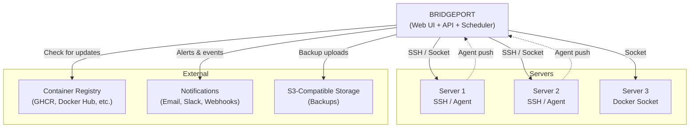
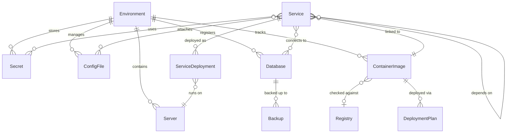

# Core Concepts

How BRIDGEPORT thinks about your infrastructure -- the mental model you need to use it effectively.

---

## Table of Contents

- [Architecture Overview](#architecture-overview)
- [Core Concepts](#core-concepts-1)
- [How Concepts Relate](#how-concepts-relate)
- [Glossary](#glossary)

---

## Architecture Overview

BRIDGEPORT follows a **hub-and-spoke model**. A single BRIDGEPORT instance connects to your servers over SSH (or the local Docker socket), manages containers, orchestrates multi-step deployments, distributes config-as-code, collects metrics, and sends notifications -- all from one place.

**How it works:**

- **BRIDGEPORT** runs as a single Docker container. It serves the web UI, runs the API, and executes background jobs (health checks, metrics collection, backup scheduling).
- **Servers** are connected via SSH or the local Docker socket. BRIDGEPORT runs Docker commands on them to deploy, monitor, and manage containers.
- **The Agent** (optional) is a lightweight Go binary that runs on each server and pushes metrics, process lists, and container snapshots back to BRIDGEPORT in real-time. Without the agent, BRIDGEPORT collects metrics by polling over SSH.
- **Registries** are polled periodically to detect new image tags. When an update is found, BRIDGEPORT can auto-deploy or notify you.
- **Notifications** go out over multiple channels -- in-app, email (SMTP), Slack, and outgoing webhooks.

---

## Core Concepts

### Environment

A logical grouping of your infrastructure. Each environment has its own servers, services, secrets, SSH key, and settings. Most teams create one environment per stage -- `production`, `staging`, `development` -- but you can organize however you like.

Related: [Environments Guide](guides/environments.md)

### Server

A machine that BRIDGEPORT manages. Servers connect via **SSH** (remote servers) or the **Docker socket** (same machine). BRIDGEPORT runs Docker commands on servers to deploy containers, collect metrics, and discover running services.

Related: [Servers Guide](guides/servers.md)

### Service

A **template** that describes how to run a Docker container — image, compose, health checks, ports, env. Each service has one or more **Service Deployments**, one per server the service runs on. The Service holds the shared definition; each Service Deployment holds per-server runtime state (status, container name, discovery, last deploy).

Related: [Services Guide](guides/services.md)

### Service Deployment

A per-server instance of a Service. When you deploy a Service that targets three servers, BRIDGEPORT creates one Service Deployment per server and reports health, status, and deploy history independently for each. Deployments share their parent Service's image, env, and health-check config.

Related: [Services Guide](guides/services.md)

### Container Image

The central image entity in BRIDGEPORT. A single container image (e.g., `myapp`) can be linked to multiple services across multiple servers. BRIDGEPORT tracks the current tag, checks registries for new tags, and can deploy updates to all linked services at once.

Related: [Container Images Guide](guides/container-images.md)

### Registry

A container registry connection (Docker Hub, GitHub Container Registry, private registries). BRIDGEPORT periodically checks registries for new image tags and can auto-link images based on patterns. When a new tag is detected, BRIDGEPORT can auto-deploy or notify you.

Related: [Registries Guide](guides/registries.md)

### Secret

An encrypted key-value pair stored in BRIDGEPORT's database. Secrets are encrypted at rest with AES-256-GCM and can be injected into services as environment variables. Some secrets can be marked as `neverReveal` to prevent viewing in the UI.

Related: [Secrets Guide](guides/secrets.md)

### Config File

A configuration file managed by BRIDGEPORT and synced to servers. Supports both text and binary files (nginx configs, SSL certificates, `.env` files). Every edit is saved to history, so you can roll back to any previous version. Config files can interpolate secrets and variables and iterate over tagged servers with `{{range servers tag="..."}}` templating.

Related: [Config Files Guide](guides/config-files.md)

### Config Fragment

A named, environment-scoped block of reusable text shared across multiple config files (a common header, a shared upstream block, a license preamble). Edit the fragment once and BRIDGEPORT auto-resyncs every config file that includes it.

Related: [Config Files Guide](guides/config-files.md)

### Database

A registered database that BRIDGEPORT manages for backups and monitoring. Supports PostgreSQL, MySQL, SQLite, MongoDB, and Redis through a plugin system. You can schedule automated backups, monitor performance metrics, and link databases to the services that use them.

Related: [Databases Guide](guides/databases.md)

### Deployment Plan

An orchestrated multi-service deployment. When services have dependencies (e.g., "deploy the API before the worker"), a deployment plan resolves the correct order, executes each step, verifies health checks, and automatically rolls back all services if any step fails.

Related: [Deployment Plans Guide](guides/deployment-plans.md)

### Service Account

A machine identity for API access, independent of any human user. Service accounts hold environment-scoped API tokens (capped to a role) used by CI/CD pipelines and automation — they don't log in and survive when people leave the team.

Related: [Users & Access Guide](guides/users.md)

### External Entity & Server Cluster

Topology building blocks beyond your own services. An **External Entity** represents a third-party dependency on the diagram (a CDN, an external client, a managed API). A **Server Cluster** groups related servers (an HA pair, a region) into a single collapsible node. Both make the dashboard topology reflect real-world architecture.

Related: [Topology Guide](guides/topology.md)

---

## How Concepts Relate

**Key relationships:**

- An **Environment** contains servers, secrets, config files, databases, and container images. Everything lives within an environment.
- A **Server** runs **Service Deployments** — the per-server instances of a Service template.
- A **Service** is a template (image, env, health, compose) with one **Service Deployment** per target server. The Service is always linked to a **Container Image**.
- A **Container Image** can be linked to a **Registry** for automatic update detection.
- **Services** can depend on other services, which controls deployment ordering in **Deployment Plans**.
- **Databases** can be linked to services to track which services use which databases.

---

## Glossary

| Term | Definition | Related Docs |
|---|---|---|
| **Agent** | A lightweight Go binary that runs on a server and pushes metrics, container snapshots, and process lists to BRIDGEPORT in real-time. Optional -- SSH polling works without it. | [Agent Reference](reference/agent.md) |
| **Auto-rollback** | When a deployment plan step fails, BRIDGEPORT automatically reverts all previously deployed services to their prior tags. | [Deployment Plans](guides/deployment-plans.md) |
| **Auto-update** | A per-image toggle that tells BRIDGEPORT to automatically deploy new tags when detected by registry checks. | [Container Images](guides/container-images.md) |
| **Batched Sync** | An all-or-nothing transactional sync of multiple config files/resources, with a dry-run preview and automatic rollback if any operation fails. | [Config Files](guides/config-files.md) |
| **Bounce** | A mechanism that suppresses repeated failure notifications. After N consecutive failures, alerts are "bounced" (paused) until the service recovers, preventing alert storms. | [Notifications](guides/notifications.md) |
| **Config File** | A text or binary file managed by BRIDGEPORT, synced to servers, with full edit history. | [Config Files](guides/config-files.md) |
| **Config Fragment** | A named, env-scoped block of reusable text shared across multiple config files; editing it auto-resyncs every file that includes it. | [Config Files](guides/config-files.md) |
| **Container Image** | The central image entity. One image can power multiple services across servers. Tracks current tag, latest available tag, and deployment history. | [Container Images](guides/container-images.md) |
| **Database Type** | A plugin-defined database engine (PostgreSQL, MySQL, SQLite, etc.) with backup commands and monitoring queries. | [Plugin Reference](reference/plugins.md) |
| **Deployment Plan** | An orchestrated multi-service deployment that respects dependency ordering, runs health checks between steps, and auto-rolls back on failure. | [Deployment Plans](guides/deployment-plans.md) |
| **Deployment Step** | A single action within a deployment plan: `deploy`, `health_check`, or `rollback`. | [Deployment Plans](guides/deployment-plans.md) |
| **Discovery** | The process of scanning a server for running Docker containers and importing them as services. | [Servers](guides/servers.md) |
| **Docker Socket** | A connection mode for managing containers on the same machine. BRIDGEPORT communicates with the Docker daemon directly via `/var/run/docker.sock`. | [Installation](installation.md) |
| **Environment** | A logical grouping of infrastructure (production, staging, etc.) with its own servers, services, secrets, SSH key, and settings. | [Environments](guides/environments.md) |
| **External Entity** | A non-server node on the topology diagram representing a third-party dependency (CDN, external client, managed API). | [Topology](guides/topology.md) |
| **Health Check** | A verification of a service's health status. Types include container health, HTTP URL checks, TCP connectivity, and TLS certificate expiry. | [Health Checks](guides/health-checks.md) |
| **Notification Type** | A defined category of notification (e.g., deployment success, health failure) with templates, severity, and per-user channel preferences. | [Notifications](guides/notifications.md) |
| **Registry** | A container registry connection that BRIDGEPORT polls for new image tags. | [Registries](guides/registries.md) |
| **Secret** | An encrypted key-value pair, stored with AES-256-GCM encryption. Injected into services as environment variables. | [Secrets](guides/secrets.md) |
| **Server** | A machine managed by BRIDGEPORT, connected via SSH or Docker socket. | [Servers](guides/servers.md) |
| **Server Cluster** | A logical grouping of related servers (HA pair, region) shown as a single collapsible node on the topology diagram. | [Topology](guides/topology.md) |
| **Service** | A template describing how to run a container (image, env, health, compose). Linked to a Container Image. Has one Service Deployment per server. | [Services](guides/services.md) |
| **Service Account** | A machine identity for API access (CI/CD, automation) that holds env-scoped, role-capped API tokens and is independent of any human user. | [Users & Access](guides/users.md) |
| **Service Deployment** | The per-server instance of a Service. Holds container name, runtime status, discovery state, and deploy history for one server. | [Services](guides/services.md) |
| **Service Dependency** | A relationship between two services that controls deployment ordering: `health_before` (check health first) or `deploy_after` (deploy in sequence). | [Deployment Plans](guides/deployment-plans.md) |
| **Service Type** | A plugin-defined service category (Django, Node.js, etc.) with predefined commands (shell, migrate, etc.). | [Plugin Reference](reference/plugins.md) |
| **SSH Mode** | A connection mode for managing containers on remote servers. BRIDGEPORT runs Docker commands over SSH. | [Servers](guides/servers.md) |
| **System Settings** | Admin-only global configuration for SSH timeouts, webhook retries, backup limits, and external URLs. Configured in the UI at **Admin > System**. | [System Settings Reference](reference/system-settings.md) |
| **Topology Connection** | A user-defined connection between services or databases, displayed on the interactive topology diagram on the dashboard. | [Topology](guides/topology.md) |
