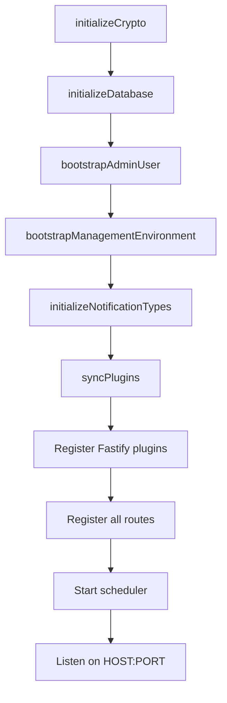
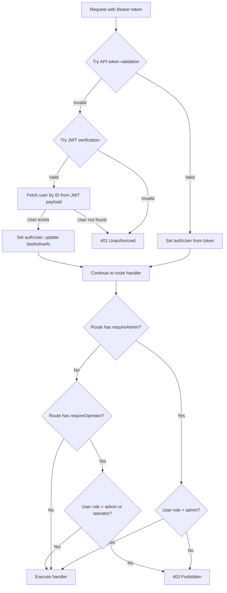

# Development Architecture

A deep dive into how BridgePort's codebase is organized, how the pieces fit together, and the key design decisions behind them.

---

## Table of Contents

- [Directory Structure](#directory-structure)
- [Backend Architecture](#backend-architecture)
- [Frontend Architecture](#frontend-architecture)
- [Database Layer](#database-layer)
- [Scheduler System](#scheduler-system)
- [Authentication Flow](#authentication-flow)
- [Design Decisions](#design-decisions)

---

## Directory Structure

```
bridgeport/
├── src/                        # Backend (Node.js + TypeScript)
│   ├── server.ts               # Fastify entry point, plugin/route registration
│   ├── lib/                    # Core utilities and infrastructure
│   │   ├── config.ts           # Zod-validated environment configuration
│   │   ├── crypto.ts           # AES-256-GCM encryption (secrets, keys)
│   │   ├── db.ts               # Prisma client singleton
│   │   ├── docker.ts           # Docker client abstraction (socket + SSH modes)
│   │   ├── ssh.ts              # SSH client wrapper with connection pooling
│   │   ├── scheduler.ts        # Background job scheduler (timers)
│   │   ├── registry.ts         # Container registry client factory
│   │   ├── image-utils.ts      # Image name parsing and tag utilities
│   │   ├── event-bus.ts        # SSE event bus for real-time updates
│   │   ├── sentry.ts           # Sentry error monitoring initialization
│   │   └── version.ts          # Agent/CLI version file readers
│   ├── routes/                 # API route handlers (Fastify plugins)
│   │   ├── auth.ts             # Login, token refresh, API tokens
│   │   ├── users.ts            # User CRUD with RBAC
│   │   ├── environments.ts     # Environment CRUD
│   │   ├── servers.ts          # Server management
│   │   ├── services.ts         # Container/service management
│   │   ├── secrets.ts          # Secret management + env templates
│   │   ├── config-files.ts     # Config file CRUD with history
│   │   ├── registries.ts       # Registry connection management
│   │   ├── container-images.ts # Image management + deploy triggers
│   │   ├── deployment-plans.ts # Orchestrated deployment plans
│   │   ├── databases.ts        # Database backup + monitoring
│   │   ├── metrics.ts          # Metrics endpoints + agent ingest
│   │   ├── monitoring.ts       # Health logs, overview, SSH testing
│   │   ├── topology.ts         # Service topology + diagram layouts
│   │   ├── notifications.ts    # User notifications + preferences
│   │   ├── webhooks.ts         # Incoming CI/CD webhooks
│   │   ├── events.ts           # SSE real-time event stream
│   │   └── admin/              # Admin-only routes
│   │       ├── smtp.ts         # SMTP configuration
│   │       ├── webhooks.ts     # Outgoing webhook configuration
│   │       └── slack.ts        # Slack channel + routing
│   ├── services/               # Business logic layer
│   │   ├── deploy.ts           # Service deployment execution
│   │   ├── orchestration.ts    # Deployment plan builder + executor
│   │   ├── health-checks.ts    # Health check logic + scheduler config
│   │   ├── health-verification.ts # Post-deploy health verification
│   │   ├── metrics.ts          # SSH metrics collection
│   │   ├── notifications.ts    # Notification creation + delivery
│   │   ├── bounce-tracker.ts   # Alert storm prevention
│   │   ├── image-management.ts # Container image CRUD + tag history
│   │   ├── database-backup.ts  # Backup execution
│   │   ├── database-monitoring-collector.ts # DB metrics scheduler
│   │   ├── database-query-executor.ts # SQL/SSH query executor
│   │   ├── compose.ts          # Docker compose template rendering
│   │   ├── plugin-loader.ts    # Plugin sync from JSON files
│   │   ├── environment-settings.ts # Per-module settings CRUD
│   │   ├── system-settings.ts  # Cached singleton for system settings
│   │   └── ...                 # Additional service modules
│   └── plugins/                # Fastify plugins
│       ├── authenticate.ts     # JWT + API token authentication
│       └── authorize.ts        # RBAC middleware (requireAdmin, requireOperator)
├── ui/                         # Frontend (React + Vite + TypeScript)
│   ├── src/
│   │   ├── components/         # Reusable UI components
│   │   │   ├── Layout.tsx      # Main layout with sidebar navigation
│   │   │   ├── AdminLayout.tsx # Admin area layout
│   │   │   ├── TopBar.tsx      # Breadcrumbs and top navigation
│   │   │   ├── monitoring/     # Shared chart components
│   │   │   └── topology/       # Topology diagram components
│   │   ├── pages/              # Page components (route targets)
│   │   │   ├── Dashboard.tsx   # Overview with topology + stats
│   │   │   ├── Servers.tsx     # Server list
│   │   │   ├── ServiceDetail.tsx # Service detail page
│   │   │   │   └── service-detail/ # Sub-components
│   │   │   ├── admin/          # Admin-only pages
│   │   │   └── ...             # Other page components
│   │   └── lib/                # Client-side utilities
│   │       ├── api.ts          # API client (fetch wrapper)
│   │       ├── store.ts        # Zustand stores (persisted)
│   │       ├── status.ts       # Status color/label utilities
│   │       └── sentry.ts       # Frontend Sentry initialization
│   └── public/                 # Static assets
├── plugins/                    # Plugin JSON definitions
│   ├── service-types/          # Service type definitions (Django, Node.js, etc.)
│   └── database-types/         # Database types with monitoring queries
├── bridgeport-agent/           # Go monitoring agent
│   ├── main.go                 # Entry point
│   ├── collector/              # System and Docker metrics collectors
│   └── Makefile
├── cli/                        # Go CLI tool
│   ├── main.go                 # Entry point
│   ├── cmd/                    # Cobra command implementations
│   ├── internal/               # Internal packages (api, ssh, docker, config)
│   └── Makefile
├── prisma/
│   ├── schema.prisma           # Database schema (single source of truth)
│   └── migrations/             # SQL migration files
├── docker/
│   ├── Dockerfile              # Multi-stage production build
│   ├── docker-compose.yml      # Production deployment template
│   └── entrypoint.sh           # Startup script (migrations + boot)
├── config/                     # Build/test configuration
│   ├── vitest.config.ts        # Integration test config
│   ├── vitest.unit.config.ts   # Unit test config
│   └── codecov.yml             # Code coverage config
├── docs/                       # Project documentation
└── tests/                      # Test infrastructure
    ├── helpers/                 # Test app builder, auth helpers
    ├── factories/               # Test data factories
    └── security/                # RBAC matrix tests
```

---

## Backend Architecture

The backend is a **Fastify** application written in TypeScript, structured in three layers:

### Layer 1: Routes (HTTP Interface)

Route files in `src/routes/` are Fastify plugins that define HTTP endpoints. Each file exports an async function that registers routes:

```typescript
export default async function (fastify: FastifyInstance) {
  fastify.get('/api/servers', {
    preHandler: [fastify.authenticate],
  }, async (request, reply) => {
    // Handler logic
  });
}
```

Routes handle:
- Request validation (via inline Zod schemas or Fastify schema)
- Authentication and authorization (via preHandlers)
- Calling service functions for business logic
- Formatting and sending responses

### Layer 2: Services (Business Logic)

Service files in `src/services/` contain the actual business logic, decoupled from HTTP concerns. They:
- Accept plain function arguments (not Fastify request objects)
- Use the Prisma client directly for database operations
- Call other services as needed
- Are independently testable with mocked dependencies

Example:

```typescript
// src/services/deploy.ts
export async function deployService(serviceId: string, tag: string, userId: string) {
  // Business logic: pull image, stop container, start with new tag
}
```

### Layer 3: Libraries (Infrastructure)

Files in `src/lib/` provide infrastructure concerns:
- **config.ts** -- Zod-validated environment configuration loaded once at startup
- **db.ts** -- Prisma client singleton
- **crypto.ts** -- AES-256-GCM encryption/decryption
- **docker.ts** -- Docker client that works over both SSH and Unix socket
- **ssh.ts** -- SSH connection pooling and command execution
- **scheduler.ts** -- Timer-based background job scheduler
- **registry.ts** -- Factory for registry API clients (Docker Hub, DigitalOcean, generic)

### Plugin Registration

In `src/server.ts`, plugins and routes are registered in a specific order:

1. **CORS** -- Cross-origin request handling
2. **JWT** -- Token verification
3. **Authenticate plugin** -- Decorates `fastify.authenticate` for use in preHandlers
4. **Multipart** -- File upload handling
5. **All route plugins** -- Registered sequentially
6. **Health endpoint** -- `GET /health` (no auth required)
7. **Static file serving** -- UI assets in production mode
8. **Scheduler start** -- Background jobs begin after all routes are ready

### Server Startup Sequence



---

## Frontend Architecture

The frontend is a **React** single-page application built with **Vite** and **TypeScript**.

### State Management

BridgePort uses **Zustand** for state management with the persist middleware:

- **`useAppStore`** in `ui/src/lib/store.ts` -- Single store for all persisted state
- User preferences (filters, time ranges, collapsed states) survive navigation and page refreshes
- Environment selection persisted to localStorage

### API Client

`ui/src/lib/api.ts` provides a thin fetch wrapper that:
- Attaches the JWT token from the store
- Handles 401 responses (redirect to login)
- Parses JSON responses

### Component Patterns

- **Pages** (`ui/src/pages/`) -- Route-level components, one per URL path
- **Components** (`ui/src/components/`) -- Reusable UI building blocks
- **Layouts** -- `Layout.tsx` (main nav + sidebar) and `AdminLayout.tsx` (admin area)
- **No page titles as `<h1>`** -- Titles are shown in the `TopBar` breadcrumbs

### Styling

- **Tailwind CSS** with a dark theme
- Custom utility classes defined in the Tailwind config
- Status colors via `ui/src/lib/status.ts` utilities

### Navigation Structure

The sidebar navigation is grouped into sections:
- **Operations**: Dashboard, Servers, Services, Databases
- **Monitoring**: Overview, Servers, Services, Databases, Health Checks, Agents & SSH
- **Orchestration**: Container Images, Deployment Plans, Registries
- **Configuration**: Environment Settings (admin-only), Secrets, Config Files

Admin pages use a completely separate layout at `/admin/*`.

---

## Database Layer

BridgePort uses **SQLite** with **Prisma ORM**.

### Why SQLite?

- **Zero infrastructure**: No separate database server to manage
- **Single file**: Easy to back up, restore, and move
- **Performance**: More than sufficient for deployment management workloads
- **Simplicity**: Matches the self-hosted, single-binary philosophy

### Prisma Usage

- `prisma/schema.prisma` is the single source of truth for the database schema
- `src/lib/db.ts` exports a singleton Prisma client
- Migrations are SQL files in `prisma/migrations/`, generated by `prisma migrate dev`
- In production, `prisma migrate deploy` runs automatically on container startup

### Key Schema Patterns

**Environment scoping**: Most resources are scoped to an environment via `environmentId`:
```prisma
model Server {
  environmentId String
  environment   Environment @relation(...)
  @@unique([environmentId, name])
}
```

**Encrypted fields**: Sensitive data is stored as ciphertext + nonce pairs:
```prisma
model Secret {
  encryptedValue String  // AES-256-GCM ciphertext
  nonce          String  // 12-byte IV (base64)
}
```

**Container image as central entity**: Every `Service` links to a `ContainerImage`, which is the central entity for image management and deployment orchestration:
```prisma
model Service {
  containerImageId String
  containerImage   ContainerImage @relation(...)
}
```

For details on working with migrations, see [Database Migrations](database-migrations.md).

---

## Scheduler System

The background scheduler (`src/lib/scheduler.ts`) uses `setInterval` timers to run periodic tasks. It is started after all routes are registered and the server is listening.

### Scheduled Tasks

| Task | Default Interval | What It Does |
|------|-----------------|--------------|
| Server health checks | 60s | SSH connectivity check for non-agent servers |
| Service health checks | 60s | URL health checks for services with `healthCheckUrl` |
| Container discovery | 5m | Discover new/removed containers on healthy servers |
| Update checks | 30m | Check registries for new image tags |
| Metrics collection | 5m | Collect CPU/memory/disk via SSH |
| Database metrics | 60s | Collect database monitoring metrics |
| Backup checks | 60s | Check for due backup schedules |
| Agent staleness | 30s | Mark agents as stale/offline if not reporting |
| Metrics cleanup | 1h | Delete metrics older than retention period |
| Notification cleanup | 24h | Delete old notification records |
| Health log cleanup | 24h | Delete old health check logs |
| Audit log cleanup | 24h | Delete old audit log entries |

### Concurrency Control

The scheduler uses `p-limit` with a concurrency of 5 to limit parallel SSH connections and API calls. This prevents overwhelming servers when many health checks or metrics collections run simultaneously.

### Configuration

Scheduler intervals are configured via environment variables (see `src/lib/config.ts`):

```bash
SCHEDULER_ENABLED=true           # Master toggle
SCHEDULER_SERVER_HEALTH_INTERVAL=60   # Seconds
SCHEDULER_SERVICE_HEALTH_INTERVAL=60
SCHEDULER_DISCOVERY_INTERVAL=300
SCHEDULER_UPDATE_CHECK_INTERVAL=1800
SCHEDULER_METRICS_INTERVAL=300
SCHEDULER_BACKUP_CHECK_INTERVAL=60
METRICS_RETENTION_DAYS=7
```

---

## Authentication Flow

BridgePort supports two authentication methods, both using the `Authorization: Bearer <token>` header:



### JWT Tokens

- Issued on login via `POST /api/auth/login`
- Contain `{ id, email }` payload
- Expire after 7 days
- Used by the web UI

### API Tokens

- Created via `POST /api/auth/tokens`
- Stored as SHA-256 hashes (plaintext shown once on creation)
- Optional expiry date
- Used for CI/CD pipelines and scripted access
- Support query parameter auth (`?token=`) for SSE connections

---

## Design Decisions

### Why Fastify instead of Express?

Fastify offers better performance, built-in validation, a plugin system with proper encapsulation, and first-class TypeScript support. The decorator pattern (`fastify.authenticate`) provides clean dependency injection.

### Why a Service Layer?

Separating business logic from route handlers enables:
- Unit testing services with mocked dependencies (no HTTP)
- Reusing logic across routes (e.g., `deployService` used by both manual deploy and webhook trigger)
- Cleaner route handlers that focus on HTTP concerns

### Why Zustand instead of Redux?

Zustand is simpler, has less boilerplate, supports persist middleware out of the box, and works well for BridgePort's state management needs (mostly persisted preferences).

### Why setInterval instead of a Job Queue?

BridgePort is designed to be self-contained with zero external dependencies. A timer-based scheduler avoids the need for Redis, RabbitMQ, or any external job queue. The concurrency limiter (`p-limit`) prevents resource exhaustion. For BridgePort's workload (health checks, metrics collection, cleanup), this approach is simple and sufficient.

### Why Single-File SQLite?

BridgePort manages Docker infrastructure -- it does not handle high-throughput application data. SQLite provides:
- Atomic transactions without a separate database server
- Simple backup (copy one file)
- No connection management complexity
- Sufficient performance for the operational data BridgePort stores

### Why AES-256-GCM?

AES-256-GCM is an AEAD cipher supported natively by Node.js `crypto` module without additional dependencies. It provides both confidentiality and integrity verification, with a 12-byte IV and 16-byte authentication tag per encryption operation.

---

## Environment Variables

Required for development:

```bash
DATABASE_URL=file:./dev.db
MASTER_KEY=<openssl rand -base64 32>
JWT_SECRET=<openssl rand -base64 32>
```

Optional settings:

```bash
HOST=0.0.0.0
PORT=3000
UPLOAD_DIR=./uploads
CORS_ORIGIN=https://deploy.example.com  # Comma-separated origins
PLUGINS_DIR=./plugins                    # Plugin JSON directory

# Initial admin (created on first boot if no users exist)
ADMIN_EMAIL=admin@example.com
ADMIN_PASSWORD=your-secure-password

# Scheduler intervals (all in seconds)
SCHEDULER_ENABLED=true
SCHEDULER_SERVER_HEALTH_INTERVAL=60     # Server health checks
SCHEDULER_SERVICE_HEALTH_INTERVAL=60    # Service health checks
SCHEDULER_DISCOVERY_INTERVAL=300        # Container discovery
SCHEDULER_UPDATE_CHECK_INTERVAL=1800    # Registry update checks
SCHEDULER_METRICS_INTERVAL=300          # SSH metrics collection
SCHEDULER_BACKUP_CHECK_INTERVAL=60      # Backup schedule check

# Sentry error monitoring (opt-in)
SENTRY_BACKEND_DSN=https://key@sentry.io/12345
SENTRY_FRONTEND_DSN=https://key@sentry.io/67890
SENTRY_ENVIRONMENT=production
SENTRY_TRACES_SAMPLE_RATE=0            # 0.0-1.0
SENTRY_ENABLED=true                     # Kill switch
```

---

## Key Models

```
# Core Resources
User               - Authentication with role (admin/operator/viewer), lastActiveAt, apiTokens
ApiToken           - Per-user API tokens with hash, expiry, last used tracking
Environment        - Logical grouping with SSH key, per-module settings (General/Monitoring/Operations/Data/Configuration)
Server             - Physical/virtual machine with metricsMode, dockerMode (ssh/socket), agent status tracking
Service            - Docker container linked to ContainerImage, with dependencies, health config, TCP/cert checks
Secret             - Encrypted key-value with neverReveal flag
ConfigFile         - Synced configuration files (text + binary support with isBinary, mimeType)
FileHistory        - Edit history for config files
Deployment         - Deployment record with logs, duration, linked to ContainerImageHistory
DeploymentArtifact - Generated compose/env/config files per deployment

# Orchestration
ContainerImage        - Central image entity linked to services, with currentTag/latestTag/autoUpdate
ContainerImageHistory - Tag deployment history per image (success/failed/rolled_back)
ServiceDependency     - Deployment order dependencies (health_before, deploy_after)
DeploymentPlan        - Orchestrated multi-service deployment with auto-rollback
DeploymentPlanStep    - Individual steps in a deployment plan (deploy/health_check/rollback)

# Data Management
Database           - Registered database for backups + monitoring (editable after creation)
DatabaseBackup     - Backup record with status, progress, duration
DatabaseMetrics    - Time-series database monitoring metrics (JSON blob per collection)
BackupSchedule     - Cron-based backup scheduling
ServiceDatabase    - Links services to databases with connection env var

# Monitoring & Metrics
ServerMetrics      - Time-series server metrics (CPU, memory, disk, load, TCP, FDs)
ServiceMetrics     - Time-series container metrics (CPU, memory, network, block I/O)
HealthCheckLog     - Health check results with duration, status, response details
AgentContainerSnapshot - Agent-reported container discovery data (latest per server)
AgentProcessSnapshot   - Agent-reported top processes (latest per server)
AgentEvent         - Agent lifecycle events (deploy, status change, token regen)

# Registry & Images
RegistryConnection - Container registry with refreshIntervalMinutes, autoLinkPattern

# Notifications
NotificationType       - Notification type definitions with templates, severity, bounce settings
Notification           - Individual notifications sent to users (in-app, email, webhook)
NotificationPreference - Per-user, per-type notification channel preferences
BounceTracker          - Consecutive failure tracking for bounce logic

# Integrations
SmtpConfig         - SMTP email configuration (singleton-like)
WebhookConfig      - Outgoing webhook endpoints with filtering
SlackChannel       - Slack incoming webhook channels
SlackTypeRouting   - Routes notification types to Slack channels

# Service Topology
ServiceConnection  - User-defined connections between services/databases (port, protocol, direction)
DiagramLayout      - Persisted node positions per environment for topology diagram

# Global Settings
ServiceType        - Predefined service types (Django, Node.js, etc.) with commands
ServiceTypeCommand - Commands for a service type (shell, migrate, etc.)
DatabaseType       - Database engine types (PostgreSQL, MySQL, SQLite) with monitoring queries
DatabaseTypeCommand - Commands for a database type (shell, vacuum, etc.)
SpacesConfig       - Global DO Spaces credentials
SpacesEnvironment  - Per-environment Spaces enable/disable
SystemSettings     - System-wide operational settings (timeouts, limits, retries, URLs)

# Per-Environment Settings (one row each per environment)
GeneralSettings       - sshUser
MonitoringSettings    - Intervals, retention, metric toggles, bounce thresholds
OperationsSettings    - Default docker/metrics modes
DataSettings          - Backup download, default monitoring settings
ConfigurationSettings - Secret reveal permissions
```

---

## UI Features

### Navigation (Sidebar Groups)
- **Operations**: Dashboard, Servers, Services, Databases
- **Monitoring**: Overview, Servers, Services, Databases, Health Checks, Agents & SSH
- **Orchestration**: Container Images, Deployment Plans, Registries
- **Configuration**: Environment Settings (admin), Secrets, Config Files
- **Clickable Logo**: Click sidebar logo to navigate to dashboard
- **My Account Modal**: Click user icon in sidebar to access profile and password change (all users)
- **Notification Bell**: In-app notification dropdown with unread count
- **Collapsible Groups**: Sidebar groups collapse/expand, state persisted to localStorage

### Server Management
- **Monitoring Card**: Configure metrics mode (disabled/SSH/agent), view real-time metrics
- **Create Service**: Manually create services before containers exist
- **Discover Containers**: Auto-discover running Docker containers

### Service Management
- **Deploy**: Deploy new image tags with pull, linked to ContainerImage
- **Health Checks**: Manual health checks with detailed results (container + URL)
- **Health Check Config**: Per-service health wait, retries, interval for deployment orchestration
- **TCP/Cert Checks**: Agent-performed TCP port connectivity and TLS certificate expiry checks
- **Dependencies**: Define deployment order dependencies between services
- **Health Check History**: View past health check results from audit log
- **Deployment History**: View past deployments with expandable logs
- **Config Files**: Attach and sync config files to servers
- **Compose Templates**: Docker compose template management with placeholder substitution

### Container Image Management (`/container-images`)
- **Central Image Entity**: One image can be linked to multiple services
- **Tag History**: Track all deployed tags with success/failure/rollback status
- **Registry Integration**: Check for updates from linked registries
- **Auto-Update**: Per-image toggle for automatic deployment on new tags
- **Deploy All**: Deploy a tag to all linked services via orchestration

### Deployment Orchestration (`/deployment-plans`)
- **Multi-Service Deployment**: Deploy to multiple services with dependency-aware ordering
- **Auto-Rollback**: Automatically roll back all services on failure
- **Step Tracking**: Real-time progress of deploy/health_check/rollback steps
- **Parallel Execution**: Option to run same-level services in parallel

### Database Management
- **Edit Databases**: Edit existing database configurations (name, connection, backup settings)
- **Backup Management**: View, create, and delete backups with schedule configuration
- **Database Monitoring**: Enable/disable monitoring, configure collection intervals, test connections
- **Monitoring Queries**: Plugin-driven (defined in database type JSON files), supports PostgreSQL, MySQL, SQLite

### Notifications (`/notifications`)
- **In-App Inbox**: Notification list with read/unread, filtering by category
- **Preferences**: Per-user, per-type channel preferences (in-app, email, webhook)
- **Bounce Logic**: Consecutive failure tracking to avoid alert storms

### Monitoring Hub (`/monitoring/*`)
- **Overview** (`/monitoring`): Summary hub with quick stats and links to sub-pages
- **Servers** (`/monitoring/servers`): Server metrics with time-series charts (CPU, Memory, Disk, Load, Swap, TCP)
- **Services** (`/monitoring/services`): Service metrics with charts (CPU, Memory, Network RX/TX)
- **Databases** (`/monitoring/databases`): Database monitoring grid with status, key metrics, sparklines
- **Database Detail** (`/monitoring/databases/:id`): Dynamic charts driven by plugin monitoring queries
- **Health Checks** (`/monitoring/health`): Filterable health check logs with pagination
- **Agents** (`/monitoring/agents`): Agent management, SSH connectivity testing, upgrade indicators
- Shared components in `ui/src/components/monitoring/` (ChartCard, StatCard, MetricGauge, etc.)
- Auto-refresh every 30 seconds

### Service Topology (Dashboard)
- **Interactive Diagram**: Visual service/database topology on the dashboard
- **Connections**: User-defined connections with port, protocol, direction
- **Draggable Nodes**: Positions persisted per environment
- **Server Groups**: Services grouped by server visually

### Agent Upgrade Indicators
- Server detail page shows "Update available" badge when deployed agent differs from bundled version
- Monitoring Agents page shows upgrade status column for all agents
- Bundled agent version exposed via `/health` and agent status API

### Admin Area (`/admin/*`) - Separate Layout
- **About** (`/admin/about`): App version + CLI tool downloads
- **System** (`/admin/system`): SSH timeouts, webhook retries, backup timeouts, limits, URLs
- **Service Types** (`/admin/service-types`): Manage predefined service types and commands
- **Database Types** (`/admin/database-types`): Manage database type definitions and monitoring queries
- **Storage** (`/admin/storage`): Global DO Spaces config with per-environment toggles
- **Users** (`/admin/users`): User management with active status tracking
- **Audit** (`/admin/audit`): Audit log viewer
- **Notifications** (`/admin/notifications`): Notification type config, SMTP, Slack channels, webhooks

---

## Related Documentation

- [Development Setup](setup.md) -- getting the dev environment running
- [Database Migrations](database-migrations.md) -- working with schema changes
- [Building](building.md) -- building Docker images and binaries
