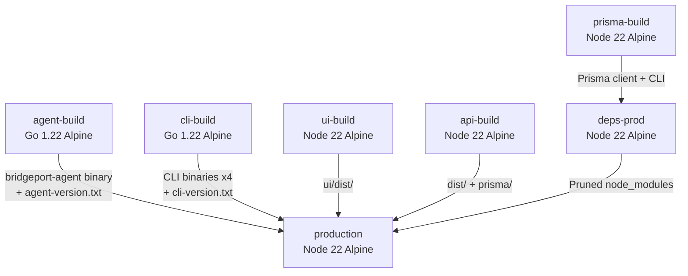

# Building

How to build BRIDGEPORT's Docker image, the Go monitoring agent, and the CLI tool, including the git-based versioning system.

---

## Table of Contents

- [Version Derivation](#version-derivation)
- [Docker Image Build](#docker-image-build)
- [Backend Build](#backend-build)
- [Frontend Build](#frontend-build)
- [Agent Build](#agent-build)
- [CLI Build](#cli-build)

---

## Version Derivation

BRIDGEPORT uses **git-based versioning** derived at build time. There are no version files to maintain in the repository.

| Component | Version Format | Derived From |
|-----------|---------------|--------------|
| **App** | `YYYYMMDDHH-<7-char SHA>` | Current commit at build time |
| **Agent** | `YYYYMMDD-<7-char SHA>` | Last commit touching `bridgeport-agent/` |
| **CLI** | `YYYYMMDD-<7-char SHA>` | Last commit touching `cli/` |

This means:
- The app version changes with every new commit
- The agent version only changes when agent code is modified
- The CLI version only changes when CLI code is modified
- The UI displays the app version via `import.meta.env.VITE_APP_VERSION`
- The bundled agent and CLI versions are stored as text files inside the Docker image (`agent/agent-version.txt`, `cli/cli-version.txt`)

### Generating Version Strings

```bash
# App version (current commit)
APP_VERSION=$(git log -1 --format='%cd-%h' --date=format:'%Y%m%d%H')

# Agent version (last commit touching bridgeport-agent/)
AGENT_VERSION=$(git log -1 --format='%cd-%h' --date=format:'%Y%m%d' -- bridgeport-agent/)

# CLI version (last commit touching cli/)
CLI_VERSION=$(git log -1 --format='%cd-%h' --date=format:'%Y%m%d' -- cli/)
```

Example output: `2026022514-a1b2c3d`

---

## Docker Image Build

The production Docker image uses a **multi-stage build** with 6 stages to minimize the final image size:



### Build Stages

| Stage | Base Image | Purpose |
|-------|-----------|---------|
| `agent-build` | `golang:1.22-alpine` | Compiles the Go agent for `linux/amd64` |
| `cli-build` | `golang:1.22-alpine` | Compiles the Go CLI for 4 platforms (darwin/linux x amd64/arm64) |
| `ui-build` | `node:22-alpine` | Builds the React frontend with Vite |
| `api-build` | `node:22-alpine` | Compiles TypeScript backend with `tsc` |
| `prisma-build` | `node:22-alpine` | Generates Prisma client |
| `deps-prod` | `node:22-alpine` | Installs production-only npm dependencies, prunes unnecessary files |
| `production` | `node:22-alpine` | Final image with all artifacts |

### Build Command

```bash
# Generate version strings
APP_VERSION=$(git log -1 --format='%cd-%h' --date=format:'%Y%m%d%H')
AGENT_VERSION=$(git log -1 --format='%cd-%h' --date=format:'%Y%m%d' -- bridgeport-agent/)
CLI_VERSION=$(git log -1 --format='%cd-%h' --date=format:'%Y%m%d' -- cli/)

# Build the image
docker build \
  --build-arg APP_VERSION=$APP_VERSION \
  --build-arg AGENT_VERSION=$AGENT_VERSION \
  --build-arg CLI_VERSION=$CLI_VERSION \
  -f docker/Dockerfile \
  -t bridgeport:latest \
  .
```

### Build Arguments

| Arg | Default | Description |
|-----|---------|-------------|
| `APP_VERSION` | `dev` | Displayed in the UI and `/health` endpoint |
| `AGENT_VERSION` | `dev` | Embedded in the agent binary via `-ldflags` |
| `CLI_VERSION` | `dev` | Embedded in the CLI binary via `-ldflags` |

### What the Final Image Contains

The production image (`node:22-alpine` base) includes:

- Compiled JavaScript backend (`/app/dist/`)
- Built frontend assets (`/app/ui/dist/`)
- Pruned production `node_modules` (Prisma client + runtime deps)
- Prisma migration files (`/app/prisma/`)
- Agent binary for Linux amd64 (`/app/agent/bridgeport-agent`)
- CLI binaries for all 4 platforms (`/app/cli/`)
- Plugin JSON files (`/app/plugins/`)
- Entrypoint script (`/app/entrypoint.sh`)
- Runtime tools: `openssh-client`, `docker-cli`, `docker-cli-compose`, `sqlite`, `postgresql16-client`

The image runs as the `node` user (non-root) and exposes port 3000.

---

## Backend Build

The backend is compiled from TypeScript to JavaScript using `tsc`:

```bash
# Install dependencies
npm install

# Generate Prisma client (required before build)
npm run db:generate

# Compile TypeScript
npm run build
```

Output is written to `dist/`. The entry point is `dist/server.js`.

> [!NOTE]
> `npm run db:generate` must be run before `npm run build` because the TypeScript code imports Prisma-generated types. Without the generated client, compilation will fail with type errors.

---

## Frontend Build

The frontend is built with Vite:

```bash
cd ui
npm install
npm run build
```

Output is written to `ui/dist/`. In production, the Fastify backend serves these static files.

The `VITE_APP_VERSION` environment variable is embedded at build time:

```bash
VITE_APP_VERSION=20260225-a1b2c3d npm run build
```

This makes the version available in the frontend via `import.meta.env.VITE_APP_VERSION`.

---

## Agent Build

The monitoring agent is a Go binary in `bridgeport-agent/`:

```bash
cd bridgeport-agent
```

### Build for Current Platform

```bash
make build
```

Produces `bridgeport-agent` for your current OS/architecture.

### Build for Linux (Deployment)

```bash
make build-linux
```

Produces two binaries:
- `bridgeport-agent-linux-amd64`
- `bridgeport-agent-linux-arm64`

### Build with Custom Version

```bash
make build VERSION=20260225-a1b2c3d
```

The version is injected via Go linker flags (`-ldflags="-X main.Version=..."`) and reported by the agent to BRIDGEPORT.

### How It Is Built in the Docker Image

In the Docker multi-stage build, the agent is compiled with:

```dockerfile
CGO_ENABLED=0 GOOS=linux GOARCH=amd64 go build \
  -ldflags="-s -w -X main.Version=${AGENT_VERSION}" \
  -o bridgeport-agent .
```

The `-s -w` flags strip debug information to reduce binary size. `CGO_ENABLED=0` ensures a statically-linked binary.

---

## CLI Build

The CLI tool is a Go binary in `cli/`:

```bash
cd cli
```

### Build for Current Platform

```bash
make build
```

Produces `bridgeport` for your current OS/architecture.

### Build for All Platforms

```bash
make build-all
```

Produces binaries in `dist/`:
- `bridgeport-darwin-amd64` (macOS Intel)
- `bridgeport-darwin-arm64` (macOS Apple Silicon)
- `bridgeport-linux-amd64` (Linux x86_64)
- `bridgeport-linux-arm64` (Linux ARM64)

### Build with Custom Version

```bash
make build VERSION=20260225-a1b2c3d
```

The version is injected via Go linker flags (`-ldflags "-X github.com/bridgein/bridgeport-cli/cmd.Version=..."`) and displayed by `bridgeport version`.

### Other Make Targets

| Target | Description |
|--------|-------------|
| `make install` | Install to `GOPATH/bin` |
| `make test` | Run Go tests |
| `make lint` | Run golangci-lint |
| `make deps` | Download dependencies |
| `make tidy` | Tidy go.mod |
| `make completions` | Generate shell completions (bash, zsh, fish) |
| `make clean` | Remove build artifacts |

---

## Related Documentation

- [Development Setup](setup.md) -- local development environment
- [Architecture](architecture.md) -- codebase structure
- [Upgrades](../operations/upgrades.md) -- how built images are deployed
