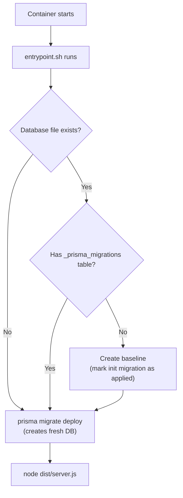

# Database Migrations

BridgePort's migration system is designed around one golden rule: container updates must always work automatically with zero human intervention.

---

## Table of Contents

- [The Golden Rule](#the-golden-rule)
- [How Migrations Run in Production](#how-migrations-run-in-production)
- [Development Workflow](#development-workflow)
- [Handling Breaking Changes](#handling-breaking-changes)
- [Testing with Production Data](#testing-with-production-data)
- [What to Never Do](#what-to-never-do)
- [Pre-Merge Checklist](#pre-merge-checklist)
- [Emergency Recovery](#emergency-recovery)

---

## The Golden Rule

**When someone pulls a new BridgePort image and restarts the container, it must just work.**

No SSH-ing into the server. No running manual commands. No reading release notes for migration instructions. The container starts, detects pending migrations, applies them, and boots the application.

If this process fails, the deployment is broken and the user is stuck. Every schema change must be designed with this constraint in mind.

---

## How Migrations Run in Production

Every time the BridgePort container starts, the entrypoint script (`docker/entrypoint.sh`) runs before the application:



### The Entrypoint Script

1. **Checks for the database file** at `DATABASE_URL`
2. **Detects legacy databases** (those created before migration tracking existed) and baselines them by inserting a record into `_prisma_migrations` for the initial migration
3. **Runs `prisma migrate deploy`** which applies all pending migrations in order
4. **Starts the application** with `exec node dist/server.js`

The `prisma migrate deploy` command is designed for production. It:
- Only runs forward (never rolls back)
- Applies migrations that have not yet been recorded in `_prisma_migrations`
- Fails loudly if a migration has errors (the container will not start)

---

## Development Workflow

When you need to change the database schema:

### Step 1: Edit the Schema

Modify `prisma/schema.prisma` with your changes:

```prisma
model Server {
  // ... existing fields
  newField String @default("")  // Add your field with a safe default
}
```

### Step 2: Create the Migration

```bash
npx prisma migrate dev --name descriptive_name
```

This command:
1. Generates a SQL migration file in `prisma/migrations/YYYYMMDDHHMMSS_descriptive_name/migration.sql`
2. Applies the migration to your development database
3. Regenerates the Prisma client

Expected output:

```
Applying migration `20260225120000_descriptive_name`

The following migration(s) have been applied:

migrations/
  └─ 20260225120000_descriptive_name/
    └─ migration.sql

Your database is now in sync with your schema.
✔ Generated Prisma Client
```

### Step 3: Review the Generated SQL

Always inspect the generated migration:

```bash
cat prisma/migrations/20260225120000_descriptive_name/migration.sql
```

Prisma generates safe SQL for most operations. For simple additions, you will see something like:

```sql
ALTER TABLE "Server" ADD COLUMN "newField" TEXT NOT NULL DEFAULT '';
```

For more complex changes (renaming columns, adding required foreign keys), Prisma may need to recreate the table (SQLite limitation). Review these carefully.

### Step 4: Test the Migration

```bash
npm run dev  # Start the app and verify it works
```

### Step 5: Commit

Always commit the migration files alongside your schema changes:

```bash
git add prisma/schema.prisma prisma/migrations/
git commit -m "Add newField to Server model"
```

---

## Handling Breaking Changes

Prisma handles most schema changes automatically, but some require manual SQL editing.

### Adding a Required Column (with default)

Prisma generates this automatically when you provide a `@default` value:

```prisma
model Service {
  healthWaitMs Int @default(30000)
}
```

Generated SQL:

```sql
ALTER TABLE "Service" ADD COLUMN "healthWaitMs" INTEGER NOT NULL DEFAULT 30000;
```

This is safe -- existing rows get the default value.

### Adding a Required Foreign Key

This requires a multi-step migration because existing rows need valid foreign key values:

```prisma
model Service {
  containerImageId String
  containerImage   ContainerImage @relation(...)
}
```

You may need to edit the generated SQL to handle existing data:

```sql
-- Step 1: Add the column as nullable
ALTER TABLE "Service" ADD COLUMN "containerImageId" TEXT;

-- Step 2: Create related records for existing services
INSERT INTO "ContainerImage" (id, name, imageName, currentTag, environmentId)
SELECT
  'img-' || "Service".id,
  "Service".name,
  "Service".name,
  "Service".imageTag,
  "Server".environmentId
FROM "Service"
JOIN "Server" ON "Service".serverId = "Server".id
WHERE "Service".containerImageId IS NULL;

-- Step 3: Update services with the new image IDs
UPDATE "Service"
SET "containerImageId" = 'img-' || id
WHERE "containerImageId" IS NULL;

-- Step 4: Prisma recreates the table with NOT NULL constraint (SQLite limitation)
-- This part is auto-generated by Prisma
```

### Renaming a Column

SQLite does not support `ALTER TABLE RENAME COLUMN` in older versions. Prisma handles this by recreating the table:

1. Create a new table with the correct schema
2. Copy data from the old table
3. Drop the old table
4. Rename the new table

Prisma generates this automatically, but review the SQL to ensure data is preserved correctly.

### Removing a Column

Prisma recreates the table without the column. Data in the removed column is lost. Make sure this is intentional.

---

## Testing with Production Data

Before merging any schema change, test it against a copy of real data:

```bash
# Copy production database to a test location
cp /path/to/prod/bridgeport.db ./test-migration.db

# Run migrations against the copy
DATABASE_URL=file:./test-migration.db npx prisma migrate deploy
```

If this succeeds, the migration is safe for production. If it fails, fix the SQL before committing.

> [!WARNING]
> Never test migrations against the actual production database. Always work on a copy.

---

## What to Never Do

### Never Use `db push` in Production

```bash
# WRONG - bypasses migration tracking
npx prisma db push
```

`db push` modifies the database schema directly without creating migration files. This means:
- No migration history is recorded
- Other deployments will not know about the changes
- `prisma migrate deploy` may fail because the schema is out of sync with the migration history

### Never Commit Schema Changes Without Migrations

```bash
# WRONG - missing migration files
git add prisma/schema.prisma
git commit -m "Add new field"
```

If you commit a schema change without the corresponding migration files, the production container will start with an out-of-date database. The schema and migration history will be out of sync.

### Never Manually Edit Production Databases

```bash
# WRONG - breaks Prisma migration state
sqlite3 prod.db "ALTER TABLE Service ADD COLUMN foo TEXT;"
```

Manual schema changes are not tracked in `_prisma_migrations`. The next `prisma migrate deploy` will either fail (if it tries to make a conflicting change) or succeed but leave the database in an inconsistent state.

### Never Delete Migration Files

Once a migration is committed and potentially deployed, it must stay in the repository forever. Prisma checks the migration history against the files on disk. Missing files cause deployment failures.

---

## Pre-Merge Checklist

Before merging any schema change, verify:

- [ ] `npx prisma migrate dev` succeeded in your development environment
- [ ] The generated SQL file is reviewed for data safety
- [ ] Tested with existing data (not just an empty database)
- [ ] Migration files are committed to git alongside `prisma/schema.prisma`
- [ ] No `prisma db push` commands in the change
- [ ] Application starts and works correctly after the migration
- [ ] If adding required fields: safe defaults are provided
- [ ] If adding foreign keys: existing data is handled in the migration SQL

---

## Emergency Recovery

### Migration Fails on Container Start

**Symptoms**: Container exits immediately after printing a Prisma migration error.

**Steps**:

1. Read the error in the container logs:
   ```bash
   docker logs bridgeport
   ```

2. The error points to the specific migration file and SQL statement that failed.

3. **If the database is corrupted**: Restore from backup.
   ```bash
   docker compose stop
   cp ./backups/bridgeport-latest.db ./data/bridgeport.db
   docker compose up -d
   ```

4. **If the migration SQL is wrong**: This is a bug in the release. Pin the previous version:
   ```yaml
   services:
     bridgeport:
       image: ghcr.io/bridgeinpt/bridgeport:previous-tag
   ```

5. Report the issue so the migration can be fixed in the codebase.

### Legacy Database Baseline Fails

For databases created before migration tracking, the entrypoint script creates a baseline automatically. If this fails:

1. Check that `sqlite3` is available in the container (it is included in the production image)
2. Check the `_prisma_migrations` table:
   ```bash
   docker exec bridgeport sqlite3 /data/bridgeport.db "SELECT * FROM _prisma_migrations;"
   ```
3. If the table exists but the baseline record is missing, you can manually insert it (following the pattern in `docker/entrypoint.sh`)

### Migration State Is Corrupted

If `_prisma_migrations` is out of sync with the actual schema (e.g., from a manual database edit):

1. **Best option**: Restore from a backup and re-apply migrations
2. **Last resort**: Delete the `_prisma_migrations` table and recreate the baseline. This is risky -- only do this if you understand the current schema state.

---

## Related Documentation

- [Development Setup](setup.md) -- getting started with development
- [Architecture](architecture.md) -- how the codebase is organized
- [Building](building.md) -- building Docker images
- [Upgrades](../operations/upgrades.md) -- how upgrades work in production
- [Backup & Restore](../operations/backup-restore.md) -- protecting your database
