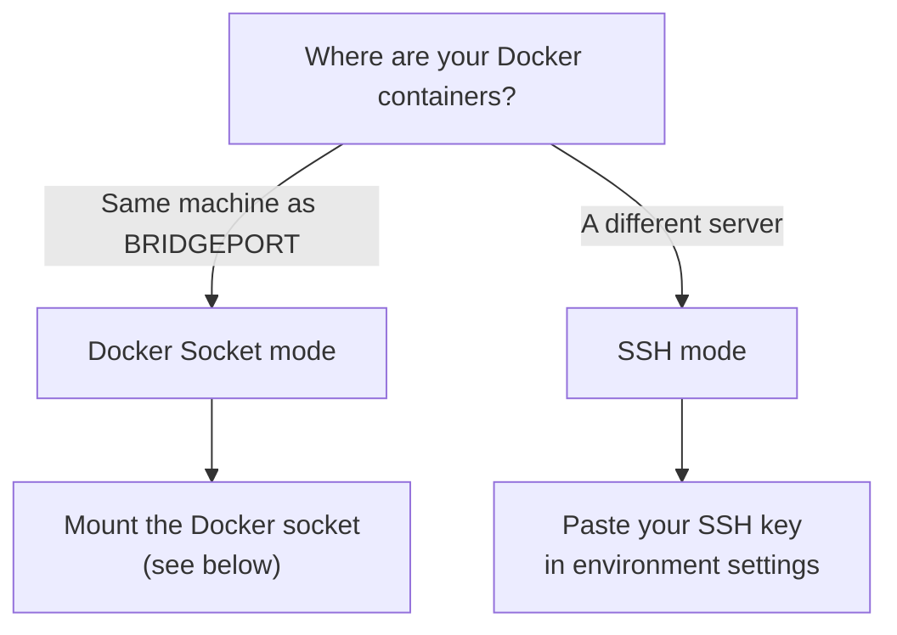

# Getting Started

Get BRIDGEPORT running and manage your first server in under 5 minutes.

---

## What You'll Accomplish

By the end of this guide, you will have:

1. A running BRIDGEPORT instance
2. Your first environment created
3. A server added and connected
4. Your running Docker containers discovered as services

## Prerequisites

- **Docker** installed on your machine ([install Docker](https://docs.docker.com/get-docker/))
- **A server to manage** -- either the same machine (via Docker socket) or a remote server with SSH access

> [!TIP]
> No remote server? You can manage containers on the same machine BRIDGEPORT runs on by mounting the Docker socket. This guide covers both options.

---

## Step 1: Start BRIDGEPORT

Run this single command to start BRIDGEPORT:

```bash
docker run -d \
  --name bridgeport \
  -p 3000:3000 \
  -v bridgeport-data:/data \
  -e MASTER_KEY=$(openssl rand -base64 32) \
  -e JWT_SECRET=$(openssl rand -base64 32) \
  -e ADMIN_EMAIL=admin@example.com \
  -e ADMIN_PASSWORD=changeme123 \
  ghcr.io/bridgeinpt/bridgeport:latest
```

You should see output like:

```
Unable to find image 'ghcr.io/bridgeinpt/bridgeport:latest' locally
latest: Pulling from bridgeinpt/bridgeport
...
Status: Downloaded newer image for ghcr.io/bridgeinpt/bridgeport:latest
a1b2c3d4e5f6...
```

Verify it's running:

```bash
docker logs bridgeport
```

Expected output:

```
=== BRIDGEPORT Startup ===
Database path: /data/bridgeport.db
No database found, will create fresh
Applying migrations...
...
=== Starting BRIDGEPORT ===
Server listening on 0.0.0.0:3000
```

Open **http://localhost:3000** in your browser.

> [!WARNING]
> This quick-start command is for trying BRIDGEPORT out. The `MASTER_KEY` and `JWT_SECRET` are generated inline and not saved anywhere. For production, see the [Installation Guide](installation.md).

---

## Step 2: Log In

You'll see the BRIDGEPORT login page. Enter the credentials you set in the `docker run` command:

- **Email**: `admin@example.com`
- **Password**: `changeme123`

After logging in, you'll land on an empty dashboard. Time to set things up.

---

## Step 3: Create an Environment

Environments are how BRIDGEPORT organizes your infrastructure. Think of them as logical groups -- "production", "staging", "dev", etc. Each environment has its own servers, services, secrets, and settings.

1. Look at the **sidebar** on the left
2. Click the **environment selector** dropdown at the top
3. Click **Create Environment**
4. Enter a name (e.g., `production`) and click **Create**

Your new environment is now active.

---

## Step 4: Add Your First Server

This is where it gets interesting. How you add a server depends on where your containers are running.



### Option A: Same Machine (Docker Socket)

If your containers run on the same machine as BRIDGEPORT, mount the Docker socket. First, stop and re-create the container:

```bash
docker stop bridgeport && docker rm bridgeport
```

Then re-run with the socket mounted:

```bash
docker run -d \
  --name bridgeport \
  -p 3000:3000 \
  -v bridgeport-data:/data \
  -v /var/run/docker.sock:/var/run/docker.sock \
  -e MASTER_KEY=$(openssl rand -base64 32) \
  -e JWT_SECRET=$(openssl rand -base64 32) \
  -e ADMIN_EMAIL=admin@example.com \
  -e ADMIN_PASSWORD=changeme123 \
  ghcr.io/bridgeinpt/bridgeport:latest
```

> [!NOTE]
> When the Docker socket is mounted and accessible, BRIDGEPORT automatically detects the host and creates a "localhost" server. Navigate to **Servers** in the sidebar -- you should see it already listed.

### Option B: Remote Server (SSH)

For remote servers, you'll connect via SSH.

1. **Upload your SSH key**: Go to **Configuration > Environment Settings** in the sidebar, then upload the SSH private key that has access to your server
2. **Add the server**: Go to **Servers** in the sidebar and click **Add Server**
3. **Enter the details**:
   - **Name**: A friendly name (e.g., `web-1`)
   - **Hostname**: The server's IP or domain (e.g., `10.0.1.50`)
4. **Test the connection**: BRIDGEPORT will verify SSH connectivity

Once connected, the server should appear with a **healthy** status.

> [!TIP]
> SSH keys are encrypted at rest and stored per-environment. Each environment can have its own SSH key for security isolation.

---

## Step 5: Discover Your Containers

Now for the fun part -- seeing your running containers.

1. Go to **Servers** in the sidebar
2. Find your server and click **Discover**
3. BRIDGEPORT scans the server for running Docker containers
4. Each container appears as a **Service** with its image, status, and ports

Navigate to **Services** in the sidebar to see everything that was discovered. Each service is linked to a **Container Image**, which BRIDGEPORT uses to track tags, check for updates, and manage deployments.

---

## Step 6: Deploy an Update (Optional)

Ready to see BRIDGEPORT in action? Try deploying a new tag to one of your services.

1. Go to **Services** and click on a service
2. In the **Deploy** card, enter a new image tag (e.g., `v1.2.0`)
3. Click **Deploy**
4. Watch the deployment log stream in real-time:
   - Image pulled
   - Container stopped
   - New container started
   - Health check passed

The deployment is recorded in the service's **Deployment History** with full logs and timestamps.

---

## What's Next?

You've got BRIDGEPORT running and managing your first server. Here's where to go from here:

| I want to... | Read this |
|---|---|
| Set up server and service monitoring | [Monitoring Guide](guides/monitoring.md) |
| Get notified about failures and deployments | [Notifications Guide](guides/notifications.md) |
| Connect a container registry for update checks | [Registries Guide](guides/registries.md) |
| Schedule database backups | [Databases Guide](guides/databases.md) |
| Manage secrets and config files | [Secrets Guide](guides/secrets.md) / [Config Files Guide](guides/config-files.md) |
| Use the CLI for terminal workflows | [CLI Reference](reference/cli.md) |
| Deploy BRIDGEPORT for production | [Installation Guide](installation.md) |
| Understand how BRIDGEPORT is structured | [Core Concepts](concepts.md) |

> [!NOTE]
> For production deployments, make sure to follow the [Installation Guide](installation.md) for proper key management, HTTPS setup, and persistent configuration.
