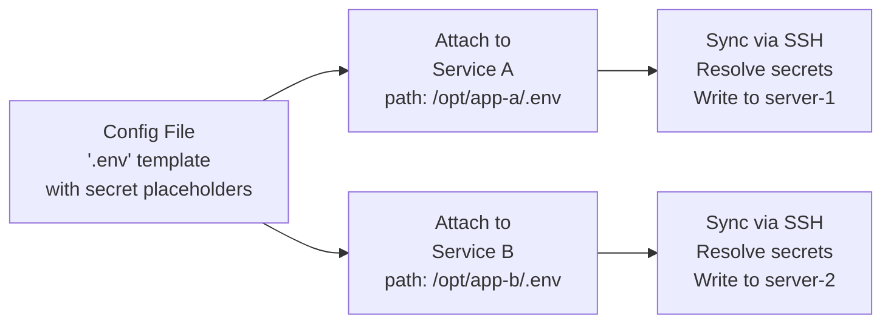
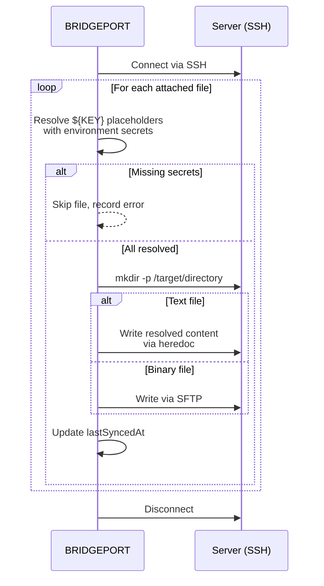

# Config Files

Config files let you store, version, and sync configuration to your servers via SSH -- from `.env` files and Nginx configs to SSL certificates and Docker Compose templates.

## Table of Contents

- [Quick Start](#quick-start)
- [How It Works](#how-it-works)
- [Creating Config Files](#creating-config-files)
- [Attaching Files to Services](#attaching-files-to-services)
- [Syncing Files to Servers](#syncing-files-to-servers)
- [Batched Atomic Sync](#batched-atomic-sync)
- [Secret and Variable Placeholders](#secret-and-variable-placeholders)
- [Iterating Over Servers](#iterating-over-servers)
- [Reusable Fragments](#reusable-fragments)
- [Edit History and Rollback](#edit-history-and-rollback)
- [Sync Status](#sync-status)
- [Auto Re-sync on Value Change](#auto-re-sync-on-value-change)
- [Use Cases](#use-cases)
- [Configuration Options](#configuration-options)
- [Troubleshooting](#troubleshooting)
- [Related](#related)

---

## Quick Start

Create a config file and deploy it to a server in under a minute:

1. Go to **Configuration > Config Files** in the sidebar.
2. Click **Add Config File**.
3. Enter a name ("App API .env"), filename (`.env`), and paste your content.
4. Click **Create**.
5. Go to the service that needs this file, click **Attach File**, select the config file, and enter the target path (e.g., `/opt/app/.env`).
6. Click **Sync Files** on the service to write the file to the server.

---

## How It Works

Config files exist at the environment level and are deployed to servers through service attachments. The flow is: create, attach, sync.



**Key concepts:**

- **Environment-scoped.** Config files belong to an environment and can be attached to any service within that environment.
- **Template-based.** Text files support `${SECRET_KEY}` placeholders that are resolved at sync time with actual [secret](secrets.md) values.
- **Version-tracked.** Every content edit creates a history entry. You can restore any previous version.
- **Sync-aware.** Each service-file attachment tracks when it was last synced. Editing a file after syncing shows a "pending" status so you know which servers need updating.

---

## Creating Config Files

### Text Files (UI)

1. Navigate to **Configuration > Config Files**.
2. Click **Add Config File**.
3. Fill in the form:

| Field | Required | Description |
|-------|----------|-------------|
| **Name** | Yes | Display name (e.g., "App API .env"). Must be unique per environment. |
| **Filename** | Yes | Target filename on the server (e.g., `.env`, `nginx.conf`, `docker-compose.yml`) |
| **Content** | Yes | File content. Use `${SECRET_KEY}` for secret placeholders. |
| **Language** | No | Syntax-highlighting hint for the editor. Auto-detected from **Filename** on save when omitted (e.g., `*.yml` → `yaml`, `Dockerfile` → `dockerfile`, `Caddyfile` → `nginx`). Override via the **Language** dropdown next to the editor. Stored on the row and reused for the read-only viewer and history diffs. |
| **Description** | No | Optional documentation |

4. Click **Create**.

The content editor uses CodeMirror with syntax highlighting. Supported language values:
`plaintext`, `yaml`, `json`, `env`, `toml`, `ini`, `conf`, `sh`, `dockerfile`, `nginx`, `sql`.
Unknown filenames fall back to `plaintext`.

### Text Files (API)

```http
POST /api/environments/:envId/config-files
Authorization: Bearer <token>
Content-Type: application/json

{
  "name": "App API .env",
  "filename": ".env",
  "content": "DATABASE_URL=${DATABASE_URL}\nREDIS_URL=${REDIS_URL}\nDEBUG=false",
  "description": "Environment variables for the API service"
}
```

### Binary Files (Upload)

For certificates, compiled configs, and other binary files:

1. Click **Upload Asset** on the Config Files page.
2. Select the file from your computer.
3. Enter a display name and filename.

Binary files are stored as base64 in the database and synced to servers via SFTP. They do not support secret placeholder substitution.

**API (multipart upload):**

```http
POST /api/environments/:envId/asset-files/upload
Authorization: Bearer <token>
Content-Type: multipart/form-data

name: "Cloudflare Origin Cert"
filename: "cloudflare-origin.pem"
file: <binary file data>
```

> [!NOTE]
> Binary file content is not returned in API responses to keep payloads small. The file metadata (name, filename, size, MIME type) is always available.

### Replacing a Binary File

Binary files cannot be edited in the text editor. To replace the content of an existing binary file in place (keeping its service attachments, sync assignments, and history):

1. Click **Edit** on the binary file.
2. Choose a replacement file under **Replace file**.
3. Click **Save Changes**. The previous content is kept in history for rollback.

**API (multipart upload):**

```http
POST /api/config-files/:id/replace-asset
Authorization: Bearer <token>
Content-Type: multipart/form-data

file: <binary file data>
```

The file's `mimeType` and `fileSize` are updated from the uploaded file. Requires the operator role.

> [!WARNING]
> `PATCH /api/config-files/:id` rejects an empty `content` value for binary files — since binary content is stripped from API responses, round-tripping a fetched file through PATCH would otherwise wipe the stored payload. Use the replace endpoint above to change binary content.

---

## Attaching Files to Services

Config files are deployed through **service attachments**. One config file can be attached to multiple services across different servers, each with a different target path.

### Attaching a File

**UI:** Go to the service detail page > Config Files section > **Attach File**.

**API:**
```http
POST /api/services/:serviceId/files
Authorization: Bearer <token>
Content-Type: application/json

{
  "configFileId": "clxyz...",
  "targetPath": "/opt/app/.env"
}
```

The `targetPath` is the absolute path on the server where the file will be written during sync. BRIDGEPORT creates parent directories automatically if they do not exist.

### Detaching a File

```http
DELETE /api/services/:serviceId/files/:configFileId
Authorization: Bearer <token>
```

Detaching a file removes the link but does not delete the file from the server where it was previously synced.

### Updating the Target Path

```http
PATCH /api/services/:serviceId/files/:configFileId
Authorization: Bearer <token>
Content-Type: application/json

{
  "targetPath": "/opt/app/config/.env"
}
```

> [!TIP]
> You can attach the same config file to multiple services with different target paths. For example, attach an Nginx config to `nginx` on server-1 at `/etc/nginx/conf.d/app.conf` and to `nginx` on server-2 at the same path.

---

## Syncing Files to Servers

Syncing writes config files to their target paths on the server via SSH. There are three sync scopes:

### Per-Service Sync

Syncs all files attached to a single service:

**UI:** Service detail page > **Sync Files** button.

**API:**
```http
POST /api/services/:serviceId/sync-files
Authorization: Bearer <token>
```

### Per-Server Sync

Syncs all config files for all services on a server in a single SSH connection:

**UI:** Server detail page > **Sync All Files** button.

**API:**
```http
POST /api/servers/:serverId/sync-all-files
Authorization: Bearer <token>
```

### Per-File Sync

Syncs a specific config file to every service it is attached to. BRIDGEPORT groups by server to minimize SSH connections:

**UI:** Config file detail page > **Sync to All** button.

**API:**
```http
POST /api/config-files/:configFileId/sync-all
Authorization: Bearer <token>
```

### Dry-Run Preview

All three sync endpoints accept `?dryRun=true` (or `X-Dry-Run: true`) to preview what a real sync would write without touching the host file or updating `lastSyncedAt`. The dry-run opens a read-only SSH session, runs `cat <hostPath>` to capture the current contents, and returns a unified diff against the rendered (redacted) content per target.

```http
POST /api/config-files/:id/sync-all?dryRun=true
Authorization: Bearer <token>
```

**Response shape:**

```json
{
  "dryRun": true,
  "results": [
    {
      "serverName": "web-1",
      "serviceName": "api",
      "configFileName": "app.env",
      "hostPath": "/etc/api/app.env",
      "diff": "--- a/etc/api/app.env\n+++ b/etc/api/app.env\n@@ -1,2 +1,2 @@\n-OLD=value\n+NEW=value",
      "exists": true,
      "referencingServices": ["api", "worker"],
      "warnings": []
    }
  ]
}
```

- `diff` is a unified diff string (empty when the rendered content matches the host file).
- `exists` is `false` if the file does not yet exist on the host — `diff` then shows the full rendered content as additions.
- Secret VALUES in the rendered content are replaced with `***`. `${KEY}` placeholders that resolve to a secret are substituted then redacted.
- Binary files are not diffed; they report an empty diff with a warning.
- When the live sync path would have refused this target (missing secrets, template errors), the response carries an `"error"` string and omits the diff. The live path returns `success: false, error: '...'` for the same conditions — the dry-run mirrors that so callers do not render a green preview for a sync that would be rejected.
- The dry-run writes an audit-log entry with `details.dryRun = true`. The same flag works on `POST /api/services/:id/sync-files`.

### What Happens During Sync



**Sync result envelope:**

All three sync endpoints return the same envelope. Branch on `status`, not `success` — the latter is a deprecated alias kept for one release.

```json
{
  "status": "ok",
  "targetsAttempted": 2,
  "targetsSucceeded": 2,
  "targetsFailed": 0,
  "results": [
    { "file": "App API .env", "targetPath": "/opt/app/.env", "success": true },
    { "file": "Nginx Config", "targetPath": "/etc/nginx/conf.d/app.conf", "success": true }
  ],
  "success": true
}
```

`status` is one of:

| Status | Meaning |
|--------|---------|
| `ok` | Every target succeeded. |
| `no_targets` | Zero targets — the config file isn't attached to any service, or the server/service has nothing to sync. Returned as **HTTP 200** with `targetsAttempted: 0` so the UI can render a warning instead of a red error. |
| `partial` | At least one target succeeded and at least one failed. |
| `failed` | Every target failed. |

> [!NOTE]
> Syncing a file does **not** restart the service. After syncing, you may need to restart or reload the service for changes to take effect (e.g., `docker compose up -d` or `nginx -s reload`).

---

## Batched Atomic Sync

When a single change touches multiple config files (a coordinated certificate rotation, an env-wide TLS switch, a redeploy that needs three compose files updated together), use the **batch sync** endpoint to apply them as a single transactional unit.

A batch is **single-environment scope** — every config file referenced by the batch must live in the same BRIDGEPORT environment. v1 supports `config-file-sync` operations only; other op types are rejected with `VALIDATION_ERROR`.

### Endpoint

```http
POST /api/sync/batch
Authorization: Bearer <token>
Idempotency-Key: <optional opaque string>
Content-Type: application/json

{
  "operations": [
    { "type": "config-file-sync", "configFileId": "ck_abc1" },
    { "type": "config-file-sync", "configFileId": "ck_abc2" }
  ],
  "rollbackOnFailure": true
}
```

### Response

```json
{
  "batchId": "ck_batch_xyz",
  "status": "ok",
  "operations": [
    { "index": 0, "status": "ok" },
    { "index": 1, "status": "ok" }
  ]
}
```

Branch on `status`, not on the per-op array length:

| Batch `status` | Meaning |
|---------------|---------|
| `ok` | Every op succeeded. |
| `partial` | At least one op succeeded and at least one failed. With `rollbackOnFailure: true`, this means some rollbacks themselves failed and the environment may be inconsistent — investigate. |
| `rolled_back` | An op failed and all previously successful ops were successfully reverted. The environment is back where it started. |
| `failed` | Every attempted op failed (or `rollbackOnFailure: true` and the very first op failed). |

Per-op `status` is one of: `ok`, `failed`, `skipped` (didn't run because an earlier op failed in `rollbackOnFailure: true` mode), `rolled_back` (was reverted), `rollback_failed` (revert attempt itself failed — manual intervention may be required).

### Rollback semantics

With `rollbackOnFailure: true`:

1. BRIDGEPORT snapshots `ConfigFile.content` **before** each op runs.
2. On the first op failure, the forward loop stops; remaining ops are marked `skipped`.
3. Already-successful ops are walked back in reverse order: prior content is restored to the database, then re-synced to the same servers.
4. If every revert succeeds, the batch ends as `rolled_back`. If any revert fails, the batch ends as `partial` and the failing op carries a `rollback_failed` status.

With `rollbackOnFailure: false` (best-effort):

- Every op is attempted regardless of earlier failures.
- The batch ends as `ok` (all succeeded), `partial` (mixed), or `failed` (all failed).

### Idempotency

Pass an `Idempotency-Key` header on retries to make the call safe to repeat:

- **Same key + same canonicalized body** → returns the original batch result without re-executing.
- **Same key + different body** → returns HTTP `409` with `code: "IDEMPOTENCY_KEY_REUSED"`.

The canonicalization sorts JSON object keys recursively before hashing, so whitespace and key ordering don't affect the dedupe.

### Inspecting a batch

```http
GET /api/sync/batch/:batchId
Authorization: Bearer <token>
```

Returns the same payload shape as the `POST` response. Audit-log entries written by the batch carry a `details.batchId` field so you can correlate individual file syncs back to their batch.

---

## Secret and Variable Placeholders

Text config files support `${KEY}` placeholders that are resolved at sync time against both [secrets](secrets.md) and [variables](secrets.md#creating-variables) from the same environment. See [Secrets and Variables > Using Placeholders in Config Files](secrets.md#using-placeholders-in-config-files) for the full details.

Quick summary:
- Use `${KEY}` syntax in your config file content.
- Placeholders resolve against vars first, then secrets; if the same key exists as both, the secret wins.
- If any referenced key is missing (not a secret and not a var), the sync fails for that file with an error listing the missing keys.
- The stored config file always contains the placeholder, never the actual value.
- A [Config File Scanner](secrets.md#config-file-scanner) can detect hardcoded values across your config files and offer to promote them to secrets or vars.

```env
# Template stored in BRIDGEPORT:
DATABASE_URL=${DATABASE_URL}
SECRET_KEY=${DJANGO_SECRET_KEY}
DEBUG=false

# File written to server after sync:
DATABASE_URL=postgres://user:pass@db:5432/app
SECRET_KEY=django-insecure-abc123
DEBUG=false
```

---

## Iterating Over Servers

In addition to `${KEY}` substitution, config files can enumerate the servers in an environment using a Go-style range block. This is useful for generating reverse-proxy upstreams, cluster member lists, or any output where the body repeats once per matching server.

### Syntax

```
{{range servers <filter>="<value>" [<filter>="<value>"]...}}<body>{{end}}
```

- `<body>` is rendered once per matching server.
- Inside the body, `{{.field}}` interpolates a per-server attribute.
- The empty set renders to an empty string -- no error is raised.
- Servers are emitted in a **stable alphabetical order by name** so the rendered output is deterministic (this matters because it feeds into SHA-256 checksums used for deployment-artifact change detection).

### Filters

| Filter | Description |
|--------|-------------|
| `tag="web"` | Server's `tags` array contains the exact value `web`. |
| `name="api-*"` | Glob match against server name. Supports `*` (any chars) and `?` (single char). |
| `environment="staging"` | Match servers in another environment by name or id. Defaults to the config file's environment when omitted. |

Filters combine with logical AND.

### Per-server fields

| Field | Source |
|-------|--------|
| `.name` | Server name (e.g., `api-1`). |
| `.hostname` | Server hostname / private address. |
| `.privateIp` | Alias of `.hostname`. |
| `.publicIp` | Reserved public IP, or empty string if not set. |
| `.id` | Internal server id. |
| `.tags` | Comma-joined tag list (e.g., `web,api`). |

Referencing an unknown field (e.g., `{{.bogus}}`) emits empty and records a template error during sync.

### Example: Caddyfile upstream

```caddyfile
api.example.com {
  reverse_proxy {{range servers tag="web"}}{{.privateIp}}:8000 {{end}}
}
```

After sync (with two `web`-tagged servers `api-1` and `api-2`):

```caddyfile
api.example.com {
  reverse_proxy 10.0.0.1:8000 10.0.0.2:8000
}
```

### Example: Cluster member list with secret

```yaml
# Servers iterated, then ${CLUSTER_SECRET} substituted in stage 2.
peers:
{{range servers tag="cluster"}}  - id: {{.id}}
    addr: {{.privateIp}}:7000
    name: {{.name}}
{{end}}cluster_secret: ${CLUSTER_SECRET}
```

### Limitations

- **No nesting.** A `{{range}}` block cannot contain another `{{range}}` block; this is reported as a template error during sync.
- **`{{range}}` and `{{end}}` are the only interpreted directives.** Any other `{{...}}` content passes through verbatim, so existing literal usages are unaffected.
- **Unclosed `{{range}}` blocks** are reported as a template error and the unterminated content is left in place.

---

## Reusable Fragments

Long `.env` and config files often repeat — most lines (DB URL, Redis URL, log
config, Sentry DSN, …) are identical across services, with only a few
service-specific keys at the end. **Fragments** are named, reusable text blocks
that live at the environment level and get concatenated into ConfigFiles at
deploy / sync time.

### Concepts

- **Env-scoped.** A fragment belongs to one environment. Names must be unique
  per env.
- **Flat.** A fragment cannot include another fragment — by construction, there
  is no field to do so. No cycle detection needed.
- **Last-definition-wins.** Fragment content is prepended; the ConfigFile's own
  content is appended last. Duplicate keys naturally resolve to the last
  occurrence — so a service-specific `LOG_LEVEL=debug` in the ConfigFile
  overrides a shared `LOG_LEVEL=info` in a fragment without any parser changes.
- **Render hygiene.** When the ConfigFile's language uses `#` comments (env,
  yaml, toml, ini, sh, dockerfile, conf, …), BRIDGEPORT injects a
  `# === fragment: <name> ===` header before each fragment and a
  `# === service-specific ===` header before the ConfigFile's own content. For
  formats that don't use `#` (json, xml, html), headers are skipped and the
  sections are concatenated directly. ConfigFiles with **no** fragments render
  byte-for-byte unchanged from before fragments existed.

### Managing Fragments

Navigate to **Configuration > Fragments** in the sidebar.

- **Create** a fragment with a name, optional description, and content. Content
  can reference `${KEY}` placeholders — they're resolved against the same
  environment-level secrets and vars at sync time.
- **Edit** a fragment to update its content. If the fragment is included by any
  ConfigFile with **Auto Re-sync** enabled, an auto-resync is triggered for
  those files (same pipeline as the secret/var auto-resync).
- **Delete** is blocked when a fragment is in use. The API returns a 409 with
  an `inUseBy` array listing the ConfigFiles (and their attached services)
  that still reference the fragment.

### Including Fragments in a ConfigFile

In the ConfigFile create / edit modal, the **Included Fragments** section lets
you pick fragments to prepend. Use the up/down arrows to reorder — the
position determines render order, and the last definition of a key wins.

Click **Preview** in the edit modal to see the rendered output: fragments
concatenated in order, headers injected, and `${KEY}` placeholders resolved.

### API

```http
POST   /api/environments/:envId/config-fragments
GET    /api/environments/:envId/config-fragments
GET    /api/config-fragments/:id
PATCH  /api/config-fragments/:id
DELETE /api/config-fragments/:id

POST   /api/config-files/:id/preview      # Render fragments + content + placeholders
```

Include fragments by passing `fragmentIds: string[]` on
`POST /api/environments/:envId/config-files` or
`PATCH /api/config-files/:id`. Array order = render order. Sending an empty
array on PATCH clears all includes; omitting the field leaves them unchanged.

---

## Edit History and Rollback

Every content edit to a config file creates a history entry with the previous content, who made the edit, and when.

### Viewing History

**UI:** Config file detail page > **History** tab.

**API:**
```http
GET /api/config-files/:id/history
Authorization: Bearer <token>
```

Returns up to 50 history entries, newest first:
```json
{
  "history": [
    {
      "id": "hist1",
      "editedAt": "2026-02-25T09:00:00.000Z",
      "editedBy": { "id": "usr1", "email": "admin@example.com", "name": "Admin" }
    }
  ]
}
```

### Restoring a Previous Version

1. Open the history for a config file.
2. Select the version to restore.
3. Click **Restore**.

```http
POST /api/config-files/:id/restore/:historyId
Authorization: Bearer <token>
```

Before restoring, the current content is saved as a new history entry so you can always undo a restore. After restoring, the config file's `updatedAt` changes, which means all synced services will show a "pending" sync status.

> [!TIP]
> History entries for binary files store the base64-encoded content but do not display the raw content in the UI. You can still restore binary file versions.

---

## Sync Status

Each file-to-service attachment tracks its sync status based on timestamps:

| Status | Meaning |
|--------|---------|
| **Synced** | The file was synced after the last content edit -- the server has the latest version |
| **Pending** | The file was edited after the last sync -- the server has an outdated version |
| **Never** | The file has never been synced to this service |
| **Not Attached** | The config file is not attached to any service |

### Status Tracking

The config files list page shows the **aggregate sync status** across all attachments:
- If all attachments are synced: **Synced**
- If any attachment is pending or never synced: **Pending**
- If no attachments exist: **Not Attached**

Individual attachment statuses are visible on the config file detail page and on the server's config file status view (`GET /api/servers/:serverId/config-files-status`).

---

## Auto Re-sync on Value Change

When a [secret](secrets.md) or [variable](secrets.md#creating-variables) is updated (via `PATCH /api/secrets/:id` or `PATCH /api/vars/:id`), BRIDGEPORT can automatically re-sync any config file that references it via `${KEY}`. This keeps deployed files in sync with their resolved values without a manual sync step.

**How it works:**

1. After a secret/var PATCH succeeds and the **value actually changes** (metadata-only edits do not trigger it), BRIDGEPORT scans the environment for text config files where `autoResync = true` and `content` contains the literal `${KEY}`.
2. Each matching config file is synced to all its attached services -- once per config file, regardless of how many times `${KEY}` appears.
3. Each triggered sync writes an audit log with `details.autoTriggered = true` and `details.triggeredBy = "var:<KEY>:patch"` (or `secret:<KEY>:patch`).
4. The trigger is fire-and-forget: it runs in the background after the PATCH response is sent, and a single failing host does not abort the rest.

**Scope and limits:**

- Only text files are considered (binary files don't get placeholder substitution).
- Only files with `autoResync = true` are considered (the default for new files).
- Creating/deleting a secret or variable does **not** trigger auto-resync (only PATCH does, and only when the value changes).
- The full file is re-synced; BRIDGEPORT does not do partial substitution.

**Disabling auto re-sync per file:**

Set `autoResync` to `false` in the create or update payload (or uncheck the toggle in the UI) for any file that you want to keep manually controlled.

```http
PATCH /api/config-files/:id
{
  "autoResync": false
}
```

---

## Use Cases

### .env Files

The most common use case. Store environment variables with secret placeholders:

```env
NODE_ENV=production
DATABASE_URL=${DATABASE_URL}
REDIS_URL=${REDIS_URL}
JWT_SECRET=${JWT_SECRET}
PORT=3000
```

Attach to your application service at `/opt/app/.env`.

### Nginx Configuration

```nginx
server {
    listen 80;
    server_name api.example.com;

    location / {
        proxy_pass http://localhost:3000;
        proxy_set_header Host $host;
        proxy_set_header X-Real-IP $remote_addr;
    }
}
```

Attach to your Nginx service at `/etc/nginx/conf.d/api.conf`.

### Docker Compose Templates

```yaml
services:
  app:
    image: registry.example.com/app:${APP_TAG}
    env_file: .env
    ports:
      - "3000:3000"
    restart: unless-stopped
```

Attach to the service at `/opt/app/docker-compose.yml`.

### SSL Certificates

Upload a certificate file (`.pem`, `.crt`, `.key`) as a binary asset. Attach it to services that need TLS termination, with target paths like `/etc/ssl/certs/origin.pem`.

### Crontabs and Systemd Units

Any text-based configuration file can be managed through BRIDGEPORT. Sync crontab files, systemd service units, or application-specific configs.

---

## Configuration Options

### Config File Fields

| Field | Type | Default | Description |
|-------|------|---------|-------------|
| `name` | string | -- | Display name (unique per environment) |
| `filename` | string | -- | Target filename on server |
| `content` | string | -- | File content (base64-encoded for binary files) |
| `description` | string | null | Optional documentation |
| `isBinary` | boolean | false | Whether this is a binary/asset file |
| `mimeType` | string | null | MIME type for binary files |
| `fileSize` | integer | null | Size in bytes (for binary files) |
| `autoResync` | boolean | true | Auto re-sync attached services when a referenced `${KEY}` secret or var changes (see [Auto Re-sync on Value Change](#auto-re-sync-on-value-change)) |
| `language` | string | `plaintext` | Syntax-highlighting hint (`yaml`, `json`, `env`, `toml`, `ini`, `conf`, `sh`, `dockerfile`, `nginx`, `sql`, `plaintext`). Auto-detected from `filename` on create when omitted. |

### Service Attachment Fields

| Field | Type | Description |
|-------|------|-------------|
| `targetPath` | string | Absolute path on the server where the file is written |
| `lastSyncedAt` | datetime | When the file was last successfully synced to this service |

### Role Requirements

| Action | Minimum Role |
|--------|-------------|
| View config files | Viewer |
| Create, edit, delete config files | Operator |
| Attach/detach files to services | Operator |
| Sync files to servers | Operator |

---

## Troubleshooting

**"Missing secrets: KEY1, KEY2" during sync**
The config file references secrets that do not exist in this environment. Create the missing secrets at Configuration > Secrets, then retry the sync.

**"Template errors: ..." during sync**
The config file uses `{{range servers ...}}` syntax but the template is malformed (unknown filter, unknown field, nested range, unclosed range, etc.). The error message lists the specific issue(s). See [Iterating Over Servers](#iterating-over-servers) for the supported syntax.

**"Failed to write file" during sync**
The SSH connection succeeded but writing to the target path failed. Common causes:
- The SSH user does not have write permissions to the target directory.
- The disk is full on the target server.
- The target path contains invalid characters.

Check the error details in the sync results for the specific failure message.

**"Connection failed" during sync**
BRIDGEPORT could not establish an SSH connection to the server. Verify:
- The server's hostname is reachable from BRIDGEPORT.
- The environment's SSH key is configured and valid.
- The SSH user has access to the server.

**Sync shows "success" but file content is wrong**
If `${KEY}` placeholders appear as literal text in the synced file, the secret either does not exist or is named differently than expected. Check the exact key name -- it is case-sensitive and must match `^[A-Z][A-Z0-9_]*$`.

**Config file edit does not update the server**
Editing a config file in BRIDGEPORT does not automatically sync to servers. After editing, check the sync status (it should show "Pending") and trigger a sync manually.

**"Config file with this name already exists"**
Config file names are unique per environment. Choose a different name, or find and edit the existing file.

**Binary file content is empty in API response**
This is by design. Binary file content is stripped from API responses to keep payloads small. The file is still stored and will be synced correctly. Download binary content by restoring from history if needed.

---

## Related

- [Secrets](secrets.md) -- Managing `${KEY}` placeholders used in config file templates
- [Services](services.md) -- Attaching and syncing config files per service
- [Servers](servers.md) -- Syncing all config files for all services on a server
- [Environments](environments.md) -- Config files are scoped per environment
