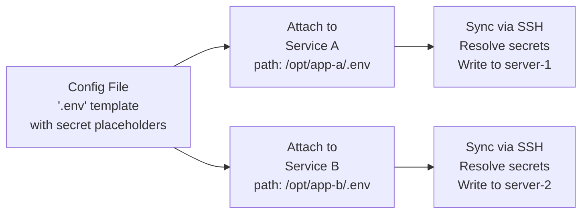
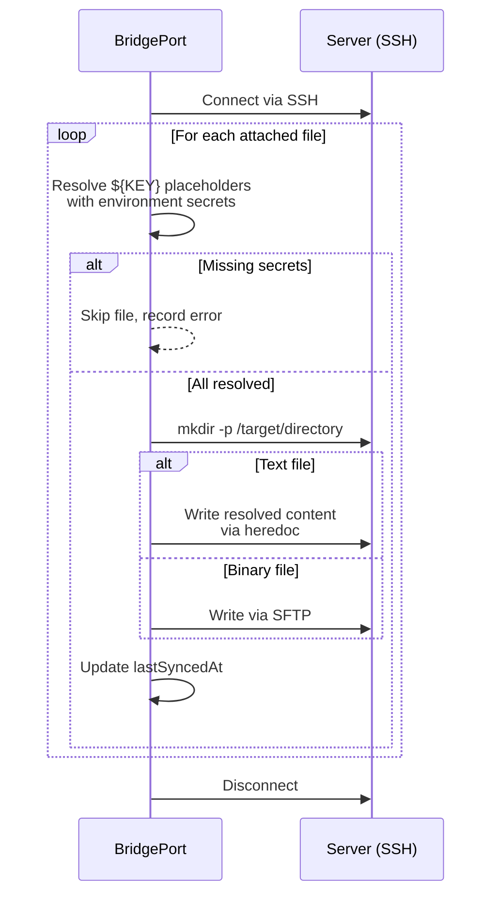

# Config Files

Config files let you store, version, and sync configuration to your servers via SSH -- from `.env` files and Nginx configs to SSL certificates and Docker Compose templates.

## Table of Contents

- [Quick Start](#quick-start)
- [How It Works](#how-it-works)
- [Creating Config Files](#creating-config-files)
- [Attaching Files to Services](#attaching-files-to-services)
- [Syncing Files to Servers](#syncing-files-to-servers)
- [Secret Placeholders](#secret-placeholders)
- [Edit History and Rollback](#edit-history-and-rollback)
- [Sync Status](#sync-status)
- [Use Cases](#use-cases)
- [Configuration Options](#configuration-options)
- [Troubleshooting](#troubleshooting)
- [Related](#related)

---

## Quick Start

Create a config file and deploy it to a server in under a minute:

1. Go to **Configuration > Config Files** in the sidebar.
2. Click **Add Config File**.
3. Enter a name ("App API .env"), filename (`.env`), and paste your content.
4. Click **Create**.
5. Go to the service that needs this file, click **Attach File**, select the config file, and enter the target path (e.g., `/opt/app/.env`).
6. Click **Sync Files** on the service to write the file to the server.

---

## How It Works

Config files exist at the environment level and are deployed to servers through service attachments. The flow is: create, attach, sync.



**Key concepts:**

- **Environment-scoped.** Config files belong to an environment and can be attached to any service within that environment.
- **Template-based.** Text files support `${SECRET_KEY}` placeholders that are resolved at sync time with actual [secret](secrets.md) values.
- **Version-tracked.** Every content edit creates a history entry. You can restore any previous version.
- **Sync-aware.** Each service-file attachment tracks when it was last synced. Editing a file after syncing shows a "pending" status so you know which servers need updating.

---

## Creating Config Files

### Text Files (UI)

1. Navigate to **Configuration > Config Files**.
2. Click **Add Config File**.
3. Fill in the form:

| Field | Required | Description |
|-------|----------|-------------|
| **Name** | Yes | Display name (e.g., "App API .env"). Must be unique per environment. |
| **Filename** | Yes | Target filename on the server (e.g., `.env`, `nginx.conf`, `docker-compose.yml`) |
| **Content** | Yes | File content. Use `${SECRET_KEY}` for secret placeholders. |
| **Description** | No | Optional documentation |

4. Click **Create**.

### Text Files (API)

```http
POST /api/environments/:envId/config-files
Authorization: Bearer <token>
Content-Type: application/json

{
  "name": "App API .env",
  "filename": ".env",
  "content": "DATABASE_URL=${DATABASE_URL}\nREDIS_URL=${REDIS_URL}\nDEBUG=false",
  "description": "Environment variables for the API service"
}
```

### Binary Files (Upload)

For certificates, compiled configs, and other binary files:

1. Click **Upload Asset** on the Config Files page.
2. Select the file from your computer.
3. Enter a display name and filename.

Binary files are stored as base64 in the database and synced to servers via SFTP. They do not support secret placeholder substitution.

**API (multipart upload):**

```http
POST /api/environments/:envId/asset-files/upload
Authorization: Bearer <token>
Content-Type: multipart/form-data

name: "Cloudflare Origin Cert"
filename: "cloudflare-origin.pem"
file: <binary file data>
```

> [!NOTE]
> Binary file content is not returned in API responses to keep payloads small. The file metadata (name, filename, size, MIME type) is always available.

---

## Attaching Files to Services

Config files are deployed through **service attachments**. One config file can be attached to multiple services across different servers, each with a different target path.

### Attaching a File

**UI:** Go to the service detail page > Config Files section > **Attach File**.

**API:**
```http
POST /api/services/:serviceId/files
Authorization: Bearer <token>
Content-Type: application/json

{
  "configFileId": "clxyz...",
  "targetPath": "/opt/app/.env"
}
```

The `targetPath` is the absolute path on the server where the file will be written during sync. BridgePort creates parent directories automatically if they do not exist.

### Detaching a File

```http
DELETE /api/services/:serviceId/files/:configFileId
Authorization: Bearer <token>
```

Detaching a file removes the link but does not delete the file from the server where it was previously synced.

### Updating the Target Path

```http
PATCH /api/services/:serviceId/files/:configFileId
Authorization: Bearer <token>
Content-Type: application/json

{
  "targetPath": "/opt/app/config/.env"
}
```

> [!TIP]
> You can attach the same config file to multiple services with different target paths. For example, attach an Nginx config to `nginx` on server-1 at `/etc/nginx/conf.d/app.conf` and to `nginx` on server-2 at the same path.

---

## Syncing Files to Servers

Syncing writes config files to their target paths on the server via SSH. There are three sync scopes:

### Per-Service Sync

Syncs all files attached to a single service:

**UI:** Service detail page > **Sync Files** button.

**API:**
```http
POST /api/services/:serviceId/sync-files
Authorization: Bearer <token>
```

### Per-Server Sync

Syncs all config files for all services on a server in a single SSH connection:

**UI:** Server detail page > **Sync All Files** button.

**API:**
```http
POST /api/servers/:serverId/sync-all-files
Authorization: Bearer <token>
```

### Per-File Sync

Syncs a specific config file to every service it is attached to. BridgePort groups by server to minimize SSH connections:

**UI:** Config file detail page > **Sync to All** button.

**API:**
```http
POST /api/config-files/:configFileId/sync-all
Authorization: Bearer <token>
```

### What Happens During Sync



**Sync result example:**
```json
{
  "success": true,
  "results": [
    { "file": "App API .env", "targetPath": "/opt/app/.env", "success": true },
    { "file": "Nginx Config", "targetPath": "/etc/nginx/conf.d/app.conf", "success": true }
  ]
}
```

> [!NOTE]
> Syncing a file does **not** restart the service. After syncing, you may need to restart or reload the service for changes to take effect (e.g., `docker compose up -d` or `nginx -s reload`).

---

## Secret Placeholders

Text config files support `${SECRET_KEY}` placeholders that are resolved at sync time. See [Secrets > Using Secrets in Config Files](secrets.md#using-secrets-in-config-files) for the full details.

Quick summary:
- Use `${KEY}` syntax in your config file content.
- Placeholders are resolved at sync time using secrets from the same environment.
- If any referenced secret is missing, the sync fails for that file with an error listing the missing keys.
- The stored config file always contains the placeholder, never the actual value.

```env
# Template stored in BridgePort:
DATABASE_URL=${DATABASE_URL}
SECRET_KEY=${DJANGO_SECRET_KEY}
DEBUG=false

# File written to server after sync:
DATABASE_URL=postgres://user:pass@db:5432/app
SECRET_KEY=django-insecure-abc123
DEBUG=false
```

---

## Edit History and Rollback

Every content edit to a config file creates a history entry with the previous content, who made the edit, and when.

### Viewing History

**UI:** Config file detail page > **History** tab.

**API:**
```http
GET /api/config-files/:id/history
Authorization: Bearer <token>
```

Returns up to 50 history entries, newest first:
```json
{
  "history": [
    {
      "id": "hist1",
      "editedAt": "2026-02-25T09:00:00.000Z",
      "editedBy": { "id": "usr1", "email": "admin@example.com", "name": "Admin" }
    }
  ]
}
```

### Restoring a Previous Version

1. Open the history for a config file.
2. Select the version to restore.
3. Click **Restore**.

```http
POST /api/config-files/:id/restore/:historyId
Authorization: Bearer <token>
```

Before restoring, the current content is saved as a new history entry so you can always undo a restore. After restoring, the config file's `updatedAt` changes, which means all synced services will show a "pending" sync status.

> [!TIP]
> History entries for binary files store the base64-encoded content but do not display the raw content in the UI. You can still restore binary file versions.

---

## Sync Status

Each file-to-service attachment tracks its sync status based on timestamps:

| Status | Meaning |
|--------|---------|
| **Synced** | The file was synced after the last content edit -- the server has the latest version |
| **Pending** | The file was edited after the last sync -- the server has an outdated version |
| **Never** | The file has never been synced to this service |
| **Not Attached** | The config file is not attached to any service |

### Status Tracking

The config files list page shows the **aggregate sync status** across all attachments:
- If all attachments are synced: **Synced**
- If any attachment is pending or never synced: **Pending**
- If no attachments exist: **Not Attached**

Individual attachment statuses are visible on the config file detail page and on the server's config file status view (`GET /api/servers/:serverId/config-files-status`).

---

## Use Cases

### .env Files

The most common use case. Store environment variables with secret placeholders:

```env
NODE_ENV=production
DATABASE_URL=${DATABASE_URL}
REDIS_URL=${REDIS_URL}
JWT_SECRET=${JWT_SECRET}
PORT=3000
```

Attach to your application service at `/opt/app/.env`.

### Nginx Configuration

```nginx
server {
    listen 80;
    server_name api.example.com;

    location / {
        proxy_pass http://localhost:3000;
        proxy_set_header Host $host;
        proxy_set_header X-Real-IP $remote_addr;
    }
}
```

Attach to your Nginx service at `/etc/nginx/conf.d/api.conf`.

### Docker Compose Templates

```yaml
services:
  app:
    image: registry.example.com/app:${APP_TAG}
    env_file: .env
    ports:
      - "3000:3000"
    restart: unless-stopped
```

Attach to the service at `/opt/app/docker-compose.yml`.

### SSL Certificates

Upload a certificate file (`.pem`, `.crt`, `.key`) as a binary asset. Attach it to services that need TLS termination, with target paths like `/etc/ssl/certs/origin.pem`.

### Crontabs and Systemd Units

Any text-based configuration file can be managed through BridgePort. Sync crontab files, systemd service units, or application-specific configs.

---

## Configuration Options

### Config File Fields

| Field | Type | Default | Description |
|-------|------|---------|-------------|
| `name` | string | -- | Display name (unique per environment) |
| `filename` | string | -- | Target filename on server |
| `content` | string | -- | File content (base64-encoded for binary files) |
| `description` | string | null | Optional documentation |
| `isBinary` | boolean | false | Whether this is a binary/asset file |
| `mimeType` | string | null | MIME type for binary files |
| `fileSize` | integer | null | Size in bytes (for binary files) |

### Service Attachment Fields

| Field | Type | Description |
|-------|------|-------------|
| `targetPath` | string | Absolute path on the server where the file is written |
| `lastSyncedAt` | datetime | When the file was last successfully synced to this service |

### Role Requirements

| Action | Minimum Role |
|--------|-------------|
| View config files | Viewer |
| Create, edit, delete config files | Operator |
| Attach/detach files to services | Operator |
| Sync files to servers | Operator |

---

## Troubleshooting

**"Missing secrets: KEY1, KEY2" during sync**
The config file references secrets that do not exist in this environment. Create the missing secrets at Configuration > Secrets, then retry the sync.

**"Failed to write file" during sync**
The SSH connection succeeded but writing to the target path failed. Common causes:
- The SSH user does not have write permissions to the target directory.
- The disk is full on the target server.
- The target path contains invalid characters.

Check the error details in the sync results for the specific failure message.

**"Connection failed" during sync**
BridgePort could not establish an SSH connection to the server. Verify:
- The server's hostname is reachable from BridgePort.
- The environment's SSH key is configured and valid.
- The SSH user has access to the server.

**Sync shows "success" but file content is wrong**
If `${KEY}` placeholders appear as literal text in the synced file, the secret either does not exist or is named differently than expected. Check the exact key name -- it is case-sensitive and must match `^[A-Z][A-Z0-9_]*$`.

**Config file edit does not update the server**
Editing a config file in BridgePort does not automatically sync to servers. After editing, check the sync status (it should show "Pending") and trigger a sync manually.

**"Config file with this name already exists"**
Config file names are unique per environment. Choose a different name, or find and edit the existing file.

**Binary file content is empty in API response**
This is by design. Binary file content is stripped from API responses to keep payloads small. The file is still stored and will be synced correctly. Download binary content by restoring from history if needed.

---

## Related

- [Secrets](secrets.md) -- Managing `${KEY}` placeholders used in config file templates
- [Services](services.md) -- Attaching and syncing config files per service
- [Servers](servers.md) -- Syncing all config files for all services on a server
- [Environments](environments.md) -- Config files are scoped per environment
