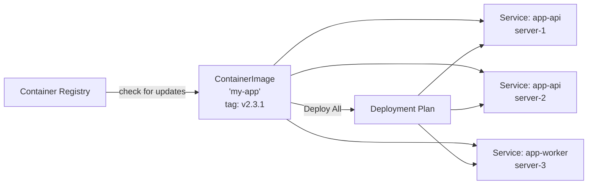
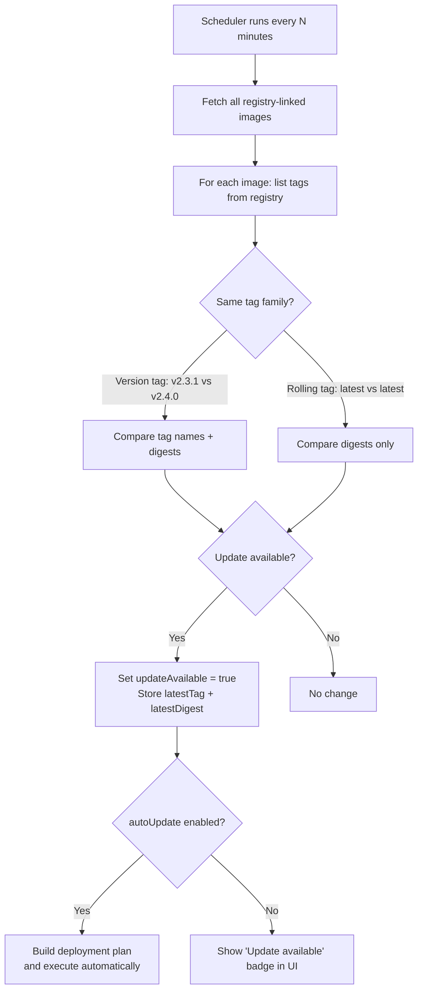

# Container Images

Container images are BridgePort's central abstraction for managing Docker images across multiple services and servers -- one image definition, deployed everywhere.

## Table of Contents

- [Quick Start](#quick-start)
- [How It Works](#how-it-works)
- [Creating a Container Image](#creating-a-container-image)
- [Linking Services](#linking-services)
- [Registry Integration](#registry-integration)
- [Tag History](#tag-history)
- [Auto-Update](#auto-update)
- [Deploy All](#deploy-all)
- [Configuration Options](#configuration-options)
- [Troubleshooting](#troubleshooting)
- [Related](#related)

---

## Quick Start

Create a container image, link it to services, and deploy a tag to all of them in under a minute:

1. Go to **Orchestration > Container Images** in the sidebar.
2. Click **Create Image**.
3. Fill in the name, full image path, and current tag.
4. Link one or more services to the image.
5. Click **Deploy** and choose a tag -- BridgePort deploys it to every linked service via an orchestrated plan.

---

## How It Works

A `ContainerImage` is a shared entity that sits between your registry and your services. Instead of each service tracking its own image and tag independently, all services that run the same image point to a single `ContainerImage` record. When you deploy a new tag, every linked service is updated through the deployment orchestration system.



**Key concepts:**

- **One image, many services.** A `ContainerImage` named "My App Backend" pointing to `registry.digitalocean.com/my-registry/my-app` can be linked to `app-api` on server-1, `app-api` on server-2, and `app-worker` on server-3.
- **Tag tracking.** The `currentTag` field records what was last deployed. The `latestTag` field records what the registry reports as newest.
- **Deployment orchestration.** Deploying a tag creates a `DeploymentPlan` that respects service dependencies, performs health checks, and supports auto-rollback.
- **Automatic discovery.** When BridgePort discovers new containers on a server, it automatically creates or links `ContainerImage` records for them.

---

## Creating a Container Image

### Via the UI

1. Navigate to **Orchestration > Container Images**.
2. Click **Create Image**.
3. Fill in the form:

| Field | Required | Description |
|-------|----------|-------------|
| **Name** | Yes | Display name (e.g., "My App Backend") |
| **Image Name** | Yes | Full Docker image path without the tag (e.g., `registry.digitalocean.com/my-registry/my-app`) |
| **Current Tag** | Yes | The tag currently running (e.g., `v2.3.1` or `latest`) |
| **Registry Connection** | No | Link to a [registry](registries.md) for update checking and tag browsing |

4. Click **Create**.

### Via the API

```http
POST /api/environments/:envId/container-images
Authorization: Bearer <token>
Content-Type: application/json

{
  "name": "My App Backend",
  "imageName": "registry.digitalocean.com/my-registry/my-app",
  "currentTag": "v2.3.1",
  "registryConnectionId": "clxyz..."
}
```

**Response (200):**
```json
{
  "image": {
    "id": "clxyz...",
    "name": "My App Backend",
    "imageName": "registry.digitalocean.com/my-registry/my-app",
    "currentTag": "v2.3.1",
    "autoUpdate": false,
    "updateAvailable": false
  }
}
```

### Automatic Creation

Container images are also created automatically during **container discovery**. When BridgePort discovers a running container on a server, it extracts the image name and creates a `ContainerImage` if one does not already exist for that image in the environment. If a registry has an [auto-link pattern](registries.md#auto-link-patterns) that matches the image name, the image is automatically linked to that registry.

> [!NOTE]
> Each image name is unique per environment. If you try to create a container image with an image name that already exists, you will receive a `409 Conflict` response.

---

## Linking Services

Every service in BridgePort must be linked to a container image. The link is established when:

- A service is created manually (you select a container image during creation).
- A container is discovered automatically (BridgePort links it to an existing or new `ContainerImage`).
- You re-link a service to a different container image.

### Re-linking a Service

To move a service from one container image to another:

```http
POST /api/container-images/:imageId/link/:serviceId
Authorization: Bearer <token>
```

The service's `imageTag` is updated to match the new container image's `currentTag`. The service must be in the same environment as the container image.

### Viewing Linkable Services

To see which services in the environment could be re-linked to a specific container image:

```http
GET /api/container-images/:imageId/linkable-services
Authorization: Bearer <token>
```

Returns services in the same environment that are currently linked to a *different* container image.

> [!TIP]
> The container image detail page shows all linked services with their server names, current tags, and health status. Use this as a single dashboard for everything running a particular image.

---

## Registry Integration

Linking a container image to a [registry connection](registries.md) enables three features:

### Tag Browser

Browse all available tags for the image directly from the UI:

```http
GET /api/container-images/:id/tags
Authorization: Bearer <token>
```

Returns the list of tags from the registry along with digests, sizes, and timestamps.

### Update Detection

BridgePort periodically checks whether a newer version is available:



**How it works:**

1. The scheduler fetches all container images that have a `registryConnectionId`.
2. For each image, it calls the registry to list all tags.
3. Tags are grouped into "families" (e.g., all `-alpine` suffixed tags form one family). Only tags in the same family as the current tag are considered.
4. For **version tags** (e.g., `v2.3.1`): the latest tag in the family is compared by name and digest.
5. For **rolling tags** (e.g., `latest`): the digest from the registry is compared against the `deployedDigest` stored after the last deployment.
6. If an update is found, `updateAvailable` is set to `true` and `latestTag` / `latestDigest` are stored.

**Manual check:**

```http
POST /api/container-images/:id/check-updates
Authorization: Bearer <token>
```

Returns:
```json
{
  "hasUpdate": true,
  "currentTag": "v2.3.1",
  "latestTag": "v2.4.0",
  "latestDigest": "sha256:abc123...",
  "lastCheckedAt": "2026-02-25T10:00:00.000Z"
}
```

### Companion Tag Resolution

When you deploy a rolling tag like `latest`, the actual build may also be tagged with a concrete version (e.g., `20260225-a1b2c3d`). BridgePort resolves this by matching digests across tags. If the `latest` digest matches another tag's digest, that companion tag is stored as `latestTag` for display, giving you a meaningful version identifier instead of just "latest".

> [!NOTE]
> If the registry does not return digests (some generic V2 registries omit them), BridgePort cannot detect updates for rolling tags and will not show false positives. Version tags still work via tag name comparison.

---

## Tag History

Every deployment records a history entry with the tag, digest, status, who triggered it, and when:

```http
GET /api/container-images/:id/history?limit=20
Authorization: Bearer <token>
```

**Response:**
```json
{
  "history": [
    {
      "id": "clxyz...",
      "tag": "v2.4.0",
      "digest": "sha256:abc123...",
      "status": "success",
      "deployedAt": "2026-02-25T10:00:00.000Z",
      "deployedBy": "admin@example.com",
      "deploymentCount": 3,
      "totalDurationMs": 45000,
      "services": [
        { "id": "svc1", "name": "app-api", "serverName": "server-1" },
        { "id": "svc2", "name": "app-api", "serverName": "server-2" }
      ]
    }
  ]
}
```

### History Status Values

| Status | Meaning |
|--------|---------|
| `success` | Tag was deployed successfully to all linked services |
| `failed` | Deployment failed (check deployment plan for details) |
| `rolled_back` | Tag was deployed but later rolled back due to a failure in the deployment plan |

Tag history provides a complete audit trail of every image change, making it easy to correlate issues with specific deployments.

---

## Auto-Update

When `autoUpdate` is enabled on a container image, BridgePort automatically deploys new versions as they are detected:

1. The scheduler detects a new tag in the registry.
2. A deployment plan is created for all linked services.
3. The plan executes, deploying the new tag to each service in dependency order.
4. If any service fails its health check, all previously deployed services are rolled back automatically.

### Enabling Auto-Update

**UI:** Toggle the "Auto-Update" switch on the container image detail page.

**API:**
```http
PATCH /api/container-images/:id
Authorization: Bearer <token>
Content-Type: application/json

{
  "autoUpdate": true
}
```

> [!WARNING]
> Auto-update is best suited for staging and development environments. For production, use [webhooks](webhooks.md) or manual deployments where you explicitly choose which tag to deploy. Auto-update combined with a rolling `latest` tag can lead to unexpected deployments.

---

## Deploy All

"Deploy All" deploys a specific tag to every service linked to a container image. Under the hood, it creates an orchestrated [deployment plan](deployment-plans.md) that:

1. Resolves service dependencies to determine deployment order.
2. Deploys to each service sequentially (or in parallel if configured).
3. Runs health checks after each deployment.
4. Rolls back all services if any health check fails (when auto-rollback is enabled).

### Triggering Deploy All

**UI:**
1. Go to the container image detail page.
2. Click **Deploy**.
3. Select the tag (from the registry tag browser or enter manually).
4. Confirm the deployment.

**API:**
```http
POST /api/container-images/:id/deploy
Authorization: Bearer <token>
Content-Type: application/json

{
  "imageTag": "v2.4.0",
  "autoRollback": true
}
```

**Response:**
```json
{
  "plan": {
    "id": "clxyz...",
    "name": "Deploy my-app v2.4.0",
    "status": "pending",
    "imageTag": "v2.4.0"
  }
}
```

The plan is executed asynchronously. Track its progress on the [Deployment Plans](deployment-plans.md) page or via `GET /api/deployment-plans/:planId`.

> [!NOTE]
> The "Deploy All" action requires at least one service to be linked to the container image. If no services are linked, the API returns a `400` error.

---

## Configuration Options

### Container Image Fields

| Field | Type | Default | Description |
|-------|------|---------|-------------|
| `name` | string | -- | Display name shown in the UI |
| `imageName` | string | -- | Full Docker image path (unique per environment) |
| `currentTag` | string | -- | Last successfully deployed tag |
| `latestTag` | string | null | Latest tag detected from registry |
| `latestDigest` | string | null | Digest of the latest tag |
| `deployedDigest` | string | null | Digest of what was actually deployed (for rolling tag comparison) |
| `updateAvailable` | boolean | false | Whether a newer version exists in the registry |
| `autoUpdate` | boolean | false | Auto-deploy when new versions are detected |
| `registryConnectionId` | string | null | Link to a registry for update checking |

### Related Settings

| Setting | Location | Effect |
|---------|----------|--------|
| `SCHEDULER_UPDATE_CHECK_INTERVAL` | Environment variable | How often the scheduler checks registries (default: 1800 seconds) |
| `registryMaxTags` | Admin > System Settings | Maximum tags to fetch per repository from generic registries (default: 50) |

---

## Troubleshooting

**"A container image for this image name already exists"**
Each image name must be unique per environment. If the image was auto-created during discovery, find it in the list and link your services to it instead of creating a new one.

**"No registry connection configured for this image"**
Update detection and tag browsing require a linked registry. Edit the container image and select a registry connection.

**"No services linked to this image"**
The "Deploy All" action requires at least one linked service. Link services to the image first.

**Update badge shows but no actual change**
For rolling tags, this can happen if the deployed digest was not recorded. Deploying the tag again will store the digest and clear the badge. If the registry does not return digests, update detection for rolling tags is disabled to prevent false positives.

**"Cannot delete container image: N service(s) are still linked"**
Services must be reassigned to a different container image or deleted before the container image can be removed. This restriction prevents orphaned services.

---

## Related

- [Registries](registries.md) -- Connect BridgePort to your container registries
- [Deployment Plans](deployment-plans.md) -- Orchestrated multi-service deployments
- [Services](services.md) -- Individual service management
- [Webhooks](webhooks.md) -- CI/CD integration for automated deployments
