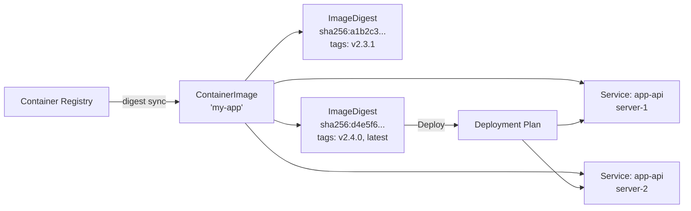

# Container Images

Container images are BRIDGEPORT's central abstraction for managing Docker images across multiple services and servers -- one image definition, deployed everywhere.

## Table of Contents

- [Quick Start](#quick-start)
- [How It Works](#how-it-works)
- [Digest-Centric Model](#digest-centric-model)
- [Creating a Container Image](#creating-a-container-image)
- [Tag Filters](#tag-filters)
- [Linking Services](#linking-services)
- [Registry Integration](#registry-integration)
- [Tag History](#tag-history)
- [Auto-Update](#auto-update)
- [Deploying](#deploying)
- [Image Pruning](#image-pruning)
- [Configuration Options](#configuration-options)
- [Troubleshooting](#troubleshooting)
- [Related](#related)

---

## Quick Start

Create a container image, link it to services, and deploy a digest to all of them in under a minute:

1. Go to **Orchestration > Container Images** in the sidebar.
2. Click **Create Image**.
3. Fill in the name, full image path, and a [tag filter](#tag-filters) (default: `latest`).
4. Link one or more services to the image.
5. From the image detail page, pick a digest from the list and click **Deploy** -- BRIDGEPORT deploys it to every linked service via an orchestrated plan.

---

## How It Works

A `ContainerImage` is a shared entity that sits between your registry and your services. Instead of each service tracking its own image independently, all services that run the same image point to a single `ContainerImage` record. BRIDGEPORT tracks every image digest (SHA) ingested from the registry as a separate `ImageDigest` row, and deployments target a specific digest -- not a tag name that can drift.



**Key concepts:**

- **One image, many services.** A `ContainerImage` named "My App Backend" pointing to `registry.digitalocean.com/my-registry/my-app` can be linked to `app-api` on server-1, `app-api` on server-2, and `app-worker` on server-3.
- **Digest-first.** The canonical identity of a deployed image is its manifest digest (SHA). Tags are labels that can point to any digest at any time. BRIDGEPORT records the `deployedDigestId` after each successful deploy so "what's running" is never ambiguous, even when the registry later moves a tag.
- **Tag filter controls ingestion.** Each image has a `tagFilter` (comma-separated glob patterns, default `latest`). Only digests whose tags match the filter are tracked in BRIDGEPORT, keeping the digest list focused on tags you actually care about.
- **Deployment orchestration.** Deploying a digest creates a `DeploymentPlan` that respects service dependencies, performs health checks, and supports auto-rollback.
- **Automatic discovery.** When BRIDGEPORT discovers new containers on a server, it automatically creates or links `ContainerImage` records for them.

---

## Digest-Centric Model

Earlier versions of BRIDGEPORT tracked a single `currentTag` / `latestTag` on each container image. That works for strict version tags (`v2.3.1`), but breaks down for rolling tags (`latest`, `main`) that point to different digests over time. BRIDGEPORT now tracks digests directly:

- Every digest pulled from the registry is stored as an `ImageDigest` row with `manifestDigest`, `configDigest`, `pushedAt`, `size`, and a JSON `tags` array of every tag pointing to that digest.
- A container image's **deployed digest** (`deployedDigestId`) is set to the exact `ImageDigest` that was most recently deployed successfully. This is the source of truth for "what is running."
- **Update Available** is computed by comparing the deployed digest against the newest digest matching the tag filter. No digest = no false positive.
- **Display tags** are picked from a digest's tag array by `getBestTag()`: filter-matching tags win, with exact-match patterns preferred over wildcards, then most dot segments, then longest string.

> [!TIP]
> Deploying by digest means that if the registry later moves `latest` to point to a different image, your running services are unaffected -- BRIDGEPORT pulls by SHA, not by tag. To roll forward, deploy the newer digest explicitly.

---

## Creating a Container Image

### Via the UI

1. Navigate to **Orchestration > Container Images**.
2. Click **Create Image**.
3. Fill in the form:

| Field | Required | Description |
|-------|----------|-------------|
| **Name** | Yes | Display name (e.g., "My App Backend") |
| **Image Name** | Yes | Full Docker image path without the tag (e.g., `registry.digitalocean.com/my-registry/my-app`) |
| **Tag Filter** | Yes | Comma-separated glob patterns for which tags BRIDGEPORT ingests. Default: `latest`. See [Tag Filters](#tag-filters). |
| **Registry Connection** | No | Link to a [registry](registries.md) for update checking and digest ingestion |

4. Click **Create**.

### Via the API

```http
POST /api/environments/:envId/container-images
Authorization: Bearer <token>
Content-Type: application/json

{
  "name": "My App Backend",
  "imageName": "registry.digitalocean.com/my-registry/my-app",
  "tagFilter": "v*.*.*, latest",
  "registryConnectionId": "clxyz..."
}
```

### Automatic Creation

Container images are also created automatically during **container discovery**. When BRIDGEPORT discovers a running container on a server, it extracts the image name and creates a `ContainerImage` if one does not already exist for that image in the environment. If a registry has an [auto-link pattern](registries.md#auto-link-patterns) that matches the image name, the image is automatically linked to that registry.

> [!NOTE]
> Each image name is unique per environment. If you try to create a container image with an image name that already exists, you will receive a `409 Conflict` response.

---

## Tag Filters

The `tagFilter` controls which tags BRIDGEPORT ingests digests for. Comma-separated glob patterns; whitespace around commas is trimmed.

Glob syntax is intentionally narrow:

- `*` matches any run of `[a-zA-Z0-9._-]` characters. That's it -- no `?`, no character classes, no `**`. A pattern without `*` is an exact match.
- A tag is kept if it matches **any** pattern in the filter.

Examples:

| Filter | Matches | Does Not Match |
|--------|---------|----------------|
| `latest` | `latest` | `v1.2.3`, `main`, `latest-alpine` |
| `v*.*.*` | `v1.2.3`, `v10.0.1` | `v1.2`, `1.2.3`, `v1.2.3-rc1` |
| `v*.*.*, latest` | `v1.2.3`, `latest` | `main` |
| `main, staging` | `main`, `staging` | `production`, `main-2026` |
| `*-alpine` | `v1.2.3-alpine`, `latest-alpine` | `v1.2.3`, `alpine` |

### Picking a Filter

- **Single version tag family** -- use a precise glob like `v*.*.*` to avoid ingesting every commit SHA.
- **Rolling tag** -- just `latest` (or whatever rolling tag your registry exposes). BRIDGEPORT will track every digest that tag has ever pointed to.
- **Mixed** -- combine patterns: `v*.*.*, latest` tracks both the canonical releases and the rolling pointer.

Tightening the filter after the fact stops BRIDGEPORT from ingesting new mismatched digests but does **not** delete existing digest rows. Broadening the filter backfills on the next registry sync.

> [!TIP]
> The first pattern in `tagFilter` is used as the fallback display tag when a digest has no matching tags (e.g., untagged manifests). Put your most "canonical" pattern first.

---

## Linking Services

Every service in BRIDGEPORT must be linked to a container image. The link is established when:

- A service is created manually (you select a container image during creation).
- A container is discovered automatically (BRIDGEPORT links it to an existing or new `ContainerImage`).
- You re-link a service to a different container image.

### Re-linking a Service

To move a service from one container image to another:

```http
POST /api/container-images/:imageId/link/:serviceId
Authorization: Bearer <token>
```

The service's `imageTag` is updated to match the new container image's `currentTag`. The service must be in the same environment as the container image.

### Viewing Linkable Services

To see which services in the environment could be re-linked to a specific container image:

```http
GET /api/container-images/:imageId/linkable-services
Authorization: Bearer <token>
```

Returns services in the same environment that are currently linked to a *different* container image.

> [!TIP]
> The container image detail page shows all linked services with their server names, current tags, and health status. Use this as a single dashboard for everything running a particular image.

---

## Registry Integration

Linking a container image to a [registry connection](registries.md) enables three features:

### Digest Sync

On a schedule, BRIDGEPORT lists tags on the registry, filters them with the image's `tagFilter`, fetches the manifest for each matching tag, and upserts an `ImageDigest` row keyed on `(containerImageId, manifestDigest)`. All tags pointing to the same digest are collapsed into that digest's `tags` JSON array, so you never see duplicate rows for `latest` and `v2.4.0` when they're the same image.

The digest list on the container image detail page is sorted by `pushedAt` (newest first), so the most recently built image is always at the top -- even when the registry reports tag order differently.

### Update Detection

BRIDGEPORT flags `updateAvailable = true` on an image when:

1. The image has a `registryConnectionId` and a `deployedDigestId`.
2. At least one digest matching the `tagFilter` was pushed more recently than the deployed digest.

If the registry does not return digests (some generic V2 registries omit them), update detection is skipped -- no false positives.

**Manual check:**

```http
POST /api/container-images/:id/check-updates
Authorization: Bearer <token>
```

### Tag Browser

The registry tag browser lets you page through every tag in the repository (including ones outside your tag filter) and deploy a specific digest ad-hoc:

```http
GET /api/container-images/:id/tags
Authorization: Bearer <token>
```

Useful for hotfix deploys against a tag that doesn't normally match your filter.

---

## Tag History

Every deployment records a history entry with the tag, digest, status, who triggered it, and when:

```http
GET /api/container-images/:id/history?limit=20
Authorization: Bearer <token>
```

**Response:**
```json
{
  "history": [
    {
      "id": "clxyz...",
      "tag": "v2.4.0",
      "digest": "sha256:abc123...",
      "status": "success",
      "deployedAt": "2026-02-25T10:00:00.000Z",
      "deployedBy": "admin@example.com",
      "deploymentCount": 3,
      "totalDurationMs": 45000,
      "services": [
        { "id": "svc1", "name": "app-api", "serverName": "server-1" },
        { "id": "svc2", "name": "app-api", "serverName": "server-2" }
      ]
    }
  ]
}
```

### History Status Values

| Status | Meaning |
|--------|---------|
| `success` | Tag was deployed successfully to all linked services |
| `failed` | Deployment failed (check deployment plan for details) |
| `rolled_back` | Tag was deployed but later rolled back due to a failure in the deployment plan |

Tag history provides a complete audit trail of every image change, making it easy to correlate issues with specific deployments.

---

## Auto-Update

When `autoUpdate` is enabled on a container image, BRIDGEPORT automatically deploys new versions as they are detected:

1. The scheduler detects a new tag in the registry.
2. A deployment plan is created for all linked services.
3. The plan executes, deploying the new tag to each service in dependency order.
4. If any service fails its health check, all previously deployed services are rolled back automatically.

### Enabling Auto-Update

**UI:** Toggle the "Auto-Update" switch on the container image detail page.

**API:**
```http
PATCH /api/container-images/:id
Authorization: Bearer <token>
Content-Type: application/json

{
  "autoUpdate": true
}
```

> [!WARNING]
> Auto-update is best suited for staging and development environments. For production, use [webhooks](webhooks.md) or manual deployments where you explicitly choose which tag to deploy. Auto-update combined with a rolling `latest` tag can lead to unexpected deployments.

---

## Deploying

Deploying pushes a specific **digest** to every service linked to a container image. Under the hood, it creates an orchestrated [deployment plan](deployment-plans.md) that:

1. Resolves service dependencies to determine deployment order.
2. Deploys to each service sequentially (or in parallel if configured).
3. Runs health checks after each deployment.
4. Rolls back all services if any health check fails (when auto-rollback is enabled).

### From the Digest List

The primary deploy path is the container image detail page:

1. Go to the container image detail page. The digest list shows every ingested SHA with its tags, size, and push time.
2. Click **Deploy** on a digest row (or on the service detail page's Deploy card).
3. Confirm the deployment.

BRIDGEPORT resolves the display tag for the deploy (via `getBestTag()`, preferring filter-matching tags) and pulls by manifest digest, so the running container matches the SHA you selected even if the registry later moves the tag.

### From the Images List

The images list also exposes a **Deploy** button that opens a digest picker -- useful when you want to cross-check against `updateAvailable` badges without drilling into each image.

### Service Detail Deploy Card

Each service has a Deploy card on its detail page showing:

- The currently deployed digest (with a short SHA link back to the image detail page).
- Available newer digests matching the tag filter.
- A one-click Deploy modal scoped to that single service.

### API

```http
POST /api/container-images/:id/deploy
Authorization: Bearer <token>
Content-Type: application/json

{
  "imageDigestId": "clxyz...",
  "autoRollback": true
}
```

The plan is executed asynchronously. Track its progress on the [Deployment Plans](deployment-plans.md) page or via `GET /api/deployment-plans/:planId`.

> [!NOTE]
> Deploy requires at least one service linked to the container image. If no services are linked, the API returns a `400` error.

---

## Image Pruning

Docker image layers accumulate on servers as you deploy new versions. Left unchecked, they fill disk. BRIDGEPORT can prune unused images manually, after every deploy, and weekly on a schedule.

### Manual Prune

From any server detail page, click **Prune Images** to immediately reclaim space:

```http
POST /api/servers/:id/prune-images
Authorization: Bearer <token>
Content-Type: application/json

{ "mode": "dangling" }
```

Returns `{ spaceReclaimedBytes, spaceReclaimedHuman }`. Audit-logged as `prune_images` on the server.

### Prune Modes

| Mode | Removes | Use When |
|------|---------|----------|
| `dangling` *(default)* | Untagged images (layers left behind after pulls/builds) | You want the safe default -- no running or tagged image is ever removed. |
| `all` | All images not used by a running container | Aggressive reclaim on servers where disk pressure is high. Any tagged image not currently in use is fair game, including rollback targets. |

> [!WARNING]
> `all` mode removes images that are not attached to a running container *right now*. If you stop a service, prune with `all`, and then try to roll back, Docker has to pull the old image again. Prefer `dangling` unless you know why you need `all`.

### Auto-Prune

Enable `autoPruneImages` in **Settings > Operations** to run prunes automatically:

- **After every deploy** -- the server that was just deployed to is pruned as a non-blocking best-effort step. Failures are logged but do not affect the deployment outcome.
- **Weekly** -- the scheduler prunes every healthy server in environments where `autoPruneImages` is enabled, rate-limited to 3 concurrent servers.

Both paths honor the environment's `pruneImagesMode` setting.

---

## Configuration Options

### ContainerImage Fields

| Field | Type | Default | Description |
|-------|------|---------|-------------|
| `name` | string | -- | Display name shown in the UI |
| `imageName` | string | -- | Full Docker image path (unique per environment) |
| `tagFilter` | string | `"latest"` | Comma-separated glob patterns; only matching tags are ingested as digests |
| `lastCheckedAt` | datetime | null | Last successful registry sync |
| `deployedDigestId` | string | null | FK to the `ImageDigest` most recently deployed |
| `updateAvailable` | boolean | false | Set when a newer matching digest exists in the registry |
| `autoUpdate` | boolean | false | Auto-deploy when new digests are detected |
| `registryConnectionId` | string | null | Link to a registry for digest ingestion |

### ImageDigest Fields

| Field | Type | Description |
|-------|------|-------------|
| `manifestDigest` | string | `sha256:...` -- used for pulling |
| `configDigest` | string? | Config digest (image ID), stable across registries |
| `tags` | string | JSON array of tags pointing to this digest |
| `size` | bigint? | Compressed image size in bytes |
| `pushedAt` | datetime? | When the digest was pushed to the registry |
| `discoveredAt` | datetime | When BRIDGEPORT first ingested this digest |

### Related Settings

| Setting | Location | Effect |
|---------|----------|--------|
| `autoPruneImages` | Settings > Operations | Auto-prune images after each deploy and weekly (default: false) |
| `pruneImagesMode` | Settings > Operations | `dangling` or `all` (default: `dangling`) |
| `SCHEDULER_UPDATE_CHECK_INTERVAL` | Environment variable | How often the scheduler checks registries (default: 1800 seconds) |
| `registryMaxTags` | Admin > System Settings | Maximum tags to fetch per repository from generic registries (default: 50) |

---

## Troubleshooting

**"A container image for this image name already exists"**
Each image name must be unique per environment. If the image was auto-created during discovery, find it in the list and link your services to it instead of creating a new one.

**"No registry connection configured for this image"**
Update detection and tag browsing require a linked registry. Edit the container image and select a registry connection.

**"No services linked to this image"**
The "Deploy All" action requires at least one linked service. Link services to the image first.

**Update badge shows but no actual change**
For rolling tags, this can happen if the deployed digest was not recorded. Deploying the tag again will store the digest and clear the badge. If the registry does not return digests, update detection for rolling tags is disabled to prevent false positives.

**"Cannot delete container image: N service(s) are still linked"**
Services must be reassigned to a different container image or deleted before the container image can be removed. This restriction prevents orphaned services.

---

## Related

- [Registries](registries.md) -- Connect BRIDGEPORT to your container registries
- [Deployment Plans](deployment-plans.md) -- Orchestrated multi-service deployments
- [Services](services.md) -- Individual service management
- [Webhooks](webhooks.md) -- CI/CD integration for automated deployments
