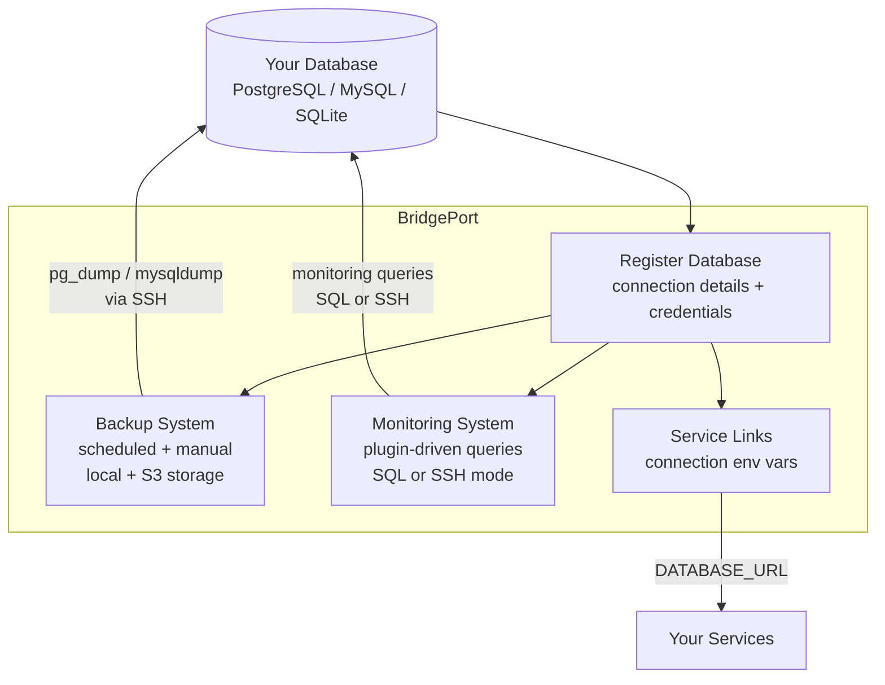
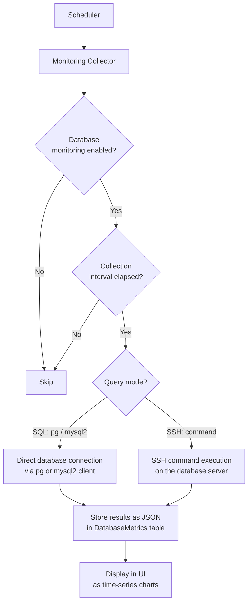

# Databases

BridgePort manages backups, monitoring, and service connections for your databases -- with a backup-first approach, because protecting your data comes before everything else.

## Table of Contents

- [Quick Start](#quick-start)
- [How It Works](#how-it-works)
- [1. Protect Your Data](#1-protect-your-data)
  - [Registering a Database](#registering-a-database)
  - [Backup Schedules](#backup-schedules)
  - [Manual Backups](#manual-backups)
  - [Backup Storage](#backup-storage)
  - [Backup Formats and Compression](#backup-formats-and-compression)
  - [Retention](#retention)
  - [Downloading Backups](#downloading-backups)
  - [Recovery](#recovery)
- [2. Monitor Your Databases](#2-monitor-your-databases)
  - [Enabling Monitoring](#enabling-monitoring)
  - [Collection Intervals](#collection-intervals)
  - [How Monitoring Works](#how-monitoring-works)
  - [Testing Connections](#testing-connections)
  - [Viewing Metrics and Charts](#viewing-metrics-and-charts)
- [3. Link Databases to Services](#3-link-databases-to-services)
- [Configuration Options](#configuration-options)
- [Troubleshooting](#troubleshooting)
- [Related](#related)

---

## Quick Start

Register a database and set up daily backups in under two minutes:

1. Go to **Operations > Databases** in the sidebar.
2. Click **Add Database**.
3. Select the database type (PostgreSQL, MySQL, or SQLite).
4. Enter connection details (host, port, database name, credentials).
5. Choose backup storage (local or [S3-compatible](storage.md)).
6. Click **Create**.
7. On the database detail page, set up a backup schedule: `0 2 * * *` (daily at 2 AM).
8. Click **Backup Now** to run your first backup immediately.

---

## How It Works

BridgePort treats databases as registered resources that you manage through three capabilities: backups, monitoring, and service linking.



**Key concepts:**

- **Plugin-driven types.** Database types (PostgreSQL, MySQL, SQLite) are defined as plugins in JSON files. Each plugin specifies connection fields, backup/restore commands, and monitoring queries. Admins can customize types at Admin > Database Types.
- **SSH-based operations.** Backups and SSH-mode monitoring execute commands on the server that hosts the database, using the environment's SSH key.
- **Encrypted credentials.** Database usernames and passwords are encrypted at rest using XChaCha20-Poly1305.
- **Environment-scoped.** Databases belong to an environment. Each database name must be unique within its environment.

---

## 1. Protect Your Data

### Registering a Database

#### Via the UI

1. Navigate to **Operations > Databases**.
2. Click **Add Database**.
3. Fill in the form:

| Field | Required | Description |
|-------|----------|-------------|
| **Name** | Yes | Display name (e.g., "Production API DB") |
| **Type** | Yes | Database type (PostgreSQL, MySQL, SQLite) |
| **Server** | Recommended | Which server hosts this database (required for SSH-based operations) |
| **Host** | For SQL DBs | Database hostname (e.g., `localhost`, `db.internal`) |
| **Port** | For SQL DBs | Database port (default: 5432 for PostgreSQL, 3306 for MySQL) |
| **Database Name** | For SQL DBs | The actual database name |
| **Username** | For SQL DBs | Database username |
| **Password** | For SQL DBs | Database password (encrypted at rest) |
| **File Path** | For SQLite | Path to the SQLite file on the server |
| **Use SSL** | No | Enable TLS/SSL for database connections |

4. Configure backup settings (see [Backup Storage](#backup-storage)).
5. Click **Create**.

#### Via the API

```http
POST /api/environments/:envId/databases
Authorization: Bearer <token>
Content-Type: application/json

{
  "name": "Production API DB",
  "type": "postgres",
  "host": "localhost",
  "port": 5432,
  "databaseName": "appdb",
  "username": "appuser",
  "password": "secretpassword",
  "serverId": "srv123",
  "backupStorageType": "local",
  "backupLocalPath": "/var/backups/appdb"
}
```

All database settings can be edited after creation. Go to the database detail page and update connection details, backup configuration, or monitoring settings at any time.

### Backup Schedules

Set up automatic backups with a cron schedule to ensure your data is always protected.

#### Setting a Schedule

**UI:** Database detail page > Schedule section.

**API:**
```http
PUT /api/databases/:id/schedule
Authorization: Bearer <token>
Content-Type: application/json

{
  "cronExpression": "0 2 * * *",
  "retentionDays": 7,
  "enabled": true
}
```

#### Common Cron Expressions

| Expression | Schedule |
|------------|----------|
| `0 2 * * *` | Daily at 2:00 AM |
| `0 */6 * * *` | Every 6 hours |
| `0 2 * * 0` | Weekly on Sunday at 2:00 AM |
| `0 2 1 * *` | Monthly on the 1st at 2:00 AM |
| `*/30 * * * *` | Every 30 minutes |

#### Schedule Fields

| Field | Required | Default | Description |
|-------|----------|---------|-------------|
| `cronExpression` | Yes | -- | Standard 5-field cron format |
| `retentionDays` | No | 7 | How many days to keep backups (1-365) |
| `enabled` | No | true | Toggle the schedule on/off without deleting it |

BridgePort's scheduler checks for due backups at the interval configured by `SCHEDULER_BACKUP_CHECK_INTERVAL` (default: 60 seconds). When a backup is due, it runs asynchronously.

> [!TIP]
> Schedule backups during low-traffic periods to minimize impact on database performance. For PostgreSQL, `pg_dump` takes a consistent snapshot without blocking writes, but it does increase I/O.

### Manual Backups

Trigger a backup at any time:

**UI:** Database detail page > **Backup Now** button.

**API:**
```http
POST /api/databases/:id/backups
Authorization: Bearer <token>
```

**Response:**
```json
{
  "backupId": "bkp123",
  "message": "Backup started"
}
```

The backup runs asynchronously. Monitor progress on the database detail page or via `GET /api/backups/:id`.

### Backup Storage

Backups can be stored locally on the server or uploaded to S3-compatible object storage.

| Storage Type | Description | Best For |
|-------------|-------------|----------|
| **Local** | Stored on the server's filesystem at the configured path | Development, staging, servers with local disk space |
| **S3/Spaces** | Uploaded to an S3-compatible bucket after the dump completes | Production, offsite storage, disaster recovery |

#### Local Storage

Set `backupStorageType: "local"` and provide a `backupLocalPath`:

```json
{
  "backupStorageType": "local",
  "backupLocalPath": "/var/backups/appdb"
}
```

The path must be writable by the SSH user. BridgePort creates the directory if it does not exist.

#### S3-Compatible Storage

Set `backupStorageType: "spaces"` and provide a bucket name:

```json
{
  "backupStorageType": "spaces",
  "backupSpacesBucket": "my-backups",
  "backupSpacesPrefix": "production/appdb/"
}
```

**Prerequisites:**
1. Configure global storage credentials at **Admin > Storage** -- see [Storage](storage.md).
2. Enable storage for the environment.
3. The configured bucket must be accessible with the stored credentials.

The object key follows the pattern: `{prefix}{database-name}/{timestamp}-{filename}`.

> [!NOTE]
> If S3 storage is not enabled for the environment, backups configured for Spaces storage will fail with "Spaces not configured for this environment."

### Backup Formats and Compression

#### PostgreSQL Formats

| Format | Description | Restore Support |
|--------|-------------|-----------------|
| **Plain** | SQL text dump (`.sql`) | `psql -f backup.sql` |
| **Custom** | pg_dump custom format (`.dump`) | `pg_restore` with selective restore |
| **Tar** | Tar archive format (`.tar`) | `pg_restore` |

#### Compression Options

| Option | Level | Description |
|--------|-------|-------------|
| **None** | -- | No compression |
| **Gzip** | 1-9 | Gzip compression (default level: 6) |

#### pg_dump Options

For PostgreSQL backups, additional options control what is included:

| Option | Description |
|--------|-------------|
| `noOwner` | Skip ownership commands (useful for restoring to a different user) |
| `clean` | Include DROP statements before CREATE |
| `ifExists` | Use IF EXISTS with DROP statements |
| `schemaOnly` | Dump schema only, no data |
| `dataOnly` | Dump data only, no schema |

#### Timeout

The `pgDumpTimeoutMs` setting controls how long BridgePort waits for `pg_dump` to complete. Range: 30 seconds to 1 hour. Default: 5 minutes (300000 ms). Increase this for large databases.

### Retention

When a backup schedule has `retentionDays` set, BridgePort automatically deletes backups older than the specified number of days after each successful scheduled backup.

- Retention only applies to scheduled backups. Manual backups are not automatically deleted.
- For S3 storage, the object is deleted from the bucket. For local storage, the file is deleted from the server.
- Retention is checked after each successful backup, not on a separate schedule.

### Downloading Backups

Backup downloads are controlled by an environment setting that is **disabled by default**.

To enable: **Settings > Data > Allow Backup Download** (admin only).

Once enabled:
- **Local backups:** Streamed through the BridgePort server.
- **S3 backups:** A presigned URL is generated (valid for 1 hour).

```http
GET /api/backups/:id/download
Authorization: Bearer <token>
```

For S3 backups, the response includes a `downloadUrl` that the client redirects to.

### Recovery

#### PostgreSQL Recovery

**Plain format (`.sql`):**
```bash
# On the server, restore directly:
psql -h localhost -U appuser -d appdb -f /var/backups/appdb/backup-20260225.sql

# Or from a downloaded backup:
psql -h localhost -U appuser -d appdb -f backup-20260225.sql
```

**Custom format (`.dump`):**
```bash
# Full restore:
pg_restore -h localhost -U appuser -d appdb /var/backups/appdb/backup-20260225.dump

# Selective restore (single table):
pg_restore -h localhost -U appuser -d appdb -t users /var/backups/appdb/backup-20260225.dump
```

**Compressed backup (`.sql.gz`):**
```bash
gunzip -c backup-20260225.sql.gz | psql -h localhost -U appuser -d appdb
```

#### MySQL Recovery

```bash
mysql -h localhost -u appuser -p appdb < /var/backups/appdb/backup-20260225.sql
```

#### SQLite Recovery

```bash
# Stop the application first, then replace the database file:
cp /var/backups/appdb/backup-20260225.db /opt/app/data/app.db
```

> [!WARNING]
> Always stop the application before restoring a database. Restoring while the application is running can cause data corruption or connection errors.

---

## 2. Monitor Your Databases

BridgePort can continuously monitor your databases by running plugin-defined monitoring queries and displaying the results as time-series charts.

### Enabling Monitoring

**UI:** Database detail page > Monitoring section > toggle **Enable Monitoring**.

**API:**
```http
PATCH /api/environments/:envId/databases/:id/monitoring
Authorization: Bearer <token>
Content-Type: application/json

{
  "monitoringEnabled": true,
  "collectionIntervalSec": 300
}
```

### Collection Intervals

| Setting | Default | Description |
|---------|---------|-------------|
| `collectionIntervalSec` | 300 (5 min) | Per-database collection interval in seconds |
| `defaultCollectionIntervalSec` | 300 | Default for new databases (set in environment Data Settings) |

Each database can have its own collection interval. The scheduler runs the collector which checks all monitored databases and runs queries for those whose interval has elapsed.

### How Monitoring Works

Monitoring queries are defined in the database type's plugin file (`plugins/database-types/*.json`). Each query specifies:
- **SQL query or SSH command** to execute
- **Result type**: scalar (single value), row (key-value pairs), or rows (table)
- **Display name and unit** for chart rendering
- **Chart grouping** for organizing related metrics



**Two execution modes:**

| Mode | Used For | How It Works |
|------|----------|-------------|
| **SQL** (`pg`, `mysql2`) | PostgreSQL, MySQL | Connects directly to the database using the stored credentials |
| **SSH** | SQLite, custom commands | Executes a command on the database's server via SSH |

### Testing Connections

Before relying on monitoring, test the connection:

**UI:** Database detail page > **Test Connection** button.

**API:**
```http
POST /api/environments/:envId/databases/:id/test-connection
Authorization: Bearer <token>
```

**Response:**
```json
{
  "success": true,
  "latencyMs": 12
}
```

The test performs a lightweight ping (e.g., `SELECT 1` for SQL databases) and reports the latency.

### Viewing Metrics and Charts

- **Monitoring > Databases** (`/monitoring/databases`): Grid view of all monitored databases with status, key metrics, and sparklines.
- **Database Detail** (`/monitoring/databases/:id`): Detailed time-series charts driven by the plugin's monitoring queries. Charts are grouped by the query's `chartGroup` field.

**API for metrics history:**
```http
GET /api/environments/:envId/databases/:id/metrics?hours=24
Authorization: Bearer <token>
```

Returns all collected metrics within the time window, along with the monitoring configuration for chart rendering.

---

## 3. Link Databases to Services

The `ServiceDatabase` model connects databases to services with a connection environment variable name. This is informational -- BridgePort does not inject these values automatically, but it provides visibility into which services depend on which databases.

**Creating a link:**

The link is typically established during service or database configuration, specifying:
- The service that depends on the database
- The environment variable name used for the connection (e.g., `DATABASE_URL`)

This information appears in:
- The service detail page (showing which databases the service uses)
- The database detail page (showing which services depend on this database)
- The [topology diagram](topology.md) (showing database-to-service connections)

---

## Configuration Options

### Database Fields

| Field | Type | Default | Description |
|-------|------|---------|-------------|
| `name` | string | -- | Display name (unique per environment) |
| `type` | string | -- | Database type (`postgres`, `mysql`, `sqlite`) |
| `host` | string | null | Database hostname |
| `port` | integer | null | Database port |
| `databaseName` | string | null | Actual database name |
| `username` | string | null | Database username (encrypted) |
| `password` | string | null | Database password (encrypted) |
| `filePath` | string | null | Path to SQLite file on server |
| `useSsl` | boolean | false | Use TLS/SSL for connections |
| `serverId` | string | null | Server that hosts this database |
| `backupStorageType` | enum | `local` | `local` or `spaces` |
| `backupLocalPath` | string | null | Local backup directory |
| `backupSpacesBucket` | string | null | S3 bucket name |
| `backupSpacesPrefix` | string | null | Object key prefix |
| `backupFormat` | enum | `plain` | `plain`, `custom`, or `tar` |
| `backupCompression` | enum | `none` | `none` or `gzip` |
| `backupCompressionLevel` | integer | 6 | Gzip level (1-9) |
| `pgDumpTimeoutMs` | integer | 300000 | pg_dump timeout (30s-1h) |
| `monitoringEnabled` | boolean | true | Enable monitoring queries |
| `collectionIntervalSec` | integer | 300 | Monitoring collection interval |

### Backup Schedule Fields

| Field | Type | Default | Description |
|-------|------|---------|-------------|
| `cronExpression` | string | -- | Standard 5-field cron expression |
| `retentionDays` | integer | 7 | Days to keep backups (1-365) |
| `enabled` | boolean | true | Schedule active toggle |

### Related Environment Settings

| Setting | Location | Default | Description |
|---------|----------|---------|-------------|
| `allowBackupDownload` | Settings > Data | false | Allow backup file downloads |
| `defaultMonitoringEnabled` | Settings > Data | false | Default monitoring toggle for new databases |
| `defaultCollectionIntervalSec` | Settings > Data | 300 | Default collection interval for new databases |

### Role Requirements

| Action | Minimum Role |
|--------|-------------|
| View databases, backups, metrics | Viewer |
| Create, edit, delete databases | Operator |
| Create and delete backups | Operator |
| Manage backup schedules | Operator |
| Update monitoring config | Operator |

---

## Troubleshooting

**"Cannot delete database with existing backups"**
Delete all backups first (or let retention clean them up), then delete the database. This prevents accidental data loss.

**Backup fails at the "connect" step**
BridgePort cannot SSH to the server. Verify:
- The server is reachable and the SSH key is configured for the environment.
- The SSH user has permissions to run `pg_dump` / `mysqldump`.

**Backup fails at the "dump" step**
The dump command failed. Common causes:
- Database credentials are incorrect.
- The `pg_dump` / `mysqldump` binary is not installed on the server.
- The database does not exist or is not accessible.
- The timeout was exceeded (increase `pgDumpTimeoutMs` for large databases).

**Backup fails at the "upload" step**
For S3 storage: verify that storage is enabled for the environment and the bucket is accessible. See [Storage > Troubleshooting](storage.md#troubleshooting).

**Monitoring shows "error" status**
Check `lastMonitoringError` on the database detail page. Common causes:
- Database connection credentials changed.
- The database is temporarily unreachable.
- A monitoring query is incompatible with the database version.

**"Spaces not configured for this environment"**
S3 storage must be configured globally (Admin > Storage) and enabled for the specific environment before databases can use it. See [Storage](storage.md).

**Scheduled backups are not running**
Verify:
- The schedule is enabled (`enabled: true`).
- The scheduler is running (`SCHEDULER_ENABLED=true`).
- The cron expression is valid.
- Check `lastRunAt` and `nextRunAt` on the schedule to see when it last ran.

**Database type not available**
Database types are loaded from plugins on startup. Check that the plugins directory (`PLUGINS_DIR`) contains the expected JSON files. Admins can also add custom database types at Admin > Database Types.

---

## Related

- [Storage](storage.md) -- S3-compatible storage setup for offsite backups
- [Monitoring](monitoring.md) -- Monitoring overview and quick start
- [Monitoring: Databases](monitoring-databases.md) -- Database monitoring deep dive
- [Services](services.md) -- Linking services to databases
- [Topology](topology.md) -- Visualizing database-to-service connections
- [Environment Settings](environments.md) -- Per-environment backup and monitoring defaults
