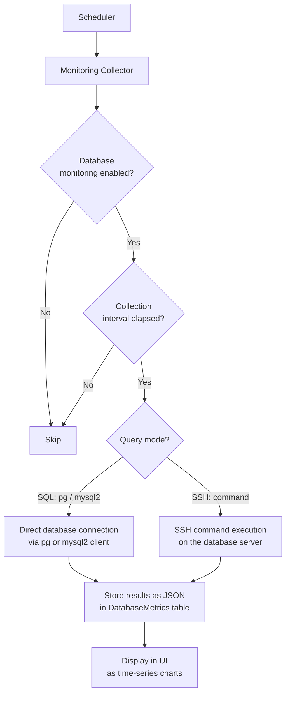

# Databases

BRIDGEPORT manages backups, monitoring, and service connections for your databases -- with a backup-first approach, because protecting your data comes before everything else.

## Table of Contents

- [Quick Start](#quick-start)
- [How It Works](#how-it-works)
- [1. Protect Your Data](#1-protect-your-data)
  - [Registering a Database](#registering-a-database)
  - [Backup Schedules](#backup-schedules)
  - [Manual Backups](#manual-backups)
  - [Backup Storage](#backup-storage)
  - [Backup Formats and Compression](#backup-formats-and-compression)
  - [Retention](#retention)
  - [Failed and Stuck Backups](#failed-and-stuck-backups)
  - [Pinning Backups](#pinning-backups)
  - [Downloading Backups](#downloading-backups)
  - [Recovery](#recovery)
- [2. Monitor Your Databases](#2-monitor-your-databases)
  - [Enabling Monitoring](#enabling-monitoring)
  - [Collection Intervals](#collection-intervals)
  - [How Monitoring Works](#how-monitoring-works)
  - [Testing Connections](#testing-connections)
  - [Viewing Metrics and Charts](#viewing-metrics-and-charts)
- [3. Link Databases to Services](#3-link-databases-to-services)
- [Configuration Options](#configuration-options)
- [Troubleshooting](#troubleshooting)
- [Related](#related)

---

## Quick Start

Register a database and set up daily backups in under two minutes:

1. Go to **Operations > Databases** in the sidebar.
2. Click **Add Database**.
3. Select the database type (PostgreSQL, MySQL, or SQLite).
4. Enter connection details (host, port, database name, credentials).
5. Choose backup storage (local or [S3-compatible](storage.md)).
6. Click **Create**.
7. On the database detail page, set up a backup schedule: `0 2 * * *` (daily at 2 AM).
8. Click **Backup Now** to run your first backup immediately.

---

## How It Works

BRIDGEPORT treats databases as registered resources that you manage through three capabilities: backups, monitoring, and service linking.


**Key concepts:**

- **Plugin-driven types.** Database types (PostgreSQL, MySQL, SQLite) are defined as plugins in JSON files. Each plugin specifies connection fields, backup/restore commands, and monitoring queries. Admins can customize types at Admin > Database Types.
- **SSH-based operations.** Backups and SSH-mode monitoring execute commands on the server that hosts the database, using the environment's SSH key.
- **Encrypted credentials.** Database usernames and passwords are encrypted at rest using AES-256-GCM.
- **Environment-scoped.** Databases belong to an environment. Each database name must be unique within its environment.

---

## 1. Protect Your Data

### Registering a Database

#### Via the UI

1. Navigate to **Operations > Databases**.
2. Click **Add Database**.
3. Fill in the form:

| Field | Required | Description |
|-------|----------|-------------|
| **Name** | Yes | Display name (e.g., "Production API DB") |
| **Type** | Yes | Database type (PostgreSQL, MySQL, SQLite) |
| **Server** | Recommended | Which server hosts this database (required for SSH-based operations) |
| **Host** | For SQL DBs | Database hostname (e.g., `localhost`, `db.internal`) |
| **Port** | For SQL DBs | Database port (default: 5432 for PostgreSQL, 3306 for MySQL) |
| **Database Name** | For SQL DBs | The actual database name |
| **Username** | For SQL DBs | Database username |
| **Password** | For SQL DBs | Database password (encrypted at rest) |
| **File Path** | For SQLite | Path to the SQLite file on the server |
| **Use SSL** | No | Enable TLS/SSL for database connections |

4. Configure backup settings (see [Backup Storage](#backup-storage)).
5. Click **Create**.

#### Via the API

```http
POST /api/environments/:envId/databases
Authorization: Bearer <token>
Content-Type: application/json

{
  "name": "Production API DB",
  "type": "postgres",
  "host": "localhost",
  "port": 5432,
  "databaseName": "appdb",
  "username": "appuser",
  "password": "secretpassword",
  "serverId": "srv123",
  "backupStorageType": "local",
  "backupLocalPath": "/var/backups/appdb"
}
```

All database settings can be edited after creation. Go to the database detail page and update connection details, backup configuration, or monitoring settings at any time.

### Backup Schedules

Set up automatic backups with a cron schedule to ensure your data is always protected.

#### Setting a Schedule

**UI:** Database detail page > Schedule section.

**API:**
```http
PUT /api/databases/:id/schedule
Authorization: Bearer <token>
Content-Type: application/json

{
  "cronExpression": "0 2 * * *",
  "enabled": true
}
```

> [!NOTE]
> The schedule only controls **when** backups run. **How many** are kept is governed by the [retention policy](#retention) (the GFS tiers), configured separately. The legacy `retentionDays` field on the schedule is deprecated and no longer enforced.

#### Common Cron Expressions

| Expression | Schedule |
|------------|----------|
| `0 2 * * *` | Daily at 2:00 AM |
| `0 */6 * * *` | Every 6 hours |
| `0 2 * * 0` | Weekly on Sunday at 2:00 AM |
| `0 2 1 * *` | Monthly on the 1st at 2:00 AM |
| `*/30 * * * *` | Every 30 minutes |

#### Schedule Fields

| Field | Required | Default | Description |
|-------|----------|---------|-------------|
| `cronExpression` | Yes | -- | Standard 5-field cron format |
| `enabled` | No | true | Toggle the schedule on/off without deleting it |
| `retentionDays` | No | 7 | **Deprecated** — retained for backward compatibility but no longer enforced. Use the [retention policy](#retention) instead. |

BRIDGEPORT's scheduler checks for due backups at the interval configured by `SCHEDULER_BACKUP_CHECK_INTERVAL` (default: 60 seconds). When a backup is due, it runs asynchronously.

> [!TIP]
> Schedule backups during low-traffic periods to minimize impact on database performance. For PostgreSQL, `pg_dump` takes a consistent snapshot without blocking writes, but it does increase I/O.

### Manual Backups

Trigger a backup at any time:

**UI:** Database detail page > **Backup Now** button.

**API:**
```http
POST /api/databases/:id/backups
Authorization: Bearer <token>
```

**Response:**
```json
{
  "backupId": "bkp123",
  "message": "Backup started"
}
```

The backup runs asynchronously. Monitor progress on the database detail page or via `GET /api/backups/:id`.

### Backup Summary

For dashboard-style views that need the latest completed backup and schedule state for every database in an environment in a single round-trip, use the batched summary endpoint instead of fanning out per-database `GET /api/databases/:id/backups` + `GET /api/databases/:id/schedule` calls.

**API:**
```http
GET /api/environments/:envId/databases/backup-summary
Authorization: Bearer <token>
```

**Response:**
```json
{
  "databases": [
    {
      "databaseId": "db123",
      "name": "Production API DB",
      "supportsBackup": true,
      "lastBackup": {
        "id": "bkp456",
        "completedAt": "2026-05-28T02:00:31.000Z",
        "createdAt": "2026-05-28T02:00:00.000Z",
        "status": "completed"
      },
      "schedule": { "enabled": true, "nextRunAt": "2026-05-29T02:00:00.000Z" }
    }
  ]
}
```

- `supportsBackup` is `false` for database types whose plugin does not define a `backupCommand`.
- `lastBackup` is the most recent `status: "completed"` backup (`null` if none has ever completed).
- `schedule` is `null` when no schedule has been configured for the database.

The endpoint is read-only and requires any authenticated user.

### Backup Storage

Backups can be stored locally on the server or uploaded to S3-compatible object storage.

| Storage Type | Description | Best For |
|-------------|-------------|----------|
| **Local** | Stored on the server's filesystem at the configured path | Development, staging, servers with local disk space |
| **S3/Spaces** | Uploaded to an S3-compatible bucket after the dump completes | Production, offsite storage, disaster recovery |

#### Local Storage

Set `backupStorageType: "local"` and provide a `backupLocalPath`:

```json
{
  "backupStorageType": "local",
  "backupLocalPath": "/var/backups/appdb"
}
```

The path must be writable by the SSH user. BRIDGEPORT creates the directory if it does not exist.

#### S3-Compatible Storage

Set `backupStorageType: "spaces"` and provide a bucket name:

```json
{
  "backupStorageType": "spaces",
  "backupSpacesBucket": "my-backups",
  "backupSpacesPrefix": "production/appdb/"
}
```

**Prerequisites:**
1. Configure global storage credentials at **Admin > Storage** -- see [Storage](storage.md).
2. Enable storage for the environment.
3. The configured bucket must be accessible with the stored credentials.

The object key follows the pattern: `{prefix}{database-name}/{timestamp}-{filename}`.

> [!NOTE]
> If S3 storage is not enabled for the environment, backups configured for Spaces storage will fail with "Spaces not configured for this environment."

### Backup Formats and Compression

#### PostgreSQL Formats

| Format | Description | Restore Support |
|--------|-------------|-----------------|
| **Plain** | SQL text dump (`.sql`) | `psql -f backup.sql` |
| **Custom** | pg_dump custom format (`.dump`) | `pg_restore` with selective restore |
| **Tar** | Tar archive format (`.tar`) | `pg_restore` |

#### Compression Options

| Option | Level | Description |
|--------|-------|-------------|
| **None** | -- | No compression |
| **Gzip** | 1-9 | Gzip compression (default level: 6) |

#### pg_dump Options

For PostgreSQL backups, additional options control what is included:

| Option | Description |
|--------|-------------|
| `noOwner` | Skip ownership commands (useful for restoring to a different user) |
| `clean` | Include DROP statements before CREATE |
| `ifExists` | Use IF EXISTS with DROP statements |
| `schemaOnly` | Dump schema only, no data |
| `dataOnly` | Dump data only, no schema |

#### Timeout

The `pgDumpTimeoutMs` setting controls how long BRIDGEPORT waits for `pg_dump` to complete. Range: 30 seconds to 1 hour. Default: 5 minutes (300000 ms). Increase this for large databases.

### Retention

BRIDGEPORT keeps your backups under a **Grandfather-Father-Son (GFS) tiered retention policy** rather than a flat "delete everything older than _N_ days" rule. GFS thins older backups across calendar buckets instead of dropping them on a hard age cliff, so you keep dense coverage of the recent past and sparse-but-long coverage of the distant past. For example, a `7d / 4w / 6m` policy spans roughly six months in about 17 files.

#### The tiers

A policy is six numbers plus an optional size cap:

| Tier | Keeps | Bounds |
|------|-------|--------|
| `keepLast` | The _N_ most-recent successful backups, regardless of when they ran (covers sub-daily schedules) | 0–100 |
| `daily` | The newest backup from each of the last _N_ calendar days | 0–366 |
| `weekly` | The newest backup from each of the last _N_ ISO weeks (weeks start Monday) | 0–520 |
| `monthly` | The newest backup from each of the last _N_ calendar months | 0–240 |
| `yearly` | The newest backup from each of the last _N_ calendar years | 0–50 |
| `minFloor` | A hard safety floor: always keep at least _N_ most-recent successful backups, no matter what the tiers select | 1–10 |
| `maxTotalBytes` | Optional absolute storage ceiling for this database's backups (off by default) | null = off |

> [!IMPORTANT]
> **A backup survives if *any* tier selects it.** The tiers are a **union**, not a sum. A single backup can simultaneously be "the newest of today", "the newest of this week", and "the newest of this month" — it just counts once. So `keepLast=24, daily=7, weekly=4, monthly=6` does **not** keep 41 backups; it keeps however many distinct backups satisfy at least one of those rules.

When more than one backup falls in the same bucket (e.g. two backups on the same day), the **newest one in the bucket wins** and the older sibling becomes eligible for pruning.

#### Presets

Most operators never touch the individual tiers. Pick a preset instead:

| Preset | `keepLast` | `daily` | `weekly` | `monthly` | `yearly` | `minFloor` |
|--------|-----------:|--------:|---------:|----------:|---------:|-----------:|
| **Lean** | 12 | 7 | 4 | 0 | 0 | 2 |
| **Balanced** (default) | 24 | 7 | 4 | 6 | 0 | 2 |
| **Long-term** | 24 | 7 | 4 | 12 | 3 | 2 |

`maxTotalBytes` is `null` (off) in every preset. Choosing **Custom** in the UI reveals the raw tier fields so you can dial in your own numbers.

#### Optional size cap (`maxTotalBytes`)

If you set `maxTotalBytes`, it is applied **after** the GFS tiers and safety floor as a final backstop: if this database's backups still total more than the cap, BRIDGEPORT evicts the **oldest non-pinned scheduled** backups until the total fits — but it never drops below `minFloor`, and it never evicts manual or pinned backups. If the cap can only be met by touching those exempt backups, BRIDGEPORT keeps them and emits a [`backup.rotation_error`](notifications.md) warning instead of silently violating your pins.

#### Inheritance: global default vs per-database override

Retention is configured at two levels:

- **Global default** — set by an **admin** at **Admin > System Settings** (the "Balanced" preset out of the box). Every database inherits this unless it has its own override.
- **Per-database override** — set by an **operator** on the database detail page. An override can pick a different preset, go fully custom, or be reverted to **"Use global default"** (which deletes the override and re-inherits whatever the admin has configured globally).

The database detail page shows the **effective** policy and whether its source is *inherited* or an *override*, so you always know which one is in force.

#### When rotation runs

Rotation evaluates a database's policy and prunes the losers:

- **After every successful backup** of that database (manual or scheduled). Completing a backup is the natural moment to re-evaluate which older siblings are still needed.
- **Via a daily sweep** over every database that has at least one backup. The sweep catches databases whose schedule is disabled or deleted, manual-only databases, and policy changes that haven't had a backup since.

You can also trigger rotation on demand with the **Rotate now** action (operator) — handy right after changing a policy.

#### What rotation never touches

Rotation only ever prunes backups that are **all** of: `completed`, `scheduled`, and **not pinned**. Always exempt:

- **Manual backups** — never auto-pruned. A backup you took by hand sticks around until you delete it.
- **Pinned backups** — pinning protects *any* backup (manual or scheduled) from rotation forever. Pin from the backup list (operator). Pinning an old backup does **not** consume a tier slot — it's protected *in addition* to whatever the tiers select.
- **Failed / in-progress backups** — never occupy a tier slot; they're handled by [failed-backup cleanup](#failed-and-stuck-backups) instead.

#### How pruning deletes a backup

Pruning is **file-first** and fully audited, so it never silently orphans an artifact:

1. The physical file is deleted first — `rm` over SSH for local storage, or a delete on the S3 object for Spaces storage.
2. Only on success is the database row removed.
3. If the file delete **fails**, the row is kept, `lastRotationError` is recorded on the backup, and the next daily sweep retries (retries are idempotent — a file that's already gone counts as success). A persistent failure raises a [`backup.rotation_error`](notifications.md) notification.

Every pass that prunes at least one backup writes an `AuditLog` entry recording the database, the effective policy, which backups were pruned, and the bytes freed. The **first** real deletion after you change a policy also sends a one-time [`backup.policy_first_prune`](notifications.md) notification summarizing what the new policy removed — so a policy change can never quietly delete history without telling you. (Routine, non-failing rotation passes are audit-logged but do not notify.)

> [!TIP]
> Before saving a policy, use the **live keep/prune preview** on the database page (or the `POST /api/databases/:id/backup-policy/preview` endpoint). It runs a server-side dry run and shows exactly how many backups the policy would keep versus prune — no guessing, nothing deleted. If a save would prune more than the configured confirmation threshold ([`backupRotationConfirmThreshold`](../reference/system-settings.md#database-backup--retention), default 5), the UI requires you to confirm first.

#### Timezone and period buckets

Calendar buckets (which day/week/month/year a backup belongs to) are computed in the **instance timezone** — a new admin setting (`timezone`, IANA format such as `Europe/Lisbon`, default `UTC`). Set it at **Admin > System Settings**.

This matters because a backup that runs at, say, 02:00 should land on the calendar day the operator expects, not the previous or next day in UTC. ISO weeks start on **Monday**. Buckets are calendar-based, so a one-hour DST shift never splits a single day across two buckets.

#### Migrating from flat retention

Upgrading from the old flat `retentionDays` model is automatic and **deletes zero backups**. On upgrade, each existing schedule's `retentionDays` is converted into that many `daily` slots (capped at 366), with weekly/monthly/yearly set to 0 and `minFloor=2`. So a database that was on `retentionDays=30` keeps roughly 30 daily restore points afterward — the first sweep prunes nothing it wouldn't already have pruned. The richer weekly/monthly/yearly tiers only ever take effect once an operator explicitly edits the policy.

> [!NOTE]
> The old `retentionDays` field on the backup schedule is retained but deprecated; it no longer drives retention. Configure retention through the backup policy (above) instead.

### Failed and Stuck Backups

Failed and stuck backups are cleaned up **separately** from the GFS rotation above — they never occupy a retention tier slot.

- **Stuck backups** are recovered first. Any backup left in `in_progress` longer than its database's `pgDumpTimeoutMs` (plus a grace margin) is marked `failed` with an explanatory error, so a crashed or hung dump can't linger forever.
- **Failed backups** are then deleted once they are older than `failedBackupRetentionDays` (a global admin setting, default **3** days). Any partial or temp artifact left behind is removed using the same file-first deletion as rotation.

This short, separate retention keeps the failure history useful for debugging recent problems without letting dead rows and partial files accumulate.

### Pinning Backups

**Pinning** protects an individual backup from rotation **forever**, regardless of policy or age. Use it to hold onto a known-good snapshot — for example, the backup taken right before a risky migration or release.

**UI:** Backup list > pin icon on the row (operator). Pinned rows are visually marked as protected.

**API:** A single idempotent endpoint sets the pinned state via a JSON body:
```http
PUT /api/databases/:id/backups/:backupId/pin
Authorization: Bearer <token>
Content-Type: application/json

{ "pinned": true }    # protect from rotation; { "pinned": false } releases it
```

Pinning works on any backup — manual or scheduled. A pinned backup is kept *in addition* to whatever the tiers select, so pinning an old backup does not reduce how many dailies, weeklies, or monthlies you retain. Pinned backups are also never evicted by the optional `maxTotalBytes` size cap. To let a pinned backup age out normally, unpin it.

### Downloading Backups

Backup downloads are controlled by an environment setting that is **disabled by default**.

To enable: **Settings > Data > Allow Backup Download** (admin only).

Once enabled:
- **Local backups:** Streamed through the BRIDGEPORT server.
- **S3 backups:** A presigned URL is generated (valid for 1 hour).

```http
GET /api/backups/:id/download
Authorization: Bearer <token>
```

For S3 backups, the response includes a `downloadUrl` that the client redirects to.

### Recovery

#### PostgreSQL Recovery

**Plain format (`.sql`):**
```bash
# On the server, restore directly:
psql -h localhost -U appuser -d appdb -f /var/backups/appdb/backup-20260225.sql

# Or from a downloaded backup:
psql -h localhost -U appuser -d appdb -f backup-20260225.sql
```

**Custom format (`.dump`):**
```bash
# Full restore:
pg_restore -h localhost -U appuser -d appdb /var/backups/appdb/backup-20260225.dump

# Selective restore (single table):
pg_restore -h localhost -U appuser -d appdb -t users /var/backups/appdb/backup-20260225.dump
```

**Compressed backup (`.sql.gz`):**
```bash
gunzip -c backup-20260225.sql.gz | psql -h localhost -U appuser -d appdb
```

#### MySQL Recovery

```bash
mysql -h localhost -u appuser -p appdb < /var/backups/appdb/backup-20260225.sql
```

#### SQLite Recovery

```bash
# Stop the application first, then replace the database file:
cp /var/backups/appdb/backup-20260225.db /opt/app/data/app.db
```

> [!WARNING]
> Always stop the application before restoring a database. Restoring while the application is running can cause data corruption or connection errors.

---

## 2. Monitor Your Databases

BRIDGEPORT can continuously monitor your databases by running plugin-defined monitoring queries and displaying the results as time-series charts.

### Enabling Monitoring

**UI:** Database detail page > Monitoring section > toggle **Enable Monitoring**.

**API:**
```http
PATCH /api/environments/:envId/databases/:id/monitoring
Authorization: Bearer <token>
Content-Type: application/json

{
  "monitoringEnabled": true,
  "collectionIntervalSec": 300
}
```

### Collection Intervals

| Setting | Default | Description |
|---------|---------|-------------|
| `collectionIntervalSec` | 300 (5 min) | Per-database collection interval in seconds |
| `defaultCollectionIntervalSec` | 300 | Default for new databases (set in environment Data Settings) |

Each database can have its own collection interval. The scheduler runs the collector which checks all monitored databases and runs queries for those whose interval has elapsed.

### How Monitoring Works

Monitoring queries are defined in the database type's plugin file (`plugins/database-types/*.json`). Each query specifies:
- **SQL query or SSH command** to execute
- **Result type**: scalar (single value), row (key-value pairs), or rows (table)
- **Display name and unit** for chart rendering
- **Chart grouping** for organizing related metrics



**Two execution modes:**

| Mode | Used For | How It Works |
|------|----------|-------------|
| **SQL** (`pg`, `mysql2`) | PostgreSQL, MySQL | Connects directly to the database using the stored credentials |
| **SSH** | SQLite, custom commands | Executes a command on the database's server via SSH |

### Testing Connections

Before relying on monitoring, test the connection:

**UI:** Database detail page > **Test Connection** button.

**API:**
```http
POST /api/environments/:envId/databases/:id/test-connection
Authorization: Bearer <token>
```

**Response:**
```json
{
  "success": true,
  "latencyMs": 12
}
```

The test performs a lightweight ping (e.g., `SELECT 1` for SQL databases) and reports the latency.

### Viewing Metrics and Charts

- **Monitoring > Databases** (`/monitoring/databases`): Grid view of all monitored databases with status, key metrics, and sparklines.
- **Database Detail** (`/monitoring/databases/:id`): Detailed time-series charts driven by the plugin's monitoring queries. Charts are grouped by the query's `chartGroup` field.

**API for metrics history:**
```http
GET /api/environments/:envId/databases/:id/metrics?hours=24
Authorization: Bearer <token>
```

Returns all collected metrics within the time window, along with the monitoring configuration for chart rendering.

---

## 3. Link Databases to Services

The `ServiceDatabase` model connects databases to services with a connection environment variable name. This is informational -- BRIDGEPORT does not inject these values automatically, but it provides visibility into which services depend on which databases.

**Creating a link:**

The link is typically established during service or database configuration, specifying:
- The service that depends on the database
- The environment variable name used for the connection (e.g., `DATABASE_URL`)

This information appears in:
- The service detail page (showing which databases the service uses)
- The database detail page (showing which services depend on this database)
- The [topology diagram](topology.md) (showing database-to-service connections)

---

## Configuration Options

### Database Fields

| Field | Type | Default | Description |
|-------|------|---------|-------------|
| `name` | string | -- | Display name (unique per environment) |
| `type` | string | -- | Database type (`postgres`, `mysql`, `sqlite`) |
| `host` | string | null | Database hostname |
| `port` | integer | null | Database port |
| `databaseName` | string | null | Actual database name |
| `username` | string | null | Database username (encrypted) |
| `password` | string | null | Database password (encrypted) |
| `filePath` | string | null | Path to SQLite file on server |
| `useSsl` | boolean | false | Use TLS/SSL for connections |
| `serverId` | string | null | Server that hosts this database |
| `backupStorageType` | enum | `local` | `local` or `spaces` |
| `backupLocalPath` | string | null | Local backup directory |
| `backupSpacesBucket` | string | null | S3 bucket name |
| `backupSpacesPrefix` | string | null | Object key prefix |
| `backupFormat` | enum | `plain` | `plain`, `custom`, or `tar` |
| `backupCompression` | enum | `none` | `none` or `gzip` |
| `backupCompressionLevel` | integer | 6 | Gzip level (1-9) |
| `pgDumpTimeoutMs` | integer | 300000 | pg_dump timeout (30s-1h) |
| `monitoringEnabled` | boolean | true | Enable monitoring queries |
| `collectionIntervalSec` | integer | 300 | Monitoring collection interval |

### Backup Schedule Fields

| Field | Type | Default | Description |
|-------|------|---------|-------------|
| `cronExpression` | string | -- | Standard 5-field cron expression |
| `enabled` | boolean | true | Schedule active toggle |
| `retentionDays` | integer | 7 | **Deprecated** — no longer enforced; superseded by the [retention policy](#retention) |

### Backup Retention Policy Fields

Per-database override of the global default (see [Retention](#retention)). Absent or `inheritGlobal: true` means the database inherits the admin's global default.

| Field | Type | Default | Description |
|-------|------|---------|-------------|
| `inheritGlobal` | boolean | false | When true, ignore the fields below and use the global default |
| `preset` | enum | `balanced` | `lean`, `balanced`, `long_term`, or `custom` |
| `keepLast` | integer | 24 | Most-recent backups kept regardless of period (0–100) |
| `daily` | integer | 7 | Daily restore points (0–366) |
| `weekly` | integer | 4 | Weekly restore points, ISO weeks (0–520) |
| `monthly` | integer | 6 | Monthly restore points (0–240) |
| `yearly` | integer | 0 | Yearly restore points (0–50) |
| `minFloor` | integer | 2 | Hard floor of most-recent successful backups (1–10) |
| `maxTotalBytes` | bigint | null | Optional per-database storage cap (null = off) |

**Endpoints:**

| Method | Path | Role | Purpose |
|--------|------|------|---------|
| `GET` | `/api/databases/:id/backup-policy` | Viewer | Effective policy + override + global default + source |
| `PUT` | `/api/databases/:id/backup-policy` | Operator | Set/replace the per-database override (send `confirm: true` if the preview exceeds the confirm threshold) |
| `DELETE` | `/api/databases/:id/backup-policy` | Operator | Revert to inheriting the global default |
| `POST` | `/api/databases/:id/backup-policy/preview` | Viewer | Dry run: `{ keep[], prune[], bytesFreed }` without deleting |
| `POST` | `/api/databases/:id/rotate` | Operator | "Rotate now" — run rotation immediately |
| `PUT` | `/api/databases/:id/backups/:backupId/pin` | Operator | Pin (`{ "pinned": true }`) or unpin (`{ "pinned": false }`) a backup |

### Related Environment Settings

| Setting | Location | Default | Description |
|---------|----------|---------|-------------|
| `allowBackupDownload` | Settings > Data | false | Allow backup file downloads |
| `defaultMonitoringEnabled` | Settings > Data | false | Default monitoring toggle for new databases |
| `defaultCollectionIntervalSec` | Settings > Data | 300 | Default collection interval for new databases |

### Role Requirements

| Action | Minimum Role |
|--------|-------------|
| View databases, backups, metrics | Viewer |
| View retention policy and preview prune/keep | Viewer |
| Create, edit, delete databases | Operator |
| Create and delete backups | Operator |
| Manage backup schedules | Operator |
| Set per-database retention policy, pin/unpin backups, "rotate now" | Operator |
| Edit the **global default** retention policy (Admin > System Settings) | Admin |
| Update monitoring config | Operator |

---

## Troubleshooting

**"Cannot delete database with existing backups"**
Delete all backups first (or let retention clean them up), then delete the database. This prevents accidental data loss.

**Backup fails at the "connect" step**
BRIDGEPORT cannot SSH to the server. Verify:
- The server is reachable and the SSH key is configured for the environment.
- The SSH user has permissions to run `pg_dump` / `mysqldump`.

**Backup fails at the "dump" step**
The dump command failed. Common causes:
- Database credentials are incorrect.
- The `pg_dump` / `mysqldump` binary is not installed on the server.
- The database does not exist or is not accessible.
- The timeout was exceeded (increase `pgDumpTimeoutMs` for large databases).

**Backup fails at the "upload" step**
For S3 storage: verify that storage is enabled for the environment and the bucket is accessible. See [Storage > Troubleshooting](storage.md#troubleshooting).

**A `backup.rotation_error` notification fired**
Rotation tried to delete a backup file but couldn't (SSH unreachable, missing local path, or an S3 error). The database row is kept — never orphaned — and the next daily sweep retries automatically. Check `lastRotationError` on the affected backup and confirm the storage backend is reachable. The same notification fires when a `maxTotalBytes` cap can't be met without evicting pinned or manual backups; in that case, raise the cap, unpin some backups, or delete manual backups by hand.

**Backups aren't being pruned even though they're old**
Confirm they're actually eligible: rotation only prunes `completed`, `scheduled`, **unpinned** backups. Manual and pinned backups are exempt by design. Also check the effective policy on the database page (it may be inheriting a generous global default) and remember that a single backup is kept if *any* tier selects it. Use the keep/prune preview to see the policy's decision.

**Monitoring shows "error" status**
Check `lastMonitoringError` on the database detail page. Common causes:
- Database connection credentials changed.
- The database is temporarily unreachable.
- A monitoring query is incompatible with the database version.

**"Spaces not configured for this environment"**
S3 storage must be configured globally (Admin > Storage) and enabled for the specific environment before databases can use it. See [Storage](storage.md).

**Scheduled backups are not running**
Verify:
- The schedule is enabled (`enabled: true`).
- The scheduler is running (`SCHEDULER_ENABLED=true`).
- The cron expression is valid.
- Check `lastRunAt` and `nextRunAt` on the schedule to see when it last ran.

**Database type not available**
Database types are loaded from plugins on startup. Check that the plugins directory (`PLUGINS_DIR`) contains the expected JSON files. Admins can also add custom database types at Admin > Database Types.

---

## Related

- [Storage](storage.md) -- S3-compatible storage setup for offsite backups
- [Monitoring](monitoring.md) -- Monitoring overview and quick start
- [Monitoring: Databases](monitoring-databases.md) -- Database monitoring deep dive
- [Services](services.md) -- Linking services to databases
- [Topology](topology.md) -- Visualizing database-to-service connections
- [Environment Settings](environments.md) -- Per-environment backup and monitoring defaults
