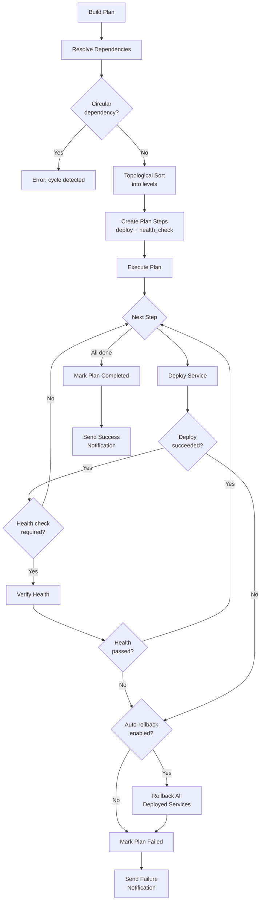
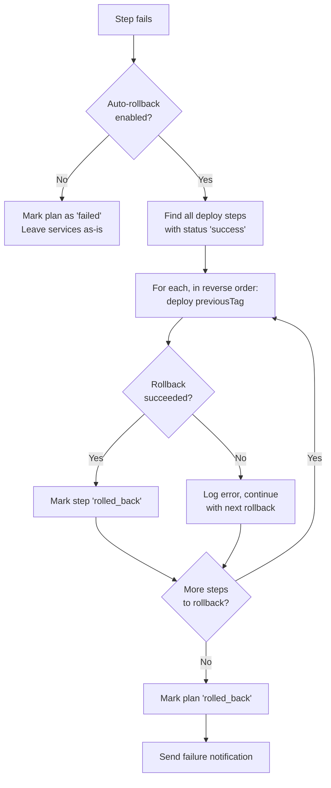
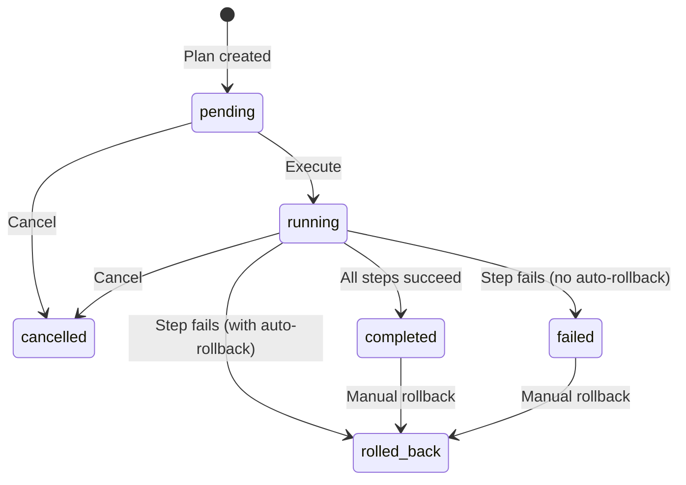
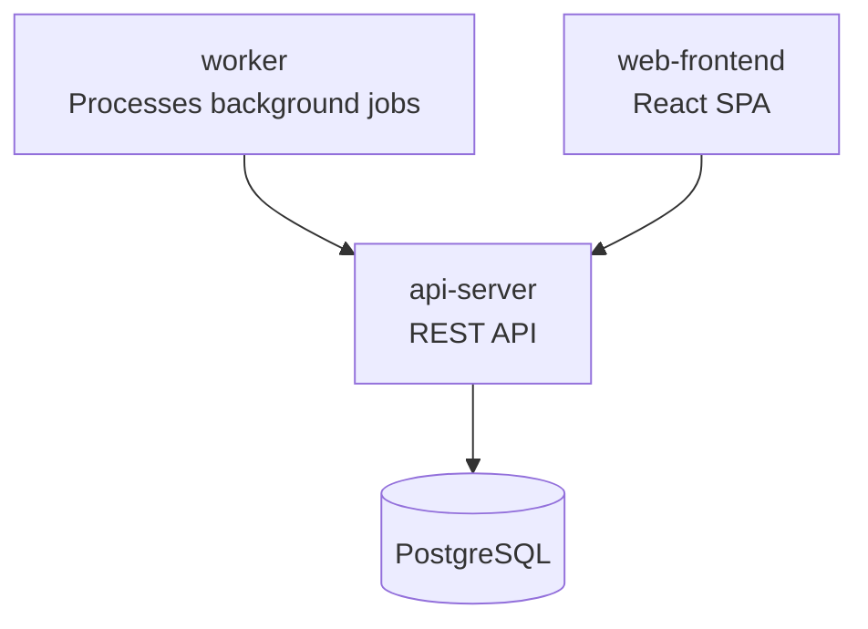

# Deployment Plans & Orchestration

Deploy multiple services in the correct order, with automatic health checks between steps and full rollback if anything goes wrong -- BridgePort's deployment orchestration turns complex multi-service releases into a single, trackable operation.

## Table of Contents

- [Overview](#overview)
- [Quick Start](#quick-start)
- [How It Works](#how-it-works)
  - [The Orchestration Pipeline](#the-orchestration-pipeline)
  - [Dependency Resolution (Kahn's Algorithm)](#dependency-resolution-kahns-algorithm)
- [Prerequisites](#prerequisites)
  - [Container Images](#container-images)
  - [Service Dependencies](#service-dependencies)
- [Setting Up Dependencies](#setting-up-dependencies)
  - [Dependency Types](#dependency-types)
  - [Creating Dependencies via the UI](#creating-dependencies-via-the-ui)
  - [Creating Dependencies via the API](#creating-dependencies-via-the-api)
  - [Viewing the Dependency Graph](#viewing-the-dependency-graph)
- [Creating a Deployment Plan](#creating-a-deployment-plan)
  - [From the UI](#from-the-ui)
  - [From the API](#from-the-api)
  - [Create and Execute in One Call](#create-and-execute-in-one-call)
- [Step Types](#step-types)
- [Execution Modes](#execution-modes)
  - [Sequential Execution (Default)](#sequential-execution-default)
  - [Parallel Execution](#parallel-execution)
- [Auto-Rollback](#auto-rollback)
  - [What Triggers a Rollback](#what-triggers-a-rollback)
  - [How Rollback Works](#how-rollback-works)
  - [Manual Rollback](#manual-rollback)
  - [Disabling Auto-Rollback](#disabling-auto-rollback)
- [Real-Time Progress Tracking (SSE)](#real-time-progress-tracking-sse)
- [Plan Lifecycle](#plan-lifecycle)
- [Example: Web + API + Worker Deployment](#example-web--api--worker-deployment)
- [Configuration Options](#configuration-options)
- [Troubleshooting](#troubleshooting)
- [Related](#related)

---

## Overview

When you manage a single service, deploying is straightforward -- pull the new image and restart. But real-world infrastructure has dependencies. Your web frontend depends on the API being healthy. Your API depends on the database migration worker finishing first. A deployment that updates all three needs to happen in the right order, with health gates between steps, and the ability to roll everything back if step 3 fails.

That is what deployment plans solve.

**What orchestration gives you:**

- Dependency-aware ordering -- services deploy in the correct sequence
- Health gates -- a service must pass health checks before its dependents deploy
- Auto-rollback -- if any step fails, all previously deployed services revert to their previous tags
- Parallel execution -- services at the same dependency level can deploy simultaneously
- Real-time progress -- track every step via SSE or polling
- Audit trail -- every plan, step, and rollback is logged

---

## Quick Start

Already have container images and services set up? Here is the fastest path to your first orchestrated deployment:

1. Navigate to **Orchestration > Container Images** and make sure your services share a container image (or note the service IDs you want to deploy).
2. Go to a service's detail page and click the **Dependencies** tab.
3. Add at least one dependency (e.g., "API depends on Worker with type `deploy_after`").
4. Navigate to **Orchestration > Deployment Plans** and click **New Plan**.
5. Select the services, enter the target image tag, and click **Create & Execute**.
6. Watch the real-time progress tracker as each step runs.

---

## How It Works

### The Orchestration Pipeline



### Dependency Resolution (Kahn's Algorithm)

BridgePort uses Kahn's algorithm for topological sorting to determine deployment order. Services are grouped into **levels** -- all services at level 0 have no dependencies, level 1 services depend only on level 0, and so on.

```
Level 0: [database-migrator]     -- no dependencies, deploys first
Level 1: [api-server, worker]    -- both depend on database-migrator
Level 2: [web-frontend]          -- depends on api-server
```

Before creating a plan, BridgePort checks for circular dependencies using depth-first search. If a cycle is found (A depends on B, B depends on C, C depends on A), the plan creation fails with a clear error message naming the cycle.

---

## Prerequisites

### Container Images

Every service in BridgePort is linked to a **ContainerImage** -- a central entity that tracks the image name, current tag, and registry connection. Before you can include a service in a deployment plan, it must have a container image assigned.

See [Container Images](container-images.md) for setup instructions.

### Service Dependencies

Dependencies are optional but are what make orchestration powerful. Without dependencies, all services deploy at the same level (effectively in parallel or arbitrary order). With dependencies, BridgePort knows exactly which services must be healthy before others can deploy.

---

## Setting Up Dependencies

### Dependency Types

| Type | What It Means | When to Use |
|------|---------------|-------------|
| `health_before` | The depended-on service must pass a **health check** before the dependent service deploys. Creates both a deploy step and a health_check step for the dependency. | API must be healthy before deploying the frontend. Database must be running before deploying the app. |
| `deploy_after` | The depended-on service must **finish deploying** (successfully) before the dependent deploys. No health check gate is inserted for the dependency itself. | Worker must deploy after the migrator. Order matters but health verification is not required. |

> [!TIP]
> Use `health_before` when the downstream service will fail to start if the upstream is not ready. Use `deploy_after` when you just need ordering without health gating.

### Creating Dependencies via the UI

1. Go to the service detail page for the **dependent** service (the one that waits).
2. Click the **Dependencies** tab.
3. Click **Add Dependency**.
4. Select the service it depends on from the dropdown (only services in the same environment are shown).
5. Choose the dependency type (`health_before` or `deploy_after`).
6. Click **Save**.

The dependency graph visualization updates immediately, showing the new edge.

### Creating Dependencies via the API

```bash
# "web-frontend" depends on "api-server" being healthy first
curl -X POST https://your-bridgeport/api/services/svc_web_frontend/dependencies \
  -H "Authorization: Bearer $TOKEN" \
  -H "Content-Type: application/json" \
  -d '{
    "dependsOnId": "svc_api_server",
    "type": "health_before"
  }'
```

Expected response:

```json
{
  "dependency": {
    "id": "dep_abc123",
    "type": "health_before",
    "dependentId": "svc_web_frontend",
    "dependsOnId": "svc_api_server",
    "dependsOn": {
      "id": "svc_api_server",
      "name": "api-server",
      "server": { "name": "app-server-01" }
    }
  }
}
```

**Validation rules:**

- Both services must be in the same environment
- A service cannot depend on itself (400 error)
- Circular dependencies are detected and rejected (400 error with cycle path)
- Duplicate dependencies return 409

### Viewing the Dependency Graph

The dependency graph endpoint returns nodes, edges, and the computed deployment order for an entire environment:

```bash
curl "https://your-bridgeport/api/environments/env_abc123/dependency-graph" \
  -H "Authorization: Bearer $TOKEN"
```

```json
{
  "nodes": [
    { "id": "svc_1", "name": "migrator", "status": "running", "dependencyCount": 0, "dependentCount": 2 },
    { "id": "svc_2", "name": "api", "status": "running", "dependencyCount": 1, "dependentCount": 1 },
    { "id": "svc_3", "name": "web", "status": "running", "dependencyCount": 1, "dependentCount": 0 }
  ],
  "edges": [
    { "id": "dep_1", "from": "svc_1", "to": "svc_2", "type": "health_before" },
    { "id": "dep_2", "from": "svc_2", "to": "svc_3", "type": "health_before" }
  ],
  "deploymentOrder": [["svc_1"], ["svc_2"], ["svc_3"]]
}
```

---

## Creating a Deployment Plan

### From the UI

1. Navigate to **Orchestration > Deployment Plans**.
2. Click **New Plan**.
3. Select the services to include (or choose "Deploy All" from a container image page to include all linked services).
4. Enter the target image tag (e.g., `v2.1.0`, `latest`, `sha-abc1234`).
5. Configure options:
   - **Auto-rollback**: Enabled by default. Disable if you want to manually handle failures.
6. Click **Create & Execute** to start immediately, or **Create** to save the plan for later execution.

### From the API

```bash
curl -X POST "https://your-bridgeport/api/environments/env_abc123/deployment-plans" \
  -H "Authorization: Bearer $TOKEN" \
  -H "Content-Type: application/json" \
  -d '{
    "serviceIds": ["svc_migrator", "svc_api", "svc_web"],
    "imageTag": "v2.1.0",
    "autoRollback": true
  }'
```

Expected response:

```json
{
  "plan": {
    "id": "plan_xyz789",
    "name": "Deploy migrator, api, web",
    "status": "pending",
    "imageTag": "v2.1.0",
    "triggerType": "manual",
    "autoRollback": true,
    "parallelExecution": false,
    "steps": [
      { "order": 0, "action": "deploy", "service": { "name": "migrator" }, "status": "pending" },
      { "order": 1, "action": "health_check", "service": { "name": "migrator" }, "status": "pending" },
      { "order": 2, "action": "deploy", "service": { "name": "api" }, "status": "pending" },
      { "order": 3, "action": "health_check", "service": { "name": "api" }, "status": "pending" },
      { "order": 4, "action": "deploy", "service": { "name": "web" }, "status": "pending" }
    ]
  }
}
```

### Create and Execute in One Call

Add `?execute=true` to the query string to start the plan immediately after creation:

```bash
curl -X POST "https://your-bridgeport/api/environments/env_abc123/deployment-plans?execute=true" \
  -H "Authorization: Bearer $TOKEN" \
  -H "Content-Type: application/json" \
  -d '{
    "serviceIds": ["svc_migrator", "svc_api", "svc_web"],
    "imageTag": "v2.1.0",
    "autoRollback": true
  }'
```

The plan is created and execution begins asynchronously. The response includes the plan with all steps in `pending` status. Use [SSE streaming](#real-time-progress-tracking-sse) or polling to track progress.

---

## Step Types

Each step in a deployment plan has an `action` and moves through a status lifecycle:

| Action | Description | Created When |
|--------|-------------|--------------|
| `deploy` | Pull the target image tag and restart the service container | Always -- one per service in the plan |
| `health_check` | Wait for the service to pass health verification (container status + optional URL check) | When the service has a `health_before` dependency or a `healthCheckUrl` configured |
| `rollback` | Re-deploy the service's previous tag | Created dynamically during rollback (not pre-planned) |

**Step status lifecycle:**

```
pending --> running --> success
                   \-> failed
                   \-> skipped (if plan cancelled)
                   \-> rolled_back (after rollback)
```

---

## Execution Modes

### Sequential Execution (Default)

Steps run one at a time in dependency order. This is the safest mode -- if step 3 fails, only steps 0-2 have been deployed and need rollback.

```
Step 0: deploy migrator        --> success
Step 1: health_check migrator  --> success
Step 2: deploy api             --> success
Step 3: health_check api       --> success
Step 4: deploy web             --> success
```

### Parallel Execution

When `parallelExecution` is enabled, services at the **same dependency level** deploy simultaneously. Services at different levels still wait for the previous level to complete.

```
Level 0:  deploy migrator                    --> success
Level 0:  health_check migrator              --> success
Level 1:  deploy api  |  deploy worker       --> both run in parallel
Level 1:  health_check api | health_check worker --> both run in parallel
Level 2:  deploy web                         --> success
```

> [!WARNING]
> Parallel execution increases deployment speed but means more services may need rollback if a failure occurs at a given level. Use it when you are confident in your health checks and want faster deployments.

---

## Auto-Rollback

### What Triggers a Rollback

Auto-rollback activates when **any** step in the plan fails:

- A `deploy` step fails (image pull error, container crash, timeout)
- A `health_check` step fails (health verification exhausted all retries)

### How Rollback Works



Key details:

1. **Only successfully deployed services get rolled back.** If step 3 fails, only steps 0 and 2 (the `deploy` steps that succeeded) are reverted.
2. **Rollback deploys the `previousTag`** that was recorded when the plan was created. This is the tag the service was running before the plan started.
3. **Rollback proceeds in reverse order** -- the last deployed service is rolled back first.
4. **Rollback failures do not stop other rollbacks.** If rolling back service A fails, service B is still attempted.
5. **The plan status becomes `rolled_back`**, not `failed`, when auto-rollback completes.

### Manual Rollback

You can trigger rollback manually on a `completed` or `failed` plan:

```bash
curl -X POST "https://your-bridgeport/api/deployment-plans/plan_xyz789/rollback" \
  -H "Authorization: Bearer $TOKEN"
```

This is useful when a deployment completes successfully but you discover a bug after the fact. Manual rollback follows the same logic as auto-rollback -- all deployed services revert to their previous tags.

### Disabling Auto-Rollback

Set `autoRollback: false` when creating the plan. If a step fails, the plan is marked `failed` and no rollback occurs. You can then:

- Fix the issue and re-execute manually
- Trigger a manual rollback
- Cancel the plan

---

## Real-Time Progress Tracking (SSE)

Connect to the SSE endpoint to receive live updates as steps execute:

```bash
curl -N "https://your-bridgeport/api/deployment-plans/plan_xyz789/stream" \
  -H "Authorization: Bearer $TOKEN"
```

The stream emits three event types:

| Event | When | Payload |
|-------|------|---------|
| `plan` | Plan status changes (pending -> running -> completed/failed/rolled_back) | Full plan object with all steps |
| `step` | Any step status changes | Single step object with updated status |
| `done` | Plan reaches a terminal state | `{ "status": "completed" }` |

Example SSE output:

```
event: plan
data: {"id":"plan_xyz789","status":"running","steps":[...]}

event: step
data: {"id":"step_1","action":"deploy","status":"running","service":{"name":"migrator"}}

event: step
data: {"id":"step_1","action":"deploy","status":"success","service":{"name":"migrator"}}

event: step
data: {"id":"step_2","action":"health_check","status":"running","service":{"name":"migrator"}}

event: step
data: {"id":"step_2","action":"health_check","status":"success","service":{"name":"migrator"}}

event: plan
data: {"id":"plan_xyz789","status":"completed","steps":[...]}

event: done
data: {"status":"completed"}
```

> [!TIP]
> The BridgePort UI uses this SSE endpoint to power the real-time deployment progress tracker on the Deployment Plan Detail page. You can use the same endpoint to build custom dashboards or Slack bots.

---

## Plan Lifecycle

A deployment plan moves through these statuses:



| Status | Meaning |
|--------|---------|
| `pending` | Plan created, not yet executing |
| `running` | Execution in progress |
| `completed` | All steps finished successfully |
| `failed` | A step failed; auto-rollback was disabled |
| `cancelled` | Plan was cancelled; pending steps marked as `skipped` |
| `rolled_back` | A step failed and auto-rollback completed, or manual rollback was triggered |

---

## Example: Web + API + Worker Deployment

Here is a concrete walkthrough deploying three services that depend on each other:

**Architecture:**



**Step 1: Set up dependencies**

```bash
# API depends on worker being deployed first (worker runs migrations)
curl -X POST https://bp.example.com/api/services/svc_api/dependencies \
  -H "Authorization: Bearer $TOKEN" \
  -H "Content-Type: application/json" \
  -d '{"dependsOnId": "svc_worker", "type": "deploy_after"}'

# Web frontend depends on API being healthy
curl -X POST https://bp.example.com/api/services/svc_web/dependencies \
  -H "Authorization: Bearer $TOKEN" \
  -H "Content-Type: application/json" \
  -d '{"dependsOnId": "svc_api", "type": "health_before"}'
```

**Step 2: Create and execute the plan**

```bash
curl -X POST "https://bp.example.com/api/environments/env_prod/deployment-plans?execute=true" \
  -H "Authorization: Bearer $TOKEN" \
  -H "Content-Type: application/json" \
  -d '{
    "serviceIds": ["svc_worker", "svc_api", "svc_web"],
    "imageTag": "v2.1.0",
    "autoRollback": true
  }'
```

**Step 3: What happens**

BridgePort resolves the dependency graph and creates these steps:

| Order | Action | Service | Why |
|-------|--------|---------|-----|
| 0 | deploy | worker | No dependencies -- deploys first |
| 1 | deploy | api-server | Depends on worker (`deploy_after`) |
| 2 | health_check | api-server | Web depends on API (`health_before`) |
| 3 | deploy | web-frontend | All dependencies satisfied |

Execution proceeds:

1. Worker deploys to `v2.1.0` -- runs migrations, starts processing jobs.
2. API deploys to `v2.1.0` -- starts up, connects to the database.
3. API health check runs -- waits for the API to respond healthy (retries with configurable interval).
4. Web frontend deploys to `v2.1.0` -- picks up the new API.

If the API health check fails after all retries, BridgePort automatically rolls back both the API and the worker to their previous tags. The web frontend never deployed, so it stays on its current version.

---

## Configuration Options

### Plan Creation Options

| Field | Type | Default | Description |
|-------|------|---------|-------------|
| `serviceIds` | string[] | -- | Service IDs to include in the plan. Required if not using `containerImageId`. |
| `imageTag` | string | -- | Target tag to deploy (e.g., `v2.1.0`, `latest`) |
| `autoRollback` | boolean | `true` | Whether to automatically roll back on failure |

### Per-Service Health Verification Settings

Each service has configurable health check timing used during `health_check` steps:

| Setting | Default | Description |
|---------|---------|-------------|
| `healthWaitMs` | 5000 | Milliseconds to wait after deploy before first health check |
| `healthRetries` | 3 | Number of health check attempts before declaring failure |
| `healthIntervalMs` | 10000 | Milliseconds between health check retries |
| `healthCheckUrl` | null | URL to check in addition to container health (e.g., `http://localhost:8080/health`) |

Configure these on the service detail page under the **Health** tab, or via the service update API.

---

## Troubleshooting

### "Circular dependency detected: A -> B -> C -> A" (400)

Your dependency graph has a cycle. Remove one of the dependencies to break the cycle. Use the dependency graph endpoint to visualize the current edges:

```bash
curl "https://your-bridgeport/api/environments/ENV_ID/dependency-graph" \
  -H "Authorization: Bearer $TOKEN"
```

### "No services found for deployment" (400)

The service IDs you provided either do not exist or are not in the specified environment. Double-check the IDs and environment.

### Health check step keeps failing

1. Check that the service's container is actually running: go to the service detail page and check container status.
2. If the service has a `healthCheckUrl`, verify the URL is reachable from the server (BridgePort checks via SSH/curl on the server, not from the BridgePort host).
3. Increase `healthWaitMs` if the service needs more startup time.
4. Increase `healthRetries` and `healthIntervalMs` for slow-starting services.

### Plan stuck in "running" status

Plans do not have a global timeout -- they wait for each step to complete. If a step is hung:

1. Check the plan detail page for step-level logs.
2. Cancel the plan: `POST /api/deployment-plans/:id/cancel`
3. Investigate the stuck service (SSH connectivity, Docker daemon health).

### "Cannot execute plan with status: running" (400)

A plan can only be executed once. If you need to retry, create a new plan with the same parameters.

### "Cannot rollback plan with status: pending" (400)

You can only roll back a `completed` or `failed` plan. Pending plans have not deployed anything yet -- just cancel them instead.

---

## Related

- [Container Images](container-images.md) -- Managing the images that deployment plans deploy
- [Services](services.md) -- Setting up the services included in plans
- [Health Checks](health-checks.md) -- How health verification works during deployment
- [Webhooks](webhooks.md) -- Triggering deployment plans from CI/CD pipelines
- [Topology Diagram](topology.md) -- Visualizing the service connections that inform dependencies
- [Notifications](notifications.md) -- Getting alerted on plan success or failure
