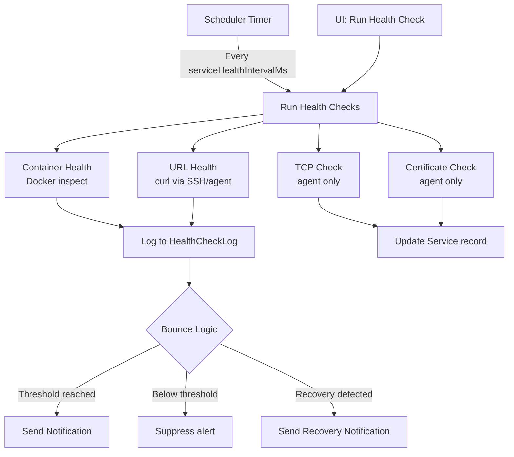
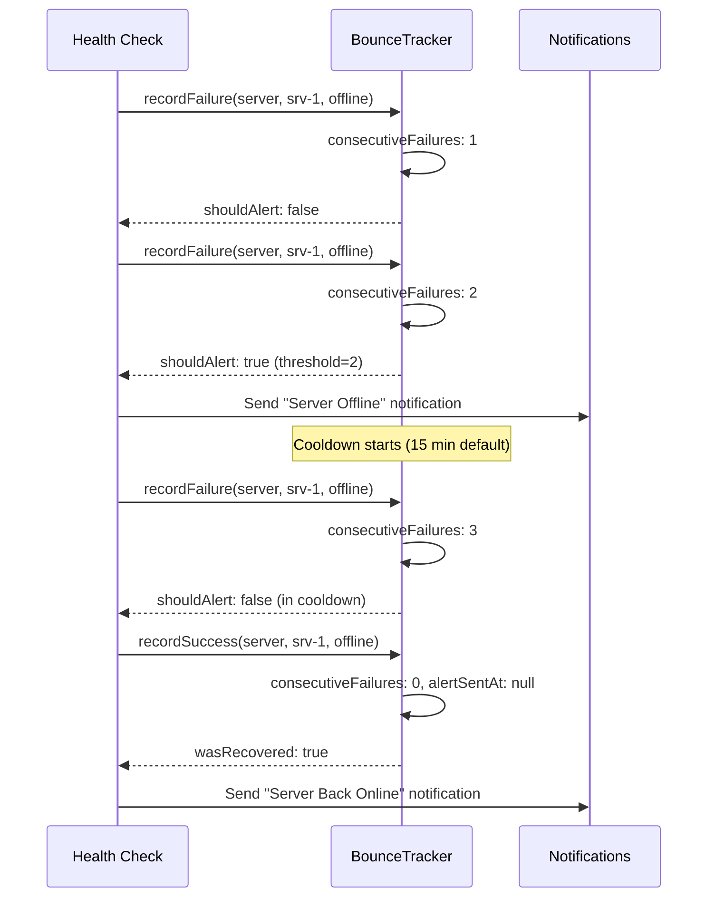
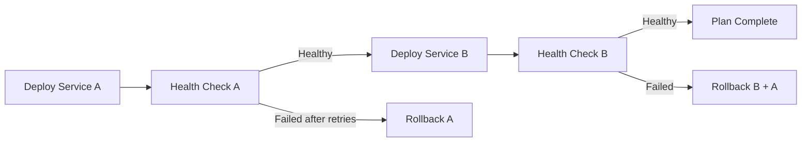

# Health Checks

BRIDGEPORT performs four types of health checks -- container health, URL, TCP port, and TLS certificate -- to continuously verify that your services are running correctly, and integrates with bounce logic and deployment orchestration to prevent alert storms and gate rollouts.

## Quick Start

1. Go to **Services** and select a service.
2. Set a **Health Check URL** (e.g., `http://localhost:8080/health`).
3. Click **Health Check** to run an immediate check.
4. View results at **Monitoring > Health Checks**.

For TCP and certificate checks:

1. In the service detail page, configure **TCP Checks** (host:port pairs) and/or **Certificate Checks**.
2. These require the server to be in **agent mode** -- the agent performs the checks and reports results.

## How It Works



## Health Check Types

### Container Health

BRIDGEPORT inspects the Docker container's native health status using the Docker API.

| Status | Meaning |
|---|---|
| `healthy` | Docker `HEALTHCHECK` passes |
| `unhealthy` | Docker `HEALTHCHECK` fails |
| `none` | No `HEALTHCHECK` defined in the Dockerfile |
| `starting` | Container is still initializing |

This check runs automatically during both SSH and agent metrics collection. No configuration is needed -- it works for every discovered container.

### URL Health Check

BRIDGEPORT (or the agent) performs an HTTP request to a user-configured URL and checks the response.

**How to configure:**

1. Go to the service detail page.
2. Set the **Health Check URL** field.
3. The URL is typically an internal endpoint (e.g., `http://localhost:8080/health` from within the server's network).

**What gets logged:**

| Field | Description |
|---|---|
| `status` | `success` if HTTP 2xx, `failure` otherwise |
| `httpStatus` | The HTTP status code (200, 500, etc.) |
| `durationMs` | How long the request took |
| `errorMessage` | Error details on failure (timeout, connection refused, etc.) |

> [!TIP]
> In SSH mode, BRIDGEPORT runs `curl` on the server via SSH. In agent mode, the agent performs the HTTP request directly. Agent mode is faster and does not require a separate SSH connection.

### TCP Port Check (Agent Only)

The agent tests TCP connectivity to specified host:port pairs and reports success/failure with latency.

**How to configure:**

1. Go to the service detail page.
2. In the **TCP Checks** section, add entries:
   ```json
   [
     { "host": "db.internal", "port": 5432, "name": "PostgreSQL" },
     { "host": "redis.internal", "port": 6379, "name": "Redis" }
   ]
   ```

**What gets reported:**

| Field | Description |
|---|---|
| `success` | Whether the TCP connection succeeded |
| `durationMs` | Connection time in milliseconds |
| `error` | Error message on failure |

### TLS Certificate Check (Agent Only)

The agent connects via TLS, retrieves the certificate, and reports expiry information.

**How to configure:**

1. Go to the service detail page.
2. In the **Certificate Checks** section, add entries:
   ```json
   [
     { "host": "api.example.com", "port": 443, "name": "API SSL" }
   ]
   ```

**What gets reported:**

| Field | Description |
|---|---|
| `expiresAt` | Certificate expiry timestamp |
| `daysUntilExpiry` | Days remaining |
| `issuer` | Certificate issuer |
| `subject` | Certificate subject |

> [!WARNING]
> TCP and certificate checks are only available with the **agent** mode. They are configured per-service but executed by the agent and included in its metrics push.

## Manual Health Checks

### Single Service Check

On the service detail page, click the **Health Check** button. This runs an immediate container + URL check and displays the result.

### Environment-Wide Check

Navigate to **Monitoring > Health Checks** and click **Run Health Checks**. Choose:

- **All** -- Check all servers and services in the environment.
- **Servers only** -- SSH connectivity check for all servers.
- **Services only** -- URL health check for all services with a health check URL configured.

Results are displayed immediately and also logged to `HealthCheckLog`.

### SSH Connectivity Test

Go to **Monitoring > Agents & SSH** and click **Test SSH** for a server, or **Test All** to check every server in the environment.

## Automated Scheduling

The scheduler runs health checks automatically based on configurable intervals.

### Server Health Checks

- **What**: SSH connectivity test (or agent push for agent-mode servers).
- **Interval**: `serverHealthIntervalMs` (default: 60 seconds).
- **Skips**: Agent-mode servers are skipped because the agent reports health directly.

### Service Health Checks

- **What**: Container health + URL health check.
- **Interval**: `serviceHealthIntervalMs` (default: 60 seconds).
- **Skips**: Services on agent-mode servers are skipped because the agent performs URL checks.

### Container Discovery

- **What**: Discovers running Docker containers and updates service statuses.
- **Interval**: `discoveryIntervalMs` (default: 5 minutes).
- **Runs on**: Healthy servers only.

## Per-Service Health Check Configuration

Each service has three timing parameters that control health verification during **deployment orchestration**:

| Setting | Default | Description |
|---|---|---|
| `healthWaitMs` | `5000` | Initial wait before the first health check (milliseconds) |
| `healthRetries` | `3` | Maximum number of health check attempts |
| `healthIntervalMs` | `10000` | Wait between retries (milliseconds) |

These are used by the [Deployment Plans](deployment-plans.md) system. When a deployment plan includes a `health_check` step, it calls `verifyServiceHealth()` which:

1. Waits `healthWaitMs` for the service to stabilize after deploy.
2. Checks container health and URL health.
3. If unhealthy, retries up to `healthRetries` times, waiting `healthIntervalMs` between each.
4. If all retries fail, the deployment plan triggers **auto-rollback** of all previously deployed services.

**To configure:**

1. Go to the service detail page.
2. Open the **Health Check Config** section.
3. Adjust wait, retries, and interval as needed.

> [!TIP]
> For services that take a long time to start (e.g., Java applications), increase `healthWaitMs` to 30000 or more. For fast-starting services (Node.js, Go), the defaults are usually fine.

## Health Check Logs

All health check results are stored in the `HealthCheckLog` table and viewable at **Monitoring > Health Checks** (`/monitoring/health`).

### Filtering

Filter logs by:

| Filter | Options |
|---|---|
| Resource type | `server`, `service`, `container` |
| Check type | `ssh`, `url`, `container_health`, `discovery` |
| Status | `success`, `failure`, `timeout` |
| Resource ID | Specific server or service |
| Time range | 1 hour to 7 days |

### Summary Counts

The health logs page shows summary counts broken down by resource type:

```
Server:    42 success | 2 failure | 0 timeout
Service:   156 success | 3 failure | 1 timeout
Container: 312 success | 5 failure | 0 timeout
```

### Retention

Health check logs are automatically cleaned up based on:

| Setting | Default | Where |
|---|---|---|
| `healthLogRetentionDays` | `30` | Per-environment in **Settings > Monitoring** |

The scheduler runs daily cleanup.

## Bounce Logic

Bounce logic prevents alert storms when a resource repeatedly fails. Instead of sending a notification on every failure, BRIDGEPORT tracks consecutive failures and only sends an alert when a threshold is reached.

### How It Works



### Configuration

Bounce thresholds and cooldowns are configured per **notification type** in **Admin > Notifications**:

| Setting | Description | Default |
|---|---|---|
| `bounceEnabled` | Whether bounce logic applies | Varies by type |
| `bounceThreshold` | Failures before first alert | `3` (or `2` for server offline) |
| `bounceCooldown` | Seconds before re-alerting | `900` (15 minutes) |

Notification types with bounce enabled:

| Type | Threshold | Cooldown |
|---|---|---|
| `system.health_check_failed` | 3 | 15 min |
| `system.server_offline` | 2 | 15 min |
| `system.container_crash` | 3 | 15 min |
| `system.database_unreachable` | 3 | 15 min |

### BounceTracker Records

The `BounceTracker` table tracks state per resource:

| Field | Description |
|---|---|
| `resourceType` | `server`, `service`, or `database` |
| `resourceId` | ID of the resource |
| `eventType` | `health_check`, `offline`, `crash`, `backup` |
| `consecutiveFailures` | Current failure count |
| `lastFailedAt` | Timestamp of last failure |
| `lastSuccessAt` | Timestamp of last success |
| `alertSentAt` | When the last alert was sent (for cooldown calculation) |

When a resource **recovers** (success after alert was sent), BRIDGEPORT sends a recovery notification and resets the tracker.

## Deployment Orchestration Integration

Health checks are a first-class part of the deployment orchestration system. When you create a [Deployment Plan](deployment-plans.md):

1. **Dependencies define order**: `health_before` dependencies require the upstream service to be healthy before deploying the downstream service.
2. **Health verification after deploy**: Each deploy step is followed by a `health_check` step that calls `verifyServiceHealth()`.
3. **Auto-rollback on failure**: If a health check fails after exhausting retries, the plan triggers rollback of all previously deployed services.



## Troubleshooting

### Health check always fails for a service

1. **Check the URL**: Ensure the health check URL is accessible from the server (not from your local machine). Use **Test SSH** > run `curl <url>` on the server to verify.
2. **Check the container**: If the container is not running, the health check will always fail. Check container status first.
3. **Check timing**: If the service takes a long time to start, health checks may fail during startup. Increase `healthWaitMs`.

### Too many notifications

- Enable **bounce logic** for the notification type in **Admin > Notifications**.
- Increase the `bounceThreshold` to require more consecutive failures before alerting.
- Increase the `bounceCooldown` to wait longer before re-alerting.
- Check if the underlying issue can be fixed (e.g., flaky health endpoint).

### Health checks pass but service shows "unhealthy"

This can happen if:
- The **Docker HEALTHCHECK** in the Dockerfile is failing even though the URL check passes.
- BRIDGEPORT uses both container health and URL health to determine overall status. Both must pass for `healthy`.
- Check `docker inspect <container>` on the server to see the Docker health status.

### TCP/cert checks not working

- Verify the server is in **agent mode**.
- Check that the agent is `active` (not `stale` or `offline`).
- Verify the TCP/cert check configuration on the service detail page.
- Check that the target host:port is reachable from the server where the agent runs.

## Related

- [Monitoring Quick Start](monitoring.md) -- Overview of all monitoring modes
- [Server Monitoring](monitoring-servers.md) -- Server health and metrics
- [Service Monitoring](monitoring-services.md) -- Container metrics and health status
- [Notifications](notifications.md) -- Alert channels and preferences
- [Deployment Plans](deployment-plans.md) -- How health checks gate deployments
- [Services Guide](services.md) -- Service configuration and management
