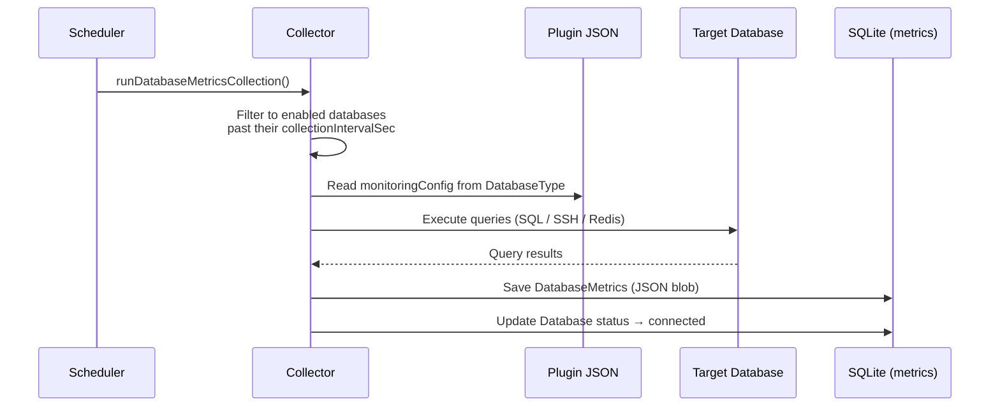

# Database Monitoring

BRIDGEPORT uses plugin-driven monitoring queries to collect database-specific metrics from PostgreSQL, MySQL, SQLite, and Redis, connecting via direct SQL, SSH commands, or the Redis protocol depending on the database type.

## Quick Start

1. Go to **Databases** and select (or create) a database.
2. Toggle **Enable Monitoring** on.
3. Click **Test Connection** to verify BRIDGEPORT can reach the database.
4. Metrics appear after the first collection interval (default: 60 seconds).
5. View charts at **Monitoring > Databases**.

## How It Works



### Connection Modes

BRIDGEPORT supports three connection modes, determined by the database type's plugin definition:

| Mode | Used By | How It Works |
|---|---|---|
| `sql` | PostgreSQL, MySQL | Direct TCP connection using `pg` or `mysql2` driver |
| `ssh` | SQLite | SSH into the server and run shell commands |
| `redis` | Redis | Direct TCP connection using `ioredis` |

> [!NOTE]
> MongoDB does not currently have monitoring queries defined in its plugin. You can add custom monitoring by editing the database type in **Admin > Database Types**.

## Supported Database Types

### PostgreSQL

Connection mode: **sql** (driver: `pg`)

| Query | What It Measures | Result Type |
|---|---|---|
| `dbSize` | Total database size | scalar (bytes) |
| `tableCount` | Number of tables | scalar |
| `totalRows` | Estimated total row count | scalar |
| `totalIndexSize` | Combined index size | scalar (bytes) |
| `deadTuples` | Dead tuples awaiting vacuum | scalar |
| `deadTupleRatio` | Dead tuple percentage | scalar (%) |
| `oldestUnvacuumed` | Seconds since oldest autovacuum | scalar (seconds) |
| `topTableSizes` | Top 10 tables by size | rows |

### MySQL

Connection mode: **sql** (driver: `mysql2`)

| Query | What It Measures | Result Type |
|---|---|---|
| `dbSize` | Total database size | scalar (bytes) |
| `tableCount` | Number of tables | scalar |
| `bufferPoolHitRatio` | InnoDB buffer pool hit ratio | scalar (%) |
| `slowQueries` | Total slow query count | scalar |
| `topTableSizes` | Top 10 tables by size | rows |

### SQLite

Connection mode: **ssh**

| Query | What It Measures | Result Type |
|---|---|---|
| `fileSize` | Database file size on disk | scalar (bytes) |
| `tableCount` | Number of tables | scalar |
| `pageCount` | Total SQLite pages | scalar |
| `freelistCount` | Free (unused) pages | scalar |
| `topTableSizes` | Top tables by row count | rows |

> [!NOTE]
> SQLite monitoring requires that the database's server has SSH access configured. The collector SSHs in and runs `sqlite3` and `stat` commands against the file path.

### Redis

Connection mode: **redis**

| Query | What It Measures | Result Type |
|---|---|---|
| `usedMemory` | Current memory usage | scalar (bytes) |
| `peakMemory` | Peak memory usage | scalar (bytes) |
| `memFragRatio` | Memory fragmentation ratio | scalar |
| `totalKeys` | Total keys across all databases | scalar |

Redis queries use a DSL rather than raw SQL:

| DSL Prefix | Example | Description |
|---|---|---|
| `INFO:` | `INFO:used_memory` | Read a field from Redis `INFO` output |
| `CMD:` | `CMD:DBSIZE` | Execute a Redis command |
| `KEYSPACE:` | `KEYSPACE:keys` | Sum a field across all keyspace entries |
| `COMPUTED:` | `COMPUTED:hit_ratio` | Calculate a derived metric |

## Step-by-Step: Setting Up Database Monitoring

### 1. Register the Database

If you have not already registered the database in BRIDGEPORT:

1. Go to **Databases** and click **Add Database**.
2. Select the database type (PostgreSQL, MySQL, SQLite, or Redis).
3. Fill in the connection details (host, port, credentials, etc.).
4. For SQLite, specify the file path and select the server where the file lives.

### 2. Enable Monitoring

1. Open the database detail page.
2. Toggle **Enable Monitoring** on.
3. Optionally adjust the **Collection Interval** (default: 60 seconds).

### 3. Test the Connection

Click **Test Connection**. You should see:

```
Connection successful
Latency: 12ms
Server version: PostgreSQL 16.2
```

If the test fails, check:
- Credentials are correct
- Host/port is reachable from BRIDGEPORT
- For SQLite: SSH key is configured for the environment and `sqlite3` is installed on the server

### 4. View Metrics

Navigate to **Monitoring > Databases** (`/monitoring/databases`).

- The **grid view** shows all monitored databases with status indicators and key metrics.
- Click a database to see its **detail page** (`/monitoring/databases/:id`) with full charts.

## Query Result Types

Each monitoring query has a `resultType` that determines how the output is parsed:

| Type | Description | Example |
|---|---|---|
| `scalar` | Single numeric or string value | `SELECT count(*) AS value FROM ...` |
| `row` | Single row with named fields | `SELECT field1, field2 FROM ... LIMIT 1` |
| `rows` | Multiple rows (table data) | `SELECT name, size FROM ... ORDER BY size DESC LIMIT 10` |

### Result Mapping

For `row` and `rows` types, you can specify a `resultMapping` to rename columns:

```json
{
  "name": "topTableSizes",
  "query": "SELECT relname AS name, pg_total_relation_size(relid) AS size ...",
  "resultType": "rows",
  "resultMapping": { "name": "name", "size": "size", "rows": "rows" }
}
```

### Chart Groups

Queries can include a `chartGroup` field to group related metrics on the same chart in the UI. Queries with the same `chartGroup` value are rendered together.

## Configuration Options

### Per-Database Settings

| Setting | Default | Description |
|---|---|---|
| `monitoringEnabled` | `false` | Toggle monitoring on or off |
| `collectionIntervalSec` | `60` | Seconds between metric collections |

### Global Scheduler

The global scheduler polls all enabled databases periodically (default: every 60 seconds). Each database's own `collectionIntervalSec` is respected -- if not enough time has passed since the last collection, that database is skipped.

### Retention

| Setting | Default | Description |
|---|---|---|
| `metricsRetentionDays` | `7` | Per-environment (Settings > Monitoring) |

Old `DatabaseMetrics` rows are cleaned up hourly by the scheduler.

### Database Status

After each collection, the database's `monitoringStatus` is updated:

| Status | Meaning |
|---|---|
| `connected` | Last collection succeeded |
| `error` | Last collection failed (error message stored in `lastMonitoringError`) |
| `pending` | Monitoring enabled but no collection has run yet |

## Custom Monitoring Queries

You can add custom queries by editing the database type in the admin UI:

1. Go to **Admin > Database Types**.
2. Select the database type (e.g., PostgreSQL).
3. Edit the **Monitoring Configuration** JSON.
4. Add new query objects to the `queries` array.

Example -- adding a connections count query for PostgreSQL:

```json
{
  "name": "activeConnections",
  "displayName": "Active Connections",
  "query": "SELECT count(*) AS value FROM pg_stat_activity WHERE state = 'active'",
  "resultType": "scalar"
}
```

> [!WARNING]
> Changes made in the admin UI set `isCustomized: true` on the database type, which prevents BRIDGEPORT from overwriting your changes on plugin sync. If you want to revert to the default plugin queries, use the **Reset** button in admin.

## Troubleshooting

### "Connection failed" on test

| Database | Common Causes |
|---|---|
| PostgreSQL | Wrong credentials, `pg_hba.conf` does not allow connections from BRIDGEPORT's IP, SSL mismatch |
| MySQL | Wrong credentials, user not granted access from BRIDGEPORT's IP |
| SQLite | SSH key not configured, `sqlite3` not installed on server, wrong file path |
| Redis | Wrong password, `requirepass` set but no password provided, TLS required but `useSsl` not enabled |

### Monitoring status stuck on "error"

1. Check the error message in the database detail page (`lastMonitoringError`).
2. Click **Test Connection** to see the current error.
3. Fix the underlying issue (credentials, network, permissions).
4. The next successful collection automatically resets the status to `connected`.

### Metrics not collecting

- Verify `monitoringEnabled` is `true` for the database.
- Verify the database type has a `monitoringConfig` defined. Check **Admin > Database Types** -- if the monitoring config is empty, no queries will run.
- Verify the scheduler is running (look for `[Scheduler] Collecting metrics from N database(s)` in the BRIDGEPORT logs).

### Queries returning errors

Individual query failures do not abort the entire collection. Check the stored `DatabaseMetrics` JSON for per-query error entries:

```json
{
  "dbSize": 1048576,
  "tableCount": 12,
  "slowQueries": { "error": "Access denied for user..." }
}
```

Fix the permissions for the failing query and the next collection will succeed.

## Related

- [Monitoring Quick Start](monitoring.md) -- Decision tree for all monitoring modes
- [Server Monitoring](monitoring-servers.md) -- Server-level metrics
- [Service Monitoring](monitoring-services.md) -- Container-level metrics
- [Databases Guide](databases.md) -- Database registration, backups, and management
- [Health Checks](health-checks.md) -- Health check system
