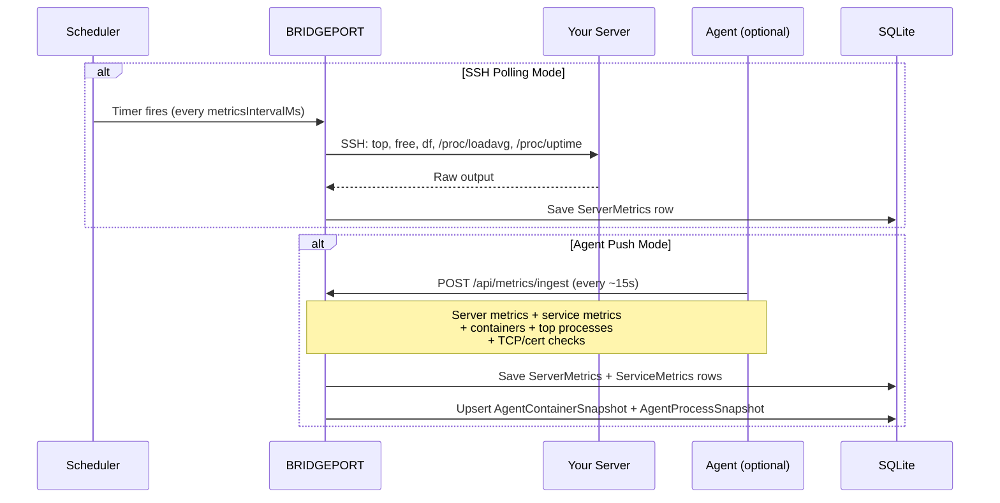
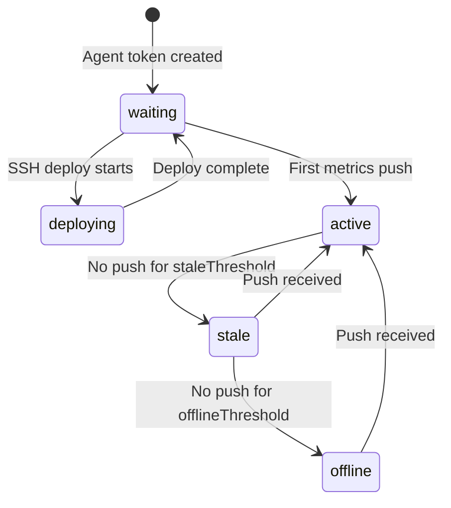

# Server Monitoring

BRIDGEPORT collects server-level metrics (CPU, memory, disk, load, swap, TCP connections, and file descriptors) via SSH polling or a lightweight push agent, stores them as time-series data, and visualizes them in interactive charts.

## Quick Start

1. Navigate to **Servers** and select a server.
2. In the **Monitoring** card, choose a metrics mode:
   - **SSH** -- BRIDGEPORT polls the server over SSH on a schedule.
   - **Agent** -- A lightweight Go binary runs on the server and pushes metrics.
3. Go to **Monitoring > Servers** to see your first data points.

> [!TIP]
> For most production setups, the **agent** mode is recommended. It provides real-time push-based metrics, top process lists, container snapshots, and TCP/certificate checks -- none of which are available with SSH polling alone.

## How It Works

## Collected Metrics

### SSH Mode

The SSH collector runs a series of shell commands in a single SSH session:

| Metric | Command | Fields |
|---|---|---|
| CPU | `top -bn1` | `cpuPercent` |
| Memory | `free -m` | `memoryUsedMb`, `memoryTotalMb` |
| Swap | `free -m` | `swapUsedMb`, `swapTotalMb` |
| Disk | `df -BG /` | `diskUsedGb`, `diskTotalGb` |
| Load | `/proc/loadavg` | `loadAvg1`, `loadAvg5`, `loadAvg15` |
| Uptime | `/proc/uptime` | `uptime` (seconds) |

### Agent Mode (additional data)

The agent collects everything SSH mode collects, plus:

| Additional Data | Description |
|---|---|
| `openFds` / `maxFds` | Open and max file descriptors |
| `tcpEstablished`, `tcpListen`, `tcpTimeWait`, `tcpCloseWait`, `tcpTotal` | TCP socket breakdown |
| Top processes (by CPU and memory) | PID, name, state, CPU%, memory MB, threads |
| Container snapshots | Full container list with image, state, ports, labels, mounts |
| TCP check results | Agent-performed TCP port connectivity checks |
| Certificate check results | TLS certificate expiry, issuer, subject |

> [!NOTE]
> TCP and certificate checks are configured per-service in the service detail page. The agent picks up the configuration from `GET /api/agent/config` and includes results in its next metrics push.

## Viewing Charts

Navigate to **Monitoring > Servers** (`/monitoring/servers`).

### Available Charts

- **CPU Usage** -- Percentage over time
- **Memory Usage** -- Used vs total (MB and percentage)
- **Swap Usage** -- Used vs total (MB and percentage)
- **Disk Usage** -- Used vs total (GB and percentage)
- **Load Average** -- 1, 5, and 15 minute averages
- **TCP Connections** -- Established, listen, time-wait, close-wait, total
- **File Descriptors** -- Open vs max (agent mode only)

### Time Range Selection

Use the time range selector to zoom in or out:

| Range | Data Points |
|---|---|
| 1h | ~12 (SSH) or ~240 (agent) |
| 6h | ~72 (SSH) or ~1440 (agent) |
| 24h | ~288 (SSH) or ~5760 (agent) |
| 7d (max) | ~2016 (SSH) or ~40320 (agent) |

### Auto-Refresh

Charts auto-refresh every 30 seconds. Toggle auto-refresh on or off with the checkbox in the top-right corner.

## Agent Details

### How the Agent Gets Deployed

When you set a server's metrics mode to `agent`:

1. BRIDGEPORT generates a unique agent token for the server.
2. BRIDGEPORT SSHs into the server and deploys the agent binary.
3. The agent starts pushing to `POST /api/metrics/ingest` using the token.
4. The server's `agentStatus` transitions from `waiting` to `active`.

### Agent Status Lifecycle

- **active** -- Agent is pushing metrics regularly.
- **stale** -- No push received within the stale threshold (configurable in System Settings).
- **offline** -- No push received within the offline threshold. A `system.server_offline` notification is sent.

### Regenerating Agent Tokens

If you need to rotate the agent token:

1. Go to **Monitoring > Agents & SSH**.
2. Click **Regenerate Token** on the server.
3. BRIDGEPORT generates a new token and redeploys the agent automatically.

### Agent Upgrade Indicators

The server detail page and the **Monitoring > Agents** page show an "Update available" badge when the deployed agent version differs from the bundled version in BRIDGEPORT.

## Collection Intervals

### Global Defaults (Environment Variables)

Set in your environment or `.env` file:

| Variable | Default | Description |
|---|---|---|
| `SCHEDULER_METRICS_INTERVAL` | `300` (5 min) | SSH metrics collection interval (seconds) |
| `SCHEDULER_SERVER_HEALTH_INTERVAL` | `60` (1 min) | Server health check interval (seconds) |

### Per-Environment Settings

Override intervals per environment in **Settings > Monitoring**:

| Setting | Default | Description |
|---|---|---|
| `metricsIntervalMs` | `300000` (5 min) | How often SSH metrics are collected |
| `serverHealthIntervalMs` | `60000` (1 min) | How often server health is checked |

> [!NOTE]
> Agent-mode servers push at their own interval (typically ~15 seconds). The per-environment `metricsIntervalMs` only affects SSH polling.

## Metric Toggles

Per-environment metric toggles let you disable collection of specific metric types. All are enabled by default. Configure in **Settings > Monitoring**:

| Toggle | Controls |
|---|---|
| `collectCpu` | CPU percentage |
| `collectMemory` | Memory usage |
| `collectSwap` | Swap usage |
| `collectDisk` | Disk usage |
| `collectLoad` | Load averages |
| `collectFds` | File descriptors |
| `collectTcp` | TCP socket counts |
| `collectProcesses` | Top processes (agent only) |
| `collectTcpChecks` | TCP port checks (agent only) |
| `collectCertChecks` | TLS certificate checks (agent only) |

## Retention

Metrics are automatically cleaned up based on retention settings:

| Setting | Default | Scope |
|---|---|---|
| `metricsRetentionDays` | `7` | Per-environment (Settings > Monitoring) |
| `SCHEDULER_METRICS_INTERVAL` cleanup | Hourly | Global (scheduler runs cleanup every hour) |

Old `ServerMetrics` and `ServiceMetrics` rows older than the retention period are deleted automatically.

## Troubleshooting

### No metrics appearing (SSH mode)

1. **Verify SSH connectivity**: Go to **Monitoring > Agents & SSH** and click **Test SSH** for the server.
2. **Check metrics mode**: Ensure the server is set to `ssh` mode, not `disabled`.
3. **Check scheduler**: Verify `SCHEDULER_ENABLED=true` in your environment.
4. **Check SSH user**: The SSH user must have permission to run `top`, `free`, `df`, and read `/proc/`.

### No metrics appearing (Agent mode)

1. **Check agent status**: Go to **Monitoring > Agents & SSH**. The agent should show `active`.
2. **If status is `waiting`**: The agent may not have connected yet. Check the server's Docker logs or system journal.
3. **If status is `offline`**: The agent stopped pushing. SSH into the server and check if the agent process is running.
4. **Check firewall**: The agent needs outbound HTTPS access to your BRIDGEPORT instance.
5. **Regenerate token**: If the token is compromised or lost, use **Regenerate Token** to redeploy.

### Stale or missing data points

- Check the **Metrics Mode** is not `disabled`.
- Verify the scheduler is running (check BRIDGEPORT container logs for `[Scheduler]` messages).
- For SSH mode, large collection intervals mean fewer data points. Decrease `SCHEDULER_METRICS_INTERVAL` for more granularity.

### Charts show flat lines

This typically means the metric value is genuinely stable. Check the Y-axis scale -- it may be zoomed in to a narrow range.

## Related

- [Monitoring Quick Start](monitoring.md) -- Decision tree for choosing your monitoring mode
- [Service Monitoring](monitoring-services.md) -- Container-level metrics
- [Database Monitoring](monitoring-databases.md) -- Plugin-driven database metrics
- [Health Checks](health-checks.md) -- Health check system and scheduling
- [Notifications](notifications.md) -- Get alerted on server offline/recovery events
- [Servers Guide](servers.md) -- Server setup and configuration
