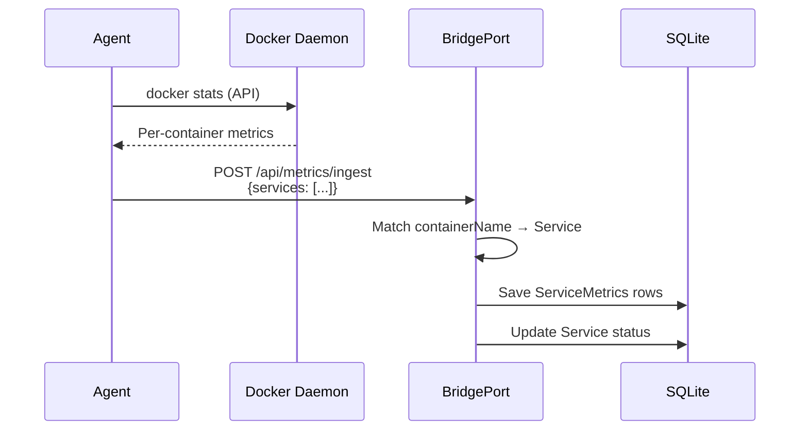

# Service Monitoring

BridgePort collects container-level metrics (CPU, memory, network I/O, and block I/O) for every discovered Docker service, visualizes them in time-series charts, and tracks restart counts to help you spot unstable containers.

## Quick Start

1. Ensure the server running your containers has metrics enabled (SSH or agent mode).
2. Verify the service has `discoveryStatus: found` (auto-discovered or manually created and linked to a running container).
3. Navigate to **Monitoring > Services** to see container metrics.

> [!NOTE]
> Container-level metrics require the **agent** mode for the richest data. In SSH mode, BridgePort collects server metrics and container health status, but per-container CPU/memory/network metrics come from the agent's Docker stats collection.

## How It Works

The agent runs `docker stats` via the Docker API, collects per-container metrics, and includes them in its periodic push to `/api/metrics/ingest`. BridgePort matches each entry by `containerName` to its corresponding `Service` record.

## Collected Metrics

| Metric | Field | Unit | Description |
|---|---|---|---|
| CPU | `cpuPercent` | % | Container CPU usage percentage |
| Memory Used | `memoryUsedMb` | MB | Current memory consumption |
| Memory Limit | `memoryLimitMb` | MB | Container memory limit (from Docker) |
| Network RX | `networkRxMb` | MB | Cumulative data received |
| Network TX | `networkTxMb` | MB | Cumulative data transmitted |
| Block Read | `blockReadMb` | MB | Cumulative disk reads |
| Block Write | `blockWriteMb` | MB | Cumulative disk writes |
| Restart Count | `restartCount` | count | Total container restarts |

> [!TIP]
> A steadily climbing `restartCount` is a strong signal of a crash-looping container. BridgePort sends a `system.container_crash` notification when a container enters the `exited` or `dead` state.

## Container Health Status

In addition to metrics, the agent reports each container's state and Docker health status on every push:

| State | Health | Overall Status |
|---|---|---|
| `running` | `healthy` | `healthy` |
| `running` | `unhealthy` | `unhealthy` |
| `running` | `none` (no healthcheck) | `running` |
| `exited` / `dead` | -- | `stopped` |
| other | -- | `unknown` |

BridgePort updates each service's `containerStatus`, `healthStatus`, and `status` fields based on this data.

## Viewing Charts

Navigate to **Monitoring > Services** (`/monitoring/services`).

### Available Charts

- **CPU Usage** -- Per-container CPU percentage over time
- **Memory Usage** -- Memory consumption vs limit
- **Network RX** -- Received bytes over time
- **Network TX** -- Transmitted bytes over time

Each chart shows data grouped by service, with the server name displayed for context.

### Time Range Selection

Use the time range selector to pick a window:

| Range | Description |
|---|---|
| 1h | Recent activity, good for debugging |
| 6h | Short-term trend |
| 24h | Daily pattern |
| 7d | Weekly trend (max retention) |

### Auto-Refresh

Charts auto-refresh every 30 seconds. The toggle is in the top-right corner of the monitoring page.

### Filtering

The services metrics history endpoint filters to services with `discoveryStatus: found` in the current environment, so you only see actively running containers.

## Step-by-Step: Enabling Service Monitoring

### Option 1: Agent Mode (recommended)

1. Go to **Servers** and select the server running your containers.
2. Set **Metrics Mode** to `agent`.
3. Wait for agent status to become `active` (usually under 30 seconds).
4. Go to **Monitoring > Services**. Container metrics appear on the next agent push.

### Option 2: SSH Mode (limited)

In SSH mode, BridgePort collects:
- Container health status (running/stopped, Docker health)
- Container state transitions (crash detection)
- URL health check results (if configured)

It does **not** collect per-container CPU/memory/network metrics in SSH mode. For those, use agent mode.

1. Go to **Servers** and select the server.
2. Set **Metrics Mode** to `ssh`.
3. Container health data appears in **Monitoring > Services** after the next collection cycle.

## Configuration Options

### Agent Push Interval

The agent pushes metrics approximately every 15 seconds. This is not currently configurable per-environment -- it is built into the agent binary.

### Metric Retention

Service metrics follow the same retention settings as server metrics:

| Setting | Default | Where |
|---|---|---|
| `metricsRetentionDays` | `7` days | Per-environment in **Settings > Monitoring** |

The scheduler cleans up old `ServiceMetrics` rows hourly.

### Health Check URL

Configure a URL health check per service to get richer health data:

1. Go to the service detail page.
2. Set the **Health Check URL** field (e.g., `http://localhost:8080/health`).
3. The agent (or SSH collector) curls this URL and reports the result.

## Troubleshooting

### No container metrics (agent mode)

1. **Check agent status**: Go to **Monitoring > Agents & SSH**. Status should be `active`.
2. **Verify container names match**: The agent matches metrics by `containerName`. If the service's `containerName` in BridgePort does not match the Docker container name, metrics will not be linked.
3. **Check discovery status**: The service must have `discoveryStatus: found`. Run container discovery from the server detail page if needed.

### Metrics show but charts are empty

- Verify the time range includes the period when metrics were collected.
- Check that the service belongs to the currently selected environment.

### Restart count is climbing

This means Docker is restarting the container. Check:

1. Container logs: Use the **Logs** action on the service to see why it is crashing.
2. Memory limits: If `memoryUsedMb` is near `memoryLimitMb`, the container may be OOM-killed.
3. Health check: If the container has a Docker `HEALTHCHECK` and it keeps failing, Docker may restart it.

### Container shows `unknown` status

This happens when BridgePort cannot determine the container state:

- The server may be unreachable (check server health first).
- The container may have been removed but the service record still exists. Run container discovery to update statuses.

## Related

- [Monitoring Quick Start](monitoring.md) -- Decision tree for all monitoring modes
- [Server Monitoring](monitoring-servers.md) -- Server-level metrics (CPU, memory, disk, etc.)
- [Database Monitoring](monitoring-databases.md) -- Database-specific metrics
- [Health Checks](health-checks.md) -- Health check types and configuration
- [Services Guide](services.md) -- Service setup, deployment, and management
