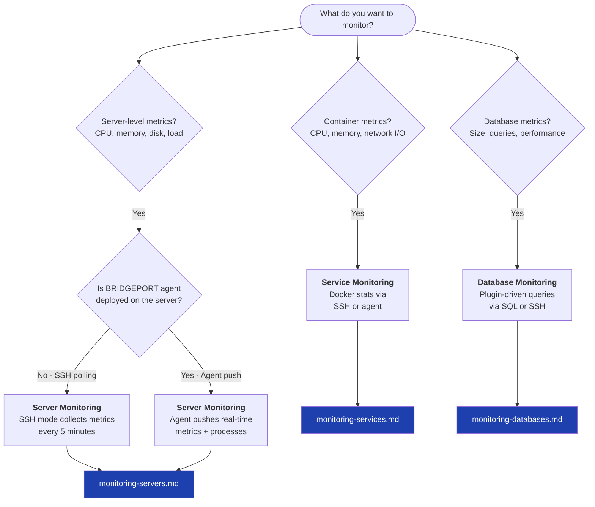

# Monitoring Quick Start

BRIDGEPORT monitors your servers, containers, and databases through three complementary systems -- pick the one that fits your infrastructure and follow the link to its deep-dive guide.

## Which Monitoring Do You Need?

Use this decision tree to find the right guide:

## Quick Setup by Mode

### SSH Polling (simplest)

No agent required. BRIDGEPORT connects over SSH to collect server metrics.

1. Go to **Servers** and select a server.
2. In the **Monitoring** card, set **Metrics Mode** to `ssh`.
3. Metrics appear within one collection cycle (default: 5 minutes).

View charts at **Monitoring > Servers**. See [Server Monitoring](monitoring-servers.md) for the full guide.

### Agent Push (recommended for production)

The agent runs on each server and pushes metrics in real time, including container stats and top processes.

1. Go to **Servers** and select a server.
2. Set **Metrics Mode** to `agent`.
3. BRIDGEPORT auto-deploys the agent via SSH.
4. Within 30 seconds you should see the agent status change to `active`.

View charts at **Monitoring > Servers** and **Monitoring > Services**. See [Server Monitoring](monitoring-servers.md) and [Service Monitoring](monitoring-services.md).

### Database Monitoring

Plugin-driven queries collect database-specific metrics (size, row counts, slow queries, etc.).

1. Go to **Databases** and select a database.
2. Toggle **Enable Monitoring** on.
3. Click **Test Connection** to verify connectivity.
4. Metrics appear after the first collection interval (default: 60 seconds).

View charts at **Monitoring > Databases**. See [Database Monitoring](monitoring-databases.md).

## Monitoring Overview Hub

The **Monitoring > Overview** page (`/monitoring`) shows a summary of all three systems at a glance:

- Total and healthy servers, services, and databases
- Active alerts count
- Quick links to each sub-page

The UI auto-refreshes every 30 seconds.

## Quick Comparison

| Capability | SSH Polling | Agent | Database Monitoring |
|---|---|---|---|
| Server metrics (CPU, memory, disk) | Yes | Yes | -- |
| Container metrics (CPU, memory, network) | -- | Yes | -- |
| Top processes | -- | Yes | -- |
| Container discovery | Yes | Yes | -- |
| TCP/cert checks | -- | Yes | -- |
| Database-specific metrics | -- | -- | Yes |
| Collection method | Pull (SSH) | Push (HTTP) | Pull (SQL/SSH/Redis) |
| Default interval | 5 min | ~15 sec | 60 sec |

## API: History Endpoints

The three columnar history endpoints share a common set of query parameters
introduced for the per-card refresh model:

| Endpoint | What it returns |
|---|---|
| `GET /api/environments/:envId/metrics/history` | Per-server CPU/memory/disk/load/etc. |
| `GET /api/environments/:envId/services/metrics/history` | Per-deployment CPU/memory/network |
| `GET /api/environments/:envId/databases/metrics/history` | Per-database, grouped by type, plugin-driven series |

All three accept:

- `hours` (1-168, default 24) — rolling window for the initial fetch.
- `maxPoints` (10-2000, default 120) — caps the number of points per series in
  the full-window response via LTTB (Largest-Triangle-Three-Buckets) downsampling.
  Picks shared timestamp slots so every series row stays aligned.
- `since` (ISO timestamp) — when set, returns only points strictly newer than
  this. The response has `mode: 'delta'` and is *not* downsampled (deltas are
  already small). Use the previous response's `until` here on each refresh tick.

Every response now includes:

- `mode: 'full' | 'delta'` — tells the client whether to replace or merge.
- `until: <ISO>` — server-now captured before the DB read. Pass this back as
  `since` on the next tick to avoid skipping rows committed mid-query.

The `/api/environments/:envId/metrics/summary` endpoint accepts an additional
`includeServices=false` query parameter that skips the per-server services[]
block (and the dependent ServiceDeployment + ServiceMetrics queries). Pages
that only render server-level data (e.g. the Servers monitoring page) opt out
to drop two queries plus an in-memory join.

## Next Steps

- [Server Monitoring](monitoring-servers.md) -- CPU, memory, disk, load, swap, TCP connections, file descriptors
- [Service Monitoring](monitoring-services.md) -- Container CPU, memory, network I/O, block I/O
- [Database Monitoring](monitoring-databases.md) -- Plugin-driven queries for PostgreSQL, MySQL, SQLite, Redis
- [Health Checks](health-checks.md) -- Container health, URL checks, TCP port checks, certificate expiry
- [Notifications](notifications.md) -- Get alerted when things go wrong
- [Configuration Reference](../configuration.md) -- Scheduler intervals and retention settings
