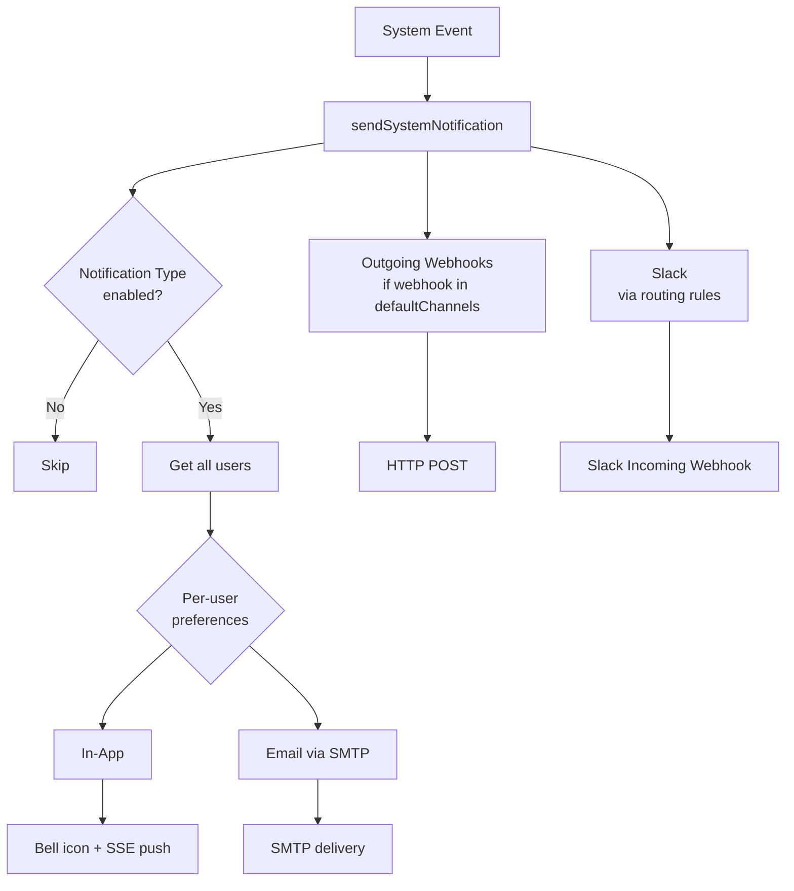

# Notifications

BRIDGEPORT delivers notifications through four channels -- in-app, email (SMTP), Slack, and outgoing webhooks -- with per-user preferences, environment filtering, and bounce logic to keep you informed without alert fatigue.

## Quick Start

### In-App (on by default)

In-app notifications work out of the box. Click the bell icon in the top navigation to see your notifications.

### Email (SMTP)

1. Go to **Admin > Notifications** and open the **Email** tab.
2. Configure your SMTP server:
   ```
   Host:         smtp.example.com
   Port:         587
   Secure:       true (TLS)
   Username:     noreply@example.com
   Password:     ••••••••
   From Address: noreply@example.com
   From Name:    BRIDGEPORT
   ```
3. Click **Test Connection** to verify.
4. Click **Send Test Email** to your address.
5. Enable the configuration and save.

### Slack

1. Create an [Incoming Webhook](https://api.slack.com/messaging/webhooks) in your Slack workspace.
2. Go to **Admin > Notifications** and open the **Slack** tab.
3. Click **Add Channel** and paste the webhook URL.
4. Click **Test** to send a test message to the channel.
5. Optionally set the channel as **default** (receives all unrouted notifications).
6. Configure **type routing** to send specific notification types to specific channels.

### Outgoing Webhooks

1. Go to **Admin > Notifications** and open the **Webhooks** tab.
2. Click **Add Webhook** and enter the endpoint URL.
3. Optionally filter by environment or notification type.
4. BRIDGEPORT sends a POST with JSON payload to your endpoint when matching notifications fire.

## How It Works



When a system event occurs (server offline, deployment failed, backup succeeded, etc.):

1. BRIDGEPORT looks up the `NotificationType` by code.
2. If the type is disabled, nothing happens.
3. For each user, BRIDGEPORT checks their `NotificationPreference`:
   - **In-app**: Creates a `Notification` record and emits an SSE event for real-time bell updates.
   - **Email**: If the user (or type default) has email enabled, sends via SMTP.
4. If the type's `defaultChannels` includes `webhook`, BRIDGEPORT dispatches to all configured outgoing webhooks.
5. Slack routing rules determine which Slack channels receive the notification.

## Notification Types

BRIDGEPORT ships with these predefined notification types:

### User Notifications

| Code | Name | Default Channels | Severity |
|---|---|---|---|
| `user.account_created` | Account Created | in-app, email | info |
| `user.password_changed` | Password Changed | in-app, email | info |
| `user.role_changed` | Role Changed | in-app, email | info |
| `user.api_token_created` | API Token Created | in-app | info |
| `user.failed_login` | Failed Login Attempt | in-app, email | warning |

### System Notifications

| Code | Name | Default Channels | Severity | Bounce |
|---|---|---|---|---|
| `system.backup_failed` | Backup Failed | in-app, email, webhook | critical | -- |
| `system.backup_success` | Backup Succeeded | in-app | info | -- |
| `system.health_check_failed` | Health Check Failed | in-app, email, webhook | warning | 3 / 15 min |
| `system.health_check_recovered` | Health Check Recovered | in-app, email, webhook | info | -- |
| `system.deployment_success` | Deployment Succeeded | in-app | info | -- |
| `system.deployment_failed` | Deployment Failed | in-app, email, webhook | critical | -- |
| `system.server_offline` | Server Offline | in-app, email, webhook | critical | 2 / 15 min |
| `system.server_online` | Server Back Online | in-app, email, webhook | info | -- |
| `system.container_crash` | Container Crashed | in-app, email, webhook | warning | 3 / 15 min |
| `system.container_recovered` | Container Recovered | in-app | info | -- |
| `system.database_unreachable` | Database Unreachable | in-app, email, webhook | critical | 3 / 15 min |

The **Bounce** column shows the threshold / cooldown. See [Bounce Logic](#bounce-logic) below.

## Template Placeholders

Each notification type has a template with `{{placeholder}}` variables that are filled in at send time:

| Placeholder | Used In | Example Value |
|---|---|---|
| `{{serverName}}` | Server offline/online | `web-server-01` |
| `{{serviceName}}` | Deployment success/failed | `api-backend` |
| `{{containerName}}` | Container crash/recovered | `myapp_web_1` |
| `{{databaseName}}` | Backup, database unreachable | `production-db` |
| `{{imageTag}}` | Deployment events | `v2.3.1` |
| `{{error}}` | Failure events | `Connection refused` |
| `{{resourceType}}` | Health check events | `Service` |
| `{{resourceName}}` | Health check events | `api-backend` |
| `{{oldRole}}` / `{{newRole}}` | Role changed | `viewer` / `admin` |
| `{{changedBy}}` | Password changed | ` by admin@example.com` |
| `{{tokenName}}` | API token created | `ci-deploy-key` |
| `{{count}}` | Failed login | `5` |

## Per-User Preferences

Every user can customize which notification types they receive and on which channels.

### Viewing Preferences

Go to the **Notifications** page (`/notifications`) and click the **Preferences** tab.

### Configuring Preferences

For each notification type, toggle:

| Channel | Description |
|---|---|
| **In-App** | Show in the notification bell |
| **Email** | Send to the user's email address |
| **Webhook** | Include in outgoing webhook dispatches |

If a user has not set a preference for a type, the type's `defaultChannels` are used.

### Environment Filtering

You can restrict notifications to specific environments:

1. In the preferences panel, click **Filter Environments** for a notification type.
2. Select the environments you want to receive notifications for.
3. Notifications from other environments will be silently skipped for that type.

This is useful when you have staging and production environments but only want critical alerts from production.

## Bounce Logic

Bounce logic prevents notification storms when a resource fails repeatedly.

### How It Works

1. Each failure increments a `consecutiveFailures` counter in the `BounceTracker`.
2. When the counter reaches the `bounceThreshold`, a notification is sent and `alertSentAt` is recorded.
3. Further failures during the `bounceCooldown` period are suppressed.
4. After the cooldown expires, the next failure sends another notification.
5. When the resource recovers (success after an alert was sent), a recovery notification is sent and the tracker resets.

### Bounce Settings (Admin)

Configure bounce behavior per notification type in **Admin > Notifications**:

| Setting | Description | Default |
|---|---|---|
| `bounceEnabled` | Whether bounce tracking applies | Varies |
| `bounceThreshold` | Consecutive failures before first alert | 3 |
| `bounceCooldown` | Seconds before re-alerting | 900 (15 min) |

> [!TIP]
> Set `bounceThreshold: 1` and `bounceCooldown: 0` if you want immediate alerts on every failure (not recommended for flaky checks). Set `bounceThreshold: 5` for noisy environments.

### Per-Environment Overrides

The `MonitoringSettings` table has per-environment `bounceThreshold` and `bounceCooldownMs` fields. These provide environment-level defaults that the notification type settings can override.

## Slack Configuration

### Channels

You can add multiple Slack channels, each with its own Incoming Webhook URL:

1. **Default channel**: Receives all notifications that do not have a specific routing rule.
2. **Additional channels**: Route specific notification types to dedicated channels.

### Type Routing

Type routing lets you send specific notification types to specific Slack channels:

1. Go to **Admin > Notifications > Slack > Type Routing**.
2. Map notification types to channels.
3. Optionally filter by environment.

Example setup:

| Notification Type | Slack Channel | Environment |
|---|---|---|
| `system.deployment_failed` | `#deploys-critical` | Production only |
| `system.server_offline` | `#infra-alerts` | All |
| `system.backup_failed` | `#backup-alerts` | All |

If no routing matches, the notification goes to the **default channel** (if one is set and enabled).

### Slack Message Format

BRIDGEPORT sends rich Slack messages using Block Kit:

- Color-coded sidebar (red for critical, amber for warning, green for info)
- Header with severity emoji
- Fields for environment, server, service, and image tag
- Action buttons linking back to BRIDGEPORT (requires `publicUrl` in System Settings)

## Outgoing Webhooks

Outgoing webhooks send notification data as JSON POST requests to your endpoints.

### Payload Format

```json
{
  "type": "system.deployment_failed",
  "severity": "critical",
  "title": "Deployment Failed",
  "message": "Deployment of \"api-backend\" failed: Image pull error",
  "data": {
    "serviceName": "api-backend",
    "serviceId": "svc_abc123",
    "serverName": "web-server-01",
    "imageTag": "v2.3.1",
    "error": "Image pull error"
  },
  "environment": "production",
  "timestamp": "2026-02-25T10:30:00.000Z"
}
```

> [!NOTE]
> `deployment_failed` payloads include `serviceId`, `serverName`, and `imageTag` for both direct service failures and failures that trigger a deployment plan rollback. This lets downstream handlers (Slack messages, incident tools) build deep links back to the exact service and tag without extra lookups.

### Slack Notifications

The built-in Slack integration renders a compact message per notification. Recent tuning:

- **No redundant message block.** The Slack Block Kit payload omits the free-text `message` block when the structured fields already convey the same information -- the title plus context fields are enough.
- **No footer timestamp.** Slack already renders the message time; the duplicate `{timestamp}` footer block was removed.
- **Deployment success** messages include every tag pointing to the deployed digest (e.g., `v2.3.1, latest`) rather than just the one that was requested, so you can see the full set of identifiers at a glance.
- **Action buttons** use `serviceId` to link back to the service detail page in BRIDGEPORT when `publicUrl` is configured.

### Retry Behavior

Outgoing webhooks retry on failure based on System Settings:

| Setting | Default | Where |
|---|---|---|
| `webhookMaxRetries` | `3` | **Admin > System Settings** |
| `webhookTimeoutMs` | `10000` | **Admin > System Settings** |

## Configuration Options

### Notification Retention

| Setting | Default | Description |
|---|---|---|
| Notification retention | 30 days | Old notifications are cleaned up daily |

### System Settings

Configure these in **Admin > System Settings**:

| Setting | Default | Description |
|---|---|---|
| `publicUrl` | -- | BRIDGEPORT URL for Slack action buttons |
| `webhookMaxRetries` | `3` | Outgoing webhook retry count |
| `webhookTimeoutMs` | `10000` | Outgoing webhook timeout |

### SMTP Configuration

Configured in **Admin > Notifications > Email**:

| Setting | Required | Description |
|---|---|---|
| Host | Yes | SMTP server hostname |
| Port | Yes | SMTP port (587 for TLS, 465 for SSL, 25 for plain) |
| Secure | Yes | Use TLS/SSL |
| Username | No | SMTP auth username |
| Password | No | SMTP auth password (encrypted at rest) |
| From Address | Yes | Sender email address |
| From Name | No | Sender display name (default: `BRIDGEPORT`) |
| Enabled | Yes | Kill switch for email delivery |

## Troubleshooting

### Not receiving in-app notifications

1. **Check preferences**: Go to **Notifications > Preferences** and verify in-app is enabled for the type.
2. **Check environment filter**: If you have environment filtering set, the notification may be for a different environment.
3. **Check notification type**: Go to **Admin > Notifications** and verify the type is enabled.

### Not receiving emails

1. **SMTP configured?** Go to **Admin > Notifications > Email** and verify the configuration.
2. **SMTP enabled?** The `enabled` toggle must be on.
3. **Test connection**: Click **Test Connection** to verify SMTP connectivity.
4. **Send test email**: Click **Send Test Email** to verify delivery.
5. **Check spam folder**: SMTP emails may be filtered by your email provider.
6. **Check user preference**: The user must have email enabled for that notification type.

### Slack messages not arriving

1. **Channel enabled?** Verify the Slack channel is enabled in **Admin > Notifications > Slack**.
2. **Webhook URL valid?** Click **Test** to send a test message.
3. **Type routing configured?** If the notification type is not routed to any channel and there is no default channel, Slack notifications are silently skipped.
4. **Environment filter**: Check if the routing has an environment filter that excludes the current environment.

### Too many notifications (alert fatigue)

1. **Enable bounce logic**: In **Admin > Notifications**, enable bounce for noisy types.
2. **Increase thresholds**: Set `bounceThreshold` higher (e.g., 5 instead of 3).
3. **Increase cooldown**: Set `bounceCooldown` higher (e.g., 3600 for 1 hour).
4. **Disable low-priority types**: Disable notification types you do not need (e.g., `system.backup_success`).
5. **Use environment filtering**: Only receive alerts from production, not staging.

### Outgoing webhooks failing

1. **Check endpoint**: Verify the URL is reachable from BRIDGEPORT.
2. **Check timeout**: If the endpoint is slow, increase `webhookTimeoutMs` in System Settings.
3. **Check retries**: BRIDGEPORT retries up to `webhookMaxRetries` times.
4. **Check logs**: Look for `[Webhook]` messages in BRIDGEPORT container logs.

## Related

- [Health Checks](health-checks.md) -- Health check types and bounce logic integration
- [Monitoring Quick Start](monitoring.md) -- How monitoring triggers notifications
- [Server Monitoring](monitoring-servers.md) -- Server offline/online notifications
- [Service Monitoring](monitoring-services.md) -- Container crash/recovery notifications
- [Database Monitoring](monitoring-databases.md) -- Database unreachable notifications
- [Configuration Reference](../configuration.md) -- Scheduler and system settings
