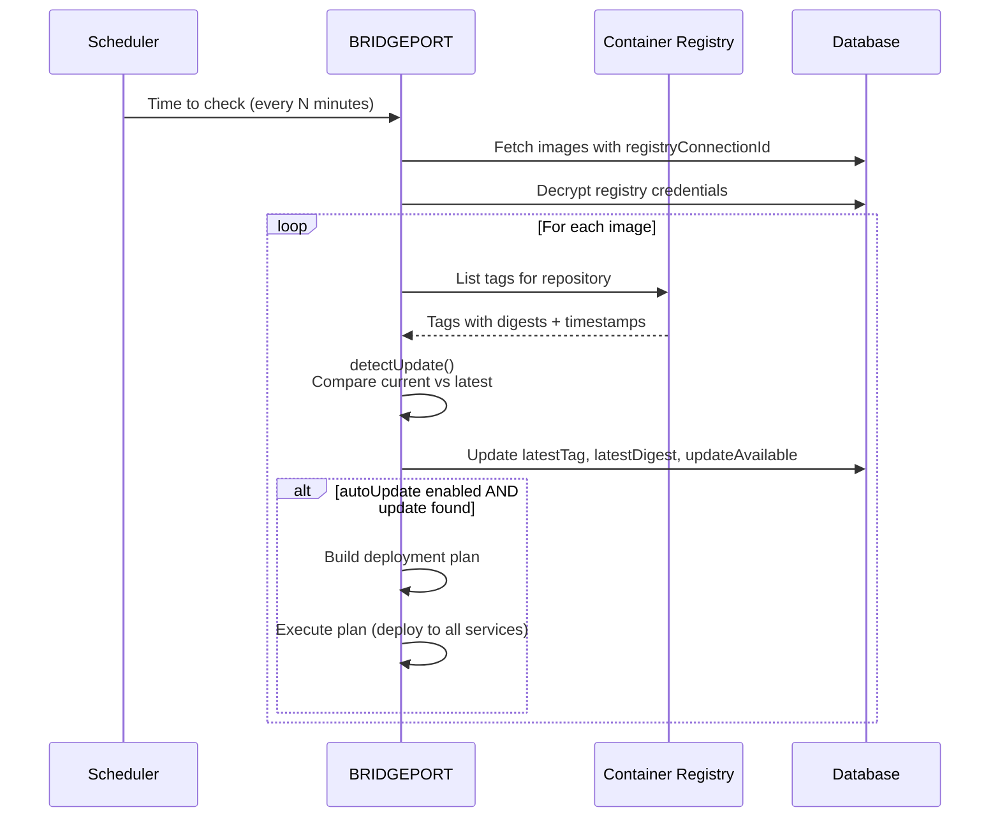
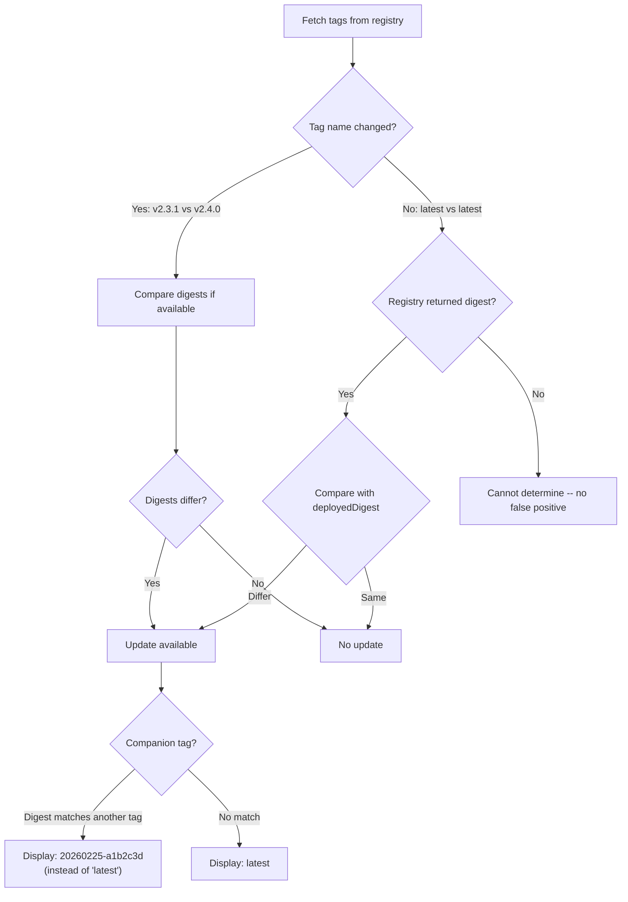

# Registry Connections

Registry connections link BRIDGEPORT to your container registries, enabling update detection, tag browsing, digest-based comparison, and automated deployments.

## Table of Contents

- [Quick Start](#quick-start)
- [Supported Registry Types](#supported-registry-types)
- [How It Works](#how-it-works)
- [Adding a Registry Connection](#adding-a-registry-connection)
- [Authentication](#authentication)
- [Refresh Intervals](#refresh-intervals)
- [Auto-Link Patterns](#auto-link-patterns)
- [Tag Browser](#tag-browser)
- [Update Detection](#update-detection)
- [Configuration Options](#configuration-options)
- [Troubleshooting](#troubleshooting)
- [Related](#related)

---

## Quick Start

Connect BRIDGEPORT to your container registry in under a minute:

1. Go to **Orchestration > Registries** in the sidebar.
2. Click **Add Registry**.
3. Select your registry type, enter the URL and credentials.
4. Click **Test Connection** to verify.
5. Click **Save**.

BRIDGEPORT will start checking for image updates every 30 minutes automatically.

---

## Supported Registry Types

BRIDGEPORT supports three registry types. The "Generic" type covers any Docker Registry V2-compatible service, which includes most private registries.

| Type | Description | Auth Method | Use For |
|------|-------------|-------------|---------|
| **DigitalOcean** | DigitalOcean Container Registry | API token (Bearer) | DO-hosted registries |
| **Docker Hub** | Docker Hub public and private repos | Username/password or access token | Public images, Docker Hub private repos |
| **Generic** | Any Docker Registry V2-compatible API | Username/password (Basic) | Harbor, GitLab Container Registry, GitHub Container Registry (GHCR), AWS ECR, self-hosted registries |

### Generic Registry Compatibility

The Generic client works with any registry that implements the [OCI Distribution Spec](https://github.com/opencontainers/distribution-spec). Tested registries include:

- **Harbor** -- `https://harbor.example.com`
- **GitLab Container Registry** -- `https://registry.gitlab.com`
- **GitHub Container Registry (GHCR)** -- `https://ghcr.io`
- **AWS ECR** -- `https://<account>.dkr.ecr.<region>.amazonaws.com` (use `AWS` as username, ECR auth token as password)
- **Self-hosted Docker Registry** -- `https://registry.example.com`

---

## How It Works

BRIDGEPORT's registry system connects your container registries to the [Container Images](container-images.md) system. Registries are checked on a schedule, and when new tags are detected, the information flows through to linked images and services.



---

## Adding a Registry Connection

### Via the UI

1. Navigate to **Orchestration > Registries**.
2. Click **Add Registry**.
3. Fill in the form:

| Field | Required | Description |
|-------|----------|-------------|
| **Name** | Yes | Display name (e.g., "Production DO Registry"). Must be unique per environment. |
| **Type** | Yes | `digitalocean`, `dockerhub`, or `generic` |
| **Registry URL** | Yes | The registry endpoint (see [Authentication](#authentication) for examples) |
| **Repository Prefix** | No | Narrows repository listing (e.g., `my-registry` for DO) |
| **Credentials** | Depends | Token, or username/password -- varies by type |
| **Default** | No | Mark as default registry for this environment |
| **Refresh Interval** | No | Minutes between update checks (default: 30, range: 5-1440) |
| **Auto-Link Pattern** | No | Glob pattern for auto-linking discovered images |

4. Click **Test Connection** to verify credentials and connectivity.
5. Click **Save**.

### Via the API

```http
POST /api/environments/:envId/registries
Authorization: Bearer <token>
Content-Type: application/json

{
  "name": "Production DO Registry",
  "type": "digitalocean",
  "registryUrl": "https://api.digitalocean.com/v2/registry",
  "repositoryPrefix": "my-registry",
  "token": "dop_v1_abc123...",
  "isDefault": true,
  "refreshIntervalMinutes": 30,
  "autoLinkPattern": "myapp-*"
}
```

**Response (200):**
```json
{
  "registry": {
    "id": "clxyz...",
    "name": "Production DO Registry",
    "type": "digitalocean",
    "registryUrl": "https://api.digitalocean.com/v2/registry",
    "repositoryPrefix": "my-registry",
    "hasToken": true,
    "hasPassword": false,
    "isDefault": true,
    "refreshIntervalMinutes": 30,
    "autoLinkPattern": "myapp-*"
  }
}
```

> [!NOTE]
> All credentials (tokens and passwords) are encrypted at rest using AES-256-GCM. They are never returned in API responses -- only `hasToken` and `hasPassword` booleans indicate whether credentials are stored.

---

## Authentication

Each registry type accepts different credential formats:

### DigitalOcean

```
Registry URL: https://api.digitalocean.com/v2/registry
Token:        dop_v1_abc123...  (DO personal access token with registry read scope)
Prefix:       my-registry     (your registry name)
```

The DO client uses two APIs: the DigitalOcean management API for tag listing, and the Docker Registry V2 API (`registry.digitalocean.com`) as a fallback for manifest digests.

### Docker Hub

```
Registry URL: https://hub.docker.com
Username:     myuser
Password:     dckr_pat_abc123...  (Docker Hub access token recommended over password)
```

For public repositories, credentials are optional but recommended to avoid rate limits. For private repositories, credentials are required.

### Generic (V2)

```
Registry URL: https://registry.example.com  (the registry's base URL)
Username:     myuser
Password:     mypassword
```

The Generic client authenticates via HTTP Basic auth and communicates using the standard Docker Registry V2 API (`/v2/` endpoints).

**GHCR example:**
```
Registry URL: https://ghcr.io
Username:     USERNAME
Password:     ghp_abc123...  (GitHub personal access token with read:packages scope)
```

**GitLab example:**
```
Registry URL: https://registry.gitlab.com
Username:     gitlab-ci-token  (or your username for personal tokens)
Password:     glpat-abc123...  (GitLab personal access token with read_registry scope)
```

---

## Refresh Intervals

Each registry connection has a configurable refresh interval that controls how often BRIDGEPORT checks for new tags.

| Setting | Range | Default |
|---------|-------|---------|
| `refreshIntervalMinutes` | 5 -- 1440 (24 hours) | 30 minutes |

The global scheduler runs at the interval configured by `SCHEDULER_UPDATE_CHECK_INTERVAL` (default: 1800 seconds / 30 minutes). During each run, it checks all container images whose linked registry is due for a refresh.

> [!TIP]
> For active development registries (staging), set a shorter interval like 5-10 minutes. For stable production registries, 30-60 minutes is sufficient and reduces API calls.

### Force Check

You can trigger an immediate update check for all images linked to a registry:

```http
POST /api/registries/:id/check-updates
Authorization: Bearer <token>
```

Returns results for each checked service:
```json
{
  "results": [
    { "serviceId": "svc1", "name": "app-api", "hasUpdate": true, "latestTag": "v2.4.0" },
    { "serviceId": "svc2", "name": "app-worker", "hasUpdate": false }
  ],
  "summary": {
    "checked": 2,
    "withUpdates": 1,
    "errors": 0
  }
}
```

---

## Auto-Link Patterns

An auto-link pattern is a string that BRIDGEPORT matches against image names during container discovery. When a new container is discovered and its image name matches the pattern, BRIDGEPORT creates a `ContainerImage` linked to this registry automatically.

**Examples:**

| Pattern | Matches |
|---------|---------|
| `myapp-*` | `myapp-backend`, `myapp-frontend`, `myapp-worker` |
| `registry.example.com/*` | Any image from `registry.example.com` |
| (empty) | No auto-linking (manual linking only) |

Set the pattern when creating or editing a registry:

```http
PATCH /api/registries/:id
Authorization: Bearer <token>
Content-Type: application/json

{
  "autoLinkPattern": "myapp-*"
}
```

> [!NOTE]
> Auto-link patterns are evaluated during container discovery. They do not retroactively link existing images. To link existing images, use the container image edit page or the link API.

---

## Tag Browser

Once a container image is linked to a registry, you can browse its available tags:

### From the Container Image

```http
GET /api/container-images/:id/tags
Authorization: Bearer <token>
```

### From the Registry

List all repositories in the registry:
```http
GET /api/registries/:id/repositories
Authorization: Bearer <token>
```

List tags for a specific repository:
```http
GET /api/registries/:id/repositories/:repo/tags
Authorization: Bearer <token>
```

Each tag includes:

| Field | Description |
|-------|-------------|
| `tag` | Tag name (e.g., `v2.4.0`, `latest`) |
| `digest` | Manifest digest (e.g., `sha256:abc123...`) |
| `size` | Compressed image size in bytes |
| `updatedAt` | When the tag was last updated |

> [!NOTE]
> Generic V2 registries do not provide real timestamps or sizes. Tags will show `updatedAt` as the current time and `size` as 0. The UI handles this gracefully by hiding unavailable fields.

---

## Update Detection

BRIDGEPORT uses a digest-based comparison system to detect updates accurately, even for rolling tags like `latest`.

### Version Tags (e.g., `v2.3.1` to `v2.4.0`)

Tags are grouped into "families" based on their suffix:
- `v2.3.1` and `v2.4.0` are in the same bare-version family
- `2.9.0-alpine` and `2.10.0-alpine` are in the `-alpine` family
- `latest` and `stable` are each in their own family

Only tags in the same family as the current tag are compared. If a newer tag exists with a different digest, an update is reported.

### Rolling Tags (e.g., `latest`)

For rolling tags where the tag name never changes, BRIDGEPORT compares the manifest digest from the registry against the `deployedDigest` recorded after the last deployment. If the digests differ, the image was updated.



### Digest-Based Comparison Details

| Scenario | Detection Method |
|----------|-----------------|
| New version tag (e.g., `v2.3.1` to `v2.4.0`) | Tag name + digest comparison |
| Rolling tag with digest (e.g., `latest`) | Digest comparison against `deployedDigest` |
| Rolling tag without digest | No detection (avoids false positives) |
| Same tag, same digest | No update |

### Registry Client Differences

| Feature | DigitalOcean | Docker Hub | Generic V2 |
|---------|-------------|------------|------------|
| Tag listing | DO management API | Hub API | `/v2/{repo}/tags/list` + manifest HEADs |
| Digest source | API field (+ V2 fallback) | API field | `Docker-Content-Digest` header |
| Real timestamps | Yes | Yes | No (set to current time) |
| Image sizes | Yes | Yes | No (always 0) |
| Auth method | Bearer token | Token exchange / Basic | Basic auth |

---

## Configuration Options

### Registry Connection Fields

| Field | Type | Default | Description |
|-------|------|---------|-------------|
| `name` | string | -- | Display name (unique per environment) |
| `type` | enum | -- | `digitalocean`, `dockerhub`, or `generic` |
| `registryUrl` | string | -- | Registry API endpoint |
| `repositoryPrefix` | string | null | Prefix for narrowing repository listing |
| `token` | string | null | API token (encrypted at rest) |
| `username` | string | null | Username for basic auth |
| `password` | string | null | Password for basic auth (encrypted at rest) |
| `isDefault` | boolean | false | Default registry for the environment |
| `refreshIntervalMinutes` | integer | 30 | How often to check for updates (5-1440) |
| `autoLinkPattern` | string | null | Pattern for auto-linking discovered images |

### Related System Settings

| Setting | Location | Default | Description |
|---------|----------|---------|-------------|
| `SCHEDULER_UPDATE_CHECK_INTERVAL` | Env var | 1800s | Global scheduler interval for registry checks |
| `registryMaxTags` | Admin > System | 50 | Max tags to fetch per repo (Generic registries) |

---

## Troubleshooting

**"Connection test failed"**
Verify the registry URL, credentials, and that the BRIDGEPORT server can reach the registry. For Generic registries, ensure the URL includes the scheme (e.g., `https://registry.example.com`). The test calls the `/v2/` endpoint.

**"Registry API error: 401"**
Credentials are invalid or expired. For Docker Hub, ensure your access token has not expired. For GHCR, ensure the personal access token has the `read:packages` scope.

**"Registry API error: 403"**
The credentials are valid but lack permissions. For DO registries, the API token needs registry read access. For GHCR, the token needs the `read:packages` scope for the target repository.

**"Cannot delete registry connection with N container image(s) attached"**
Container images must be unlinked or deleted before the registry can be removed. Edit each container image and either set `registryConnectionId` to null or delete the image.

**Tags show "0 bytes" and no real timestamps**
This is normal for Generic V2 registries. The Docker Registry V2 API does not provide size or timestamp information in tag listings. BRIDGEPORT fetches digests via manifest HEAD requests but cannot retrieve sizes or timestamps.

**Update check finds updates but they are false positives**
This can happen if the deployed digest was not recorded (e.g., the service was deployed before the digest tracking feature was added). Deploy the current tag once to store the digest, which will clear the false positive.

**"No registry connection configured for this image"**
The container image has no `registryConnectionId`. Edit the container image and select a registry connection.

---

## Related

- [Container Images](container-images.md) -- Central image management, tag history, auto-update
- [Deployment Plans](deployment-plans.md) -- Orchestrated multi-service deployments
- [Webhooks](webhooks.md) -- CI/CD integration for push-based deployments
- [Configuration Reference](../configuration.md) -- `SCHEDULER_UPDATE_CHECK_INTERVAL` and other env vars
