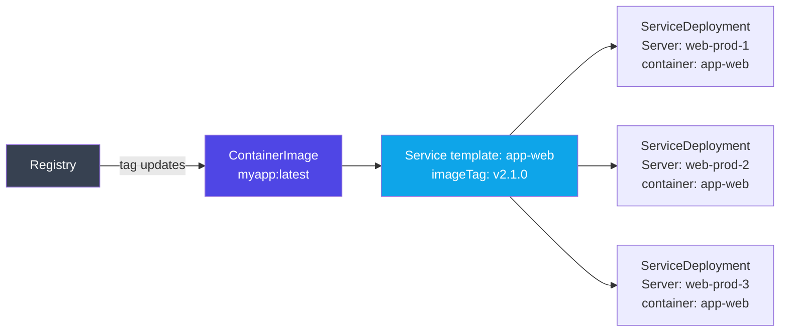

# Services

A **service** in BRIDGEPORT is an **environment-scoped template** that describes _what_ to run (image, tag, health checks, compose template, base env). Where it actually runs is captured by one or more **service deployments**, each pinning the template to a specific server with its own container name, env overrides, and runtime status.

> [!NOTE]
> **2.0 split.** Earlier versions tied a Service directly to a single Server. As of v2.0, a Service is a reusable template and a `ServiceDeployment` row stores per-server runtime state (status, health, container name, exposed ports, last discovered, etc.). The auto-migration creates exactly one `ServiceDeployment` per pre-existing service so nothing is lost.

## Table of Contents

1. [Quick Start](#quick-start)
2. [How It Works](#how-it-works)
3. [Step-by-Step Guide](#step-by-step-guide)
   - [Creating Services](#creating-services)
   - [Deploying Tags](#deploying-tags)
   - [Deployment Logs & History](#deployment-logs--history)
   - [Service Actions](#service-actions)
   - [Health Check Configuration](#health-check-configuration)
   - [TCP & Certificate Checks](#tcp--certificate-checks)
   - [Type Tags (Grouping & Filtering)](#type-tags-grouping--filtering)
   - [Linking to Container Images](#linking-to-container-images)
   - [Service Dependencies](#service-dependencies)
   - [Config File Attachment & Sync](#config-file-attachment--sync)
   - [Docker Compose Templates](#docker-compose-templates)
4. [Configuration Options](#configuration-options)
5. [Troubleshooting](#troubleshooting)
6. [Related](#related)

---

## Quick Start

Get a service deployed in 3 steps:

1. **Discover or create** a service on your server:
   - Server detail page > **Discover** to auto-import running containers, or
   - Server detail page > **Create Service** to set one up manually.

2. **Deploy a tag:**
   - On the service detail page, select a tag from the dropdown and click **Deploy**.

3. **Check health:**
   - Click the health check button to verify the container is running.

---

## How It Works

A service has two layers:

1. **Service template** -- environment-scoped. Holds the image, tag, compose template, health checks, base env, and **deploy strategy** (`sequential` or `parallel`). One template can have many deployments.
2. **Service deployment** -- one row per (template, server). Holds the container name, env overrides, runtime status (`status`, `containerStatus`, `healthStatus`, `discoveryStatus`), exposed ports, and last-checked / last-discovered timestamps.

Every template is linked to a `ContainerImage`. The container image is the central entity that tracks the image name, available tags from the registry, and deployment history. One container image can be linked to many templates.



When you deploy a tag to a service template, BRIDGEPORT:

1. Looks at the template's `deployStrategy` (`sequential` or `parallel`) and the list of `serviceDeployments`.
2. For each deployment (one per server), creates a `Deployment` record (status: `pending`).
3. Generates deployment artifacts (compose file, config files) per deployment if applicable.
4. Pulls the new image on each target server.
5. Runs `docker compose up` (if compose path is set) or restarts the container, in sequence or in parallel depending on the strategy.
6. Verifies each container is running.
7. Records success or failure per deployment in deployment history and container image tag history.

**Sequential vs parallel:**
- `sequential` (default) -- one deployment at a time. Useful when downstream services depend on a hot single instance, or when you want to bail out early on the first failure.
- `parallel` -- all deployments at once. Faster for stateless replicas behind a load balancer.

---

## Step-by-Step Guide

### Creating Services

There are two ways to create services: **auto-discovery** and **manual creation**.

#### Auto-Discovery

Discovery scans a server's Docker daemon and creates services for every running container. See [Servers > Container Discovery](servers.md#container-discovery) for details.

Each discovered container gets:
- A service record linked to the server
- A `ContainerImage` record (created if no matching image exists)
- Current tag and container name populated from the running container

#### Manual Creation

Create a service template before deploying its container, or for containers that are not yet running.

**Recommended (template-only) API:**
```http
POST /api/environments/:envId/services
Authorization: Bearer <token>
Content-Type: application/json

{
  "name": "app-api",
  "containerImageId": "climg...",
  "imageTag": "v2.1.0",
  "composeTemplate": null,
  "deployStrategy": "sequential"
}
```

This creates the **template only** -- with zero deployments. Attach servers afterwards by creating `ServiceDeployment` rows via the deployment endpoints.

**Legacy (create template + first deployment in one call):**
```http
POST /api/servers/:serverId/services
Authorization: Bearer <token>
Content-Type: application/json

{
  "name": "app-api",
  "containerName": "app-api",
  "containerImageId": "climg...",
  "imageTag": "v2.1.0"
}
```

This endpoint is preserved for the CLI and pre-2.0 UI flows. It creates the env-scoped Service plus a single `ServiceDeployment` bound to the specified server.

**Required template fields:**
- `name` -- service display name (unique per environment). Free-form — rename anytime without breaking discovery.
- `containerImageId` -- ID of an existing `ContainerImage` in the same environment.

**Required deployment fields (for legacy server-scoped create):**
- `containerName` -- Docker container name (unique per server). Discovery matches deployments to running containers via this field, so it must match the `container_name:` value in your compose file.

**Optional fields:**
- `imageTag` -- defaults to `latest`.
- `typeTag` -- free-form operator-defined type label (e.g., `"django"`, `"postgres"`, `"redis"`). Used to group services on the list page via filter chips. Distinct from the plugin-provided `serviceTypeId` relation. Max 64 chars; trimmed; empty string is stored as `null`.
- `composeTemplate` -- template Compose file (the rendered file is uploaded per-deployment to each server's compose path).
- `deployStrategy` -- `sequential` (default) or `parallel`; controls how multi-server deploys roll out.
- `baseEnv` -- JSON object of env vars applied to every deployment. Per-deployment env overrides take precedence.

> [!NOTE]
> Every service must be linked to a `ContainerImage`. Create the image first (via the Container Images page or API) if one does not exist for your image.

### Deploying Tags

**UI:** On the service detail page, select a tag from the dropdown and click **Deploy**.

**API:**
```http
POST /api/services/:id/deploy
Authorization: Bearer <token>
Content-Type: application/json

{
  "imageTag": "v2.2.0",
  "generateArtifacts": true,
  "pullImage": true
}
```

**Parameters:**

| Field | Type | Default | Description |
|-------|------|---------|-------------|
| `imageTag` | string | Current tag | Tag to deploy |
| `generateArtifacts` | boolean | `true` | Generate and upload compose/config files |
| `pullImage` | boolean | `true` | Pull the image before deploying |

**What happens during deploy:**

1. A `Deployment` record is created with status `pending`, then updated to `deploying`.
2. BRIDGEPORT connects to the server (SSH or socket mode).
3. If `generateArtifacts` is true:
   - Creates the deploy directory (`/opt/<service-name>/` or the compose path's directory).
   - Generates and uploads the compose file (auto-generated or from custom template).
   - Uploads attached config files to their target paths.
   - Saves artifacts to the database.
4. If `pullImage` is true, pulls the image (`docker pull <image>:<tag>`).
5. Runs `docker compose up` (compose mode) or `docker restart` (direct mode).
6. Verifies the container is running.
7. Appends container output (`docker logs <container>`, last `defaultLogLines` lines with timestamps) to the deployment log. This runs on both the success and failure paths so a container that crashes immediately surfaces its internal error in the deployment plan view without needing SSH access. If the container does not exist (for example, `docker compose up` failed before creating it), a `--- container logs unavailable: <reason> ---` note is appended instead.
8. Updates the deployment record to `success` or `failed` with logs and duration.

**Response:**
```json
{
  "deployment": {
    "id": "cldep...",
    "imageTag": "v2.2.0",
    "previousTag": "v2.1.0",
    "status": "success",
    "logs": "[2026-02-25T10:00:00Z] Starting deployment...\n...",
    "durationMs": 12340,
    "startedAt": "2026-02-25T10:00:00.000Z",
    "completedAt": "2026-02-25T10:00:12.340Z"
  },
  "logs": "...",
  "previousTag": "v2.1.0"
}
```

### Dry-Run Preview

Add `?dryRun=true` to the query string (or send `X-Dry-Run: true` as a header) on `POST /api/services/:id/deployments/:depId/deploy` to preview what a real deploy would do **without** creating a `Deployment` row, pulling the image, opening an SSH write session, or running `docker compose up`. The same flag works on `POST /api/services/:id/sync-files` and the deployment-plan / config-file sync endpoints documented below.

```http
POST /api/services/:id/deployments/:depId/deploy?dryRun=true
Authorization: Bearer <token>
```

**Response shape:**

```json
{
  "dryRun": true,
  "serviceId": "csrv...",
  "serviceDeploymentId": "csdp...",
  "serverName": "web-1",
  "imageTag": "v2.2.0",
  "imageDigest": "sha256:abc123...",
  "composeContent": "services:\n  api:\n    image: registry.example.com/api:v2.2.0\n    ...",
  "env": { "PORT": "3000", "DB_PASSWORD": "***" },
  "containerAction": "cycle",
  "warnings": []
}
```

- `imageDigest` is resolved from the registry manifest (no `docker pull`). `null` when no registry connection exists or the manifest fetch failed — a warning is added explaining why.
- `containerAction` is `"start"` (no container running), `"cycle"` (running, would be recreated by `compose up`), or `"no-op"`.
- Secret VALUES are replaced with `***` in both `composeContent` and `env`. `${KEY}` references in the template stay visible in the source compose template's substitution path; once resolved, the substituted value is redacted.
- The endpoint still writes an audit-log entry with `details.dryRun = true` so operators can see who probed which deployment.
- The request body's `imageTag` (if provided) is honored — the preview reflects the tag that the real deploy would have used. Plan dry-runs use the per-step `targetTag` the same way.
- When the real deploy would have failed at artifact generation (missing secrets, template errors in a config file), the response carries `"wouldSucceed": false` and an `"error"` string describing the blocker. The preview is still returned (so operators can see what is broken) but callers should treat this as a hard block before running the real path.

For the service-wide `POST /api/services/:id/sync-files` endpoint, the dry-run response shape is:

```json
{
  "dryRun": true,
  "results": [
    {
      "serverName": "web-1",
      "serviceName": "api",
      "configFileName": "app.env",
      "hostPath": "/etc/api/app.env",
      "diff": "--- a/etc/api/app.env\n+++ b/etc/api/app.env\n@@ -1,2 +1,2 @@\n-OLD=value\n+NEW=value",
      "exists": true,
      "referencingServices": ["api"],
      "warnings": []
    }
  ]
}
```

### Deployment Logs & History

**View deployment history:**
```http
GET /api/services/:id/deployments?limit=20
Authorization: Bearer <token>
```

Returns recent deployments ordered newest first, each with `id`, `imageTag`, `previousTag`, `status`, `triggeredBy`, `startedAt`, `completedAt`, and `durationMs`.

**View a single deployment with logs:**
```http
GET /api/deployments/:id
Authorization: Bearer <token>
```

**View deployment artifacts:**
```http
GET /api/deployments/:id/artifacts
Authorization: Bearer <token>
```

Returns the compose file, env files, and config files that were generated and uploaded during that deployment.

**View service action history (all actions):**
```http
GET /api/services/:id/history?limit=50
Authorization: Bearer <token>
```

Returns audit log entries for this service (deploys, restarts, health checks, updates, creates) plus a separate `deployments` array.

### Service Actions

BRIDGEPORT supports several container lifecycle actions:

**Restart container:**
```http
POST /api/services/:id/restart
Authorization: Bearer <token>
```

For compose-managed services (those with a `composePath`), restart runs `docker compose ... rm -f -s <service>` followed by `docker compose ... up -d --force-recreate <service>`. This creates a **new** container so updated compose or config files are picked up. For services without a `composePath`, restart falls back to `docker restart <container-name>`. Restart does not regenerate compose artifacts — it always uses the current on-disk compose file. The action is logged in the audit trail.

**View container logs:**
```http
GET /api/services/:id/logs?tail=100&before=2026-05-25T10:23:45Z
Authorization: Bearer <token>
```

Returns container logs with timestamps. Query params:

- `tail` (optional): number of lines to return. When omitted, falls back to the `defaultLogLines` system setting.
- `before` (optional): ISO-8601 timestamp. When set, the endpoint returns up to `tail` lines whose timestamps are at or before this value — used by the service detail logs viewer to page back ("Load older").

Output always includes Docker timestamps (`docker logs -t`), so the client can extract the oldest line's timestamp and request the next page with `before=<that timestamp>`.

**Stream container logs (SSE):**
```http
GET /api/services/:id/logs/stream
Authorization: Bearer <token>
```

Opens a Server-Sent Events stream with real-time `stdout` and `stderr` events.

**Run predefined commands:**
```http
POST /api/services/:id/run-command
Authorization: Bearer <token>
Content-Type: application/json

{
  "commandName": "shell"
}
```

Runs a command defined by the service's service type (e.g., Django shell, Node.js REPL). Returns the command string for the CLI to execute.

**Check for image updates:**
```http
POST /api/services/:id/check-updates
Authorization: Bearer <token>
```

Queries the linked registry for newer tags and returns whether an update is available.

### Health Check Configuration

Each service has per-service health check settings used during deployment orchestration:

| Setting | API Field | Default | Description |
|---------|-----------|---------|-------------|
| Health Wait | `healthWaitMs` | `30000` (30s) | Wait after deploy before first check |
| Health Retries | `healthRetries` | `3` | Number of check attempts |
| Health Interval | `healthIntervalMs` | `5000` (5s) | Time between retry attempts |

**Update health check config:**
```http
PATCH /api/services/:id
Authorization: Bearer <token>
Content-Type: application/json

{
  "healthWaitMs": 60000,
  "healthRetries": 5,
  "healthIntervalMs": 10000
}
```

**Manual health check:**
```http
POST /api/services/:id/health
Authorization: Bearer <token>
```

This runs a comprehensive check:
1. Connects to the server and inspects the container (state, health, ports, image).
2. If `healthCheckUrl` is configured, makes an HTTP request to that URL.
3. Updates the service's `status`, `containerStatus`, and `healthStatus` fields.
4. Checks the linked registry for available updates.
5. Logs the result in the health check log.

**Set a health check URL:**
```http
PATCH /api/services/:id
Authorization: Bearer <token>
Content-Type: application/json

{
  "healthCheckUrl": "http://localhost:8000/health"
}
```

> [!TIP]
> Health check URLs are checked from within the server's network. Use `localhost` or the container's internal hostname, not the public URL.

### TCP & Certificate Checks

For services that expose TCP ports or TLS endpoints, the **monitoring agent** can perform automated connectivity and certificate expiry checks.

> [!NOTE]
> TCP and certificate checks require the agent to be deployed on the server (metrics mode: `agent`). These checks are not available in SSH or disabled modes.

**Configure TCP checks:**
```http
PATCH /api/services/:id
Authorization: Bearer <token>
Content-Type: application/json

{
  "tcpChecks": "[{\"host\": \"localhost\", \"port\": 5432, \"name\": \"postgres\"}]"
}
```

**Configure certificate checks:**
```http
PATCH /api/services/:id
Authorization: Bearer <token>
Content-Type: application/json

{
  "certChecks": "[{\"host\": \"api.example.com\", \"port\": 443, \"name\": \"api-cert\"}]"
}
```

The agent runs these checks periodically and stores results in `agentTcpCheckResults` and `agentCertCheckResults` on the service record.

### Type Tags (Grouping & Filtering)

Each service has an optional free-form `typeTag` string (e.g., `"django"`, `"postgres"`, `"redis"`). This is **separate** from the plugin-provided `serviceTypeId` relation -- type tags are operator-defined labels for grouping services on the Services list page.

**Set / change a type tag:**
```http
PATCH /api/services/:id
Authorization: Bearer <token>
Content-Type: application/json

{
  "typeTag": "django"
}
```

Pass `null` (or `""`) to clear the tag. Values are trimmed and capped at 64 characters; comparisons are case-sensitive, so `"django"` and `"Django"` are distinct tags.

**List distinct type tags in an environment (for chips / autocomplete):**
```http
GET /api/environments/:envId/services/type-tags
Authorization: Bearer <token>
```

**Response:**
```json
{
  "tags": [
    { "tag": "django", "count": 4 },
    { "tag": "postgres", "count": 2 }
  ]
}
```

Empty / null tags are excluded -- the Services list page surfaces untyped services via a separate "No type" filter chip.

**UI:** the Services list page shows filter chips at the top (one per distinct tag, plus "No type" when applicable). The selected chip persists in the URL via `?type=<tag>` (`?type=__none__` for the "No type" chip). The ServiceDetail config modal exposes a "Type" input with autocomplete from existing values in the current environment.

### Linking to Container Images

Every service is linked to a `ContainerImage` -- the central entity that tracks the Docker image name, deployed tags, and registry updates.

**Change a service's container image:**
```http
PATCH /api/services/:id
Authorization: Bearer <token>
Content-Type: application/json

{
  "containerImageId": "clnewimg..."
}
```

The container image must be in the same environment as the service's server. One image can be linked to many services, enabling "deploy all" workflows from the Container Images page.

See [Container Images](container-images.md) for managing images, tag history, and auto-updates.

### Service Dependencies

Dependencies define the order in which services should be deployed and health-checked during orchestrated deployments.

Two dependency types:

| Type | Meaning |
|------|---------|
| `health_before` | The dependency must be healthy before this service is deployed |
| `deploy_after` | This service deploys after the dependency has been deployed |

Dependencies are configured on the service detail page or via the Service Dependencies API. They are used by deployment plans to build the correct execution order.

See [Deployment Plans](deployment-plans.md) for the full orchestration guide.

### Config File Attachment & Sync

Config files (docker-compose overrides, nginx configs, .env files, certificates) can be attached to services and synced to the server during deployment.

**Attach a config file to a service:**
```http
POST /api/services/:serviceId/files
Authorization: Bearer <token>
Content-Type: application/json

{
  "configFileId": "clcfg...",
  "targetPath": "/opt/app-api/config/nginx.conf"
}
```

The `targetPath` is the absolute path on the server where the file will be written during deployment. During deploy, BRIDGEPORT:

1. Resolves any `{{SECRET_NAME}}` placeholders in the file content with actual secret values.
2. Uploads the file to the target path via SSH.
3. Sets `chmod 600` on `.env` files for security.

See [Config Files](config-files.md) for creating and managing config files.

### Docker Compose Templates

BRIDGEPORT generates a Docker Compose file for each service during deployment. You can use the auto-generated default or provide a custom template.

#### Auto-Generated Template

If no custom template is set, BRIDGEPORT generates a minimal compose file:

```yaml
services:
  app-api:
    image: "registry.example.com/app-api:v2.1.0"
    container_name: app-api
    restart: unless-stopped
    volumes:
      - "/opt/app-api/config/nginx.conf:/opt/app-api/config/nginx.conf:ro"
    ports:
      - "8080:80"
```

The auto-generated template includes the image, container name, restart policy, read-only volume mounts for any attached config files, and `ports:` entries derived from the service's discovered `exposedPorts`.

Port-mapping behavior:

- An explicit binding (e.g., `8080:80`) round-trips as `"8080:80"`.
- A binding restricted to a specific host IP (e.g., `127.0.0.1:8080:80`) preserves the IP, so loopback-only services are not silently widened to all interfaces on regenerate.
- A port the container only `EXPOSE`s (no host binding) is published on the matching host port — `EXPOSE 80` becomes `"80:80"`. Without this, the regenerated compose would have no `ports:` section and the container would come up unreachable.

To opt out of a port binding entirely (e.g., a service that should only be reached from inside the docker network), switch to a custom template.

#### Custom Templates

For complex setups (extra networks, sidecar containers, environment variables, volume mounts), create a custom compose template with variable substitution.

**Set a custom template:**
```http
PUT /api/services/:id/compose/template
Authorization: Bearer <token>
Content-Type: application/json

{
  "composeTemplate": "services:\n  ${SERVICE_NAME}:\n    image: ${FULL_IMAGE}\n    container_name: ${CONTAINER_NAME}\n    restart: unless-stopped\n    networks:\n      - traefik\n    volumes:\n      - ${CONFIG_FILE_0}:${CONFIG_FILE_0}:ro\n      - app-data:/data\n\nvolumes:\n  app-data:\n\nnetworks:\n  traefik:\n    external: true"
}
```

#### Variable Substitution

Custom templates support these variables:

| Variable | Replaced With | Example |
|----------|---------------|---------|
| `${SERVICE_NAME}` | Service name | `app-api` |
| `${CONTAINER_NAME}` | Docker container name | `app-api` |
| `${IMAGE_NAME}` | Full image path without tag | `registry.example.com/app-api` |
| `${IMAGE_TAG}` | Tag being deployed | `v2.1.0` |
| `${FULL_IMAGE}` | Image path with tag | `registry.example.com/app-api:v2.1.0` |
| `${CONFIG_FILE_N}` | Mount path of Nth config file (0-indexed) | `/opt/app-api/config/nginx.conf` |
| `${CONFIG_FILE_N_NAME}` | Filename of Nth config file (0-indexed) | `nginx.conf` |

#### Preview Before Deploying

Preview what the generated artifacts will look like without actually deploying:

```http
GET /api/services/:id/compose/preview
Authorization: Bearer <token>
```

Returns the compose file content, config file contents (with secret placeholders resolved), and checksums.

#### View Past Deployment Artifacts

```http
GET /api/deployments/:id/artifacts
Authorization: Bearer <token>
```

Returns all artifacts (compose, config, env files) that were generated and uploaded during a specific deployment.

#### Revert to Auto-Generated

Delete the custom template to go back to the auto-generated default:

```http
DELETE /api/services/:id/compose/template
Authorization: Bearer <token>
```

#### When to Use Custom Templates

| Scenario | Recommendation |
|----------|---------------|
| Simple single-container service | Auto-generated is sufficient |
| Extra Docker networks (e.g., Traefik) | Custom template |
| Named volumes or bind mounts | Custom template |
| Sidecar containers | Custom template |
| Environment variables in compose | Custom template |
| Complex restart/healthcheck policies | Custom template |

---

## Configuration Options

### Service Template Settings (env-scoped, shared across deployments)

| Field | Type | Default | Description |
|-------|------|---------|-------------|
| `imageTag` | string | `'latest'` | Tag deployed across all deployments of this template |
| `typeTag` | string \| null | `null` | Free-form operator-defined type label (e.g., `"django"`, `"postgres"`). Drives the filter chips on the Services list. Distinct from the plugin-provided `serviceTypeId`. |
| `composeTemplate` | string | `null` | Custom compose template (null = auto-generated) |
| `baseEnv` | JSON string | `null` | Env vars applied to every deployment (overrides win per-deployment) |
| `deployStrategy` | enum | `'sequential'` | `sequential` or `parallel` -- how multi-server deploys roll out |
| `healthCheckUrl` | string | `null` | URL to check for HTTP health |
| `healthWaitMs` | int | `30000` | Wait after deploy before checking health |
| `healthRetries` | int | `3` | Number of health check attempts |
| `healthIntervalMs` | int | `5000` | Interval between health check retries |
| `serviceTypeId` | string | `null` | Service type for predefined commands |
| `tcpChecks` | JSON string | `null` | TCP port checks (agent-required) |
| `certChecks` | JSON string | `null` | TLS certificate checks (agent-required) |

### Service Deployment Settings (per-server)

| Field | Type | Default | Description |
|-------|------|---------|-------------|
| `serverId` | string | required | Target server for this deployment |
| `containerName` | string | required | Docker container name on the server (unique per server) |
| `composePath` | string | `null` | Path to compose file on the server |
| `envOverrides` | JSON string | `null` | Per-deployment env vars (override the template `baseEnv`) |
| `exposedPorts` | JSON string | `null` | Discovered exposed ports (managed by discovery) |
| `status` / `containerStatus` / `healthStatus` | string | derived | Per-deployment runtime status, updated by health checks and the agent |
| `discoveryStatus` | string | `'unknown'` | `found` / `missing` / `unknown` -- last discovery result |
| `lastCheckedAt` / `lastDiscoveredAt` / `lastDeployedAt` | datetime | `null` | Per-deployment timestamps |

### Environment-Level Settings (Affect All Services)

| Setting | Module | Default | Description |
|---------|--------|---------|-------------|
| Service Health Interval | Monitoring | `60000ms` | Automated health check frequency |
| Update Check Interval | Monitoring | `1800000ms` | How often to check registries for new tags |

---

## Troubleshooting

**Deploy fails with "Container is not running after deploy"**
The container exited after starting. Check container logs (`GET /api/services/:id/logs`) for error messages. Common causes: missing environment variables, port conflicts, or application errors.

**"Service not found" on deploy**
Verify the service ID is correct. If the service was recently deleted and re-created, the ID will have changed.

**"Container image must be in the same environment"**
When creating a service, the `containerImageId` must reference a container image in the same environment as the server. Create the image in the correct environment first.

**Health check returns "unknown" status**
The container was not found on the server. Run container discovery to update the service's status, or verify the container name matches what is actually running.

**Config files not appearing on the server after deploy**
- Verify the config file is attached to the service with a target path.
- Check that `generateArtifacts` is `true` (the default) in the deploy request.
- Verify SSH connectivity to the server.

**Custom compose template variables not substituted**
Variable syntax is `${VARIABLE_NAME}` (with curly braces). Check for typos in variable names. Only the variables listed in the [Variable Substitution](#variable-substitution) table are supported.

**"No registry connection configured" when checking for updates**
The service's container image is not linked to a registry connection. Configure one on the Container Images page.

---

## Related

- [Servers](servers.md) -- managing the machines services run on
- [Container Images](container-images.md) -- central image management and tag history
- [Deployment Plans](deployment-plans.md) -- orchestrated multi-service deployments with dependencies
- [Config Files](config-files.md) -- managing configuration files
- [Secrets](secrets.md) -- encrypted secrets used in config file templates
- [Health Checks](health-checks.md) -- health check types and scheduling
- [Environment Settings Reference](../reference/environment-settings.md) -- monitoring intervals
