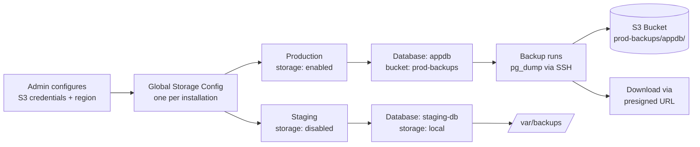
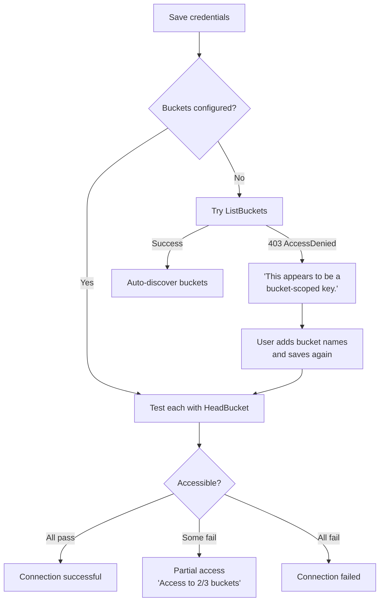

# S3-Compatible Storage

Configure S3-compatible object storage so BridgePort can upload database backups to a remote bucket instead of (or in addition to) the local filesystem.

## Table of Contents

- [Quick Start](#quick-start)
- [How It Works](#how-it-works)
- [Supported Providers](#supported-providers)
- [Setup Guide](#setup-guide)
  - [Step 1: Navigate to Admin > Storage](#step-1-navigate-to-admin--storage)
  - [Step 2: Enter Credentials](#step-2-enter-credentials)
  - [Step 3: Configure Buckets](#step-3-configure-buckets)
  - [Step 4: Test the Connection](#step-4-test-the-connection)
  - [Step 5: Enable Per Environment](#step-5-enable-per-environment)
- [Provider-Specific Examples](#provider-specific-examples)
  - [DigitalOcean Spaces](#digitalocean-spaces)
  - [AWS S3](#aws-s3)
  - [MinIO](#minio)
  - [Backblaze B2](#backblaze-b2)
  - [Wasabi](#wasabi)
  - [Cloudflare R2](#cloudflare-r2)
- [Scoped Keys](#scoped-keys)
- [Per-Environment Control](#per-environment-control)
- [Configuration Options](#configuration-options)
- [Troubleshooting](#troubleshooting)
- [Related](#related)

---

## Quick Start

Set up offsite backup storage in under two minutes:

1. Go to **Admin > Storage** in the sidebar.
2. Click **Configure Spaces**.
3. Enter your S3 access key, secret key, and region.
4. Click **Save Configuration**, then **Test Connection**.
5. Scroll down and enable storage for your production environment.
6. On any database, set "Backup Storage" to **Spaces** and select a bucket.

Your next backup will upload to S3.

---

## How It Works

BridgePort's storage feature provides a single, globally configured S3-compatible endpoint that any environment can opt into. The storage is used exclusively for database backup files.



**What storage is for:**

- Offsite storage for database backup files (PostgreSQL dumps, MySQL dumps, SQLite exports)
- Download via presigned URL instead of streaming through the BridgePort server

**What storage is not for:**

- General file hosting
- Config file syncing (that uses SSH directly)
- BridgePort's own database (see [Backup & Restore](../backup-restore.md))

**Architecture:**

- One storage configuration per BridgePort installation (global credentials)
- Each environment can independently opt in or out
- Each database can use a different bucket with a custom key prefix
- Credentials are encrypted at rest using AES-256-GCM
- The secret key is never returned to the client after saving

---

## Supported Providers

BridgePort uses the AWS S3 SDK internally, so any provider that speaks the S3 API works.

| Provider | Custom Endpoint? | ListBuckets? | Notes |
|----------|:----------------:|:------------:|-------|
| **DigitalOcean Spaces** | No (auto-derived) | Yes | Default region dropdown targets Spaces |
| **AWS S3** | No | Yes | Standard S3, endpoint resolved from region |
| **MinIO** | Yes | Yes | Self-hosted, needs valid TLS |
| **Backblaze B2** | Yes | Yes | S3-compatible API |
| **Wasabi** | Yes | Yes | Region must match bucket location |
| **Cloudflare R2** | Yes | No | Must use scoped keys with manual bucket names |

---

## Setup Guide

### Step 1: Navigate to Admin > Storage

Go to **Admin** in the sidebar, then click **Storage**. This page is only visible to admin users.

### Step 2: Enter Credentials

Click **Configure Spaces** (if no configuration exists) or **Edit** (to update an existing one).

Fill in the following fields:

| Field | Required | Description |
|-------|----------|-------------|
| **Access Key** | Yes | The access key ID for your S3-compatible storage |
| **Secret Key** | Yes (new config) | The secret access key. On updates, leave blank to keep the existing value |
| **Region** | Yes | The region your bucket lives in. Defaults to `fra1` |
| **Endpoint** | Derived | For DigitalOcean Spaces, auto-derived from region. For other providers, set via API (see below) |
| **Buckets** | No | Manual bucket list for scoped keys. Leave empty if your key has full API access |

Click **Save Configuration** when done.

**API:**
```http
PUT /api/settings/spaces
Authorization: Bearer <admin-token>
Content-Type: application/json

{
  "accessKey": "DO00EXAMPLE1234",
  "secretKey": "wJalrXUtnFEMI/K7MDENG/bPxRfiCYEXAMPLEKEY",
  "region": "fra1",
  "endpoint": "fra1.digitaloceanspaces.com",
  "buckets": []
}
```

For non-DigitalOcean providers, use the API to set a custom `endpoint` value separate from `region`. The UI auto-derives the endpoint as `{region}.digitaloceanspaces.com`, which is only correct for DO Spaces.

> [!TIP]
> For non-DigitalOcean providers, set the `endpoint` field explicitly via the API. The UI's region dropdown targets DO Spaces regions, so using the API gives you full control over both `region` and `endpoint` independently.

### Step 3: Configure Buckets

BridgePort needs to know which buckets are available for backup storage. There are two modes:

**Auto-discovery (full-access keys):** If your key has permission to call `ListBuckets`, BridgePort discovers available buckets automatically. Leave the Buckets field empty.

**Manual list (scoped keys):** If your key is restricted to specific buckets, `ListBuckets` will return a 403 and auto-discovery will not work. Add the bucket names manually in the **Buckets** field. BridgePort will test access to each bucket individually using `HeadBucket`.

See [Scoped Keys](#scoped-keys) for more on when and why to use this.

### Step 4: Test the Connection

After saving, click **Test Connection**. BridgePort will:

1. Attempt `ListBuckets` if no buckets are manually configured.
2. If `ListBuckets` returns 403, report that the key appears to be scoped and prompt you to add bucket names.
3. If buckets are manually configured, run `HeadBucket` on each and report accessible vs. failed.

**Expected output (full-access key):**
```json
{
  "success": true,
  "message": "Connection successful (full API access)",
  "buckets": ["prod-backups", "staging-backups", "archive"],
  "scopedKey": false
}
```

**Expected output (scoped key):**
```json
{
  "success": true,
  "message": "Connected. Access to 2/2 buckets.",
  "buckets": ["prod-backups", "staging-backups"],
  "scopedKey": true
}
```

A successful test confirms credentials are valid and at least one bucket is reachable.

> [!NOTE]
> The connection test uses the saved credentials, not the form fields. Save first, then test.

### Step 5: Enable Per Environment

After the global configuration is saved, scroll down to the **Environment Access** section. Each environment has a toggle. Only environments where storage is enabled can use cloud backup storage.

**API:**
```http
PUT /api/settings/spaces/environments/:environmentId
Authorization: Bearer <admin-token>
Content-Type: application/json

{
  "enabled": true
}
```

**Check environment statuses:**
```http
GET /api/settings/spaces/environments
Authorization: Bearer <token>
```

Returns:
```json
{
  "environments": [
    { "id": "env1", "name": "production", "spacesEnabled": true },
    { "id": "env2", "name": "staging", "spacesEnabled": false }
  ]
}
```

---

## Provider-Specific Examples

### DigitalOcean Spaces

No custom endpoint needed. Select a region from the dropdown:

| Region Code | Location |
|-------------|----------|
| `fra1` | Frankfurt (default) |
| `nyc3` | New York |
| `sfo3` | San Francisco |
| `ams3` | Amsterdam |
| `sgp1` | Singapore |
| `syd1` | Sydney |

The endpoint is automatically set to `{region}.digitaloceanspaces.com`.

```json
{
  "accessKey": "DO00EXAMPLE",
  "secretKey": "secret...",
  "region": "fra1"
}
```

### AWS S3

```json
{
  "accessKey": "AKIAEXAMPLE",
  "secretKey": "secret...",
  "region": "us-east-1",
  "endpoint": "s3.amazonaws.com"
}
```

For AWS, the SDK resolves the correct regional endpoint. Leave the Buckets field empty if your IAM key has `s3:ListAllMyBuckets` permission. If using a scoped IAM policy, add bucket names manually.

### MinIO

```json
{
  "accessKey": "minioadmin",
  "secretKey": "secret...",
  "region": "us-east-1",
  "endpoint": "minio.example.com"
}
```

BridgePort prepends `https://` to the endpoint automatically. Ensure your MinIO instance has a valid TLS certificate, or use a reverse proxy that terminates TLS.

### Backblaze B2

```json
{
  "accessKey": "00123456789abcdef",
  "secretKey": "secret...",
  "region": "us-west-004",
  "endpoint": "s3.us-west-004.backblazeb2.com"
}
```

Replace `us-west-004` with your bucket's actual region. Backblaze B2's S3-compatible API requires the region to match the bucket location.

### Wasabi

```json
{
  "accessKey": "WASABIEXAMPLE",
  "secretKey": "secret...",
  "region": "us-east-1",
  "endpoint": "s3.us-east-1.wasabisys.com"
}
```

Wasabi endpoint format: `s3.{region}.wasabisys.com`. Use the region where your bucket was created.

### Cloudflare R2

```json
{
  "accessKey": "R2EXAMPLE",
  "secretKey": "secret...",
  "region": "auto",
  "endpoint": "ACCOUNT_ID.r2.cloudflarestorage.com",
  "buckets": ["my-backup-bucket"]
}
```

R2 does not support `ListBuckets`. You **must** add bucket names manually in the Buckets field. The connection test will use `HeadBucket` to verify access.

> [!WARNING]
> Cloudflare R2 always requires manual bucket configuration. Without bucket names, the connection test will fail and backups will not work.

---

## Scoped Keys

A scoped (bucket-scoped) key is a set of credentials that has been granted access only to specific buckets, rather than full API access to the storage account. This is a common security practice.

**Why use a scoped key:**

- Limits the blast radius if credentials are compromised
- Required by some organizational policies
- R2 and some other providers effectively issue scoped keys by default

**How BridgePort handles scoped keys:**



1. You enter the key credentials and save.
2. You add the bucket names manually in the Buckets field (since `ListBuckets` will return 403).
3. BridgePort tests each configured bucket with `HeadBucket` and reports which are accessible.
4. During backup upload, BridgePort writes to the configured bucket for that database.

If you run the connection test with a scoped key but no buckets configured, you will see:

```
This appears to be a bucket-scoped key. Please add the bucket names manually.
```

Add the bucket names and save, then test again.

> [!WARNING]
> If you configure a scoped key with no bucket names, backups will fail at the upload step. Always add bucket names when using scoped keys.

---

## Per-Environment Control

Storage is configured globally (one set of credentials for the whole installation) but activated per environment. This means:

- A single set of S3 credentials can serve multiple environments
- Each environment can use a different bucket, or the same bucket with different key prefixes
- Environments where storage is disabled will not attempt cloud uploads even if a database is configured for Spaces storage

**Common pattern:** Enable storage for production (where offsite backup durability matters) and leave staging pointed at local storage (to avoid unnecessary cloud costs).

When a backup runs for a database configured with `storage type: spaces`:

1. BridgePort checks whether storage is enabled for that environment.
2. If enabled, it reads the global credentials, constructs an S3 client, and uploads to the configured bucket.
3. If storage is not enabled for the environment, the backup fails with: `Spaces not configured for this environment. Go to Settings > Spaces to configure.`

The default object key prefix is `{environment-name}/{database-name}/`, set automatically when you create a database with Spaces storage. You can override this in the database settings (`backupSpacesPrefix`).

---

## Configuration Options

### Global Storage Fields

| Field | Type | Default | Description |
|-------|------|---------|-------------|
| `accessKey` | string | -- | S3 access key ID |
| `secretKey` | string | -- | S3 secret access key (encrypted at rest) |
| `region` | string | `fra1` | Storage region |
| `endpoint` | string | derived | S3 endpoint hostname (auto-derived for DO Spaces) |
| `buckets` | string[] | [] | Manual bucket list for scoped keys |

### Per-Database Storage Fields

| Field | Type | Default | Description |
|-------|------|---------|-------------|
| `backupStorageType` | enum | `local` | `local` or `spaces` |
| `backupSpacesBucket` | string | null | Target bucket name |
| `backupSpacesPrefix` | string | null | Object key prefix (e.g., `production/appdb/`) |

### API Endpoints

| Method | Path | Auth | Description |
|--------|------|------|-------------|
| `GET` | `/api/settings/spaces` | Any | Get global storage config |
| `PUT` | `/api/settings/spaces` | Admin | Create/update global config |
| `DELETE` | `/api/settings/spaces` | Admin | Delete global config |
| `POST` | `/api/settings/spaces/test` | Any | Test connection |
| `GET` | `/api/settings/spaces/buckets` | Any | List available buckets |
| `GET` | `/api/settings/spaces/environments` | Any | Get per-environment status |
| `PUT` | `/api/settings/spaces/environments/:envId` | Admin | Enable/disable per environment |

---

## Troubleshooting

**`AccessDenied` on ListBuckets**

Your key does not have permission to list buckets. This is expected for scoped keys. Add bucket names manually in the Buckets field and the test will switch to `HeadBucket` mode.

**`AccessDenied` on HeadBucket**

The key does not have access to that specific bucket. Verify:
- The bucket name is spelled correctly (case-sensitive)
- The key's policy includes `s3:GetBucketLocation` or equivalent for that bucket
- For AWS, the bucket is in the region you specified

**Wrong endpoint / connection refused**

The endpoint is constructed as `https://{endpoint}`. Verify:
- No `https://` prefix in the endpoint field
- No trailing slash
- The hostname resolves and is reachable from the BridgePort server

For DigitalOcean Spaces, the endpoint is auto-derived as `{region}.digitaloceanspaces.com`. If you see a connection error, check that the region code is valid.

**Backup fails at upload step**

Check that:
1. Storage is enabled for the environment (Admin > Storage > Environment Access)
2. The database has a bucket configured (`backupSpacesBucket`)
3. The configured bucket name matches one the key can access

**Presigned download URL does not work**

Presigned URLs generated for Spaces backups are valid for 1 hour. If the link is expired, trigger a new download from the BridgePort UI.

> [!NOTE]
> Backup downloads via presigned URL are subject to the **Allow Backup Download** environment setting (found in Settings > Data). This is disabled by default.

**"Spaces not configured" error on backup**

Either:
- Global storage credentials have not been configured (Admin > Storage), or
- Storage is not enabled for the database's environment (Admin > Storage > Environment Access)

Configure both before setting a database to use Spaces storage.

---

## Related

- [Databases](databases.md) -- Configure a database to use Spaces for backup storage
- [Backup & Restore](../backup-restore.md) -- Full backup workflow, formats, scheduling, and restore procedures
- [Environments](environments.md) -- Overview of environment-level settings
