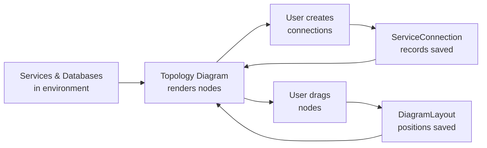

# Service Topology Diagram

Visualize your entire infrastructure at a glance with BridgePort's interactive topology diagram -- see which services talk to which databases, how traffic flows between components, and where everything runs.

## Table of Contents

- [Overview](#overview)
- [Quick Start](#quick-start)
- [How It Works](#how-it-works)
- [Creating Connections](#creating-connections)
  - [Connection Properties](#connection-properties)
  - [Direction Explained](#direction-explained)
- [Working with the Diagram](#working-with-the-diagram)
  - [Toolbar](#toolbar)
  - [Node Types](#node-types)
  - [Server Grouping](#server-grouping)
  - [Dragging and Layout Persistence](#dragging-and-layout-persistence)
  - [Node Popovers](#node-popovers)
- [Exporting as Mermaid](#exporting-as-mermaid)
- [Use Cases](#use-cases)
- [API Reference](#api-reference)
- [Troubleshooting](#troubleshooting)
- [Related](#related)

---

## Overview

The topology diagram lives on your **Dashboard** page and renders an interactive, draggable graph of every service and database in the selected environment. Connections between nodes represent the data flows you define -- a web app connecting to PostgreSQL on port 5432, an API server talking to Redis over TCP, a worker polling a message queue.

**What the topology diagram shows:**

- Services grouped visually by the server they run on
- Databases (both server-hosted and standalone)
- User-defined connections with port, protocol, and direction metadata
- Real-time status via color-coded nodes

**What it does not show:**

- Automatic network-level discovery (connections are user-defined)
- Cross-environment relationships (each environment has its own diagram)

---

## Quick Start

You need at least one environment with services or databases already created. If you are starting from scratch, see [Services](services.md) and [Databases](databases.md) first.

1. Navigate to the **Dashboard** (click the BridgePort logo or go to `/`).
2. Select your environment from the sidebar dropdown.
3. Your services and databases appear as nodes, grouped by server.
4. Click **Add Connection** to draw a line between two nodes.
5. Drag nodes to arrange the layout -- positions save automatically.

That is it. You now have a living architecture diagram that stays in sync with your infrastructure.

---

## How It Works



The diagram is composed of two data sources:

1. **Nodes** come automatically from your existing services (grouped by server) and databases in the selected environment. You do not need to create nodes manually -- they appear as soon as you add a service or database.

2. **Connections** are user-defined `ServiceConnection` records that you create to represent the relationships between nodes. Each connection stores source, target, port, protocol, direction, and an optional label.

3. **Layout** is stored as a `DiagramLayout` record per environment. When you drag nodes, the positions (x, y coordinates keyed by node ID) are persisted to the database so every team member sees the same arrangement.

---

## Creating Connections

### From the UI

1. On the Dashboard, click **Add Connection** (or the + button on the topology toolbar).
2. In the modal that appears, fill in:
   - **Source**: Pick a service or database
   - **Target**: Pick a different service or database
   - **Port** (optional): e.g., `5432`, `6379`, `8080`
   - **Protocol** (optional): e.g., `tcp`, `http`, `grpc`
   - **Label** (optional): e.g., "Primary DB", "Cache", "Message Queue"
   - **Direction**: `forward` (arrow from source to target) or `none` (undirected line)
3. Click **Create**.

The connection appears immediately on the diagram.

### From the API

```bash
curl -X POST https://your-bridgeport/api/connections \
  -H "Authorization: Bearer $TOKEN" \
  -H "Content-Type: application/json" \
  -d '{
    "environmentId": "env_abc123",
    "sourceType": "service",
    "sourceId": "svc_web",
    "targetType": "database",
    "targetId": "db_postgres",
    "port": 5432,
    "protocol": "tcp",
    "label": "Primary DB",
    "direction": "forward"
  }'
```

Expected response (201):

```json
{
  "id": "conn_xyz789",
  "environmentId": "env_abc123",
  "sourceType": "service",
  "sourceId": "svc_web",
  "targetType": "database",
  "targetId": "db_postgres",
  "port": 5432,
  "protocol": "tcp",
  "label": "Primary DB",
  "direction": "forward",
  "createdAt": "2026-02-25T10:00:00.000Z"
}
```

### Connection Properties

| Property | Type | Required | Description |
|----------|------|----------|-------------|
| `environmentId` | string | Yes | The environment this connection belongs to |
| `sourceType` | `"service"` or `"database"` | Yes | What kind of node the connection starts from |
| `sourceId` | string | Yes | The ID of the source service or database |
| `targetType` | `"service"` or `"database"` | Yes | What kind of node the connection goes to |
| `targetId` | string | Yes | The ID of the target service or database |
| `port` | integer | No | Port number (e.g., 5432, 6379, 443) |
| `protocol` | string | No | Protocol label (e.g., `tcp`, `http`, `grpc`, `amqp`) |
| `label` | string | No | Human-readable description shown on the edge |
| `direction` | `"forward"` or `"none"` | No (default: `"none"`) | Whether the edge has an arrow |

> [!NOTE]
> A connection is uniquely identified by the combination of environment, source, target, and port. You can have multiple connections between the same two nodes if they use different ports (e.g., a service connecting to PostgreSQL on both port 5432 and port 5433 for read replicas).

### Direction Explained

- **`forward`**: Renders an arrow from source to target. Use this when data flows in a clear direction -- a web app querying a database, or an API pushing to a message queue.
- **`none`**: Renders an undirected line. Use this for bidirectional communication or when direction does not matter -- two services that call each other, or a shared cache.

---

## Working with the Diagram

### Toolbar

The top-right of the diagram canvas has a toolbar with three controls:

- **Add Connection** (+) -- opens the Create Connection modal. Same as the Dashboard-level button.
- **Connections list** (chain-link icon) -- opens a dropdown listing every manual connection in the environment with its source → target names. Hover a row to reveal a quick delete icon; the connection is removed without leaving the dashboard.
- **Layout controls** -- fit-to-view, reset layout, and export as Mermaid (see [Exporting as Mermaid](#exporting-as-mermaid)).

The connections dropdown is the fastest way to audit and prune stale links when a diagram has grown dense.

### Node Types

The topology diagram renders three types of nodes:

| Node Type | Visual | Source |
|-----------|--------|--------|
| **ServiceNode** | Rounded rectangle with service name, status indicator, and exposed port | Every `Service` in the environment |
| **DatabaseNode** | Cylinder shape with database name and port | Every `Database` in the environment |
| **ServerGroupNode** | Container box that groups its child services (and databases hosted on it) | Every `Server` in the environment |

Each node displays a color-coded status indicator:

- **Green**: Running / Healthy
- **Yellow**: Warning / Starting
- **Red**: Stopped / Unhealthy / Error
- **Gray**: Unknown / Not checked

### Server Grouping

Services are automatically grouped inside their parent server's visual boundary. This gives you an immediate sense of which services are co-located.

```
┌─────────────────────────────────┐
│  web-server-01                  │
│  ┌───────────┐  ┌───────────┐  │
│  │  nginx    │  │  web-app  │  │
│  │  :80      │  │  :3000    │  │
│  └───────────┘  └───────────┘  │
└─────────────────────────────────┘
         │                │
         ▼                ▼
      ╔═══════╗    ┌───────────┐
      ║ Redis ║    │  api-01   │
      ║ :6379 ║    │  ┌─────┐  │
      ╚═══════╝    │  │ api │  │
                   │  └─────┘  │
                   └───────────┘
```

Databases that have a `serverId` appear inside that server's group. Standalone databases (no server association) appear as independent nodes outside any group.

### Dragging and Layout Persistence

Every node on the diagram is draggable. When you release a node, BridgePort saves the new position to the database:

```
PUT /api/diagram-layout
{
  "environmentId": "env_abc123",
  "positions": {
    "service:svc_web": { "x": 150, "y": 200 },
    "service:svc_api": { "x": 400, "y": 200 },
    "database:db_pg":  { "x": 275, "y": 450 }
  }
}
```

These positions are per-environment and shared across all users. If a teammate arranges the diagram, everyone sees the same layout on their next page load.

> [!TIP]
> If the diagram gets messy, you can reset positions by removing the layout record. Nodes will return to their auto-calculated positions.

### Node Popovers

Click on any node to see a popover with quick details:

- **Service nodes**: Container status, health status, image tag, server name, link to service detail page
- **Database nodes**: Database type, connection info, monitoring status, link to database detail page

---

## Exporting as Mermaid

You can export the current topology as a Mermaid diagram for use in external documentation, wikis, or READMEs.

```bash
curl "https://your-bridgeport/api/diagram-export?environmentId=env_abc123&format=mermaid" \
  -H "Authorization: Bearer $TOKEN"
```

Example response:

```json
{
  "mermaid": "graph TD\n  subgraph web_server_01[\"web-server-01\"]\n    svc_web[\"web-app (3000)\"]\n    svc_nginx[\"nginx (80)\"]\n  end\n  subgraph api_server_01[\"api-server-01\"]\n    svc_api[\"api (8080)\"]\n  end\n  db_postgres[(\"PostgreSQL (5432)\")]\n  svc_web -->|Primary DB| db_postgres\n  svc_api -->|Primary DB| db_postgres\n  svc_nginx --> svc_web"
}
```

Paste the `mermaid` value into any Mermaid-compatible renderer (GitHub markdown, Notion, Confluence) and it renders automatically.

> [!NOTE]
> The export only supports `mermaid` format. Pass `format=mermaid` as a query parameter. Other values return a 400 error.

---

## Use Cases

### 1. Onboarding New Team Members

When a new engineer joins, point them at the Dashboard topology. In seconds they can see which services exist, where they run, and how they connect -- without reading a 50-page architecture doc.

### 2. Incident Response

During an outage, the topology diagram shows unhealthy nodes in red. Follow the connections to trace upstream and downstream dependencies. "The API is red, and it connects to PostgreSQL which is also red -- the database is the root cause."

### 3. Architecture Documentation

Export the topology as Mermaid and embed it in your project's README or wiki. Since connections are maintained in BridgePort, the exported diagram stays up to date with a single API call.

### 4. Planning Infrastructure Changes

Before migrating a database to a new server, check the topology to see which services connect to it. You will know exactly what needs updating.

---

## API Reference

| Method | Endpoint | Auth | Description |
|--------|----------|------|-------------|
| `GET` | `/api/connections?environmentId=X` | Any role | List all connections in an environment |
| `POST` | `/api/connections` | Operator+ | Create a connection |
| `DELETE` | `/api/connections/:id` | Operator+ | Delete a connection |
| `GET` | `/api/diagram-layout?environmentId=X` | Any role | Get saved node positions |
| `PUT` | `/api/diagram-layout` | Operator+ | Save/update node positions |
| `GET` | `/api/diagram-export?environmentId=X&format=mermaid` | Any role | Export topology as Mermaid |

---

## Troubleshooting

### Nodes are not appearing on the diagram

- Make sure you have selected the correct environment in the sidebar dropdown.
- Services only appear if they belong to a server in the current environment.
- Databases only appear if they are associated with the current environment.

### "A connection with this source, target, and port already exists" (409)

Connections are unique per environment + source + target + port combination. If you need multiple connections between the same two nodes, use different port numbers.

### "Cannot create a connection from a node to itself" (400)

Self-connections are not allowed. If you need to represent a service connecting to itself (e.g., a recursive worker), consider using the label field on the service itself instead.

### Dragged positions are not saving

- Check that you have the `operator` or `admin` role. Viewers can view the diagram but cannot modify layout positions.
- Check the browser console for API errors. A 404 on the PUT endpoint usually means the environment ID is stale.

### Mermaid export renders incorrectly

- Ensure your Mermaid renderer supports `subgraph` syntax (most do since Mermaid 8.x).
- Special characters in service/database names are escaped automatically, but extremely long names may cause layout issues in the rendered output.

---

## Related

- [Services](services.md) -- Managing the services that appear as nodes
- [Databases](databases.md) -- Managing the databases that appear as nodes
- [Servers](servers.md) -- Understanding server grouping
- [Deployment Plans](deployment-plans.md) -- Orchestrating deployments across connected services
- [Monitoring Overview](monitoring.md) -- Real-time health data shown on topology nodes
