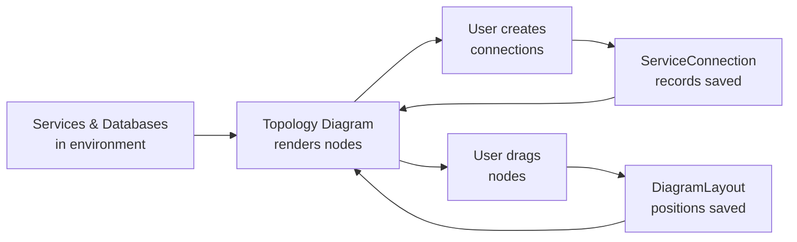

# Service Topology Diagram

Visualize your entire infrastructure at a glance with BRIDGEPORT's interactive topology diagram -- see which services talk to which databases, how traffic flows between components, and where everything runs.

## Table of Contents

- [Overview](#overview)
- [Quick Start](#quick-start)
- [How It Works](#how-it-works)
- [Creating Connections](#creating-connections)
  - [Connection metadata](#connection-metadata)
  - [Direction Explained](#direction-explained)
- [External Entities](#external-entities)
- [Server Clustering](#server-clustering)
- [Resizable Server Boxes](#resizable-server-boxes)
- [Connection Anchors](#connection-anchors)
- [Working with the Diagram](#working-with-the-diagram)
  - [Toolbar](#toolbar)
  - [Node Types](#node-types)
  - [Server Grouping](#server-grouping)
  - [Dragging and Layout Persistence](#dragging-and-layout-persistence)
  - [Node Popovers](#node-popovers)
- [Exporting as Mermaid](#exporting-as-mermaid)
- [Use Cases](#use-cases)
- [API Reference](#api-reference)
- [Troubleshooting](#troubleshooting)
- [Related](#related)

---

## Overview

The topology diagram lives on your **Dashboard** page and renders an interactive, draggable graph of every service and database in the selected environment. Connections between nodes represent the data flows you define -- a web app connecting to PostgreSQL on port 5432, an API server talking to Redis over TCP, a worker polling a message queue.

**What the topology diagram shows:**

- Services grouped visually by the server they run on
- Databases (both server-hosted and standalone)
- User-defined connections with port, protocol, and direction metadata
- Real-time status via color-coded nodes

**What it does not show:**

- Automatic network-level discovery (connections are user-defined)
- Cross-environment relationships (each environment has its own diagram)

---

## Quick Start

You need at least one environment with services or databases already created. If you are starting from scratch, see [Services](services.md) and [Databases](databases.md) first.

1. Navigate to the **Dashboard** (click the BRIDGEPORT logo or go to `/`).
2. Select your environment from the sidebar dropdown.
3. Your services and databases appear as nodes, grouped by server.
4. Click **Add Connection** to draw a line between two nodes.
5. Drag nodes to arrange the layout -- positions save automatically.

That is it. You now have a living architecture diagram that stays in sync with your infrastructure.

---

## How It Works



The diagram is composed of two data sources:

1. **Nodes** come automatically from your existing services (grouped by server) and databases in the selected environment. You do not need to create nodes manually -- they appear as soon as you add a service or database.

2. **Connections** are user-defined `ServiceConnection` records that you create to represent the relationships between nodes. Each connection stores source, target, port, protocol, direction, and an optional label.

3. **Layout** is stored as a `DiagramLayout` record per environment. When you drag nodes, the positions (x, y coordinates keyed by node ID) are persisted to the database so every team member sees the same arrangement.

---

## Creating Connections

### From the UI

You have two ways to create connections:

**Drag-to-connect (fast path):**
Hover any service or database node; the colored dots on each side are connection handles. Drag from a handle and release on another node. The connection is saved with the default direction (`forward`) and no port/protocol metadata. To delete, click the X that appears on the manual (green) edge, or use the Connections list dropdown.

**Add Connection modal (full control):**
Click the **+** button in the topology toolbar to open a form where you can pick source/target from dropdowns and fill in port, protocol, label, and direction. The connection appears immediately on the diagram.

### Connection metadata

| Property | Type | Required | Description |
|----------|------|----------|-------------|
| `environmentId` | string | Yes | The environment this connection belongs to |
| `sourceType` | `"service"`, `"database"`, or `"external"` | Yes | What kind of node the connection starts from |
| `sourceId` | string | Yes | The ID of the source service, database, or external entity |
| `sourceHandle` | string | No | Which handle on the source the user dragged from (`"left"`, `"right"`, `"top"`, `"bottom"`). Used to preserve the exact anchor across reloads. |
| `targetType` | `"service"`, `"database"`, or `"external"` | Yes | What kind of node the connection goes to |
| `targetId` | string | Yes | The ID of the target service, database, or external entity |
| `targetHandle` | string | No | Which handle on the target the user dropped onto |
| `port` | integer | No | Port number (e.g., 5432, 6379, 443) |
| `protocol` | string | No | Protocol label (e.g., `tcp`, `http`, `grpc`, `amqp`) |
| `label` | string | No | Human-readable description shown on the edge |
| `direction` | `"forward"` or `"none"` | No (default: `"none"`) | Whether the edge has an arrow |

> [!NOTE]
> A connection is uniquely identified by the combination of environment, source, target, and port. You can have multiple connections between the same two nodes if they use different ports. When port is omitted, the backend rejects duplicates between the same endpoints with `409 Conflict`.

### From the API

```bash
curl -X POST https://your-bridgeport/api/connections \
  -H "Authorization: Bearer $TOKEN" \
  -H "Content-Type: application/json" \
  -d '{
    "environmentId": "env_abc123",
    "sourceType": "service",
    "sourceId": "svc_web",
    "targetType": "database",
    "targetId": "db_postgres",
    "port": 5432,
    "protocol": "tcp",
    "label": "Primary DB",
    "direction": "forward"
  }'
```

Expected response (201):

```json
{
  "id": "conn_xyz789",
  "environmentId": "env_abc123",
  "sourceType": "service",
  "sourceId": "svc_web",
  "targetType": "database",
  "targetId": "db_postgres",
  "port": 5432,
  "protocol": "tcp",
  "label": "Primary DB",
  "direction": "forward",
  "createdAt": "2026-02-25T10:00:00.000Z"
}
```

### Direction Explained

- **`forward`**: Renders an arrow from source to target. Use this when data flows in a clear direction -- a web app querying a database, or an API pushing to a message queue.
- **`none`**: Renders an undirected line. Use this for bidirectional communication or when direction does not matter -- two services that call each other, or a shared cache.

---

## External Entities

Not every node on your diagram is a server-hosted service. Inbound traffic often originates from systems you don't run yourself -- Cloudflare, a CDN, an external browser/client, or another company's API. **External entities** model these on the canvas without pretending they're services.

```
  ┌──────────────┐         ┌──────────────────────────────┐
  │  Cloudflare  │  --->   │  web-server-01               │
  │  (external)  │         │  ┌────────────┐              │
  └──────────────┘         │  │  nginx     │              │
                           │  └────────────┘              │
                           └──────────────────────────────┘
```

- Click the **globe icon** in the topology toolbar to drop a new external entity onto the canvas. You'll be prompted for a label (e.g. `"Cloudflare"`) and a `kind` (e.g. `cloudflare`, `cdn`, `web`, `client`).
- The `kind` drives the visual accent (Cloudflare/CDN → orange, Web/Client → cyan, anything else → slate).
- Drag from any of the four handles to a service or database to represent inbound traffic. The connection is stored exactly like any other `ServiceConnection`, but with `sourceType: "external"`.
- Resize an external entity with the dashed corner handles when it's selected.
- Delete via the trash icon on the node (operator role required). Connections referencing the deleted entity are cleaned up automatically.

External entities live per-environment and persist their position and size across reloads.

### API

| Method | Endpoint | Auth | Description |
|--------|----------|------|-------------|
| `GET` | `/api/environments/:envId/external-entities` | Any role | List external entities for an environment |
| `POST` | `/api/environments/:envId/external-entities` | Operator+ | Create an external entity |
| `PATCH` | `/api/external-entities/:id` | Operator+ | Update label, kind, position, size |
| `DELETE` | `/api/external-entities/:id` | Operator+ | Delete the entity (cleans up referring connections) |

---

## Server Clustering

When several servers belong together logically -- an HA pair, a swarm or Kubernetes node set, or a regional grouping -- you can wrap them in a **cluster** container. Clusters group servers visually and let you move or collapse them as a unit.

- Click the **stack icon** in the topology toolbar to create a new cluster. You'll be prompted for a name (e.g. `"Production HA"`).
- Open a server's detail view and set its `clusterId` to the cluster's ID (via `PATCH /api/servers/:id`). The diagram parents the server's group inside the cluster on the next render.
- Collapse a cluster from its header to fold all child servers into a single aggregate node. **Edges from any child server reroute to the cluster** while collapsed -- a per-server collapse state inside a collapsed cluster is ignored (the cluster always wins).
- Delete a cluster via its header trash icon. Member servers are **not** deleted -- their `clusterId` is set to `NULL` so they re-emerge as standalone server groups.

### API

| Method | Endpoint | Auth | Description |
|--------|----------|------|-------------|
| `GET` | `/api/environments/:envId/server-clusters` | Any role | List clusters for an environment |
| `POST` | `/api/environments/:envId/server-clusters` | Operator+ | Create a cluster |
| `PATCH` | `/api/server-clusters/:id` | Operator+ | Update name, color, collapsed flag, position, size |
| `DELETE` | `/api/server-clusters/:id` | Operator+ | Delete the cluster (sets child `Server.clusterId = NULL`) |
| `PATCH` | `/api/servers/:id` | Operator+ | Set/clear `clusterId` on a server (pass `null` to disassociate) |

---

## Resizable Server Boxes

Densely-populated server groups can become unreadable in a fixed-width box. To fix that, **select a server box** (click its border) -- four resize handles appear on the corners. Drag them to enlarge the container so child services stay legible.

The new size persists in the diagram layout for everyone on the team, alongside the existing position data. Server boxes can't be shrunk below the bounding box of their currently-laid-out children to avoid clipping. The same NodeResizer behavior is available on external entities and cluster containers.

---

## Connection Anchors

When you drag a connection between two nodes, BRIDGEPORT now remembers **the exact handle (anchor) you dragged from and dropped onto** -- not just "this node to that node". This matters when:

- You routed a connection from the **bottom** of a node to the **top** of another (vertical flow).
- You want auto-inferred and manual edges to share consistent routing across reloads.

Each node exposes four handles -- `left`, `right`, `top`, `bottom` -- with stable IDs that are stored on the `ServiceConnection` row as `sourceHandle` and `targetHandle`. The Add Connection modal sets these to `null` (no specific anchor) so React Flow picks the shortest path; drag-to-connect captures the user's exact anchor choice.

---

## Working with the Diagram

### Toolbar

The top-right of the diagram canvas has a toolbar with several controls:

- **Add Connection** (+) -- opens the Create Connection modal. Same as the Dashboard-level button.
- **Add external entity** (globe icon) -- drops a new external, non-server entity on the canvas. See [External Entities](#external-entities).
- **New cluster** (stack icon) -- creates a logical grouping of servers. See [Server Clustering](#server-clustering).
- **Connections list** (chain-link icon) -- opens a dropdown listing every manual connection in the environment with its source → target names. Hover a row to reveal a quick delete icon; the connection is removed without leaving the dashboard.
- **Layout controls** -- fit-to-view, reset layout, and export as Mermaid (see [Exporting as Mermaid](#exporting-as-mermaid)).

The connections dropdown is the fastest way to audit and prune stale links when a diagram has grown dense.

### Node Types

The topology diagram renders three types of nodes:

| Node Type | Visual | Source |
|-----------|--------|--------|
| **ServiceNode** | Rounded rectangle with service name, status indicator, and exposed port | Every `Service` in the environment |
| **DatabaseNode** | Cylinder shape with database name and port | Every `Database` in the environment |
| **ServerGroupNode** | Container box that groups its child services (and databases hosted on it) -- resizable when selected | Every `Server` in the environment |
| **ExternalEntityNode** | Pill-shaped node with a globe icon, color-coded by `kind` | Every `ExternalEntity` in the environment |
| **ServerClusterNode** | Dashed container that groups multiple server boxes; collapsible | Every `ServerCluster` in the environment |

Each node displays a color-coded status indicator:

- **Green**: Running / Healthy
- **Yellow**: Warning / Starting
- **Red**: Stopped / Unhealthy / Error
- **Gray**: Unknown / Not checked

### Server Grouping

Services are automatically grouped inside their parent server's visual boundary. This gives you an immediate sense of which services are co-located.

```
┌─────────────────────────────────┐
│  web-server-01                  │
│  ┌───────────┐  ┌───────────┐  │
│  │  nginx    │  │  web-app  │  │
│  │  :80      │  │  :3000    │  │
│  └───────────┘  └───────────┘  │
└─────────────────────────────────┘
         │                │
         ▼                ▼
      ╔═══════╗    ┌───────────┐
      ║ Redis ║    │  api-01   │
      ║ :6379 ║    │  ┌─────┐  │
      ╚═══════╝    │  │ api │  │
                   │  └─────┘  │
                   └───────────┘
```

Databases that have a `serverId` appear inside that server's group. Standalone databases (no server association) appear as independent nodes outside any group.

### Dragging and Layout Persistence

Every node on the diagram is draggable. When you release a node, BRIDGEPORT saves the new position to the database:

```
PUT /api/diagram-layout
{
  "environmentId": "env_abc123",
  "positions": {
    "service:svc_web": { "x": 150, "y": 200 },
    "service:svc_api": { "x": 400, "y": 200 },
    "database:db_pg":  { "x": 275, "y": 450 }
  }
}
```

These positions are per-environment and shared across all users. If a teammate arranges the diagram, everyone sees the same layout on their next page load.

> [!TIP]
> If the diagram gets messy, you can reset positions by removing the layout record. Nodes will return to their auto-calculated positions.

### Node Popovers

Click on any node to see a popover with quick details:

- **Service nodes**: Container status, health status, image tag, server name, link to service detail page
- **Database nodes**: Database type, connection info, monitoring status, link to database detail page

---

## Exporting as Mermaid

You can export the current topology as a Mermaid diagram for use in external documentation, wikis, or READMEs.

```bash
curl "https://your-bridgeport/api/diagram-export?environmentId=env_abc123&format=mermaid" \
  -H "Authorization: Bearer $TOKEN"
```

Example response:

```json
{
  "mermaid": "graph TD\n  subgraph web_server_01[\"web-server-01\"]\n    svc_web[\"web-app (3000)\"]\n    svc_nginx[\"nginx (80)\"]\n  end\n  subgraph api_server_01[\"api-server-01\"]\n    svc_api[\"api (8080)\"]\n  end\n  db_postgres[(\"PostgreSQL (5432)\")]\n  svc_web -->|Primary DB| db_postgres\n  svc_api -->|Primary DB| db_postgres\n  svc_nginx --> svc_web"
}
```

Paste the `mermaid` value into any Mermaid-compatible renderer (GitHub markdown, Notion, Confluence) and it renders automatically.

> [!NOTE]
> The export only supports `mermaid` format. Pass `format=mermaid` as a query parameter. Other values return a 400 error.

---

## Use Cases

### 1. Onboarding New Team Members

When a new engineer joins, point them at the Dashboard topology. In seconds they can see which services exist, where they run, and how they connect -- without reading a 50-page architecture doc.

### 2. Incident Response

During an outage, the topology diagram shows unhealthy nodes in red. Follow the connections to trace upstream and downstream dependencies. "The API is red, and it connects to PostgreSQL which is also red -- the database is the root cause."

### 3. Architecture Documentation

Export the topology as Mermaid and embed it in your project's README or wiki. Since connections are maintained in BRIDGEPORT, the exported diagram stays up to date with a single API call.

### 4. Planning Infrastructure Changes

Before migrating a database to a new server, check the topology to see which services connect to it. You will know exactly what needs updating.

---

## API Reference

| Method | Endpoint | Auth | Description |
|--------|----------|------|-------------|
| `GET` | `/api/connections?environmentId=X` | Any role | List all connections in an environment |
| `POST` | `/api/connections` | Operator+ | Create a connection (`sourceType`/`targetType` may be `service`, `database`, or `external`) |
| `DELETE` | `/api/connections/:id` | Operator+ | Delete a connection |
| `GET` | `/api/diagram-layout?environmentId=X` | Any role | Get saved node positions (`x`, `y`, optional `width`, `height`) |
| `PUT` | `/api/diagram-layout` | Operator+ | Save/update node positions (incl. resized width/height) |
| `GET` | `/api/diagram-export?environmentId=X&format=mermaid` | Any role | Export topology as Mermaid (services, databases, external entities) |
| `GET` | `/api/environments/:envId/external-entities` | Any role | List external entities |
| `POST` | `/api/environments/:envId/external-entities` | Operator+ | Create an external entity |
| `PATCH` | `/api/external-entities/:id` | Operator+ | Update an external entity |
| `DELETE` | `/api/external-entities/:id` | Operator+ | Delete an external entity (cleans up referring connections) |
| `GET` | `/api/environments/:envId/server-clusters` | Any role | List server clusters |
| `POST` | `/api/environments/:envId/server-clusters` | Operator+ | Create a server cluster |
| `PATCH` | `/api/server-clusters/:id` | Operator+ | Update a cluster (name, color, collapsed, position, size) |
| `DELETE` | `/api/server-clusters/:id` | Operator+ | Delete a cluster (members keep existing; `clusterId` set to `NULL`) |
| `PATCH` | `/api/servers/:id` | Operator+ | Includes `clusterId` (string or `null`) to attach/detach a server from a cluster |

---

## Troubleshooting

### Nodes are not appearing on the diagram

- Make sure you have selected the correct environment in the sidebar dropdown.
- Services only appear if they belong to a server in the current environment.
- Databases only appear if they are associated with the current environment.

### "A connection with this source, target, and port already exists" (409)

Connections are unique per environment + source + target + port combination. If you need multiple connections between the same two nodes, use different port numbers.

### "Cannot create a connection from a node to itself" (400)

Self-connections are not allowed. If you need to represent a service connecting to itself (e.g., a recursive worker), consider using the label field on the service itself instead.

### Dragged positions are not saving

- Check that you have the `operator` or `admin` role. Viewers can view the diagram but cannot modify layout positions.
- Check the browser console for API errors. A 404 on the PUT endpoint usually means the environment ID is stale.

### Mermaid export renders incorrectly

- Ensure your Mermaid renderer supports `subgraph` syntax (most do since Mermaid 8.x).
- Special characters in service/database names are escaped automatically, but extremely long names may cause layout issues in the rendered output.

---

## Related

- [Services](services.md) -- Managing the services that appear as nodes
- [Databases](databases.md) -- Managing the databases that appear as nodes
- [Servers](servers.md) -- Understanding server grouping
- [Deployment Plans](deployment-plans.md) -- Orchestrating deployments across connected services
- [Monitoring Overview](monitoring.md) -- Real-time health data shown on topology nodes
