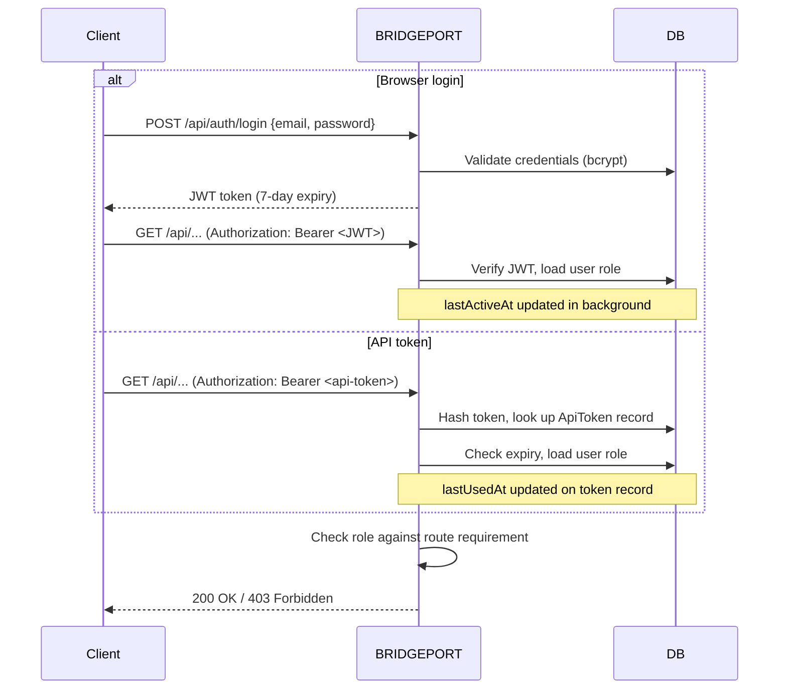

# Users & Roles

BRIDGEPORT uses a three-tier role system (admin, operator, viewer) with JWT sessions and API tokens to control who can view, operate, and administer the platform.

## Table of Contents

1. [Quick Start](#quick-start)
2. [How It Works](#how-it-works)
3. [Roles & Permissions](#roles--permissions)
4. [Managing Users (Admin)](#managing-users-admin)
5. [Self-Service Account](#self-service-account)
6. [API Tokens](#api-tokens)
7. [Service Accounts](#service-accounts)
8. [Initial Admin Setup](#initial-admin-setup)
9. [Active User Tracking](#active-user-tracking)
10. [Configuration Options](#configuration-options)
11. [Troubleshooting](#troubleshooting)
12. [Related](#related)

---

## Quick Start

After your first admin account exists (see [Initial Admin Setup](#initial-admin-setup)), create additional users in under a minute:

1. Navigate to **Admin > Users** (`/admin/users`).
2. Click **Add User**.
3. Enter email, password (8+ characters), optional name, and role.
4. Click **Create**.

The new user can log in immediately and receives a welcome notification.

---

## How It Works

BRIDGEPORT supports two authentication methods: **JWT sessions** for interactive browser use and **API tokens** for programmatic access. Both carry the user's role and grant the same permissions.



**Authentication flow details:**

1. The `authenticate` plugin tries the `Authorization: Bearer` value as an **API token first** (hash lookup in the `ApiToken` table).
2. If no API token matches, it attempts **JWT verification**.
3. If neither succeeds, the request gets `401 Unauthorized`.
4. After authentication, route-level middleware (`requireAdmin`, `requireOperator`) checks the user's role.

JWTs expire after **7 days**. API tokens have optional expiry set at creation time.

---

## Roles & Permissions

BRIDGEPORT has three roles in strict hierarchy: **admin > operator > viewer**. Higher roles inherit all permissions of lower roles.

### Role Descriptions

| Role | Purpose | Typical User |
|------|---------|--------------|
| **viewer** | Read-only access to all resources in every environment | Stakeholders, on-call engineers, auditors |
| **operator** | Viewer permissions + operational actions (deploy, manage secrets, trigger backups) | Day-to-day platform engineers |
| **admin** | Full access including user management, environments, and system settings | Platform owners, team leads |

### Full Permissions Matrix

| Action | Admin | Operator | Viewer |
|--------|:-----:|:--------:|:------:|
| **View all resources** (servers, services, metrics, logs) | Yes | Yes | Yes |
| **View audit logs** | Yes | Yes | Yes |
| **View deployment history** | Yes | Yes | Yes |
| **Reveal secret values** | Yes | Yes* | Yes* |
| **Deploy services** | Yes | Yes | No |
| **Restart / stop / start containers** | Yes | Yes | No |
| **Run predefined commands** (shell, migrate) | Yes | Yes | No |
| **Manage secrets** (create, update, delete) | Yes | Yes | No |
| **Manage config files & sync** | Yes | Yes | No |
| **Manage databases & backups** | Yes | Yes | No |
| **Trigger health checks** | Yes | Yes | No |
| **Create / delete environments** | Yes | No | No |
| **Edit environment settings** | Yes | No | No |
| **Manage users** (create, edit roles, delete) | Yes | No | No |
| **Manage service types / database types** | Yes | No | No |
| **System settings** (SSH timeouts, webhook config) | Yes | No | No |
| **SMTP / Slack / webhook channel config** | Yes | No | No |
| **Delete servers** | Yes | No | No |

\* Secret reveal is subject to the per-environment `allowSecretReveal` setting and the per-secret `neverReveal` flag, both configured by admins.

> [!WARNING]
> An admin cannot change their own role. This prevents accidental self-demotion. Another admin must make the change.

---

## Managing Users (Admin)

All user management is under **Admin > Users** (`/admin/users`). These actions require the `admin` role.

### Creating a User

```http
POST /api/users
Authorization: Bearer <admin-token>
Content-Type: application/json

{
  "email": "alice@example.com",
  "password": "securepassword",
  "name": "Alice",
  "role": "operator"
}
```

**Response (200):**
```json
{
  "user": {
    "id": "clxyz...",
    "email": "alice@example.com",
    "name": "Alice",
    "role": "operator",
    "createdAt": "2026-02-25T10:00:00.000Z",
    "updatedAt": "2026-02-25T10:00:00.000Z"
  }
}
```

Validation: password must be 8+ characters, email must be unique (returns `409 Conflict` if taken). The new user receives a welcome notification.

> [!NOTE]
> Email addresses cannot be changed after creation. To change a user's email, delete the account and create a new one.

### Listing Users

```http
GET /api/users
Authorization: Bearer <admin-token>
```

Returns all users ordered by creation date (newest first). Each record includes `id`, `email`, `name`, `role`, `lastActiveAt`, `createdAt`, and `updatedAt`. Password hashes are never returned.

### Editing a User

Admins can update `name` and `role`. Email is immutable.

```http
PATCH /api/users/:id
Authorization: Bearer <admin-token>
Content-Type: application/json

{
  "role": "admin"
}
```

When a role changes, the affected user receives a notification: _"Your role has been changed from operator to admin."_

> [!NOTE]
> Non-admin users can call `PATCH /api/users/:id` on their own account to update their `name`. Including a `role` field is rejected with `403 Forbidden`.

### Resetting a User's Password

Admins can reset any user's password without knowing the current one:

```http
POST /api/users/:id/change-password
Authorization: Bearer <admin-token>
Content-Type: application/json

{
  "newPassword": "newSecurePassword"
}
```

The affected user receives a notification: _"Your password was changed by an administrator."_

### Deleting a User

```http
DELETE /api/users/:id
Authorization: Bearer <admin-token>
```

Returns `400 Bad Request` if you attempt to delete your own account. All related records (deployments, audit logs, API tokens, notifications) are cascade-deleted.

> [!WARNING]
> Deletion is permanent. There is no deactivation mechanism. If you need to revoke access without losing audit history, consider rotating the user's password and revoking all their API tokens instead.

---

## Self-Service Account

Every user, regardless of role, can manage their own profile without admin involvement.

### Accessing My Account

Click the **user icon** at the bottom of the left sidebar. The **My Account** modal opens with two sections:

- **Profile** -- update your display name (email and role are read-only)
- **Change Password** -- update your own password

### Changing Your Password

1. Enter your **Current Password**.
2. Enter your **New Password** (8+ characters).
3. Click **Change Password**.

```http
POST /api/users/:id/change-password
Authorization: Bearer <token>
Content-Type: application/json

{
  "currentPassword": "oldPassword",
  "newPassword": "newPassword"
}
```

> [!NOTE]
> Non-admin users must provide `currentPassword`. Admins resetting another user's password can omit it.

---

## API Tokens

API tokens let scripts, CI/CD pipelines, and external tools authenticate without exposing user passwords. Tokens are admin-managed and live under **Admin > Integrations** (`/admin/integrations`).

### Token Anatomy

Every token has four properties beyond its name:

- **Owner** — either a user or a [service account](#service-accounts). Service-account ownership is preferred for tools, since SA tokens survive when individual admins leave.
- **Role** — `admin`, `operator`, or `viewer`. The token's role is capped at the owner's role: a viewer-owned token cannot be operator-grade.
- **Environment scope** — either "all environments" or a specific allowlist. Env-scoped tokens cannot reach environments outside their allowlist and are **denied on global routes** (users, system settings, audit log, etc.).
- **Expiry** — mandatory, max 365 days. Forces rotation.

Tokens are prefixed `bport_pat_` so they're trivially detectable in logs and secret scanners.

### Creating a Token

UI: **Admin > Integrations > New Token**. Fill in the owner, role, scope, and expiry.

API:
```http
POST /api/admin/tokens
Authorization: Bearer <admin-token-or-jwt>
Content-Type: application/json

{
  "name": "github-actions-staging",
  "ownerServiceAccountId": "clxyz...",
  "role": "operator",
  "allEnvironments": false,
  "environmentIds": ["clenv-staging..."],
  "expiresInDays": 90
}
```

Either `ownerUserId` or `ownerServiceAccountId` is required (exactly one). When `allEnvironments` is `false`, `environmentIds` must contain at least one ID.

**Response:**
```json
{
  "token": "bport_pat_abc123...",
  "tokenRecord": {
    "id": "cltok...",
    "name": "github-actions-staging",
    "tokenPrefix": "bport_pat_abc1",
    "role": "operator",
    "allEnvironments": false,
    "expiresAt": "2026-08-18T10:00:00.000Z",
    "createdAt": "2026-05-20T10:00:00.000Z",
    "userId": null,
    "serviceAccountId": "clxyz..."
  }
}
```

> [!WARNING]
> The full token value is returned **only once** at creation time. BRIDGEPORT stores only a SHA-256 hash. Copy it immediately and store it in your secrets manager. If lost, revoke the token and mint a new one.

### Listing Tokens

```http
GET /api/admin/tokens
Authorization: Bearer <admin-token>
```

Optional query: `?ownerUserId=<id>` or `?ownerServiceAccountId=<id>` to filter. Records include scope and ownership but never the token hash.

### Revoking a Token

```http
DELETE /api/admin/tokens/:tokenId
Authorization: Bearer <admin-token>
```

Revocation is immediate. Any request using the token will get `401 Unauthorized` after this call returns.

### Using a Token

**HTTP header (most requests):**
```http
Authorization: Bearer bport_pat_abc123...
```

**Query parameter (SSE connections):**
```
GET /api/events?token=bport_pat_abc123...
```

The SSE query parameter approach exists because `EventSource` clients cannot set custom headers.

### Effective Role at Use Time

When the token authenticates a request, BRIDGEPORT computes `effective role = min(token role, owner role)`. If an owner gets demoted after a token was minted, the token's permissions drop automatically — no need to re-issue.

### Token Use Cases

| Use Case | Recommended Setup |
|----------|-------------------|
| CI/CD deploy to staging | Service account, operator, env-scoped to staging, 90-day expiry |
| Read-only dashboards | Service account, viewer, all environments |
| Personal CLI | User-owned, role matches the user, all environments |
| Webhook integrations | Service account, role matches the action, env-scoped |

> [!TIP]
> Name tokens descriptively (`"github-actions-staging"`, `"grafana-readonly"`). `lastUsedAt` helps find stale tokens that can be revoked.

---

## Service Accounts

Service accounts are machine identities — they own tokens but never log in. Use them for any tool that talks to BRIDGEPORT (CI/CD, monitoring scrapers, deploy bots) so the credential is decoupled from any one person's user account.

### Why Service Accounts

If a CI pipeline uses a token owned by `alice@company.com` and Alice leaves, her account is deactivated and the pipeline breaks. With a service account, the credential is attached to a named identity (`ci-deploy-staging`) that outlives any admin.

### Managing Service Accounts

UI: **Admin > Integrations > New Service Account**.

```http
POST /api/admin/service-accounts
Authorization: Bearer <admin-token>
Content-Type: application/json

{
  "name": "ci-deploy-staging",
  "description": "GitHub Actions deployer for staging",
  "role": "operator"
}
```

Names follow the pattern `[a-z0-9][a-z0-9_-]*` (lowercase, max 64 chars). Each SA has a role that caps all tokens minted against it.

### Disabling

Set `disabled: true` via `PATCH /api/admin/service-accounts/:id` to immediately invalidate every token belonging to that SA without revoking them individually. Re-enable later to restore.

### Deletion

`DELETE /api/admin/service-accounts/:id` cascades to all of the SA's tokens. Audit log entries created by the SA are preserved (the `serviceAccountId` link nulls out via `ON DELETE SET NULL`).

---

## Initial Admin Setup

On first boot, if no users exist, BRIDGEPORT creates an admin account from environment variables:

```bash
ADMIN_EMAIL=admin@example.com
ADMIN_PASSWORD=your-secure-password
```

The `bootstrapAdminUser()` function in `src/services/auth.ts` checks `prisma.user.count()` and only proceeds if zero users exist, making it safe to leave these variables set permanently.

If neither variable is set, use the one-time registration endpoint instead:

```http
POST /api/auth/register
Content-Type: application/json

{
  "email": "admin@example.com",
  "password": "securepassword",
  "name": "Admin"
}
```

This creates the user with the `admin` role and returns a JWT. It returns `403 Forbidden` if any user already exists, effectively disabling open registration after bootstrap.

> [!NOTE]
> `ADMIN_PASSWORD` must be at least 8 characters. `ADMIN_EMAIL` must be a valid email. Invalid values cause a startup failure.

---

## Active User Tracking

BRIDGEPORT tracks when users are actively using the application. On every **JWT-authenticated** request, the `lastActiveAt` field is updated in the background (fire-and-forget, no added latency).

### Viewing Active Users

In **Admin > Users**, the page header shows an active users summary. Individual user cards show a green "Online" badge for currently active users.

```http
GET /api/users/active
Authorization: Bearer <admin-token>
```

Returns users whose `lastActiveAt` is within the configured active window.

### Configuring the Active Window

The window is controlled by `activeUserWindowMin` in System Settings (default: **15 minutes**):

```http
PATCH /api/settings/system
Authorization: Bearer <admin-token>
Content-Type: application/json

{
  "activeUserWindowMin": 30
}
```

> [!NOTE]
> API token requests do **not** update `lastActiveAt`. Active user tracking reflects interactive browser sessions only.

---

## Configuration Options

| Setting | Location | Default | Description |
|---------|----------|---------|-------------|
| `ADMIN_EMAIL` | Environment variable | -- | Email for auto-created admin on first boot |
| `ADMIN_PASSWORD` | Environment variable | -- | Password for auto-created admin on first boot |
| `activeUserWindowMin` | System Settings | `15` | Minutes of inactivity before a user is no longer "active" |
| `allowSecretReveal` | Environment Settings > Configuration | `true` | Whether non-admin users can reveal secret values |
| JWT expiry | Hardcoded | `7 days` | JWT token lifetime |

---

## Troubleshooting

**"Email already in use" when creating a user**
Email must be unique. Check existing users with `GET /api/users`.

**"Cannot delete your own account"**
Intentional safeguard. Log in as a different admin to delete the account.

**"Current password is incorrect" when changing password**
The submitted current password does not match. Admins can bypass this by calling `POST /api/users/:id/change-password` for another user without providing `currentPassword`.

**"Registration disabled" on `POST /api/auth/register`**
At least one user exists. Use `POST /api/users` with an admin token to create additional accounts.

**API token returns 401 after rotation**
Any system using the old token value will fail. Update the token in all dependent systems before revoking the old one. Consider creating the replacement token first, updating integrations, then deleting the old token.

**User not showing as "Online" in admin panel**
`lastActiveAt` is only updated on JWT requests, not API token requests. Users authenticating exclusively via API tokens (e.g., service accounts) will not appear online.

**Admin cannot change their own role in the UI**
The role dropdown is intentionally disabled when editing your own account. Ask another admin to make the change.

---

## Related

- [Environments](environments.md) -- per-environment `allowSecretReveal` permission
- [API Reference](../reference/api.md) -- full endpoint documentation
- [Real-Time Events](../reference/events.md) -- SSE authentication with API tokens
- [System Settings](../reference/system-settings.md) -- `activeUserWindowMin` and other defaults
