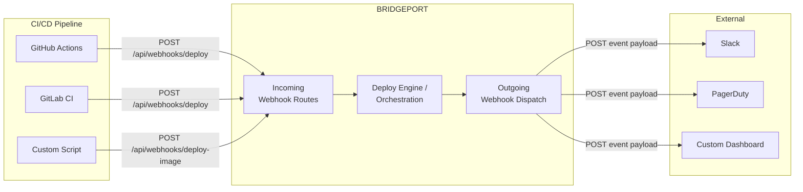
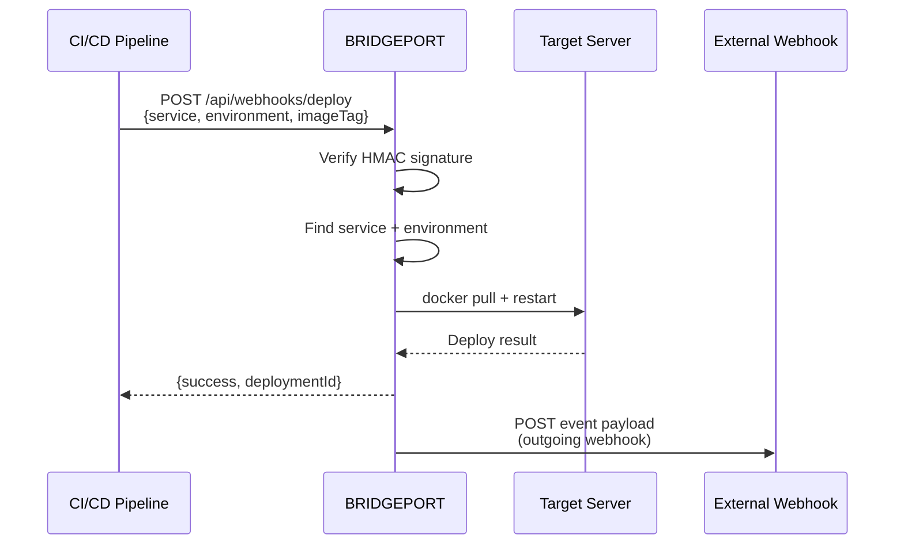

# Webhooks

Connect your CI/CD pipelines to BRIDGEPORT for automatic deployments on push, and send BRIDGEPORT events to external systems like Slack, PagerDuty, or custom dashboards.

## Table of Contents

- [Overview](#overview)
- [Quick Start](#quick-start)
- [How It Works](#how-it-works)
- [Incoming Webhooks (CI/CD Triggers)](#incoming-webhooks-cicd-triggers)
  - [Deploy a Single Service](#deploy-a-single-service)
  - [Deploy All Services for an Image](#deploy-all-services-for-an-image)
  - [GitHub Webhook Integration](#github-webhook-integration)
  - [Payload Reference](#payload-reference)
  - [Authentication](#authentication)
- [Outgoing Webhooks (Event Notifications)](#outgoing-webhooks-event-notifications)
  - [Setting Up Outgoing Webhooks](#setting-up-outgoing-webhooks)
  - [Outgoing Webhook Payload Format](#outgoing-webhook-payload-format)
  - [Filtering by Type and Environment](#filtering-by-type-and-environment)
  - [Signature Verification](#signature-verification)
  - [Retry Behavior](#retry-behavior)
  - [Testing Outgoing Webhooks](#testing-outgoing-webhooks)
- [CI/CD Integration Examples](#cicd-integration-examples)
  - [GitHub Actions](#github-actions)
  - [GitLab CI/CD](#gitlab-cicd)
  - [Generic Script / curl](#generic-script--curl)
- [Configuration Options](#configuration-options)
- [Troubleshooting](#troubleshooting)
- [Related](#related)

---

## Overview

BRIDGEPORT has two webhook systems that serve different purposes:

| Direction | Purpose | Who configures it | Auth mechanism |
|-----------|---------|-------------------|----------------|
| **Incoming** | CI/CD pipelines call BRIDGEPORT to trigger deployments | DevOps engineer (env vars on BRIDGEPORT + CI secrets) | HMAC signature (`X-Webhook-Signature` or `X-Hub-Signature-256`) |
| **Outgoing** | BRIDGEPORT calls external URLs when events occur (deploy success, health failure, etc.) | Admin (via Admin > Notifications > Webhooks) | Optional HMAC signature (`X-Webhook-Signature`) |



---

## Quick Start

**Incoming webhook** -- deploy a service after a CI build:

1. Set the `WEBHOOK_SECRET` environment variable on your BRIDGEPORT instance.
2. In your CI pipeline, add a step that calls BRIDGEPORT after a successful build:

```bash
curl -X POST https://your-bridgeport.example.com/api/webhooks/deploy \
  -H "Content-Type: application/json" \
  -H "X-Webhook-Signature: $(echo -n '{"service":"my-api","environment":"production","imageTag":"v2.1.0"}' | openssl dgst -sha256 -hmac "$WEBHOOK_SECRET" | cut -d' ' -f2)" \
  -d '{"service":"my-api","environment":"production","imageTag":"v2.1.0"}'
```

**Outgoing webhook** -- get notified when deployments happen:

1. Go to **Admin > Notifications** and click the **Webhooks** tab.
2. Click **Add Webhook**, enter a name and your endpoint URL.
3. (Optional) Add a secret for payload signing.
4. Click **Test** to verify connectivity.

---

## How It Works



---

## Incoming Webhooks (CI/CD Triggers)

### Deploy a Single Service

**Endpoint:** `POST /api/webhooks/deploy`

The simplest incoming webhook. Identify a service by name (or ID) and environment name, optionally specify an image tag.

```bash
curl -X POST https://your-bridgeport.example.com/api/webhooks/deploy \
  -H "Content-Type: application/json" \
  -H "X-Webhook-Signature: $SIGNATURE" \
  -d '{
    "service": "my-api",
    "environment": "production",
    "imageTag": "v2.1.0"
  }'
```

**Response (success):**

```json
{
  "success": true,
  "deploymentId": "dep_abc123",
  "status": "success"
}
```

**Response (failure):**

```json
{
  "error": "Deployment failed: container exited with code 1"
}
```

> [!NOTE]
> The `service` field accepts either the service name or its ID. BRIDGEPORT tries both. If `imageTag` is omitted, the service deploys using its current configured tag.

### Deploy All Services for an Image

**Endpoint:** `POST /api/webhooks/deploy-image`

Deploy a new tag to **all services** linked to a container image. This uses the deployment orchestration system -- it builds a plan, resolves dependencies, and executes with auto-rollback.

```bash
curl -X POST https://your-bridgeport.example.com/api/webhooks/deploy-image \
  -H "Content-Type: application/json" \
  -H "X-Webhook-Signature: $SIGNATURE" \
  -d '{
    "imageName": "registry.example.com/myapp/backend",
    "environment": "production",
    "imageTag": "v2.1.0"
  }'
```

**Response:**

```json
{
  "success": true,
  "planId": "plan_xyz789",
  "serviceCount": 3,
  "services": ["api-server", "worker", "scheduler"]
}
```

**Requirements:**

- The container image must exist in the specified environment
- The `autoUpdate` flag must be enabled on the container image
- At least one service must be linked to the image

> [!WARNING]
> If `autoUpdate` is not enabled on the container image, this endpoint returns a 400 error with a hint to enable it. This is a safety mechanism -- you must explicitly opt in to webhook-triggered deployments per image.

### GitHub Webhook Integration

**Endpoint:** `POST /api/webhooks/github`

A GitHub-native webhook endpoint that handles GitHub's signature format and event types.

**Supported events:**

| Event | Action | Behavior |
|-------|--------|----------|
| `package` | `published` | Deploys all services whose container image name contains the package name |

**Setup:**

1. In your GitHub repository, go to **Settings > Webhooks > Add webhook**.
2. Set the payload URL to `https://your-bridgeport.example.com/api/webhooks/github`.
3. Set the content type to `application/json`.
4. Set the secret to match your `GITHUB_WEBHOOK_SECRET` environment variable.
5. Select the `Packages` event (or choose individual events).

GitHub sends `X-Hub-Signature-256` with each request, which BRIDGEPORT verifies using `sha256=` prefixed HMAC.

### Payload Reference

**`/api/webhooks/deploy`**

| Field | Type | Required | Description |
|-------|------|----------|-------------|
| `service` | string | Yes | Service name or ID |
| `environment` | string | Yes | Environment name |
| `imageTag` | string | No | Target tag (e.g., `v2.1.0`). Omit to use current tag. |
| `generateArtifacts` | boolean | No | Generate compose/env files. Default: `false` |

**`/api/webhooks/deploy-image`**

| Field | Type | Required | Description |
|-------|------|----------|-------------|
| `imageName` | string | Yes | Full image name (e.g., `registry.example.com/myapp/backend`) |
| `environment` | string | Yes | Environment name |
| `imageTag` | string | Yes | Target tag |

### Authentication

Incoming webhooks use HMAC-SHA256 signature verification.

**How it works:**

1. Set the `WEBHOOK_SECRET` environment variable on your BRIDGEPORT instance (or `GITHUB_WEBHOOK_SECRET` for the GitHub endpoint).
2. When sending a webhook, compute `HMAC-SHA256(request_body, secret)` and include it in the header.
3. BRIDGEPORT recomputes the signature and compares using constant-time comparison.

**Header format:**

| Endpoint | Header | Format |
|----------|--------|--------|
| `/api/webhooks/deploy` | `X-Webhook-Signature` | Hex-encoded HMAC: `a1b2c3d4...` |
| `/api/webhooks/deploy-image` | `X-Webhook-Signature` | Hex-encoded HMAC: `a1b2c3d4...` |
| `/api/webhooks/github` | `X-Hub-Signature-256` | Prefixed: `sha256=a1b2c3d4...` |

**Computing the signature:**

```bash
# For /api/webhooks/deploy and /api/webhooks/deploy-image
PAYLOAD='{"service":"my-api","environment":"production","imageTag":"v2.1.0"}'
SIGNATURE=$(echo -n "$PAYLOAD" | openssl dgst -sha256 -hmac "$WEBHOOK_SECRET" | cut -d' ' -f2)

curl -X POST https://your-bridgeport.example.com/api/webhooks/deploy \
  -H "Content-Type: application/json" \
  -H "X-Webhook-Signature: $SIGNATURE" \
  -d "$PAYLOAD"
```

> [!TIP]
> If `WEBHOOK_SECRET` is not set on BRIDGEPORT, signature verification is skipped entirely. This is convenient for testing but not recommended for production. Always set a strong secret.

---

## Outgoing Webhooks (Event Notifications)

Outgoing webhooks let BRIDGEPORT push events to your external systems. When something happens (a deployment succeeds, a health check fails, a backup completes), BRIDGEPORT POSTs a JSON payload to each matching webhook endpoint.

### Setting Up Outgoing Webhooks

1. Navigate to **Admin > Notifications** and click the **Webhooks** tab.
2. Click **Add Webhook**.
3. Fill in the configuration:

| Field | Required | Description |
|-------|----------|-------------|
| **Name** | Yes | Display name (e.g., "Slack deploy channel", "PagerDuty alerts") |
| **URL** | Yes | The endpoint BRIDGEPORT will POST to |
| **Secret** | No | Shared secret for HMAC signing. If set, BRIDGEPORT signs every payload. |
| **Headers** | No | Custom HTTP headers (JSON key-value pairs) |
| **Enabled** | Yes | Toggle webhook on/off without deleting it |
| **Type filter** | No | Array of notification type codes. If set, only matching events trigger this webhook. |
| **Environment filter** | No | Array of environment IDs. If set, only events from matching environments trigger this webhook. |

4. Click **Create**.

### Outgoing Webhook Payload Format

Every outgoing webhook POST includes a JSON body with this structure:

```json
{
  "event": "deployment.success",
  "timestamp": "2026-02-25T14:30:00.000Z",
  "environmentId": "env_abc123",
  "environmentName": "production",
  "data": {
    "planName": "Deploy v2.1.0",
    "imageTag": "v2.1.0",
    "serviceCount": 3
  }
}
```

| Field | Type | Description |
|-------|------|-------------|
| `event` | string | The notification type code (e.g., `deployment.success`, `health.failed`) |
| `timestamp` | string | ISO 8601 timestamp |
| `environmentId` | string or null | Environment ID (null for system-wide events) |
| `environmentName` | string or null | Environment display name |
| `data` | object | Event-specific payload data |

**Headers sent with every request:**

```
Content-Type: application/json
User-Agent: BRIDGEPORT-Webhook/1.0
X-Webhook-Signature: sha256=<hmac>  (only if secret is configured)
```

### Filtering by Type and Environment

You can scope outgoing webhooks to avoid noisy endpoints:

- **Type filter**: Only trigger for specific event types. For example, `["deployment.success", "deployment.failed"]` to get deploy events only.
- **Environment filter**: Only trigger for events in specific environments. For example, only production events go to PagerDuty.

If no filters are set, the webhook fires for all event types and all environments.

### Signature Verification

If a secret is configured on the outgoing webhook, BRIDGEPORT includes an `X-Webhook-Signature` header with every request:

```
X-Webhook-Signature: sha256=<hex-encoded HMAC-SHA256>
```

To verify on the receiving end (example in Node.js):

```javascript
const crypto = require('crypto');

function verifySignature(payload, signature, secret) {
  const expected = 'sha256=' + crypto
    .createHmac('sha256', secret)
    .update(JSON.stringify(payload))
    .digest('hex');

  return crypto.timingSafeEqual(
    Buffer.from(signature),
    Buffer.from(expected)
  );
}
```

### Retry Behavior

Outgoing webhooks retry on failure with exponential backoff. The defaults are configurable in **Admin > System Settings**:

| Setting | Default | Description |
|---------|---------|-------------|
| `webhookMaxRetries` | 3 | Total delivery attempts (including the first) |
| `webhookTimeoutMs` | 30000 | HTTP request timeout per attempt |
| `webhookRetryDelaysMs` | `[1000, 5000, 15000]` | Delay before each retry (ms) |

**Retry timeline (with defaults):**

```
Attempt 1: Immediate
  --> fails (timeout or HTTP 5xx)
Attempt 2: After 1 second
  --> fails
Attempt 3: After 5 seconds
  --> fails
Result: Webhook marked as failed, failure count incremented
```

A delivery is considered successful if the endpoint returns any 2xx status code. Any other status code or network error triggers a retry.

> [!NOTE]
> BRIDGEPORT tracks `successCount` and `failureCount` for each outgoing webhook. You can see these stats on the webhook list page in the admin UI.

### Testing Outgoing Webhooks

After creating a webhook, click the **Test** button to send a test payload:

```json
{
  "event": "test",
  "timestamp": "2026-02-25T14:30:00.000Z",
  "data": {
    "message": "This is a test webhook from BRIDGEPORT"
  }
}
```

You can also test via the API:

```bash
curl -X POST "https://your-bridgeport.example.com/api/admin/webhooks/wh_abc123/test" \
  -H "Authorization: Bearer $ADMIN_TOKEN"
```

A 200 response means the endpoint was reachable and returned a 2xx status.

---

## CI/CD Integration Examples

### GitHub Actions

Deploy a single service after building and pushing a Docker image:

```yaml
name: Build and Deploy

on:
  push:
    branches: [main]

jobs:
  build:
    runs-on: ubuntu-latest
    steps:
      - uses: actions/checkout@v4

      - name: Build and push Docker image
        run: |
          docker build -t registry.example.com/myapp/api:${{ github.sha }} .
          docker push registry.example.com/myapp/api:${{ github.sha }}

      - name: Deploy to BRIDGEPORT
        env:
          BRIDGEPORT_URL: ${{ secrets.BRIDGEPORT_URL }}
          WEBHOOK_SECRET: ${{ secrets.BRIDGEPORT_WEBHOOK_SECRET }}
        run: |
          PAYLOAD='{"service":"my-api","environment":"production","imageTag":"${{ github.sha }}"}'
          SIGNATURE=$(echo -n "$PAYLOAD" | openssl dgst -sha256 -hmac "$WEBHOOK_SECRET" | cut -d' ' -f2)

          curl -f -X POST "$BRIDGEPORT_URL/api/webhooks/deploy" \
            -H "Content-Type: application/json" \
            -H "X-Webhook-Signature: $SIGNATURE" \
            -d "$PAYLOAD"
```

Deploy all services linked to a container image (with orchestration):

```yaml
      - name: Deploy all services via orchestration
        env:
          BRIDGEPORT_URL: ${{ secrets.BRIDGEPORT_URL }}
          WEBHOOK_SECRET: ${{ secrets.BRIDGEPORT_WEBHOOK_SECRET }}
        run: |
          PAYLOAD='{"imageName":"registry.example.com/myapp/api","environment":"production","imageTag":"${{ github.sha }}"}'
          SIGNATURE=$(echo -n "$PAYLOAD" | openssl dgst -sha256 -hmac "$WEBHOOK_SECRET" | cut -d' ' -f2)

          curl -f -X POST "$BRIDGEPORT_URL/api/webhooks/deploy-image" \
            -H "Content-Type: application/json" \
            -H "X-Webhook-Signature: $SIGNATURE" \
            -d "$PAYLOAD"
```

### GitLab CI/CD

```yaml
stages:
  - build
  - deploy

build:
  stage: build
  image: docker:latest
  services:
    - docker:dind
  script:
    - docker build -t registry.example.com/myapp/api:$CI_COMMIT_SHORT_SHA .
    - docker push registry.example.com/myapp/api:$CI_COMMIT_SHORT_SHA

deploy:
  stage: deploy
  image: curlimages/curl:latest
  script:
    - |
      PAYLOAD="{\"service\":\"my-api\",\"environment\":\"production\",\"imageTag\":\"$CI_COMMIT_SHORT_SHA\"}"
      SIGNATURE=$(echo -n "$PAYLOAD" | openssl dgst -sha256 -hmac "$WEBHOOK_SECRET" | cut -d' ' -f2)

      curl -f -X POST "$BRIDGEPORT_URL/api/webhooks/deploy" \
        -H "Content-Type: application/json" \
        -H "X-Webhook-Signature: $SIGNATURE" \
        -d "$PAYLOAD"
  environment:
    name: production
  only:
    - main
  variables:
    BRIDGEPORT_URL: $BRIDGEPORT_URL
    WEBHOOK_SECRET: $BRIDGEPORT_WEBHOOK_SECRET
```

### Generic Script / curl

A standalone deployment script you can use from any CI system or run manually:

```bash
#!/usr/bin/env bash
set -euo pipefail

# Configuration
BRIDGEPORT_URL="${BRIDGEPORT_URL:?Set BRIDGEPORT_URL}"
WEBHOOK_SECRET="${WEBHOOK_SECRET:?Set WEBHOOK_SECRET}"
SERVICE="${1:?Usage: deploy.sh <service> <environment> <tag>}"
ENVIRONMENT="${2:?Usage: deploy.sh <service> <environment> <tag>}"
IMAGE_TAG="${3:?Usage: deploy.sh <service> <environment> <tag>}"

# Build payload and signature
PAYLOAD="{\"service\":\"$SERVICE\",\"environment\":\"$ENVIRONMENT\",\"imageTag\":\"$IMAGE_TAG\"}"
SIGNATURE=$(echo -n "$PAYLOAD" | openssl dgst -sha256 -hmac "$WEBHOOK_SECRET" | cut -d' ' -f2)

echo "Deploying $SERVICE to $ENVIRONMENT with tag $IMAGE_TAG..."

RESPONSE=$(curl -sf -X POST "$BRIDGEPORT_URL/api/webhooks/deploy" \
  -H "Content-Type: application/json" \
  -H "X-Webhook-Signature: $SIGNATURE" \
  -d "$PAYLOAD")

echo "Response: $RESPONSE"

# Check result
SUCCESS=$(echo "$RESPONSE" | jq -r '.success')
if [ "$SUCCESS" = "true" ]; then
  echo "Deployment successful!"
  exit 0
else
  echo "Deployment failed!"
  exit 1
fi
```

Usage:

```bash
export BRIDGEPORT_URL=https://your-bridgeport.example.com
export WEBHOOK_SECRET=your-secret-here

./deploy.sh my-api production v2.1.0
```

Expected output:

```
Deploying my-api to production with tag v2.1.0...
Response: {"success":true,"deploymentId":"dep_abc123","status":"success"}
Deployment successful!
```

---

## Configuration Options

### Environment Variables (Incoming Webhooks)

| Variable | Required | Description |
|----------|----------|-------------|
| `WEBHOOK_SECRET` | Recommended | HMAC secret for `/api/webhooks/deploy` and `/api/webhooks/deploy-image`. If not set, signature verification is skipped. |
| `GITHUB_WEBHOOK_SECRET` | No | HMAC secret for `/api/webhooks/github`. Uses GitHub's `X-Hub-Signature-256` header format. |

### System Settings (Outgoing Webhooks)

Configurable under **Admin > System Settings**:

| Setting | Default | Description |
|---------|---------|-------------|
| `webhookMaxRetries` | 3 | Total delivery attempts |
| `webhookTimeoutMs` | 30000 | HTTP timeout per attempt (ms) |
| `webhookRetryDelaysMs` | `[1000, 5000, 15000]` | JSON array of retry delays (ms) |

---

## Troubleshooting

### Incoming webhook returns 401 "Missing signature"

The `WEBHOOK_SECRET` environment variable is set on BRIDGEPORT, so signature verification is active, but your request is missing the `X-Webhook-Signature` header. Make sure your CI pipeline computes and includes the signature.

### Incoming webhook returns 401 "Invalid signature"

The signature does not match. Common causes:

- The secret in your CI differs from the `WEBHOOK_SECRET` on BRIDGEPORT
- The payload body sent to BRIDGEPORT differs from the string you signed (watch for whitespace, JSON formatting differences)
- Make sure you are signing the **exact JSON string** you are sending in the request body

> [!TIP]
> For debugging, temporarily unset `WEBHOOK_SECRET` on BRIDGEPORT to skip verification. Once your pipeline works, set it back and ensure the secret matches.

### Incoming webhook returns 404 "Service not found" or "Environment not found"

- Double-check that the `service` field matches the service name (or ID) exactly
- Double-check that the `environment` field matches the environment name exactly (case-sensitive)
- The service must be in a server that belongs to the specified environment

### deploy-image webhook returns 400 "Container image does not have autoUpdate enabled"

The container image exists but its `autoUpdate` flag is `false`. Enable it in the UI (Orchestration > Container Images > click the image > toggle Auto-Update) or via the API before using this webhook.

### Outgoing webhook shows high failure count

1. Check that the endpoint URL is reachable from the BRIDGEPORT server.
2. Click **Test** on the webhook to see if it responds.
3. Check the endpoint's logs for errors (authentication failures, payload parsing issues).
4. Increase `webhookTimeoutMs` in System Settings if the endpoint is slow.

### Outgoing webhook not firing for certain events

- Check the **Type filter** -- if set, only matching event types trigger the webhook.
- Check the **Environment filter** -- if set, only events from matching environments trigger the webhook.
- Make sure the webhook is **Enabled**.

---

## Related

- [Deployment Plans](deployment-plans.md) -- The orchestration system that `deploy-image` webhooks trigger
- [Container Images](container-images.md) -- Managing the `autoUpdate` flag for webhook-triggered deployments
- [Notifications](notifications.md) -- Outgoing webhooks are one notification channel alongside email and Slack
- [Configuration Reference](../configuration.md) -- Full list of environment variables including `WEBHOOK_SECRET`
- [API Reference](../reference/api.md) -- Complete API documentation
