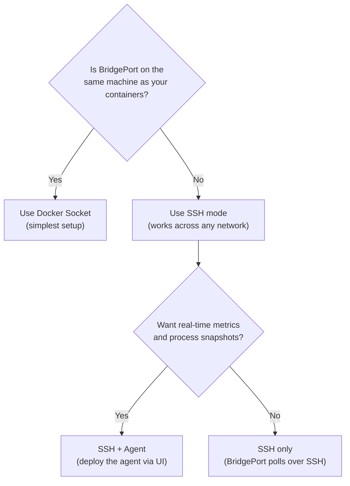

# Installation Guide

Three ways to run BridgePort -- pick the path that fits your situation.

---

## Table of Contents

- [Path 1: Quick Start (Docker Run)](#path-1-quick-start-docker-run)
- [Path 2: Production (Docker Compose)](#path-2-production-docker-compose)
- [Path 3: Development](#path-3-development)
- [Docker Socket vs SSH](#docker-socket-vs-ssh)

---

## Path 1: Quick Start (Docker Run)

For trying BridgePort out. One command, no files to create.

```bash
docker run -d \
  --name bridgeport \
  -p 3000:3000 \
  -v bridgeport-data:/data \
  -e MASTER_KEY=$(openssl rand -base64 32) \
  -e JWT_SECRET=$(openssl rand -base64 32) \
  -e ADMIN_EMAIL=admin@example.com \
  -e ADMIN_PASSWORD=changeme123 \
  ghcr.io/bridgeinpt/bridgeport:latest
```

Verify it's running:

```bash
docker logs bridgeport
```

Expected output:

```
=== BridgePort Startup ===
Database path: /data/bridgeport.db
No database found, will create fresh
Applying migrations...
...
=== Starting BridgePort ===
Server listening on 0.0.0.0:3000
```

Open **http://localhost:3000** and log in with `admin@example.com` / `changeme123`.

> [!WARNING]
> **Not for production.** The `MASTER_KEY` and `JWT_SECRET` are generated inline and not saved. If the container is removed, you lose the ability to decrypt stored secrets. For production, follow Path 2 below.

---

## Path 2: Production (Docker Compose)

A proper setup with persistent configuration, saved keys, and everything you need for a real deployment.

### 1. Create a directory

```bash
mkdir -p /opt/bridgeport && cd /opt/bridgeport
```

### 2. Generate and save your keys

```bash
echo "MASTER_KEY=$(openssl rand -base64 32)" >> .env
echo "JWT_SECRET=$(openssl rand -base64 32)" >> .env
```

> [!WARNING]
> **Back up your `MASTER_KEY` now** (e.g., in a password manager). It is the encryption key for all secrets and SSH keys stored in BridgePort. If you lose it, encrypted data cannot be recovered.

### 3. Add the remaining configuration

Append to your `.env` file:

```bash
cat >> .env << 'EOF'

# Admin user (created on first boot only)
ADMIN_EMAIL=admin@yourcompany.com
ADMIN_PASSWORD=a-strong-password-here

# CORS (set to your domain if using a reverse proxy)
# CORS_ORIGIN=https://deploy.yourcompany.com

# Optional: Sentry error monitoring
# SENTRY_BACKEND_DSN=https://key@sentry.io/12345
# SENTRY_FRONTEND_DSN=https://key@sentry.io/67890
EOF
```

### 4. Create `docker-compose.yml`

```yaml
services:
  bridgeport:
    image: ghcr.io/bridgeinpt/bridgeport:latest
    container_name: bridgeport
    restart: unless-stopped
    ports:
      - "3000:3000"
    env_file:
      - .env
    environment:
      - NODE_ENV=production
      - DATABASE_URL=file:/data/bridgeport.db
      - UPLOAD_DIR=/data/uploads
    volumes:
      - ./data:/data

      # Docker socket (optional -- for managing containers on this host)
      # See "Docker Socket vs SSH" section below before uncommenting
      # - /var/run/docker.sock:/var/run/docker.sock

      # Custom plugins (optional -- mount to add/override plugin JSON files)
      # - ./plugins:/app/plugins

    healthcheck:
      test: ["CMD", "wget", "-q", "-O", "/dev/null", "http://127.0.0.1:3000/health"]
      interval: 30s
      timeout: 10s
      retries: 3
      start_period: 10s
```

### 5. Start BridgePort

```bash
docker compose up -d
```

Verify startup:

```bash
docker compose logs -f bridgeport
```

Expected output:

```
=== BridgePort Startup ===
Database path: /data/bridgeport.db
No database found, will create fresh
Applying migrations...
...
=== Starting BridgePort ===
Server listening on 0.0.0.0:3000
```

### 6. Set up HTTPS (recommended)

BridgePort serves HTTP on port 3000. For production, put it behind a reverse proxy with TLS. Here's a minimal example using Caddy:

```yaml
services:
  bridgeport:
    # ... same as above, but remove the ports section ...
    networks:
      - proxy

  caddy:
    image: caddy:2-alpine
    container_name: caddy
    restart: unless-stopped
    ports:
      - "80:80"
      - "443:443"
      - "443:443/udp"
    volumes:
      - ./Caddyfile:/etc/caddy/Caddyfile:ro
      - caddy_data:/data
      - caddy_config:/config
    depends_on:
      - bridgeport
    networks:
      - proxy

volumes:
  caddy_data:
  caddy_config:

networks:
  proxy:
    driver: bridge
```

With a `Caddyfile`:

```
deploy.yourcompany.com {
    reverse_proxy bridgeport:3000
}
```

> [!TIP]
> When using a reverse proxy, set `CORS_ORIGIN=https://deploy.yourcompany.com` in your `.env` file to allow the frontend to communicate with the API.

### Post-Installation Checklist

After your first login:

- [ ] Change the default admin password (click the user icon in the sidebar)
- [ ] Set up HTTPS via a reverse proxy (Caddy, Nginx, or Traefik)
- [ ] Set `CORS_ORIGIN` to your domain in `.env`
- [ ] Create your first environment and upload an SSH key
- [ ] Verify the `/health` endpoint returns OK: `curl http://localhost:3000/health`
- [ ] (Optional) Configure SMTP for email notifications (Admin > Notifications)
- [ ] (Optional) Configure Sentry for error monitoring
- [ ] (Optional) Set up S3-compatible storage for backup uploads (Admin > Storage)

---

## Path 3: Development

For contributors who want to run BridgePort from source with hot reload.

```bash
git clone https://github.com/bridgeinpt/bridgeport.git
cd bridgeport

# Install dependencies
npm install
cd ui && npm install && cd ..

# Create your .env file
cat > .env << 'EOF'
DATABASE_URL=file:./dev.db
MASTER_KEY=$(openssl rand -base64 32)
JWT_SECRET=$(openssl rand -base64 32)
ADMIN_EMAIL=admin@dev.local
ADMIN_PASSWORD=devpassword123
EOF

# Generate Prisma client
npm run db:generate

# Run database migrations
npx prisma migrate dev

# Start backend (port 3000)
npm run dev

# In a second terminal: start frontend (port 5173)
cd ui && npm run dev
```

The frontend dev server proxies API requests to the backend automatically. Open **http://localhost:5173**.

For full contributor guidelines, see [CONTRIBUTING.md](../CONTRIBUTING.md).

---

## Docker Socket vs SSH

BridgePort supports two modes for communicating with Docker on a server. This decision applies to every server you manage.

### Decision Flowchart



### Comparison

| Feature | Docker Socket | SSH Mode | SSH + Agent |
|---|---|---|---|
| **Setup** | Mount volume, done | SSH key in environment settings | SSH key + deploy agent via UI |
| **Network** | Same machine only | Any network with SSH access | Any network with SSH access |
| **Metrics** | Basic (container stats) | SSH polling (CPU, memory, disk, load) | Real-time push (+ processes, containers) |
| **Container discovery** | Yes | Yes | Yes + process snapshots |
| **Latency** | Instant (local socket) | SSH round-trip | Push-based (near real-time) |
| **Security** | Full Docker daemon access | SSH key-based authentication | SSH + per-server agent token |

### Enabling Docker Socket Mode

Mount the Docker socket in your `docker-compose.yml`:

```yaml
services:
  bridgeport:
    volumes:
      - ./data:/data
      - /var/run/docker.sock:/var/run/docker.sock
```

BridgePort automatically detects the mounted socket and creates a "localhost" server in each environment.

> [!NOTE]
> **Security consideration**: Mounting the Docker socket gives BridgePort full access to the Docker daemon, which is effectively root access on the host machine. If this is a concern, use SSH mode instead.

### Enabling SSH Mode

No special Docker configuration needed. Just:

1. Upload an SSH private key in **Configuration > Environment Settings**
2. Add a server with its hostname or IP
3. BridgePort connects via SSH to run Docker commands

> [!TIP]
> The SSH key is encrypted and stored per-environment. Different environments can use different keys for security isolation.
