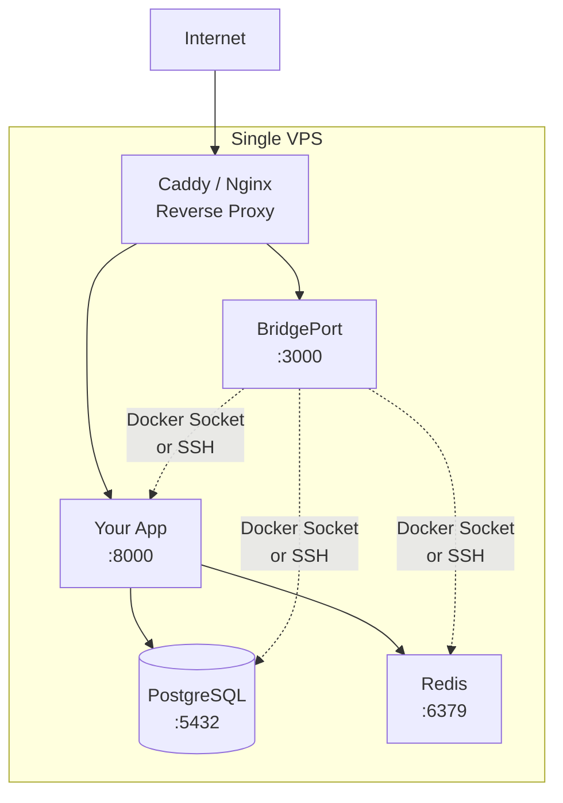
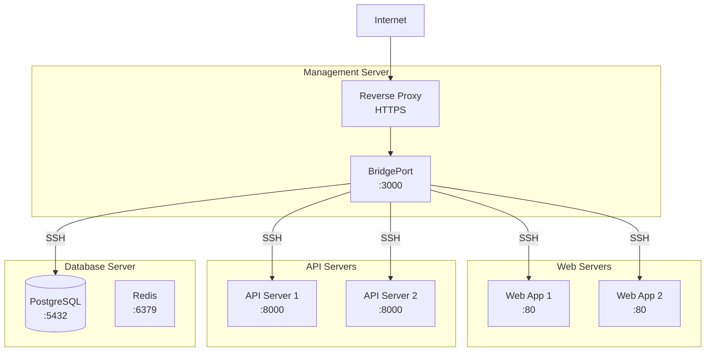
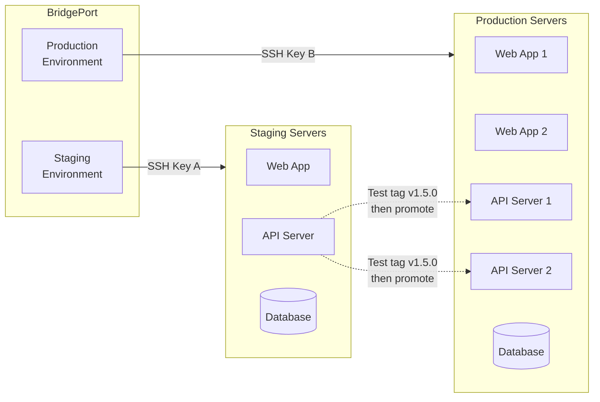
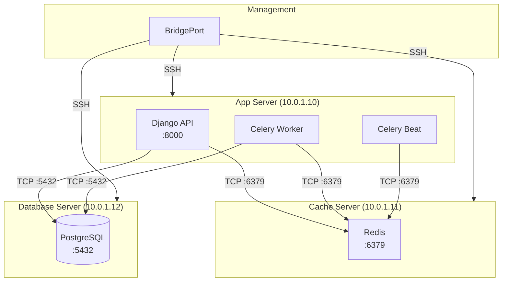

# Architecture Patterns

Common deployment patterns for BridgePort, from a single VPS to multi-server production stacks with staging environments.

---

## Table of Contents

- [Pattern 1: Single Server](#pattern-1-single-server)
- [Pattern 2: Multi-Server](#pattern-2-multi-server)
- [Pattern 3: Staging + Production](#pattern-3-staging--production)
- [Pattern 4: Real-World Stack](#pattern-4-real-world-stack)

---

## Pattern 1: Single Server

The simplest setup: BridgePort and your application running on the same machine.



### When to Use

- Small projects and personal infrastructure
- Side projects and MVPs
- Learning and experimentation
- Budget-constrained deployments

### Setup Walkthrough

1. **Install BridgePort** using Docker Compose on your VPS (see [Installation](../installation.md))

2. **Choose a Docker connection mode**:
   - **Socket mode** (recommended for single server): Mount `/var/run/docker.sock` in the compose file. BridgePort can manage containers directly without SSH.
   - **SSH mode**: BridgePort connects via SSH even to the local machine. Useful if you want a consistent experience across all servers.

3. **Create an environment** (e.g., "production") in BridgePort

4. **The host server is auto-detected**: When the Docker socket is mounted, BridgePort automatically creates a "localhost" server entry

5. **Discover containers**: Click "Discover" on the server page to find all running containers

6. **Set up monitoring**: Enable SSH or agent mode for metrics collection

### Docker Compose Example

```yaml
services:
  bridgeport:
    image: ghcr.io/bridgeinpt/bridgeport:latest
    ports:
      - "3000:3000"
    env_file: .env
    volumes:
      - ./data:/data
      - /var/run/docker.sock:/var/run/docker.sock  # Socket mode
    restart: unless-stopped
```

> [!TIP]
> Socket mode eliminates the need for SSH key setup on a single server. BridgePort communicates directly with the Docker daemon.

---

## Pattern 2: Multi-Server

Separate concerns across multiple servers, all managed from a single BridgePort instance.



### When to Use

- Production workloads requiring high availability
- Separation of concerns (web, API, data tiers)
- When different services need different server specs
- Teams that want centralized deployment management

### Setup Walkthrough

1. **Install BridgePort** on a dedicated management server (or alongside your reverse proxy)

2. **Create an environment** (e.g., "production")

3. **Configure SSH**: Upload an SSH private key in **Settings > SSH**. The corresponding public key must be in `~/.ssh/authorized_keys` on all managed servers.

4. **Add servers**: For each server, provide:
   - A name (e.g., "web-1", "api-1", "db-1")
   - The hostname or IP address
   - Docker mode: SSH (default for remote servers)

5. **Discover containers** on each server

6. **Deploy the monitoring agent** to each server for real-time metrics (optional but recommended):
   - Go to the server detail page
   - Switch metrics mode to "Agent"
   - Click "Deploy Agent"

7. **Set up container images**: Create container image entries and link them to services across servers. This enables coordinated deployments.

### Key Considerations

- **SSH keys**: One key per environment. All servers in an environment share the same SSH key.
- **Firewall rules**: BridgePort needs SSH access (port 22) to all managed servers.
- **Agent callback URL**: If using agents, set `agentCallbackUrl` in **Admin > System Settings** so agents can reach BridgePort from their network.

---

## Pattern 3: Staging + Production

Use BridgePort environments to separate staging from production, with a clear promotion workflow.



### When to Use

- Any team with a staging/production workflow
- When you want to test deployments before going live
- Organizations requiring deployment approval processes

### Setup Walkthrough

1. **Create two environments** in BridgePort:
   - "staging" with its own SSH key
   - "production" with a separate SSH key

2. **Add servers to each environment**: Staging servers go in the staging environment, production servers in production

3. **Mirror container image configuration**: Create the same container image entries in both environments, but linked to different services

4. **Configure per-environment settings**: Each environment has its own monitoring intervals, backup settings, and access controls

### Promotion Workflow

1. **Deploy to staging**: Push a new tag (e.g., `v1.5.0`) to staging via the UI, webhook, or auto-update
2. **Verify in staging**: Run health checks, test the application, review monitoring
3. **Deploy to production**: Switch to the production environment and deploy the same tag
4. **Use deployment plans**: For multi-service deployments, create an orchestrated deployment plan with dependency-aware ordering and auto-rollback

> [!TIP]
> Use the same image tag names across environments. This makes promotion clear: "v1.5.0 passed staging, deploy v1.5.0 to production."

### Environment Isolation

Each environment has completely independent:

| Resource | Isolated? |
|----------|-----------|
| SSH keys | Yes -- separate key per environment |
| Servers | Yes -- each server belongs to one environment |
| Secrets | Yes -- secrets are scoped to environments |
| Config files | Yes -- separate config files per environment |
| Container images | Yes -- separate image entries per environment |
| Monitoring settings | Yes -- independent intervals and retention |
| Backup schedules | Yes -- per-database, per-environment |

---

## Pattern 4: Real-World Stack

A concrete example: deploying a **Django + Celery + Redis + PostgreSQL** stack across 3 servers with full orchestration, monitoring, and backup configuration.



### Step 1: Environment and Servers

1. Create a "production" environment
2. Configure the SSH key in **Settings > SSH**
3. Add three servers:

| Server Name | Hostname | Purpose |
|-------------|----------|---------|
| app-server | 10.0.1.10 | Django, Celery, Celery Beat |
| cache-server | 10.0.1.11 | Redis |
| db-server | 10.0.1.12 | PostgreSQL |

4. Run container discovery on each server

### Step 2: Container Images

Create container image entries for your application:

| Image Name | Image Path | Registry |
|------------|-----------|----------|
| Django Backend | registry.example.com/myapp-backend | Your registry |
| Redis | redis | (no registry needed for official images) |
| PostgreSQL | postgres | (no registry needed) |

Link the Django Backend image to all three application services (Django, Celery, Celery Beat) -- they all use the same image with different commands.

### Step 3: Service Dependencies

Set up deployment ordering so services deploy in the right sequence:

| Dependent Service | Depends On | Dependency Type |
|------------------|------------|-----------------|
| Django API | PostgreSQL | `health_before` -- PostgreSQL must be healthy before Django deploys |
| Django API | Redis | `health_before` -- Redis must be healthy before Django deploys |
| Celery Worker | Django API | `deploy_after` -- Deploy worker after API is deployed |
| Celery Beat | Celery Worker | `deploy_after` -- Deploy beat after worker |

### Step 4: Health Checks

Configure health check URLs:

| Service | Health Check URL | Wait | Retries |
|---------|-----------------|------|---------|
| Django API | `http://10.0.1.10:8000/health` | 30s | 3 |
| Redis | (TCP check via agent) | 10s | 3 |
| PostgreSQL | (TCP check via agent) | 10s | 3 |

### Step 5: Monitoring

Deploy the BridgePort agent to each server for real-time metrics:

1. Go to each server's detail page
2. Switch metrics mode to "Agent"
3. Click "Deploy Agent"
4. Set `agentCallbackUrl` in System Settings to BridgePort's internal IP

Configure database monitoring for PostgreSQL:

1. Go to the PostgreSQL database entry
2. Enable monitoring
3. Set collection interval (e.g., 300 seconds)
4. BridgePort will collect plugin-defined metrics (connections, table sizes, slow queries, etc.)

### Step 6: Backups

Configure PostgreSQL backups:

1. On the database detail page, set backup configuration:
   - Format: Custom (recommended for pg_restore support)
   - Compression: Gzip
   - Storage: Spaces (for offsite) or local
2. Set a backup schedule: `0 2 * * *` (daily at 2 AM)
3. Set retention: 14 days

### Step 7: Deployment

When you push a new version:

1. **Single-image deploy**: From the Container Images page, click "Deploy" on the Django Backend image. BridgePort creates a deployment plan that:
   - Checks PostgreSQL and Redis are healthy
   - Deploys the Django API
   - Runs a health check on the Django API
   - Deploys the Celery Worker
   - Deploys Celery Beat
2. **Auto-rollback**: If any step fails, all previously deployed services roll back to their previous tags automatically

### Topology Visualization

After setting up service connections in the topology editor (Dashboard), you get an interactive diagram showing the entire architecture with server grouping, connection ports, and health status at a glance.

---

## Related Documentation

- [Getting Started](../getting-started.md) -- initial setup guide
- [Installation](../installation.md) -- deployment options
- [Container Images](../guides/container-images.md) -- image management
- [Deployment Plans](../guides/deployment-plans.md) -- orchestrated deployments
- [Monitoring](../guides/monitoring.md) -- monitoring setup
- [Databases](../guides/databases.md) -- database backup configuration
