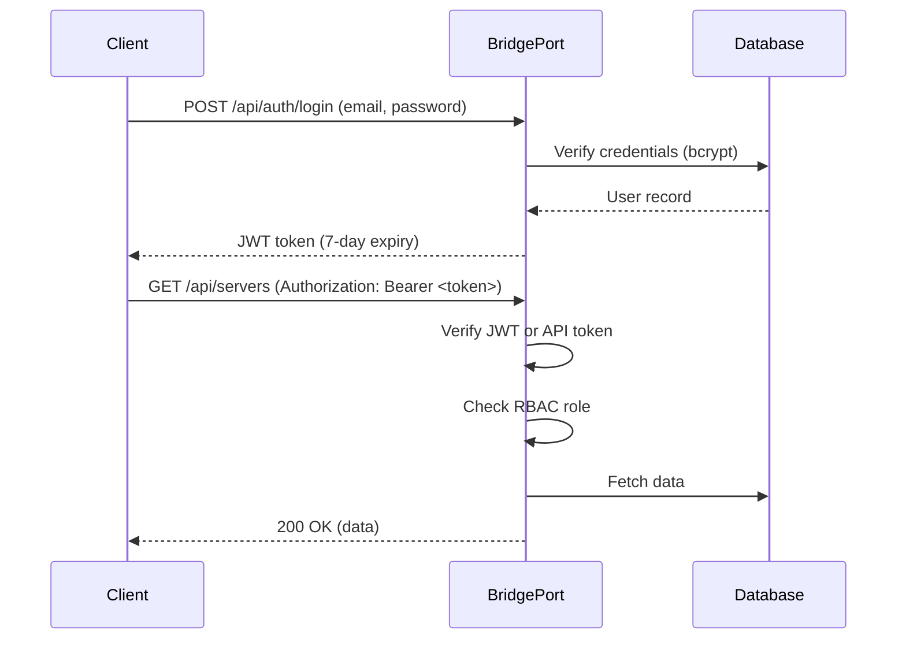

# Security & Hardening

BridgePort secures your infrastructure with JWT authentication, role-based access control, AES-256-GCM encryption for secrets at rest, per-environment SSH keys, and per-server agent tokens.

---

## Table of Contents

- [Security Architecture](#security-architecture)
- [Authentication Flow](#authentication-flow)
- [RBAC Model](#rbac-model)
- [Encryption at Rest](#encryption-at-rest)
- [SSH Key Management](#ssh-key-management)
- [Agent Token Security](#agent-token-security)
- [Production Hardening Checklist](#production-hardening-checklist)
- [Audit Logging](#audit-logging)
- [Vulnerability Reporting](#vulnerability-reporting)

---

## Security Architecture

BridgePort uses multiple security layers to protect your deployment infrastructure:

| Layer | Mechanism | Purpose |
|-------|-----------|---------|
| **Authentication** | JWT tokens (7-day expiry) + API tokens | Verify user identity |
| **Authorization** | RBAC with three roles | Control what users can do |
| **Encryption** | AES-256-GCM (AEAD) | Protect secrets, SSH keys, and credentials at rest |
| **Transport** | HTTPS via reverse proxy | Protect data in transit |
| **SSH** | Per-environment encrypted keys | Isolate server access by environment |
| **Agent** | Per-server tokens (SHA-256 hashed) | Authenticate agent metric pushes |
| **Audit** | Comprehensive action logging | Track who did what and when |

---

## Authentication Flow

BridgePort supports two authentication methods:

1. **JWT tokens** -- issued on login, expire after 7 days, used by the web UI
2. **API tokens** -- long-lived tokens created by users for programmatic access (CI/CD, scripts). Tokens are stored as SHA-256 hashes and cannot be retrieved after creation.

Both methods use the same `Authorization: Bearer <token>` header. BridgePort tries API token validation first, then falls back to JWT verification.

---

## RBAC Model

BridgePort has three roles arranged in a strict hierarchy: **admin** > **operator** > **viewer**.

| Action | Admin | Operator | Viewer |
|--------|:-----:|:--------:|:------:|
| View servers, services, databases | Yes | Yes | Yes |
| View secrets (if `allowSecretReveal` enabled) | Yes | Yes | Yes |
| View audit logs | Yes | Yes | Yes |
| Deploy services | Yes | Yes | No |
| Manage secrets (create, update, delete) | Yes | Yes | No |
| Create/trigger backups | Yes | Yes | No |
| Run health checks | Yes | Yes | No |
| Manage config files | Yes | Yes | No |
| Create/delete servers | Yes | No | No |
| Create/delete environments | Yes | No | No |
| Manage users | Yes | No | No |
| System settings | Yes | No | No |
| Environment settings | Yes | No | No |
| SMTP, Slack, webhook configuration | Yes | No | No |
| Service type and database type management | Yes | No | No |

> [!NOTE]
> Operators can perform most day-to-day operational tasks (deploying, managing secrets, running backups). Only admins can make structural changes (creating environments, managing users, system configuration).

The RBAC middleware is enforced at the route level using `requireAdmin` and `requireOperator` preHandlers. Every route that modifies data includes explicit authorization checks.

---

## Encryption at Rest

All sensitive data stored in the database is encrypted using **AES-256-GCM** (Authenticated Encryption with Associated Data):

- **Secrets** (key-value pairs stored in the Secrets page)
- **SSH private keys** (per-environment, configured in Settings)
- **Registry credentials** (tokens and passwords for container registries)
- **SMTP passwords** (for email notification delivery)
- **Slack webhook URLs**
- **Spaces secret keys** (for S3-compatible storage)

### How It Works

1. A 32-byte `MASTER_KEY` is provided via environment variable
2. Each encrypted value gets a unique 12-byte random IV (initialization vector)
3. AES-256-GCM produces both the ciphertext and a 16-byte authentication tag
4. The IV (nonce) and ciphertext+tag are stored as separate base64-encoded fields

### Key Management

- The `MASTER_KEY` is **never stored in the database**. It exists only in your `.env` file or environment variables.
- If the `MASTER_KEY` is lost, all encrypted data becomes irrecoverable. Store it securely in a password manager or secrets vault.
- To rotate the `MASTER_KEY`, you would need to decrypt all values with the old key and re-encrypt with the new one. There is currently no automated rotation command.

> [!WARNING]
> The `MASTER_KEY` is the single most critical secret in your BridgePort deployment. Back it up separately from the database. Without it, encrypted secrets, SSH keys, and registry credentials cannot be recovered.

---

## SSH Key Management

BridgePort uses **per-environment SSH keys** for secure server access:

- Each environment has its own SSH private key, configured in **Settings > SSH**
- Keys are encrypted with AES-256-GCM before being stored in the database
- When BridgePort needs to connect to a server, it decrypts the key in memory
- Keys are never written to disk in plaintext

This design provides:
- **Environment isolation**: Staging and production use different keys
- **No key files on the container filesystem**: Keys exist only in encrypted database storage
- **Centralized management**: Upload keys once in the UI; they work for all servers in that environment

---

## Agent Token Security

Each server running the BridgePort monitoring agent has a unique authentication token:

- Tokens are generated as 32-byte random values (base64url-encoded)
- Only the **SHA-256 hash** of the token is stored in the database
- The plaintext token is shown once when the agent is deployed, then discarded
- Tokens can be regenerated from the server detail page if compromised

The agent includes the token in every metrics push to authenticate itself. BridgePort verifies the hash on each request.

---

## Production Hardening Checklist

Use this checklist to secure your BridgePort deployment:

- [ ] **Run behind a reverse proxy with HTTPS** -- BridgePort itself serves HTTP. Use Caddy, nginx, or Traefik to terminate TLS. The included `docker-compose.yml` ships with a Caddy configuration.

- [ ] **Set strong `MASTER_KEY` and `JWT_SECRET`** -- Generate with `openssl rand -base64 32`. Never reuse these values across deployments.

- [ ] **Change default admin credentials** -- Set `ADMIN_EMAIL` and `ADMIN_PASSWORD` in your `.env` before first boot, then change the password via the UI.

- [ ] **Configure `CORS_ORIGIN`** -- Set this to your specific domain (e.g., `https://deploy.example.com`). In production, BridgePort defaults to rejecting cross-origin requests from unknown domains.

- [ ] **Run as non-root** -- The Docker image already runs as the `node` user (UID 1000). The `docker-compose.yml` sets `user: "1000:1000"`.

- [ ] **Restrict network access** -- Limit access to port 3000 (or your reverse proxy port) to trusted networks. BridgePort is an internal tool, not a public-facing service.

- [ ] **Set up firewall rules for SSH** -- BridgePort connects to your servers via SSH. Ensure only BridgePort's IP (or network) can reach port 22 on managed servers.

- [ ] **Protect the Docker socket** -- If using socket mode for host container management, understand that mounting `/var/run/docker.sock` gives BridgePort full Docker daemon access.

- [ ] **Enable Sentry for error monitoring** -- Set `SENTRY_BACKEND_DSN` and `SENTRY_FRONTEND_DSN` to catch errors before your users do.

- [ ] **Back up the SQLite database regularly** -- See [Backup & Restore](backup-restore.md) for automated backup strategies.

- [ ] **Review audit logs periodically** -- Check **Admin > Audit** for unexpected activity. Configure retention via System Settings.

- [ ] **Keep BridgePort updated** -- Pull the latest image regularly to get security patches. See [Upgrades](upgrades.md).

---

## Audit Logging

BridgePort maintains a comprehensive audit trail of all significant actions.

### What Gets Audited

| Category | Actions Tracked |
|----------|----------------|
| **Deployments** | `deploy`, `restart`, `rollback` |
| **Secrets** | `create`, `update`, `delete`, `access` (reveal) |
| **User Management** | `create`, `update`, `delete` (users and API tokens) |
| **Configuration** | `create`, `update`, `delete` (servers, services, environments, config files) |
| **Backups** | `backup`, `restore`, schedule changes |
| **Registries** | `create`, `update`, `delete`, credential changes |
| **System Settings** | All changes to system-wide and environment settings |
| **Storage** | Spaces configuration and per-environment toggle changes |

### Audit Log Structure

Each audit log entry includes:

| Field | Description |
|-------|-------------|
| `action` | What happened (`deploy`, `create`, `update`, `delete`, `access`) |
| `resourceType` | What was affected (`server`, `service`, `secret`, `environment`, etc.) |
| `resourceId` | ID of the affected resource |
| `resourceName` | Human-readable name for display |
| `details` | JSON string with additional context |
| `success` | Whether the action succeeded |
| `error` | Error message if it failed |
| `userId` | Who performed the action |
| `environmentId` | Which environment was affected |
| `createdAt` | When it happened |

### Accessing Audit Logs

- **UI**: Navigate to **Admin > Audit**. Filter by environment, resource type, action, and date range.
- **API**: `GET /api/audit-logs` with query parameters for filtering.

### Retention

Audit log retention is configurable via **Admin > System Settings** (`auditLogRetentionDays`). The default is 90 days. Set to 0 to keep audit logs forever. Cleanup runs automatically once per day.

---

## Vulnerability Reporting

If you discover a security vulnerability in BridgePort, please report it responsibly. See [SECURITY.md](../../SECURITY.md) for reporting instructions, response timeline expectations, and the scope of what constitutes a security issue.

---

## Related Documentation

- [Backup & Restore](backup-restore.md) -- protect your data
- [Upgrades](upgrades.md) -- keep BridgePort patched
- [Troubleshooting](troubleshooting.md) -- debug authentication and access issues
- [Configuration Reference](../configuration.md) -- environment variable details
