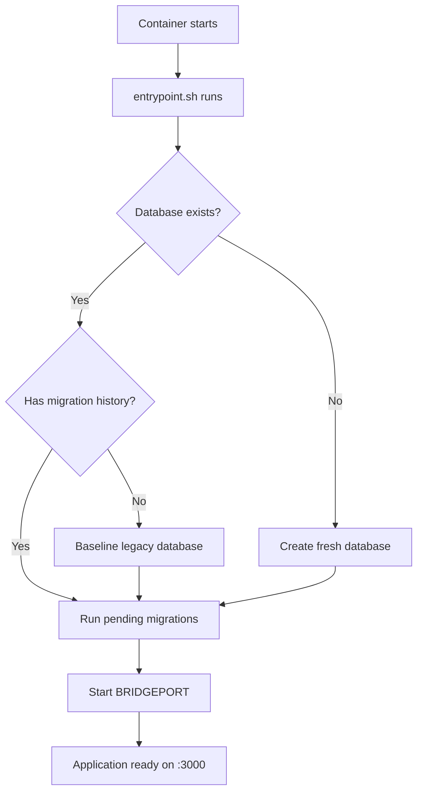

# Upgrade Guide

BRIDGEPORT upgrades are zero-intervention: pull the new image, restart the container, and migrations run automatically.

---

## Table of Contents

- [Channels](#channels)
- [How Upgrades Work](#how-upgrades-work)
- [Upgrade Procedure](#upgrade-procedure)
- [What to Expect](#what-to-expect)
- [Verifying the Upgrade](#verifying-the-upgrade)
- [Rollback](#rollback)
- [Agent Upgrades](#agent-upgrades)

---

## Channels

BRIDGEPORT is published to `ghcr.io/bridgeinpt/bridgeport` under several tags. Pick the one that matches how aggressively you want updates.

| Tag | Tracks | Use case |
|---|---|---|
| `:latest` | Most recent stable release | Default for production |
| `:stable` | Alias for `:latest` | Explicit intent — same image as `:latest` |
| `:v1.2.0`, `:1.2.0` | A specific patch release | Reproducible deploys, locked at this version |
| `:1.2` | Latest patch on the 1.2.x line | Auto-receive patch updates (1.2.0 → 1.2.1) |
| `:1` | Latest release in major version 1 | Auto-receive minor + patch updates |
| `:edge` | Current `master` HEAD | Testing / preview only — **not** for production |
| `:YYYYMMDDHH-sha` | Immutable per-commit master build | Bisecting edge bugs |

How they're produced:

- **Stable tags** (`:latest`, `:stable`, `:vX.Y.Z`, `:X.Y`, `:X`) are published by `.github/workflows/release.yml`, triggered when an annotated `vX.Y.Z` git tag is pushed.
- **Edge tags** (`:edge`, `:YYYYMMDDHH-sha`) are published by `.github/workflows/build.yml` on every code push to `master` (doc-only and CI-only pushes are skipped).

Prereleases (e.g. `v1.2.0-rc.1`) are pushed only as their exact tags (`:v1.2.0-rc.1`, `:1.2.0-rc.1`) — they never become `:latest`, `:stable`, or the floating major/minor tags.

> [!NOTE]
> Releases `v1.0.0` and `v1.1.0` predate this flow and have no ghcr.io image tags. The first version with full multi-tag publishing is the next release cut via the new pipeline. If you currently run `:latest`, you're already on the right channel — it will be set when the next release publishes.

---

---

## How Upgrades Work

Every time the BRIDGEPORT container starts, the entrypoint script handles database migrations before the application boots. You never need to run migrations manually.



The entrypoint script (`docker/entrypoint.sh`) performs these steps:

1. **Checks for the database file** at the path specified by `DATABASE_URL`
2. **Detects legacy databases** that predate migration tracking, and creates a baseline so Prisma can manage them going forward
3. **Runs `prisma migrate deploy`** to apply any pending migrations
4. **Starts the Node.js server** via `node dist/server.js`

This means every new release can include schema changes, and they are applied automatically and safely on startup.

---

## Upgrade Procedure

### Docker Compose (recommended)

```bash
cd /opt/bridgeport
docker compose pull
docker compose up -d
```

### Docker Run

```bash
docker pull ghcr.io/bridgeinpt/bridgeport:latest
docker stop bridgeport && docker rm bridgeport
docker run -d \
  --name bridgeport \
  --restart unless-stopped \
  -p 3000:3000 \
  --env-file .env \
  -e DATABASE_URL=file:/data/bridgeport.db \
  -e UPLOAD_DIR=/data/uploads \
  -v ./data:/data \
  ghcr.io/bridgeinpt/bridgeport:latest
```

### Expected Log Output

After starting the new container, you should see output like this:

```
=== BRIDGEPORT Startup ===
Database path: /data/bridgeport.db
Database exists
Migration history found
Applying migrations...
Prisma Migrate applied all migrations.
=== Starting BRIDGEPORT ===
```

If there are pending migrations from the new version, you will also see lines like:

```
The following migration(s) have been applied:
  20260215_add_notification_preferences
```

---

## What to Expect

| Aspect | Details |
|--------|---------|
| **Downtime** | Typically under 30 seconds. The old container stops, the new one starts and runs migrations. |
| **Data** | All data is preserved. The SQLite database lives in the mounted volume (`./data`). |
| **Migrations** | Applied automatically. No manual steps required. |
| **Configuration** | Your `.env` file and volume mounts remain unchanged. |
| **Agent/CLI** | These are separate binaries. Check for updates after upgrading BRIDGEPORT (see [Agent Upgrades](#agent-upgrades)). |

### What's new in v1.4

The v1.3 → v1.4 upgrade introduces several schema changes. All are applied automatically by the entrypoint — no manual steps required.

- **Service → ServiceDeployment split.** Each pre-existing Service is backfilled with one ServiceDeployment row per server, carrying over container name, ports, env overrides, status, and discovery state. The Service row keeps the shared template (image, env, health, compose); per-server runtime moves to its deployments. UI and API are backward-compatible: legacy `service.server` callers still see the first deployment's server.
- **Denormalized health status.** `Server.lastHealthCheckStatus` / `lastHealthCheckAt` and `ServiceDeployment.lastHealthCheckStatus` / `lastHealthCheckAt` are populated from the latest `HealthCheckLog` row at migration time, and kept current by the health-check writer. Monitoring overview no longer scans `HealthCheckLog` on the hot path.
- **SecretUsage / VarUsage join tables.** Secrets and Vars list endpoints stop doing GLOB scans over config-file content; the migration backfills usage rows by pattern-matching once.
- **Compound indexes** added to `HealthCheckLog`, `AuditLog`, and `Database` for the most common query shapes.
- **Notification fan-out queue.** `sendSystemNotification` writes to an in-process queue and returns immediately; delivery happens off the request thread.
- **New features.** ConfigFile fragments (env-scoped reusable text blocks), atomic multi-resource sync batches, dry-run preview for deploys / plans / config-file syncs, server bootstrap (Docker + agent + sysctl + swap), free-form Service type tagging, OpenAPI spec at `/openapi.json` with a `code/message/field/hint` error envelope.

> [!TIP]
> Always back up your database before upgrading, especially for major version jumps. A simple file copy is sufficient:
> ```bash
> cp ./data/bridgeport.db ./data/bridgeport-backup-$(date +%Y%m%d).db
> ```

---

## Verifying the Upgrade

### Check the Health Endpoint

```bash
curl -s http://localhost:3000/health | jq .
```

Expected output:

```json
{
  "status": "ok",
  "timestamp": "2026-02-25T12:00:00.000Z",
  "version": "1.0.0",
  "bundledAgentVersion": "20260220-abc1234",
  "cliVersion": "20260218-def5678"
}
```

### Check the Admin About Page

Navigate to **Admin > About** in the UI. This page displays:

- The current app version
- The bundled agent version
- CLI download links with version info

### Verify Logs Are Clean

```bash
docker logs bridgeport --tail 50
```

Look for `BRIDGEPORT running at http://0.0.0.0:3000` as confirmation that startup completed successfully. Any migration errors will appear before this line.

---

## Rollback

> [!WARNING]
> Database migrations are **forward-only**. If a new version adds or modifies database tables, the older BRIDGEPORT version may not be compatible with the updated schema.

### Rolling Back to a Previous Version

1. Stop the current container:
   ```bash
   docker compose stop
   ```

2. Restore the database backup you made before upgrading:
   ```bash
   cp ./data/bridgeport-backup-20260225.db ./data/bridgeport.db
   ```

3. Update `docker-compose.yml` to pin the previous image tag. Use a specific version (e.g. `:v1.1.0`) or a floating minor (e.g. `:1.1`) so the next `docker compose pull` won't jump you forward again:
   ```yaml
   services:
     bridgeport:
       image: ghcr.io/bridgeinpt/bridgeport:v1.1.0
   ```

4. Start the container:
   ```bash
   docker compose up -d
   ```

### When Rollback Is Safe

- If the new version only added code changes (no schema migrations), you can roll back without restoring the database.
- If the new version included migrations, you **must** restore the pre-upgrade database backup.

### When Rollback Is Not Possible

If you have been running the new version in production and new data has been written, rolling back the database means losing that data. In this situation, the better path is to fix the issue in the new version and deploy a patch.

---

## Agent Upgrades

The BRIDGEPORT monitoring agent is a separate Go binary deployed to your servers. It is versioned independently from the main application -- its version only changes when code in the `bridgeport-agent/` directory is modified.

### Detecting an Agent Version Mismatch

BRIDGEPORT makes it easy to spot outdated agents:

- **Server detail page**: Shows an "Update available" badge when the deployed agent version differs from the version bundled in the current BRIDGEPORT image.
- **Monitoring > Agents page**: Shows an upgrade status column for all agent-managed servers.
- **Health endpoint**: The `bundledAgentVersion` field in `/health` tells you what version the current BRIDGEPORT image ships.

### Upgrading the Agent

The simplest way to upgrade an agent is through the BRIDGEPORT UI:

1. Navigate to the server's detail page
2. Click **Deploy Agent** (or **Redeploy Agent** if one is already running)
3. BRIDGEPORT will SSH into the server and deploy the new agent binary automatically

The agent runs as a systemd service, so the new binary replaces the old one and the service restarts.

### Manual Agent Upgrade

If you prefer manual control:

```bash
# Copy the new agent binary from the BRIDGEPORT container
docker cp bridgeport:/app/agent/bridgeport-agent ./bridgeport-agent

# Transfer to the target server
scp ./bridgeport-agent user@server:/usr/local/bin/bridgeport-agent

# Restart the agent service
ssh user@server "sudo systemctl restart bridgeport-agent"
```

---

## Related Documentation

- [Backup & Restore](backup-restore.md) -- back up before upgrading
- [Troubleshooting](troubleshooting.md) -- if something goes wrong during an upgrade
- [Database Migrations](../development/database-migrations.md) -- how the migration system works internally
