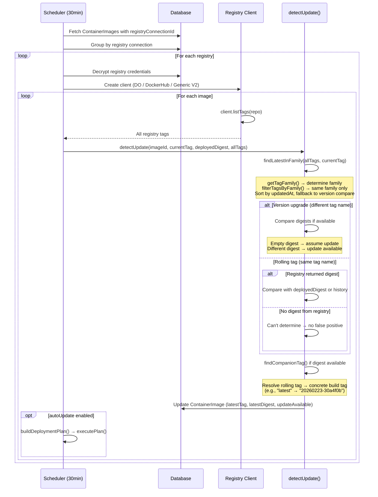
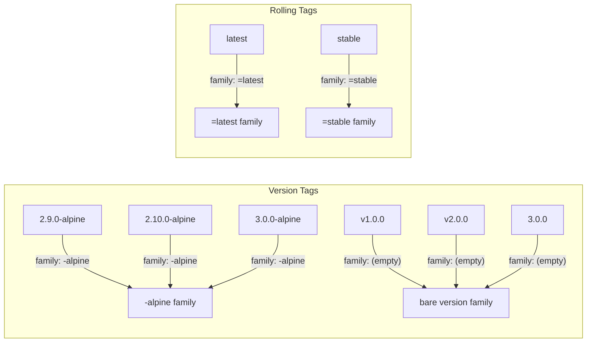
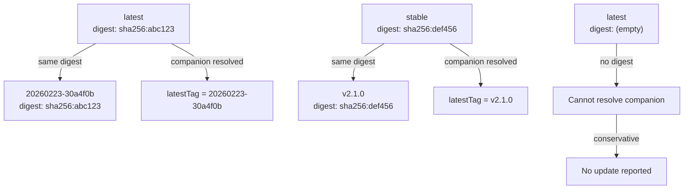

# Registry Update Detection Flow

This document describes how BridgePort detects container image updates from registries, resolves tag families, and correlates tags by digest.

## Update Check Flow

## Tag Family & Digest Correlation

### Tag Families

Tags are grouped into "families" based on their suffix. Only tags in the same family are compared for updates:

### Digest Correlation (Companion Tags)

Rolling tags like "latest" point to the same image as a concrete build tag. BridgePort resolves this via digest matching:

## Registry Client Differences

| Feature | DO Registry | Docker Hub | Generic V2 |
|---------|-------------|------------|------------|
| **Tag listing** | DO API response | Hub API response | `/v2/{repo}/tags/list` + manifest HEADs |
| **Digest source** | API field | API field (may be empty) | `Docker-Content-Digest` header |
| **Size available** | Yes | Yes | No (always 0) |
| **Real timestamps** | Yes | Yes | No (set to current time) |
| **Auth method** | Bearer token | Token exchange / Basic | Basic auth |
| **Manifest types** | Standard | Standard | Multi-Accept (v2 + OCI + manifest list) |

### Empty Digest Handling

When a registry doesn't return a digest:

- **Version tags**: Update detection falls back to tag name comparison. If a newer version exists in the same family, it's reported as an update.
- **Rolling tags**: Cannot determine if the image changed. Returns `hasUpdate: false` to avoid false positives (the "latest available" badge problem).
- **Companion resolution**: Skipped entirely — requires a valid digest to match across tags.
- **UI display**: Shows "unavailable" in muted text instead of a misleading dash.

### Synthetic Timestamps

Generic V2 registries don't provide real timestamps — all tags get `new Date().toISOString()` as `updatedAt`. When this is detected:

- **Sorting**: Falls back to semver-aware version comparison (`compareVersionTags()`) instead of timestamp ordering.
- **UI display**: Shows "—" for the Updated column instead of a misleading "less than a minute ago".
