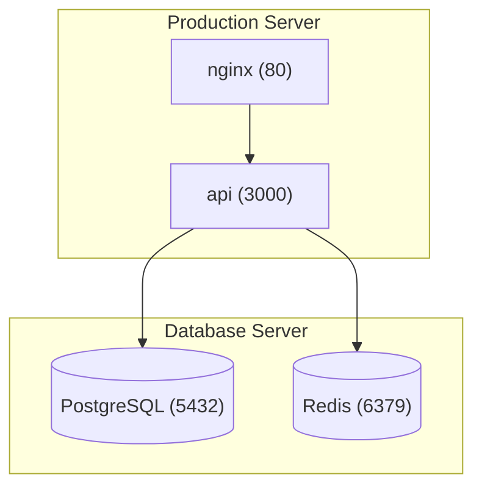

# Service Topology Diagram

A visual, interactive diagram on the Dashboard showing services grouped by servers with connections (auto-inferred from ports and user-defined), databases as nodes, and export capability.

---

## Overview

The diagram is a **visualization-only** section on the Dashboard page. It reads existing data (services, databases, exposed ports) — it never triggers discovery or any mutating operations. Services are grouped inside collapsible server nodes, databases appear as distinct nodes (placed inside their server group or standalone), and connections between nodes are drawn based on port matching and manual definitions.

---

## Data Model

### ServiceConnection (New Model)

Stores user-defined connections between services and/or databases.

```prisma
model ServiceConnection {
  id            String   @id @default(cuid())
  environmentId String
  environment   Environment @relation(fields: [environmentId], references: [id], onDelete: Cascade)

  // Source node
  sourceType    String   // "service" | "database"
  sourceId      String   // Service.id or Database.id

  // Target node
  targetType    String   // "service" | "database"
  targetId      String   // Service.id or Database.id

  // Connection metadata
  port          Int?     // Port number (e.g., 5432, 6379)
  protocol      String?  // "tcp" | "http" | "grpc" | etc.
  label         String?  // Optional description (e.g., "Primary DB", "Redis cache")
  direction     String   @default("none") // "forward" (source→target) | "none" (undirected)

  createdAt     DateTime @default(now())
  updatedAt     DateTime @updatedAt

  @@unique([environmentId, sourceType, sourceId, targetType, targetId, port])
}
```

### DiagramLayout (New Model)

Stores persisted node positions per environment as a single JSON blob.

```prisma
model DiagramLayout {
  id            String   @id @default(cuid())
  environmentId String   @unique
  environment   Environment @relation(fields: [environmentId], references: [id], onDelete: Cascade)

  positions     String   // JSON: { "service:<id>": {"x": 100, "y": 200}, "database:<id>": {"x": 300, "y": 400}, "server:<id>": {"x": 0, "y": 0} }

  updatedAt     DateTime @updatedAt
}
```

The `positions` JSON uses namespaced keys (`service:<id>`, `database:<id>`, `server:<id>`) to store `{x, y}` coordinates. This format is chosen for simplicity and easy export to Mermaid (which uses similar node referencing).

---

## Auto-Inferred Connections

Connections are inferred at render time on the frontend by matching port data. No backend computation required.

### Algorithm

1. Build a map of all databases in the environment with their configured `host` and `port`.
2. For each service, iterate its `exposedPorts` array.
3. For each exposed port, check if any database in the environment matches:
   - **Same server**: Service and Database are on the same server AND the container port matches the database's configured port.
   - **Cross-server**: The database's `host` field matches the service's server hostname/IP AND the container port matches the database port.
4. Well-known port matching (fallback): Match common ports to database types:
   - `5432` → PostgreSQL
   - `3306` → MySQL
   - `6379` → Redis
   - `27017` → MongoDB

### Auto-inferred vs Manual

- **Auto-inferred connections**: Rendered in **blue** (`text-blue-400` / `stroke-blue-400`)
- **Manual connections**: Rendered in **green** (`text-green-400` / `stroke-green-400`)
- Both types can coexist on the same node pair (shown as parallel edges or with both colors)

---

## API Endpoints

### Connections CRUD

```
GET    /api/connections?environmentId=<id>
POST   /api/connections                      # requireOperator
DELETE /api/connections/:id                   # requireOperator
```

**GET response:**
```json
[
  {
    "id": "clx...",
    "sourceType": "service",
    "sourceId": "abc",
    "targetType": "database",
    "targetId": "def",
    "port": 5432,
    "protocol": "tcp",
    "label": "Primary DB",
    "direction": "forward"
  }
]
```

**POST body:**
```json
{
  "environmentId": "env1",
  "sourceType": "service",
  "sourceId": "abc",
  "targetType": "database",
  "targetId": "def",
  "port": 5432,
  "protocol": "tcp",
  "label": "Primary DB",
  "direction": "forward"
}
```

### Layout Persistence

```
GET  /api/diagram-layout?environmentId=<id>
PUT  /api/diagram-layout                      # requireOperator
```

**PUT body:**
```json
{
  "environmentId": "env1",
  "positions": {
    "service:abc": { "x": 100, "y": 200 },
    "database:def": { "x": 300, "y": 400 },
    "server:ghi": { "x": 0, "y": 0 }
  }
}
```

### Export

```
GET /api/diagram-export?environmentId=<id>&format=mermaid
```

Returns Mermaid markdown text representing the current diagram topology.

---

## Frontend

### Library: React Flow

React Flow is the best fit for this use case:
- Purpose-built for interactive node graphs
- Native support for grouped/nested nodes (server groups)
- Drag-and-drop node repositioning
- Custom node rendering (for service/database/server visuals)
- Edge rendering with labels and colors
- Collapsible groups via parent node toggling
- Well-maintained, large community, MIT license

**Package:** `@xyflow/react` (v12+)

### Dashboard Integration

The diagram appears as a new section on the Dashboard, placed **after the summary stats cards** and **before the Available Updates section**.

```
Dashboard Layout:
1. Alerts & Warnings
2. Summary Stats Cards (Servers / Services / Databases)
3. ★ Service Topology Diagram (NEW)
4. Available Updates
5. Server Health Grid
6. Service Health Grid
7. Recent Activity & Database Backups
```

#### Size & Expand Behavior

- **Default**: Compact card with fixed height (~350px), showing the diagram with pan/zoom
- **Expand button**: Toggles to a larger view (~700px height)
- **Fullscreen**: A button to open the diagram in a fullscreen overlay/modal for detailed work

### Node Types

#### Server Group Node
- Bordered rectangle with rounded corners, dark background (`bg-slate-800/50 border-slate-700`)
- Header bar with server name + status indicator dot
- **Collapsible**: Click collapse icon to reduce to a single compact node
- When collapsed: shows server name + service count badge
- When collapsed: connections aggregate to/from the collapsed node with count badge

#### Service Node
- Compact card inside server group
- Shows: service name, status dot (color from `status.ts`), primary port
- Color-coded status border (green=healthy, red=unhealthy, yellow=unknown, gray=stopped)
- Click → info popover

#### Database Node
- Similar to service node but with a database icon
- Placed inside server group if database's server matches, standalone if external
- Shows: database name, type badge, status dot
- Click → info popover

### Node Popover (on click)

Simple popover showing:
- **Name** (bold)
- **Image** (for services) or **Type** (for databases), monospace
- **Status** with colored badge
- **Ports** list
- **Link** to detail page (`/services/:id` or `/databases/:id`)

### Connection Edges

- **Auto-inferred**: Blue color, solid line
- **Manual**: Green color, solid line
- **Direction**: Arrow when direction is `"forward"`, plain line when `"none"`
- **Label**: Shown on edge if provided (optional label from manual connections)
- **Hover**: Tooltip showing port, protocol, label

### Collapsed Server Behavior

When a server group is collapsed:
- All edges to/from its child services aggregate to the collapsed server node
- A badge on the edge shows the count of connections (e.g., "3 connections")
- Edge colors blend: if mixed auto/manual, show both colors or a neutral color

### Add Connection Modal

Triggered via a toolbar button (visible to operators/admins only).

Fields:
- **Source**: Dropdown of all services + databases in the environment
- **Target**: Dropdown of all services + databases (excludes source)
- **Port**: Optional number input
- **Protocol**: Optional dropdown (TCP, HTTP, gRPC, custom text)
- **Label**: Optional text input
- **Direction**: Toggle between "Directed (source → target)" and "Undirected"

### Toolbar

Small toolbar above the diagram card:
- **Zoom controls**: +/- buttons, fit-to-view
- **Expand/Collapse all** server groups
- **Fullscreen** toggle
- **Add Connection** button (operators/admins only)
- **Export** dropdown: Mermaid (.md) / PNG / SVG

### RBAC

| Role | View Diagram | Drag Nodes | Add/Delete Connections | Save Layout |
|------|-------------|-----------|----------------------|-------------|
| Viewer | Yes | No | No | No |
| Operator | Yes | Yes | Yes | Yes |
| Admin | Yes | Yes | Yes | Yes |

### Auto-Refresh

- Node **status/health** data refreshes with the existing Dashboard auto-refresh (30 seconds)
- The diagram structure (services, servers, databases list) also refreshes with the Dashboard
- **No separate discovery calls** — the diagram reads whatever data the Dashboard already fetches
- Layout positions are preserved across refreshes (from persisted layout + React Flow internal state)

---

## Export

### Mermaid Export

Generate Mermaid `graph TD` syntax from the current topology:



- Server groups → Mermaid `subgraph`
- Services → Rectangle nodes `["name"]`
- Databases → Cylinder nodes `[("name")]`
- Directed connections → `-->`
- Undirected connections → `---`
- Labels → `-->|label|`

The export endpoint generates this server-side from the connections + service/database data.

### Image Export (PNG/SVG)

Use React Flow's built-in `toImage()` / `toSvg()` methods for client-side image generation. No server-side rendering needed.

---

## Migration Plan

### Database Migration

```sql
-- CreateTable ServiceConnection
CREATE TABLE "ServiceConnection" (
    "id" TEXT NOT NULL PRIMARY KEY,
    "environmentId" TEXT NOT NULL,
    "sourceType" TEXT NOT NULL,
    "sourceId" TEXT NOT NULL,
    "targetType" TEXT NOT NULL,
    "targetId" TEXT NOT NULL,
    "port" INTEGER,
    "protocol" TEXT,
    "label" TEXT,
    "direction" TEXT NOT NULL DEFAULT 'none',
    "createdAt" DATETIME NOT NULL DEFAULT CURRENT_TIMESTAMP,
    "updatedAt" DATETIME NOT NULL,
    CONSTRAINT "ServiceConnection_environmentId_fkey" FOREIGN KEY ("environmentId") REFERENCES "Environment" ("id") ON DELETE CASCADE ON UPDATE CASCADE
);

-- CreateTable DiagramLayout
CREATE TABLE "DiagramLayout" (
    "id" TEXT NOT NULL PRIMARY KEY,
    "environmentId" TEXT NOT NULL,
    "positions" TEXT NOT NULL,
    "updatedAt" DATETIME NOT NULL,
    CONSTRAINT "DiagramLayout_environmentId_fkey" FOREIGN KEY ("environmentId") REFERENCES "Environment" ("id") ON DELETE CASCADE ON UPDATE CASCADE
);

-- CreateIndex
CREATE UNIQUE INDEX "ServiceConnection_environmentId_sourceType_sourceId_targetType_targetId_port_key"
  ON "ServiceConnection"("environmentId", "sourceType", "sourceId", "targetType", "targetId", "port");

CREATE UNIQUE INDEX "DiagramLayout_environmentId_key" ON "DiagramLayout"("environmentId");
```

This is a non-breaking, additive migration. No data transformation needed.

---

## Implementation Order

1. **Schema + Migration**: Add `ServiceConnection` and `DiagramLayout` models
2. **Backend Routes**: Connections CRUD + Layout GET/PUT + Mermaid export
3. **Frontend Diagram Component**: React Flow setup with custom node types
4. **Auto-inference Logic**: Frontend port-matching algorithm
5. **Manual Connections**: Add connection modal + delete flow
6. **Layout Persistence**: Save/load positions via API
7. **Export**: Mermaid generation + image export buttons
8. **Dashboard Integration**: Place diagram section in Dashboard page

---

## Dependencies

- `@xyflow/react` (React Flow v12+) — npm install in `ui/`
- No backend dependencies added

---

## Edge Cases

- **Empty state**: No servers/services → show empty state with message "No services discovered yet"
- **Orphan databases**: Databases not on any server → shown as standalone floating nodes
- **Deleted services**: If a service/database referenced by a connection is deleted, cascade-delete the connection (handled by checking at render time; stale connections won't render)
- **Large environments**: React Flow handles hundreds of nodes efficiently; no pagination needed
- **Connection to self**: Prevent creating a connection where source = target
- **Duplicate connections**: Unique constraint prevents duplicate source+target+port combinations
